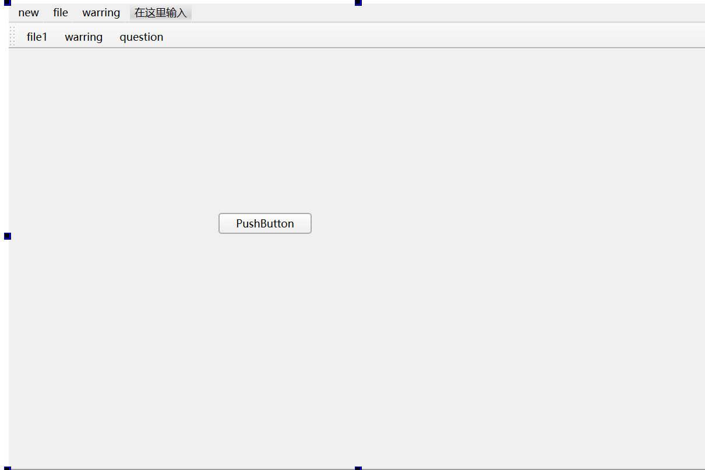
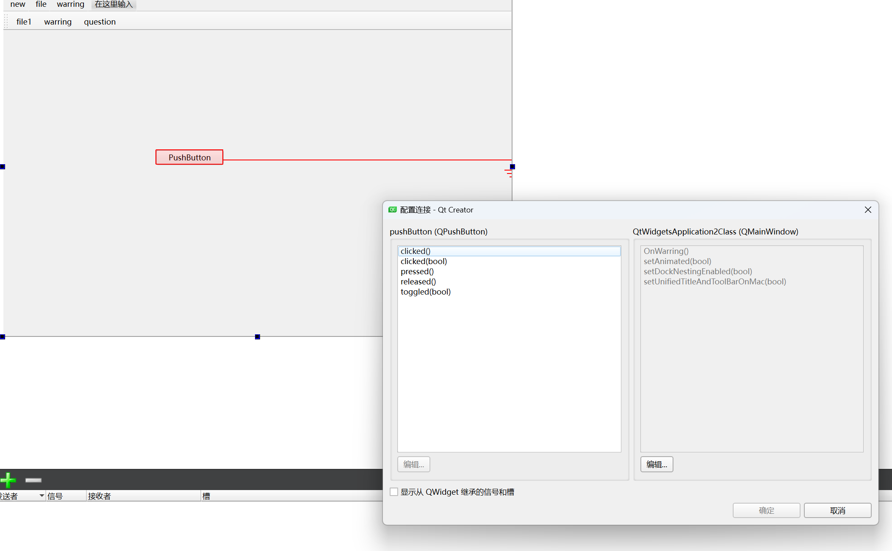
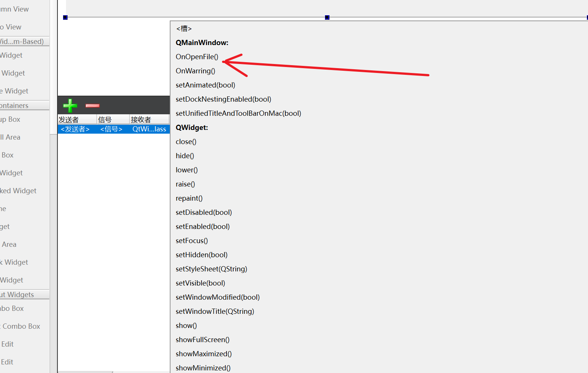

## QT 按钮

## 按钮创建与父子关系

1. 父子关系：

> ​	默认情况下按钮没有认干爹的情况下，是个顶层窗口
> ​	想要按钮显示在窗口上，就要跟窗口构造父子关系，有以下两种方式
> ​	1 setParent 
> ​	2 构造函数传参


2. QT坐标系：

> ​    是以父窗口的左上角为0,0
> ​    以向右的方向为x的正方向
> ​    以向下的方向为y的正方向
> ​    顶层窗口就是以屏幕左上角为0,0

3. 常用API函数：

> move 移动窗口到父窗口某个坐标
> resize 重新设置窗口的大小
> setFixedSize 设置窗口的固定大小
> setWidowTitle 设置窗口标题
> setGeometry 同时设置窗口位置和大小，相当于move和resize的结合体
>
> setText 设置文字

**示例：**

```c++
#iclude <QPushButto>

QPushButto * bt = new QPushButto; 

    //设置父亲
    bt>setParet(this);
    //设置文字
    bt>setText("德玛西亚");
    //移动位置
    bt>move(100,100);

    //第二种创建
    QPushButto * bt2 = new QPushButto("孙悟空",this);
    //重新指定窗口大小
    this>resize(600,400);

    //设置窗口标题
    this>setWidowTitle("第一个项目");

    //限制窗口大小
    this>setFixedSize(600,400);

```

上面代码中，一个按钮其实就是一个QPushButto类的对象，如果只是创建出对象，是无法显示到窗口中的，所以我们需要依赖一个父窗口，也就是指定一个父亲**，利用setParet函数或者按钮创建的时候通过构造函数传参**，此时我们称两个窗口建立了**父子关系**。

在有父窗口的情况下，窗口调用show会显示在父窗口中，如果没有父窗口，那么窗口调用show显示的会是一个顶层的窗口（顶层窗口是能够在任务栏中找到的，不依赖于任何一个窗口而独立存在）（按钮也是继承于QWidget，也属于窗口）。

## 对象树模型

QObject是Qt里边绝大部分类的根类

1. QObject对象之间是以对象树的形式组织起来的。

   > - 当两个QObject（或子类）的对象建立了**父子关系**的时候。子对象就会加入到父对象的一个成员变量叫childre（孩子）的list（列表）中。
   >
   > - 当**父对象析构的时候**，这个列表中的**所有对象也会被析构**。（注意，这里是说父对象和子对象，不要理解成父类和子类）

2. QWidget是能够在屏幕上显示的一切组件的父类

   > - **QWidget继承自QObject，因此也继承了这种对象树关系。一个孩子自动地成为父组件的一个子组件**。我们向某个窗口中添加了一个按钮或者其他控件（建立父子关系），当用户关闭这个窗口的时候，该窗口就会被析构，之前添加到他上边的按钮和其他控件也会被一同析构。这个结果也是我们开发人员所期望的。
   >
   > - 当然，**我们也可以手动删除子对象。当子对象析构的时候会发出一个信号destroyed，父对象收到这个信号之后就会从childre列表中将它剔除。**比如，当我们删除了一个按钮时，其所在的主窗口会自动将该按钮从其子对象列表（childre）中删除，并且自动调整屏幕显示，按钮在屏幕上消失。当这个窗口析构的时候，childre列表里边已经没有这个按钮子对象，所以我们手动删除也不会引起程序错误。

Qt 引入对象树的概念，在一定程度上解决了内存问题。

对象树中对象的顺序是没有定义的。这意味着，销毁这些对象的顺序也是未定义的。

任何对象树中的 QObject对象 delete 的时候，如果这个对象有 parent，则自动将其从 paret 的childre()列表中删除；如果有孩子，则自动 delete 每一个孩子。Qt 保证没有QObject会被 delete 两次，这是由析构顺序决定的。


**对象树在栈区存在的问题**

> ```c++
> {
>     QWidget widow;
>     QPushButto quit("Quit", &widow);
> }
> 
> ```
>
> 作为父组件的 widow 和作为子组件的 quit 都是QObject的子类（事实上，它们都是QWidget的子类，而QWidget是QObject的子类）。这段代码是正确的，quit 的析构函数不会被调用两次，因为标准 C++要求，**局部对象的析构顺序应该按照其创建顺序的相反过程**。因此，这段代码在超出作用域时，会先调用 quit 的析构函数，将其从父对象 widow 的子对象列表中删除，然后才会再调用 widow 的析构函数。
>
>  
>
> 但是，如果代码如下
>
> ```c++
> {
>     QPushButto quit("Quit");
>     QWidget widow;
>     quit.setParet(&widow);
> }
> 
> ```
>
> 情况又有所不同，析构顺序就有了问题。我们看到，在上面的代码中，**作为父对象的 widow 会首先被析构，因为它是最后一个创建的对象。在析构过程中，它会调用子对象列表中每一个对象的析构函数，也就是说， quit 此时就被析构了**。然后，代码继续执行，在 widow 析构之后，quit 也会被析构，因为 quit 也是一个局部变量，在超出作用域的时候当然也需要析构。但是，这时候已经是第二次调用 quit 的析构函数了，C++ 不允许调用两次析构函数，因此，程序崩溃了。

## 信号与槽

### 简介

**信号：各种事件**

**槽：** **响应信号的动作**

当某个事件发生后，如某个按钮被点击了一下，它就会发出一个被点击的信号（signal）。

某个对象接收到这个信号之后，就会做一些相关的处理动作（称为槽slot）。

但是Qt对象不会无故收到某个信号，要想让一个对象收到另一个对象发出的信号，这时候需要建立连接（coect）

例如：

```c++
	按钮
	被点击
	窗口
	关闭
	
	建立四者的关系(按钮 被点击 窗口 关闭)
        
	信号发送者
    信号
    信号接收者
    槽：信号的处理动作
    默认情况下，它们四者没有关系，通过coect 建立四者的关系
	
    conncet(信号发送者，信号，信号接收者，槽) 
        
	信号和槽，本质都是函数
	conncet里边4个参数都是指针
    conncet(bt,&QPushButto::clicked,this,&Widget::hide);
```

### 系统自带的信号与槽

**conncet函数**：

```c++
conncet函数是建立信号发送者、信号、信号接收者、槽四者关系的函数：
conncet(seder, sigal, receiver, slot);
参数解释：
	seder：信号发送者
	sigal：信号
	receiver：信号接收者
	slot：接收对象在接收到信号之后所需要调用的函数（槽函数）
这里要注意的是connect的四个参数都是指针，信号和槽是函数指针。

```

**使用示例**

下面我们完成一个小功能，上面我们已经学习了按钮的创建，但是还没有体现出按钮的功能，按钮最大的功能也就是点击后触发一些事情，比如我们点击按钮，就把当前的窗口给关闭掉

```c++
 QPushButto * quitBt = new QPushButto("关闭窗口",this);

 coect(quitBt,&QPushButto::clicked,this,&MyWidget::close);

第一行是创建一个关闭按钮，这个之前已经学过，第二行就是核心了，也就是信号槽的使用方式

coect函数是建立信号发送者、信号、信号接收者、槽四者关系的函数：

conncet(seder, sigal, receiver, slot);
```


**如何查找自带的信号与槽**：

系统自带的信号和槽如何查找呢，这个就需要利用帮助文档了，在帮助文档中比如我们上面的按钮的点击信号，在帮助文档中输入QPushButto，首先我们可以在导航栏中寻找关键字 sigals，信号的意思，但是我们发现并没有找到，这时候我们应该想到也许这个信号的被父类继承下来的，因此我们去他的父类QAbstractButto中就可以找到该关键字，点击sigals索引到系统自带的信号有如下几个


### 自定义信号与槽

比如说点击某个按钮让另一个按钮的文字改变，这时候标准信号和槽就没有提供这样的函数。但是Qt信号和槽机制提供了允许我们自己设计自己的信号和槽。

1. **自定义信号的使用条件**

   > 1) 声明在类的sigals域下
   > 2) 没有返回值，void类型的函数
   > 3) 只有函数声明，没有定义
   > 4) 可以有参数，可以重载
   > 5) 通过emit关键字来触发信号，形式：emit object>sig(参数);

2. **自定义槽函数使用条件**

   > 1) qt4 必须声明在 private/public/protected slots域下面，qt5之后可以声明public下，同时还可以是静态的成员函数，全局函数，lambda表达式
   > 2) 没有返回值，void类型的函数
   > 3) 不仅有声明，还得要有实现
   > 4) 可以有参数，可以重载

**使用示例：**

定义场景：下课了，老师跟同学说肚子饿了（信号），学生请老师吃饭（槽）

首先定义一个学生类和老师类：

老师类中声明信号 饿了 hugry

```c++
sigals:
       void hugry();
```

学生类中声明槽 请客treat

```
public slots:
       void treat();
```


在窗口中声明一个公共方法下课，这个方法的调用会触发老师饿了这个信号，而响应槽函数学生请客

```c++
	void MyWidget::ClassIsOver()
{
    //发送信号
    emit teacher>hugry();
}
```

 学生响应了槽函数，并且打印信息

//自定义槽函数 实现

```c++
void Studet::treat()
{
       qDebug() << "Studet treat teacher";
}

```

在窗口中连接信号槽

```c++
  teacher = new Teacher(this);

  studet = new Studet(this);

  connect(teacher,&Teacher::hugury,studet,&Studet::treat);
```

并且调用下课函数，测试打印出相应log

自定义的信号 hugry带参数，需要提供重载的自定义信号和 自定义槽

```c++
void hugry(QStrig ame);  自定义信号
void treat(QStrig ame );  自定义槽
但是由于有两个重名的自定义信号和自定义的槽，直接连接会报错，所以需要利用函数指针来指向函数地址， 然后在做连接
    
void (Teacher:: * teacherSigal)(QStrig) = &Teacher:: hagry;
void (Studet:: * studetSlot)(QStrig) = &Studet::treat;
coect(teacher,teacherSigal,studet,studetSlot);

也可以使用static_cast静态转换挑选我们要的函数
coect(teacher,
static_cast<void(Teacher:: *)(QStrig)>(&Teacher:: hagry),
studet,
static_cast<void(Studet:: *)(QStrig)>(& Studet::treat));

```

### 信号与槽的拓展

1. **一个信号可以和多个槽相连**

   > 如果是这种情况，这些槽会一个接一个的被调用，但是**槽函数调用顺序是不确定的**。像上面的例子，可以将一个按钮点击信号连接到关闭窗口的槽函数，同时也连接到学生请吃饭的槽函数，点击按钮的时候可以看到关闭窗口的同时也学生请吃饭的log也打印出来。

2. **多个信号可以连接到一个槽**

   > 只要任意一个信号发出，这个槽就会被调用。如：一个窗口多个按钮都可以关闭这个窗口。

3. **一个信号可以连接到另外的一个信号**

   > 当第一个信号发出时，第二个信号被发出。除此之外，这种信号信号的形式和信号槽的形式没有什么区别。注意这里还是使用coect函数，只是信号的接收者和槽函数换成另一个信号的发送者和信号函数。
   >
   > 如上面老师饿了的例子，可以新建一个按钮bt。
   >
   > ```c++
   > coect(bt,&QPushButto::clicked,teacher,&Teacher::hugry);
   > ```
   >
   > 

4. **信号和槽可以断开连接**

   > 可以使用discoect函数，当初建立连接时coect参数怎么填的，discoect里边4个参数也就怎么填。这种情况并不经常出现，因为当一个对象delete之后，Qt自动取消所有连接到这个对象上面的槽。

5. **信号和槽函数参数类型和个数必须同时满足两个条件**

   > 1)	信号函数的参数个数必须大于等于槽函数的参数个数
   > 2)	信号函数的参数类型和槽函数的参数类型必须一一对应

### Lambda表达式

C++11中的Lambda表达式**用于定义匿名的函数对象**，以简化编程工作。首先看一下Lambda表达式的基本构成：

分为四个部分：[局部变量捕获列表]、（函数参数）、函数额外属性设置opt、函数返回值>retype、{函数主体}

```c++
[capture](parameters) opt >retType
    {
    ……;
    }

```

1. 局部变量引入的参数

   > [ ]，标识一个**Lambda**的开始。由于lambda表达式可以定义在某一个函数体A里边，所以lambda表达式有可能会去访问A函数中的局部变量。中括号里边内容是描述了在lambda表达式里边可以使用的外部局部变量的列表：
   >
   >  []
   >
   >   表示lambda表达式不能访问外部函数体的任何局部变量
   >
   >  [a]
   >
   >   在函数体内部使用值传递的方式访问a变量
   >
   >  [&b]
   >
   >   在函数体内部使用引用传递的方式访问b变量
   >
   >   [=]
   >
   >   函数外的所有局部变量都通过值传递的方式使用, 函数体内使用的是副本
   >
   >  [&]
   >
   >   引用的方式使用lambda表达式外部的所有变量
   >
   >  [=, &foo]
   >
   >   foo使用引用方式, 其余是值传递的方式
   >
   >  [&,foo]
   >
   >   foo使用值传递方式, 其余是引用传递的方式
   >
   >   [this]
   >
   > 在函数内部可以使用类的成员函数和成员变量，=和&形式也都会默认引入
   >
   > 由于引用方式捕获对象会有局部变量释放了而lambda函数还没有被调用的情况。如果执行lambda函数那么引用传递方式捕获进来的局部变量的值不可预知。
   >
   > 所以在无特殊情况下建议使用**[=] () {}**的形式

2. **函数参数**

   > (params)表示lambda函数对象接收的参数，类似于函数定义中的小括号表示函数接收的参数类型和个数。参数可以通过按值（如：(int a,int b)）和按引用（如：(int &a,int &b)）两种方式进行传递。函数参数部分可以省略，省略后相当于无参的函数。
   >
   >  
   >
   > 同时如果参数和捕获的变量同名则按参数使用
   >
   > 

3. **选项Opt**

   > Opt 部分是可选项，最常用的是mutable声明，这部分可以省略。外部函数局部变量通过值传递引进来时，其默认是const，所以不能修改这个局部变量的拷贝，加上mutable就可以
   >
   > ```c++
   >   int a = 10 ;
   >   [=] ()
   > 
   > {
   >     a=20;//编译报错，a引进来是const
   > }
   > 
   >   [=] ()mutable
   > {
   >     a=20;//编译成功
   > };
   > ```
   >
   > 

4. **函数返回值 ->retType**

   > ->retType，标识lambda函数返回值的类型。这部分可以省略，但是省略了并不代表函数没有返回值，编译器会自动根据函数体内的return语句判断返回值类型，但是如果有多条return语句，而且返回的类型都不一样，编译会报错，如：
   >
   > ```c++
   >      [=]()mutable
   >     {
   >         int b = 20;
   >         float c = 30.0;
   >         if(a>0)
   >             return b;
   >         else
   >             return c;//编译报错，两条return语句返回类型不一致
   >     };
   > 
   > ```
   >
   > 

**槽函数使用lambba示例**：

以QPushButton点击事件为例：

```c++
  connect(btn,&QPushButton::clicked,[=](){

   qDebug()<<"Clicked";

});
```

这里可以看出使用Lambda表达式作为槽的时候不需要填入信号的接收者。当点击按钮的时候，clicked信号被触发，lambda表达式也会直接运行。当然lambda表达式还可以指定函数参数，这样也就能够接收到信号函数传递过来的参数了。

由于lambda表达式比我们自己自定义槽函数要方便而且灵活得多，所以在实现槽函数的时候优先考虑使用Lambda表达式。一般我们的使用习惯也是lambda表达式外部函数的局部变量全部通过值传递捕获进来，也就是:

[=] () { }的形式


### ui界面使用自定义的信号与槽

首先出现这个界面



然后按下f4，将你想要打造信号与槽的两个控件连接起来



左边是发出信号的控件和具体信号，右边是接受信号的控件以及使用哪种槽函数来接受

同时可以点击编辑，输入自定义的槽函数名


**缺陷：**

无法直接对工具栏的action添加信号与槽，但是可以从前面的步骤中新添加槽函数的名称

然后

这里就会出现自定义的槽函数名称，然后菜单栏上面的action就可以使用了


<font color='red'>注意：点击F4后如果要继续编写ui文件需要再点击F3</font>