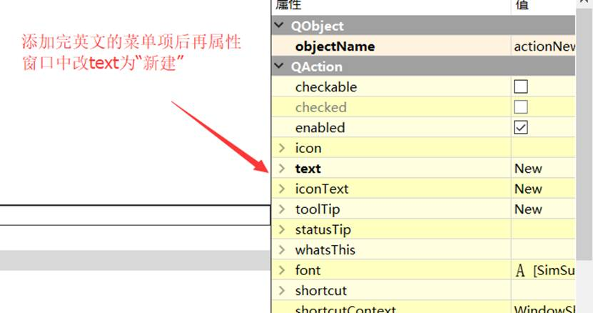
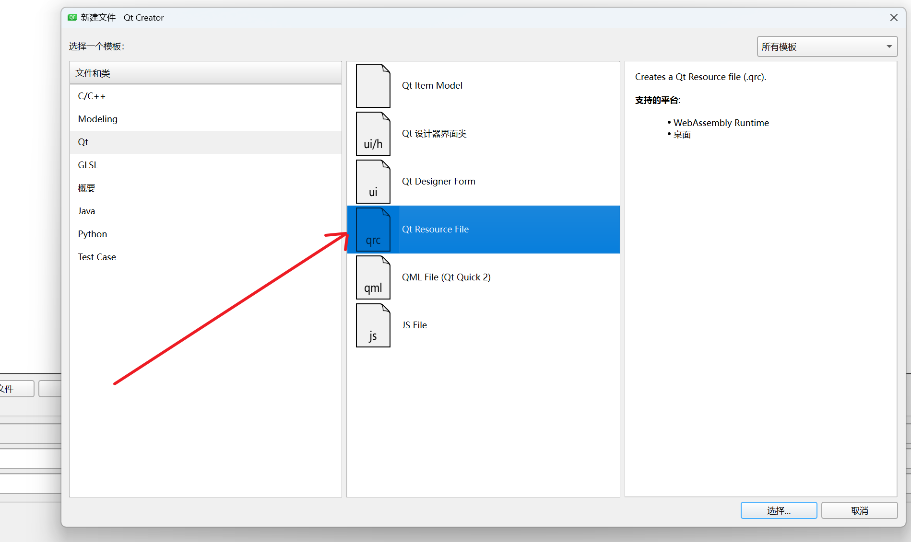

## QMainWindow

QMainWindow是一个为用户提供主窗口程序的类，包含一个菜单栏（menu bar）、多个工具栏(too1. bars)、多个停靠部件(dock widgets)、一个状态栏(status bar)及一个中心部件(centra1. widget)，是许多应用程序的基础，如文本编辑器，图片编辑器等。


### 菜单栏

一个主窗口最多只有一个菜单栏。位于主窗口顶部、主窗口标题栏下面。

> 1. 通过QMainWindow类的menubar（）函数获取主窗口菜单栏指针，如果当前窗口没有菜单栏，该函数会自动创建一个。
>
> ```c++
>   QMenuBar *  menuBar() const;
> ```
>
> 2. 创建菜单，调用QMenuBar的成员函数addMenu来添加菜单，如果通过QMenu的成员函数addMenu来添加菜单，那么就会在QMenu上创建一个二级菜单
>
> ```c++
>   QAction* addMenu(QMenu * menu);
> 
>   QMenu* addMenu(const QString & title);
> 
>   QMenu* addMenu(const QIcon & icon, const QString & title);
> ```
>
> 
>
> 3. 创建菜单项，调用QMenu的成员函数addAction来添加菜单项
>
> ```c++
>   QAction* activeAction() const;
> 
>   QAction* addAction(const QString & text);
> 
>   QAction* addAction(const QIcon & icon, const QString & text);
> 
>   QAction* addAction(const QString & text, const QObject * receiver,
> 
>    const char * member, const QKeySequence & shortcut = 0);
> 
>   QAction* addAction(const QIcon & icon, const QString & text, 
> 
>   const QObject * receiver, const char * member, 
> 
>   const QKeySequence & shortcut = 0);
> ```
>
>  
>
> 4. 添加分隔符QMenu的成员函数addSeparator

Qt 并没有专门的菜单项类，只是使用一个QAction类，抽象出公共的动作。当我们把QAction对象添加到菜单，就显示成一个菜单项，添加到工具栏，就显示成一个工具按钮。用户可以通过点击菜单项、点击工具栏按钮、点击快捷键来激活这个动作。


### 工具栏

主窗口的工具栏上可以有多个工具条，通常采用一个菜单对应一个工具条的的方式，也可根据需要进行工具条的划分。

需要包含头文件QToolBar,注意QT6.2的主窗口本身就有一个状态栏，如果你用addToolBar，那么窗口就有两个状态栏

> 1. 调用QMainWindowd对象的成员函数addToolBar（）,该函数每次调用都会创建一个新的工具栏，并且返回该工具栏的指针。
>
> 2.  插入属于工具条的项，这时工具条上添加项也是用QAction。
>
>    通过QToolBar类的addAction函数添加。
>
> 3. 工具条是一个可移动的窗口，它的停靠区域由QToolBar的allowAreas决定，包括（以下值可以通过查帮助文档allowAreas来索引到）：
>
>    ```c++
>    Qt::LeftToolBarArea      停靠在左侧
>    
>    Qt::RightToolBarArea     停靠在右侧
>    
>    Qt::TopToolBarArea      停靠在顶部
>    
>    Qt::BottomToolBarArea   停靠在底部
>    
>    Qt::AllToolBarAreas      以上四个位置都可停靠
>    
>    使用setAllowedAreas（）函数指定停靠区域：
>    
>    setAllowedAreas（Qt::LeftToolBarArea | Qt::RightToolBarArea）
>    
>    使用setFloatable（trueOrFalse）函数来设定工具栏可否浮动
>    
>    使用setMoveable（trueOrFalse）函数设定工具栏的可移动性：
>    
>    setMoveable（false）//工具条不可移动, 只能停靠在初始化的位置上
>    ```
>
>    

### 状态栏

一个QMainWindow的程序最多只有一个状态栏。QMainWindow中可以有多个的部件都使用add…名字的函数，而只有一个的部件，就直接使用获取部件的函数，如menuBar。

同理状态栏也提供了一个获取状态栏的函数statusBar()，没有就自动创建一个并返回状态栏的指针。

1. 添加小部件（从状态栏左侧添加）

   ```c++
     void addWidget(QWidget * widget, int stretch = 0);
   
     //插入小部件
   
     int insertWidget(int index, QWidget * widget, int stretch = 0);
   
     //删除小部件
   
     void removeWidget(QWidget * widget);
   ```

2. 添加小部件（从状态栏右侧添加）

   ```c++
   void addPermenentWidget (QWidget *widget, int stretch = 0);
   ```

### 停靠部件

停靠部件 QDockWidget，也称浮动窗口，可以有多个。

```c++
 QDockWidget * dock = new QDockWidget("标题",this);
    //添加停靠部件到mainWindow中，并且设定默认停靠在左边
    addDockWidget(Qt::LeftDockWidgetArea,dock);
    //设定停靠部件允许停靠的范围
    dock->setAllowedAreas(Qt::LeftDockWidgetArea |
     Qt::RightDockWidgetArea | Qt::TopDockWidgetArea); 

```

### 核心部件

除了以上几个部件，中心显示的部件都可以作为核心部件，例如一个记事本程序中，就是一个QTextEdit（编辑框控件）做核心部件

```c++
QTextEdit * edit = new QTextEdit(this);
//设置mainWindow的核心部件
setCentralWidget(edit);

```

### 代码

mainwindow.cpp

```c++
#include "mainwindow.h"
#include <QMenuBar>
#include <QToolBar>
#include <QStatusBar>
#include <QLabel>
#include <QDockWidget>
#include <QTextEdit>

MainWindow::MainWindow(QWidget *parent)
    : QMainWindow(parent)
{
    this->resize(800,600);
    //菜单栏，获取当前窗口的菜单栏，没有的话会自动创建一个
    QMenuBar *mb = this->menuBar();
    //添加菜单
    QMenu *menuFile = mb->addMenu("文件");
    QMenu *menuEdit = mb->addMenu("编辑");
    //往菜单里边添加菜单项
    QAction *actionNew = menuFile->addAction("新建");
    QAction *actionOpen = menuFile->addAction("打开");

    //添加分割符
    menuFile->addSeparator();

    //添加二级菜单
    QMenu *menuRecent = menuFile->addMenu("最近打开的文件");
    menuRecent->addAction("1.txt");

    //工具栏，可以有多个
    QToolBar *toolBar = this->addToolBar("");
    //工具栏添加工具
    toolBar->addAction(actionNew);
    toolBar->addAction(actionOpen);

    //默认停靠在左边
    this->addToolBar(Qt::LeftToolBarArea,toolBar);

    //只允许停靠在左边或者右边
    toolBar->setAllowedAreas(Qt::LeftToolBarArea|Qt::RightToolBarArea);

    //设置工具栏不可以浮动
    toolBar->setFloatable(false);

    //设置工具栏不允许拖动
    toolBar->setMovable(false);

    //状态栏，只有一个
    //获取窗口的状态栏，没有的话就创建一个
    QStatusBar *sb = this->statusBar();

    //往状态栏里边添加信息
    //添加左侧信息
    QLabe-*labelLeft = new QLabel("左侧信息",this);
    sb->addWidget(labelLeft);
    //添加右侧信息
    QLabe-*labelRight = new QLabel("右侧信息",this);
    sb->addPermanentWidget(labelRight);


    //停靠部件，可以有多个
    QDockWidget *dockWidget = new QDockWidget("停靠部件",this);
    //默认情况下没有核心部件作为参照物，停靠部件会占完窗口
    this->addDockWidget(Qt::BottomDockWidgetArea,dockWidget);

    //添加核心部件
    QTextEdit *textEdit = new QTextEdit(this);
    this->setCentralWidget(textEdit);
}

MainWindow::~MainWindow()
{

}

```

## 使用ui文件创建窗口

### **窗口介绍**


### 菜单栏

**添加删除菜单栏**

默认情况下QMainWindow项目一创建就自带了菜单栏，可以在对象树窗口中，右键菜单栏对象，移除菜单栏：


删除后也可以创建菜单栏（删除了后才可以新建菜单栏），此时在对象树中右键MainWindow对象，菜单里边会多了创建菜单栏的功能


添加菜单


添加菜单项


在UI界面中添加菜单项只能用英文，因为此时会创建一个QAction对象，会用输入的值作为对象名，所以不能用中文，得添加后再属性窗口改中文。



### 工具栏

删除工具栏方法和删除菜单栏方法一样，不过工具栏可以有多个，所以每次右键MainWindow对象，都可以看到添加工具栏的选项。


**工具栏添加动作**

新添加的QAction对象会在动作编辑器里找到（Action Editor），可以直接拖拽上来添加到工具栏里。


可以对工具栏属性中设定停靠区域、能否浮动、能否移动等

### 停靠部件

从工具箱中拖出一个停靠部件就行。也可以像设定工具栏停靠范围一样，在停靠部件的属性窗口中设定他可以停靠的范围。


同理核心部件也可以直接拖出来

### 原理

使用UI文件创建界面很轻松很便捷，他的原理就是每次我们保存UI文件的时候，QtCreator就自动帮我们将UI文件翻译成C++的图形界面创建代码。可以通过以下步骤查看代码

到工程编译目录，一般就是工程同级目录下会生成另一个编译目录，会找到一个带ui_前缀跟ui文件同名的.h文件，这就是代码

```c++
在项目MainWindow的构造函数中会调用这个函数来初始化窗口，其实这里边就是初始化我们的各个控件。

MainWindow::MainWindow(QWidget *parent) :

  QMainWindow(parent),

  ui(new Ui::MainWindow)

{
	//setupUI函数，就是关联UI文件的代码到程序
  ui->setupUi(this);

  //如果想要使用ui里边的控件对象

  //代码必须写在setupUi之下

  //否则ui各个控件没有初始化时使用会出问题

  ui->pushButton->setText("Hello");

}
```

### ui下的信号与槽

在UI编辑界面中使用信号和槽很方便，比如，拖出一个Button到窗口上，右键这个button，选择转到槽：


此时会出现这个控件（QPushButton）可以连接的各个信号，我们可以根据具体需求选中信号来创建一个连接这个信号的槽函数：


以click(bool)信号为例，创建了一个槽函数

这个槽函数是QtCreator自动帮我们创建的，而且也使用生成C++代码的方式帮我们做好了连接，我们可以直接在这个函数体内实现功能就行。很方便，比使用Lambda表达式还方便。


**信号与槽编辑器**

可以使用动作编辑器旁边的信号槽编辑器，里边也可以添加信号和槽的连接，比如添加actionQuit的triggered信号和窗口close槽的连接：


### 主窗口使用ui创建的控件


## 资源文件

Qt 资源系统是一个跨平台的资源机制，用于将程序运行时所需要的资源以二进制的形式存储于可执行文件内部。如果你的程序需要加载特定的资源（图标、文本翻译等），那么，将其放置在资源文件中，就再也不需要担心这些文件的丢失。也就是说，如果你将资源以资源文件形式存储，它是会编译到可执行文件内部。


使用 Qt Creator 可以很方便地创建资源文件。我们可以在工程上点右键，选择“添加新文件…”，可以在 Qt 分类下找到“Qt 资源文件”：



点击这个资源文件

右侧的编辑区有个“添加”，我们首先需要添加前缀，比如我们将前缀取名为 images。然后选中这个前缀，继续点击添加文件，可以找到我们所需添加的文件。这里，我们选择 document-open.png 文件。

操作完成后如下


通过使用 : 开头的路径来找到这个文件。比如，我们的前缀是 /images，文件是 document-open.png，那么就可以使用:/images/document-open.png找到这个文件。

这么做带来的一个问题是，如果以后我们要更改文件名，比如将 docuemnt-open.png 改成 docopen.png，那么，所有使用了这个名字的路径都需要修改。所以，更好的办法是，我们给这个文件去一个“别名”，以后就以这个别名来引用这个文件。具体做法是，选中这个文件，添加别名信息：


这样，我们可以直接使用**:/a1**引用到这个资源，**无需关心图片的真实文件名。**

## 对话框

### 简介

对话框是 GUI 程序中不可或缺的组成部分。很多不能或者不适合放入主窗口的功能组件都必须放在对话框中，比如用于完成一次性任务的功能（如登录功能、选择某个文件打开、保存文件）。对话框通常会是一个顶层窗口，出现在程序最上层，用于实现短期任务或者简洁的用户交互。

Qt 中使用QDialog类实现对话框，但是声明一个QDilaog对象的时候，不管这个对话框对象跟哪个窗口建立了父子关系，当他显示出来的时候都还是一个顶层的窗口。

对话框分为模态对话框和非模态对话框：

1. 模态对话框

   > 当对话框打开时，不能操作同一个应用程序的其他窗口，只有当对话框关闭的时候才可以操作。
   >
   > 模态对话框很常见，比如“打开文件”功能。你可以尝试一下记事本的打开文件，当打开文件对话框出现时，我们是不能对除此对话框之外的窗口部分进行操作的。
   >
   > ```c++
   > QDialog::exec()//实现应用程序级别的模态对话框
   > ```
   >
   > 

2. 非模态对话框

   > 例如查找对话框，我们可以在显示着查找对话框的同时，继续对记事本的内容进行编辑。
   >
   > ```c++
   > QDialog dialog(this);
   > dialog.setWindowTitle(tr("Hello, dialog!"));
   > dialog.show();
   > 
   > ```
   >
   > 对话框竟然一闪而过！这是因为，**show()函数不会阻塞当前线程，对话框会显示出来，然后函数立即返回，代码继续执行。**注意，dialog 是建立在栈上的，show()函数返回，MainWindow函数结束，dialog 超出作用域被析构，因此对话框消失了。知道了原因就好改了，我们将 dialog 改成堆上建立，当然就没有这个问题了：
   >
   > ```c++
   > QDialog *dialog = new QDialog;
   > dialog->setWindowTitle(tr("Hello, dialog!"));
   > dialog->show();
   > ```
   >
   > 但是存在内存泄漏问题
   >
   > ```c++
   > 通过设置窗口的属性来让其关闭后自动释放
   > dialog->setAttribute(Qt::WA_DeleteOnClose);
   > ```
   >
   > 

### 标准对话框

所谓标准对话框，是 Qt 内置的一系列对话框，用于简化开发。事实上，有很多对话框都是通用的，比如打开文件、设置颜色、打印设置等。这些对话框在所有程序中几乎相同，因此没有必要在每一个程序中都自己实现这么一个对话框。

Qt 的内置对话框大致分为以下几类：

- QMessageBox：        模态对话框，用于显示信息、询问问题等；

- QColorDialog：       选择颜色；

- QFontDialog：        选择字体；

- QFileDialog：        选择文件或者目录；

- QInputDialog：       允许用户输入一个值，并将其值返回；

- QPageSetupDialog：   为打印机提供纸张相关的选项；

- QPrintDialog：       打印机配置；

- QPrintPreviewDialog： 打印预览；

- QProgressDialog：     显示操作过程。

#### 消息对话框

QMessageBox用于显示消息提示。我们一般会使用其提供的几个 static 函数：

调用方式都是QMessageBox::critical(xxx);

1. Critical显示严重错误对话框。

   ```c++
   StandardButton critical(QWidget * parent, 
   const QString & title, 
   const QString & text, 
   StandardButtons buttons = Ok, 
   StandardButton defaultButton = NoButton);
   
   这个对话框将显示一个红色的错误符号。我们可以通过 buttons 参数指明其显示的按钮。默认情况下只有一个 Ok 按钮，我们可以使用StandardButtons类型指定多种按钮。
   ```

2. infomation

   ```c++
   StandardButton information(QWidget * parent, 
   const QString & title, 
   const QString & text, 
   StandardButtons buttons = Ok, 
   StandardButton defaultButton = NoButton)
   
   ```

3. Question 对话框提供一个问号图标，并且其显示的按钮是“是”和“否”。

   ```c++
   StandardButton question(QWidget * parent,
   const QString & title, 
   const QString & text, 
   StandardButtons buttons = StandardButtons( Yes | No ), 
   StandardButton defaultButton = NoButton) 
   
   第一个参数是对话框的父窗口是 this。
   QMessageBox是QDialog的子类，这意味着它的初始显示位置将会是在 parent 窗口的中央。
   第二个参数是对话框的标题。
   第三个参数是我们想要显示的内容。
   第四个参数是关联的按键类型，我们可以使用或运算符（|）指定对话框应该出现的按钮。比如我们希望是一个 Yes 和一个 No。
   最后一个参数指定默认选择的按钮。
   
   这个函数有一个返回值，用于确定用户点击的是哪一个按钮。按照我们的写法，应该很容易的看出，这是一个模态对话框，因此我们可以直接获取其返回值。
   
   //示例
        if (QMessageBox::Yes == QMessageBox::question(this,
                         tr("Question"), tr("Are you OK?"),
                         QMessageBox::Yes | QMessageBox::No,
                         QMessageBox::Yes))
           {
               QMessageBox::information(this, tr("Hmmm..."),
           tr("I'm glad to hear that!"));
           }
           else
           {
               QMessageBox::information(this, tr("Hmmm..."),
           tr("I'm sorry!"));
           }
   
   ```

   

#### 消息对话框示例

```c++
QMessageBox msgBox;
msgBox.setText(tr("The document has been modified."));
msgBox.setInformativeText(tr("Do you want to save your changes?"));
msgBox.setDetailedText(tr("Differences here..."));
msgBox.setStandardButtons(QMessageBox::Save
                          | QMessageBox::Discard
                          | QMessageBox::Cancel);
msgBox.setDefaultButton(QMessageBox::Save);
int ret = msgBox.exec();
switch (ret) 
{
case QMessageBox::Save:
    qDebug() << "Save document!";
    break;
case QMessageBox::Discard:
    qDebug() << "Discard changes!";
    break;
case QMessageBox::Cancel:
    qDebug() << "Close document!";
    break;
}
/*
msgBox 是一个建立在栈上的QMessageBox实例。
我们设置其主要文本信息为“The document has been modified.”，
informativeText 则是会在对话框中显示的简单说明文字。
下面我们使用了一个detailedText，也就是详细信息，当我们点击了详细信息按钮时，对话框可以自动显示更多信息。
我们自己定义的对话框的按钮有三个：保存、丢弃和取消。
然后我们使用了exec()是其成为一个模态对话框，根据其返回值进行相应的操作。
*/
```

### 文件对话框

```c++
使用QFileDialog 来打开一个文件对话框
		常用的函数是getOpenFileName来选择单一某文件
		可以指定默认路径，
		还可以指定文件过滤器，格式： 类型名称 ( *.类型后缀 ...) ;; 类型名称2 ...
		通过返回值来获取用户选取了哪个文件
		 QString fileName = QFileDialog::getOpenFileName(this,"打开一个文件",
                                 "G:\\C7_Qt\\day02\\03_resources\\Image",
                                 "PNG (*.png) ;; JPG (*.jpg) ;; GIF (*.gif) ;; all (*.*)");
```

#### 使用文件对话框实现打开和保存文件

1.创建文本编辑器的窗口

```c++
openAction = new QAction(QIcon(":/images/file-open"),tr("&Open..."), this);
openAction->setStatusTip(tr("Open an existing file"));
saveAction = new QAction(QIcon(":/images/file-save"), tr("&Save..."), this);
saveAction->setStatusTip(tr("Save a new file"));
QMenu *file = menuBar()->addMenu(tr("&File"));
file->addAction(openAction);
file->addAction(saveAction);
        
QToolBar *toolBar = addToolBar(tr("&File"));
toolBar->addAction(openAction);
toolBar->addAction(saveAction);
        
textEdit = new QTextEdit(this);
setCentralWidget(textEdit);

```

我们在菜单和工具栏添加了两个动作：打开和保存。接下来是一个QTextEdit类，这个类用于显示富文本文件。也就是说，它不仅仅用于显示文本，还可以显示图片、表格等等。不过，我们现在只用它显示纯文本文件。QMainWindow有一个setCentralWidget()函数，可以将一个组件作为窗口的中心组件，放在窗口中央显示区。显然，在一个文本编辑器中，文本编辑区就是这个中心组件，因此我们将QTextEdit作为这种组件。

**2.使用信号与槽添加对应的操作**

```c++
connect(openAction, &QAction::triggered, 
        this, &MainWindow::openFile);
connect(saveAction, &QAction::triggered, 
        this, &MainWindow::saveFile);

```

**3.实现具体的槽函数**

```c++
/打开文件
void MainWindow::openFile()
{
    QString path = QFileDialog::getOpenFileName(this,
                                                tr("Open File"), ".", tr("Text Files(*.txt)"));
    if(!path.isEmpty()) 
    {
        QFile file(path);
        if (!file.open(QIODevice::ReadOnly | QIODevice::Text)) 
        {
            QMessageBox::warning(this, tr("Read File"),
                                 tr("Cannot open file:\n%1").arg(path));
            return;
        }
        QTextStream in(&file);
        textEdit->setText(in.readAll());
        file.close();
    } 
    else 
    {
        QMessageBox::warning(this, tr("Path"),
                             tr("You did not select any file."));
    }
}

//保存文件
void MainWindow::saveFile()
{
    QString path = QFileDialog::getSaveFileName(this,
                                                tr("Open File"), ".", tr("Text Files(*.txt)"));
    if(!path.isEmpty()) 
    {
        QFile file(path);
        if (!file.open(QIODevice::WriteOnly | QIODevice::Text)) 
        {
            QMessageBox::warning(this, tr("Write File"),
                                 tr("Cannot open file:\n%1").arg(path));
            return;
        }
        QTextStream out(&file);
        out << textEdit->toPlainText();
        file.close();
    } 
    else 
    {
        QMessageBox::warning(this, tr("Path"),
                             tr("You did not select any file."));
    }
}

```

在openFile()函数中，我们使用QFileDialog::getOpenFileName()来获取需要打开的文件的路径。这个函数原型如下：

```c++
QString getOpenFileName(QWidget * parent = 0,
                        const QString & caption = QString(),
                        const QString & dir = QString(),
                        const QString & filter = QString(),
                        QString * selectedFilter = 0,
                        Options options = 0);
/*
-	parent：父窗口。
-	caption：对话框标题；
-	dir：对话框打开时的默认目录
    --	“.” 代表程序运行目录
    --	“/” 代表当前盘符的根目录（特指 Windows 平台；Linux 平台当然就是根目录），这个参数也可以是平台相关的，比如“C:\\”等；
-	filter：过滤器。
我们使用文件对话框可以浏览很多类型的文件，但是，很多时候我们仅希望打开特定类型的文件。比如，文本编辑器希望打开文本文件，图片浏览器希望打开图片文件。过滤器就是用于过滤特定的后缀名。如果我们使用“Image Files(*.jpg *.png)”，则只能显示后缀名是 jpg 或者 png 的文件。如果需要多个过滤器，使用“;;”分割，比如“JPEG Files(*.jpg);;PNG Files(*.png)”；
-	selectedFilter：默认选择的过滤器；
-	options：对话框的一些参数设定
    比如只显示文件夹等等，它的取值是enum QFileDialog::Option，每个选项可以使用 | 运算组合起来。
*/

//QFileDialog::getOpenFileName()返回值是选择的文件路径。我们将其赋值给 path。通过判断 path 是否为空，可以确定用户是否选择了某一文件。只有当用户选择了一个文件时，我们才执行下面的操作。
```

