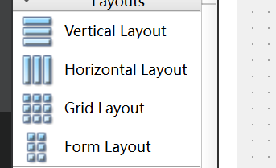
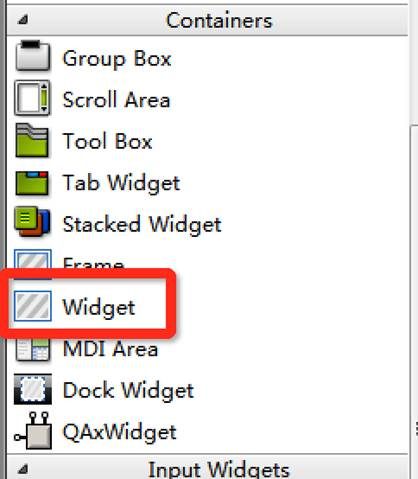
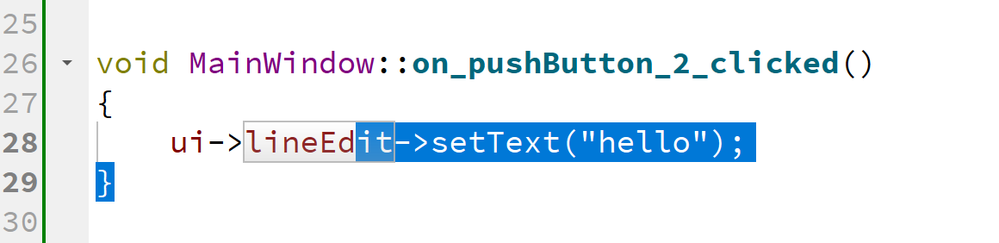
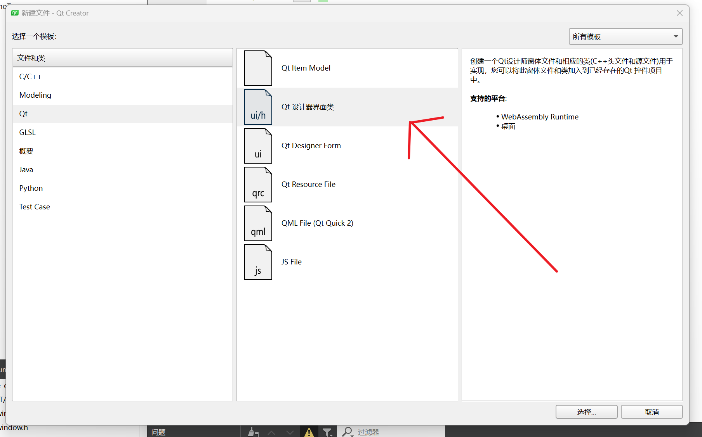
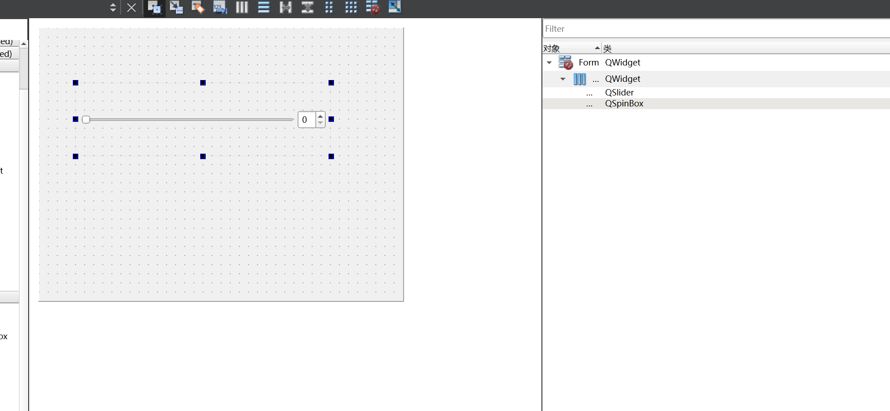
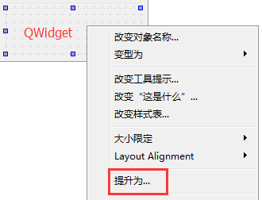
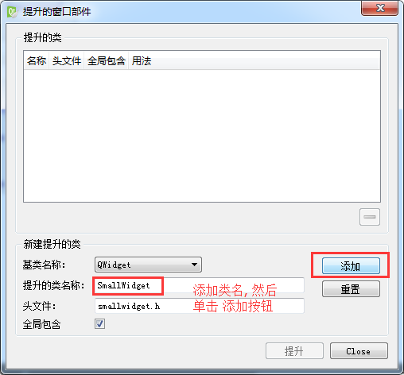
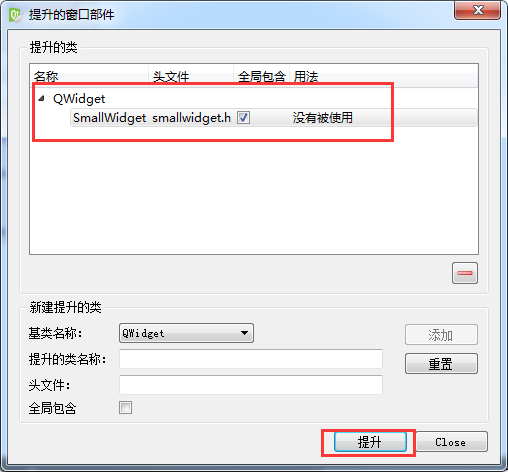
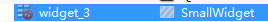

 

## 布局

两类：静态、动态
	静态就是位置和大小不会跟着外部窗口变化而变化
	动态就是位置和大小会跟着外部窗口变化而变化
	

常用动态布局
	水平、垂直、栅格、表单布局

​	

​	上面的布局从上到下分别是水平布局，类为QHBoxLayout：按照水平方向从左到右布局；

​	第二个为垂直布局，类为	QVBoxLayout

​	第三个为网格布局，QGridLayout 在一个网格中进行布局，类似于 HTML 的 table；

​	推荐使用widget的自带的布局功能，ui中先放一个widget上去，然后将组件拖入widget中，然后点击上面的水平布局



**注：ui中使用的控件，可以在主窗口的函数中通过内部的ui类，访问这些控件形如**



这个槽函数显示，如果点击按钮，就设置lineEdit控件显示hello内容


1 listWidget

	使用方式 addItem  或者 addItems
	QStringList ->   std::list<std::string>
	//使用左移操作符添加成员
	QStringList list;
	list<<"床前明月光"<<"疑似地上霜"<<"举头望明月"<<"低头思故乡";

2 treeWidget

```c++
		1 设置标题，会根据setHeaderLabels 里边的成员数自己生成有多少列
		2 添加根节点  treeWidget->addTopLevelItem
		3 根节点下边添加子节点 item->addChild 
```

3 tableWidgeet

```c++
	1 设置行数、列数  setRowCount  setColumnCount
	2 设置水平的标题  setHorizontalLabels 
	3 设置表格某行某列的数据 setItem(row,col,item)
```

4 容器

```c++
	stacked Widget  页面切换需要我们自己去实现，一般使用按钮点击的时候切换
		setCurrentIndex 方式切换到第几页，序号从0开始
```


5 显示控件

```c++
	label 可以显示静态图 pixmap属性
		显示动态图 gif ， 要使用 movie 
		setMovie 函数设置电影
		movie->start()来播放动画
```


## 自定义控件

在搭建Qt窗口界面的时候，在一个项目中很多窗口，或者是窗口中的某个模块会被经常性的重复使用。一般遇到这种情况我们都会将这个窗口或者模块拿出来做成一个独立的窗口类，以备以后重复使用。

在使用Qt的ui文件搭建界面的时候，工具栏栏中只为我们提供了标准的窗口控件，如果我们想使用自定义控件怎么办？

例如：我们从QWidget派生出一个类SmallWidget，实现了一个自定窗口，


### 通过ui方式

**步骤1.添加新的ui文件**



步骤2：设计新添加类的形式



**步骤3：**在自定义控件的类构造函数中，添加信号与槽，实现拖动滑轮，数字变动

```c++
Form::Form(QWidget *parent)
    : QWidget(parent)
    , ui(new Ui::Form)
{
    ui->setupUi(this);
    connect(ui->spinBox,
            static_cast<void (QSpinBox::*)(int)>(&QSpinBox::valueChanged),
            ui->horizontalSlider, &QSlider::setValue);
    connect(ui->horizontalSlider, &QSlider::valueChanged,
            ui->spinBox, &QSpinBox::setValue);

}
```

**步骤4：**如何将设计类的转变自定义控件

打开Qt的主窗口.ui文件,因为SmallWidget是派生自Qwidget类,所以需要在ui文件中先放入一个QWidget控件, 然后再上边鼠标右键



弹出提升窗口部件对话框



添加要提升的类的名字,然后选择 添加 



添加之后,类名会显示到上边的列表框中,然后单击提升按钮,完成操作.

我们可以看到, 这个窗口对应的类从原来的QWidget变成了SmallWidget



再次运行程序,这个widget_3中就能显示出我们自定义的窗口了.

### 通过代码实现

最后一步相同

其他三步可使用代码完成

```c++
// smallwidget.h
class SmallWidget : public QWidget
{
    Q_OBJECT
public:
    explicit SmallWidget(QWidget *parent = 0);
    
signals:
    
public slots:
private:
    QSpinBox* spin;
    QSlider* slider;
};

// smallwidget.cpp
SmallWidget::SmallWidget(QWidget *parent) : QWidget(parent)
{
    spin = new QSpinBox(this);
    slider = new QSlider(Qt::Horizontal, this);
    
    // 创建布局对象
    QHBoxLayout* layout = new QHBoxLayout;
    // 将控件添加到布局中
    layout->addWidget(spin);
    layout->addWidget(slider);
    // 将布局设置到窗口中
    setLayout(layout);
    
    // 添加消息响应
    connect(spin, 
            static_cast<void (QSpinBox::*)(int)>(&QSpinBox::valueChanged),
            slider, &QSlider::setValue);
    connect(slider, &QSlider::valueChanged, 
            spin, &QSpinBox::setValue);
}

```

