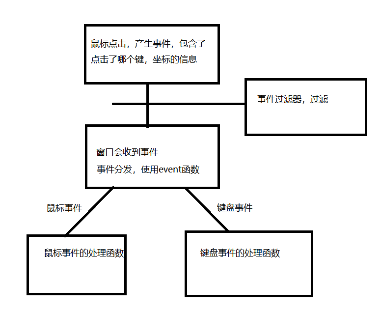

## 事件

 事件（event）是由系统或者 Qt 应用程序本身在不同的时刻发出的。当用户按下鼠标、敲下键盘，或者是窗口需要重新绘制的时候，都会发出一个相应的事件。一些事件在对用户操作做出响应时发出，如键盘事件等；另一些事件则是由系统自动发出，如计时器事件。



### 事件处理函数

在所有组件的父类QWidget中，定义了很多事件处理的函数，如

- keyPressEvent()：键盘按键按下事件

- keyReleaseEvent()：键盘按键松开事件

- mouseDoubleClickEvent()：鼠标双击事件

- mouseMoveEvent()：鼠标移动事件

- mousePressEvent()：鼠标按键按下事件

- mouseReleaseEvent() ：鼠标按键松开事件

- 等等

这些函数都是 protected virtual 的，也就是说，我们可以在子类中重新实现这些函数。下面来看一个例子：

**例子**：

//mylabel.h

```c++
#ifndef MYLABEL_H
#define MYLABEL_H

#include <QWidget>
#include <QLabel>

class MyLabel : public QLabel
{
    Q_OBJECT
public:
    explicit MyLabel(QWidget *parent = nullptr);

signals:

public slots:

protected:
    //重写鼠标按键处理函数
    void mousePressEvent(QMouseEvent *ev);
    //重写鼠标移动的处理函数
    void mouseMoveEvent(QMouseEvent *ev);
	void mouseReleaseEvent(QMouseEvent *event)
    //重写event分发函数
    bool event(QEvent *e);

    //重写eventFilter
    bool eventFilter(QObject *watched, QEvent *event);
};

#endif // MYLABEL_H
```

//mylabel.cpp

```c++


#include "mylabel.h"
#include <QMouseEvent>

MyLabel::MyLabel(QWidget *parent) : QLabel(parent)
{
    //默认情况下，窗口不会主动跟踪鼠标
    //只有当某个鼠标按键按下的情况下才开始跟踪
    //如果想一开始跟踪，就要使用以下函数
    this->setMouseTracking(true);

    //事件过滤器的使用
    //1 窗口调用installEventFilter来安装一个事件过滤器
    //2 参数是一个事件过滤器对象QObject，该对象的类要重写eventFilter的函数
    //事件过滤的时候，事件会先到达事件过滤器的eventFilter函数
    //返回值：true表示拦截，false表示不拦截，不拦截情况下事件会继续的到达窗口

    this->installEventFilter(this);
}

void MyLabel::mousePressEvent(QMouseEvent *ev)
{
    //输出鼠标事件一些信息
    //获取坐标
    int x = ev->x();
    int y = ev->y();

    //获取鼠标按键
    Qt::MouseButton btn = ev->button();
    QString strButton ="" ;
    if(btn == Qt::LeftButton)
    {
        strButton = "LeftButton";
    }
    if(btn == Qt::RightButton)
    {
        strButton = "RightButton";
    }
    if(btn == Qt::MiddleButton)
    {
        strButton = "MidButton";
    }

    //label是可以显示html
    QString str = QString("<h1><center>press[%1,%2][%3]</center></h1>")
            .arg(x).arg(y).arg(strButton);
    this->setText(str);
}

void MyLabel::mouseMoveEvent(QMouseEvent *ev)
{
    //输出鼠标事件一些信息
    //获取坐标
    int x = ev->x();
    int y = ev->y();

    //获取鼠标按键
    Qt::MouseButtons btns = ev->buttons();
    QString strButton ="" ;
    if(btns & Qt::LeftButton)
    {
        strButton += "LeftButton;";
    }
    if(btns & Qt::RightButton)
    {
        strButton += "RightButton;";
    }
    if(btns & Qt::MidButton)
    {
        strButton += "MidButton";
    }

    //label是可以显示html
    QString str = QString("<h1><center>move[%1,%2][%3]</center></h1>")
            .arg(x).arg(y).arg(strButton);
    this->setText(str);
}

bool MyLabel::event(QEvent *e)
{
    //返回值：true表示该事件得到处理，如果是false，没被处理，事件会继续传递到父窗口
    //QEvent就是所有Event类的父类
    //判断event的类型，是否也意味着可以自己写事件处理函数
//    if(e->type()==QEvent::MouseMove)
//    {
//        //this->mouseMoveEvent(static_cast<QMouseEvent *>(e));
//        return true;
//    }

    return QLabel::event(e);
}

void EventLabel::mouseReleaseEvent(QMouseEvent *event)
{
    QString msg;
    msg.sprintf("<center><h1>Release: (%d, %d)</h1></center>",
                event->x(), event->y());
    this->setText(msg);
}


bool MyLabel::eventFilter(QObject *watched, QEvent *event)
{
    if(event->type()==QEvent::MouseMove)
    {
        //返回true 表示拦截该事件
        return true;
    }
    return false;
}

```

1. MyLabel继承了QLabel，覆盖了mousePressEvent()、mouseMoveEvent()和MouseReleaseEvent()三个函数。我们并没有添加什么功能，只是在鼠标按下（press）、鼠标移动（move）和鼠标释放（release）的时候，把当前鼠标的坐标值显示在这个Label上面。由于QLabel是支持 HTML 代码的，因此我们直接使用了 HTML 代码来格式化文字。

2. QString的arg()函数可以自动替换掉QString中出现的占位符。其占位符以 % 开始，后面是占位符的位置，例如 %1，%2 这种。QString("[%1, %2]").arg(x).arg(y);语句将会使用x替换 %1，y替换 %2，因此，生成的QString为[x, y]。

3. 在mouseReleaseEvent()函数中，我们使用了另外一种QString的构造方法。我们使用类似 C 风格的格式化函数sprintf()来构造QString。

4. 点击鼠标之后才能在mouseMoveEvent()函数中显示鼠标坐标

   > 这是因为QWidget中有一个mouseTracking属性，该属性用于设置是否追踪鼠标。只有鼠标被追踪时，mouseMoveEvent()才会发出。如果mouseTracking是 false（默认即是），组件在至少一次鼠标点击之后，才能够被追踪，也就是能够发出mouseMoveEvent()事件。如果mouseTracking为 true，则mouseMoveEvent()直接可以被发出。


**我们新建了一个控件，并在这个控件中实现了事件处理函数，然后在widget的ui中，拖入了一个常用的label将他的父类修改为了MyLabel，这样编译生成的窗口中就有了新添加的label窗口对象，这该窗口对象中就会对鼠标事件进行处理然后显示**

### 事件分发函数

#### 基础

事件对象创建完毕后，Qt 将这个事件对象传递给QObject的event()函数。event()函数并不直接处理事件，而是将这些事件对象按照它们不同的类型，分发给不同的事件处理器（event handler）。

如上所述，**event()函数主要用于事件的分发**。所以，如果你希望在事件分发之前做一些操作，就可以重写这个event()函数了。例如，我们希望在一个QWidget组件中监听 tab 键的按下，那么就可以继承QWidget，并重写它的event()函数，来达到这个目的：

```c++
bool CustomWidget::event(QEvent *e)
{
    if (e->type() == QEvent::KeyPress) {
        QKeyEvent *keyEvent = static_cast<QKeyEvent *>(e);
        if (keyEvent->key() == Qt::Key_Tab) {
            qDebug() << "You press tab.";
            return true;
        }
    }
    return QWidget::event(e);
}

```

CustomWidget是一个普通的QWidget子类。我们重写了它的event()函数，这个函数有一个QEvent对象作为参数，也就是需要转发的事件对象。函数返回值是 bool 类型。

- **如果传入的事件已被识别并且处理，则需要返回 true****，否则返回 false。如果返回值是 true，那么 Qt **会认为这个事件已经处理完毕，不会再将这个事件发送给其它对象，而是会继续处理事件队列中的下一事件。**

- **在event()**函数中，调用事件对象的accept()和ignore()函数是没有作用的，不会影响到事件的传播。


我们可以通过使用**QEvent::type()函数**可以检查事件的实际类型，其返回值是**QEvent::Type类型的枚举**。我们处理过自己感兴趣的事件之后，可以直接返回 true，表示我们已经对此事件进行了处理；对于其它我们不关心的事件，则需要调用父类的event()函数继续转发，否则这个组件就只能处理我们定义的事件了。为了测试这一种情况，我们可以尝试下面的代码：

```c++
bool CustomTextEdit::event(QEvent *e)
{
   if (e->type() == QEvent::KeyPress) 
{
        QKeyEvent *keyEvent = static_cast<QKeyEvent *>(e);
       if (keyEvent->key() == Qt::Key_Tab) 
{
            qDebug() << "You press tab.";
            return true;
       }
    }
    return false;
}

```

​	CustomTextEdit是QTextEdit的一个子类。我们重写了其event()函数，却没有调用父类的同名函数。这样，我们的组件就只能处理 Tab 键，再也无法输入任何文本，也不能响应其它事件，比如鼠标点击之后也不会有光标出现。这是因为我们只处理的KeyPress类型的事件，并且如果不是KeyPress事件，则直接返回 false，鼠标事件根本不会被转发，也就没有了鼠标事件。


#### 源码理解

通过查看QObject::event()的实现，我们可以理解，event()函数同前面的章节中我们所说的事件处理器有什么联系：

```c++
bool QObject::event(QEvent *e)
{
    switch (e->type()) {
    case QEvent::Timer:
        timerEvent((QTimerEvent*)e);
        break;

    case QEvent::ChildAdded:
    case QEvent::ChildPolished:
    case QEvent::ChildRemoved:
        childEvent((QChildEvent*)e);
        break;
    // ...
    default:
        if (e->type() >= QEvent::User) {
            customEvent(e);
            break;
        }
        return false;
    }
    return true;
}

```

这是 Qt 5 中QObject::event()函数的源代码。

我们可以看到，同前面我们所说的一样，Qt 也是使用QEvent::type()判断事件类型，然后调用了特定的事件处理器。

比如，如果event->type()返回值是QEvent::Timer，则调用timerEvent()函数。可以想象，QWidget::event()中一定会有如下的代码：

```c++
    switch (event->type()) {
        case QEvent::MouseMove:
            mouseMoveEvent((QMouseEvent*)event);
            break;
        // ...
    }

```

​	事实也的确如此。timerEvent()和mouseMoveEvent()这样的函数，就是我们前面章节所说的**事件处理器 event handler**。也就是说，event()函数中实际是通过事件处理器来响应一个具体的事件。这相当于event()函数将具体事件的处理“委托”给具体的事件处理器。而这些事件处理器是 protected virtual 的，因此，我们重写了子类某一个事件处理器，即可让 Qt 调用我们自己实现的版本。

​	由此可以见，**event()是一个集中处理不同类型的事件的地方（事件分发器）**。如果你不想重写一大堆事件处理器，就可以重写这个event()函数，通过QEvent::type()判断不同的事件。鉴于重写event()函数需要十分小心注意父类的同名函数的调用，一不留神就可能出现问题，所以一般还是建议只重写事件处理器（当然，也必须记得是不是应该调用父类的同名处理器event handler）。这其实暗示了event()函数的另外一个作用：屏蔽掉某些不需要的事件处理器。正如我们前面的CustomTextEdit例子看到的那样，我们创建了一个只能响应 tab 键的组件。这种作用是重写事件处理器所不能实现的。

​	同时我们可以使用event来针对不同的事件调用自己的事件处理函数，而不是重写父类的事件处理函数

### 事件过滤器

有时候，对象需要查看、甚至要拦截发送到另外对象的事件。例如，对话框可能想要拦截按键事件，不让别的组件接收到；或者要修改回车键的默认处理。

QObject有一个eventFilter()函数，用于建立事件过滤器。函数原型如下：

```c++
virtual bool QObject::eventFilter ( QObject * watched, QEvent * event );
```

这个函数正如其名字显示的那样，是一个“事件过滤器”。所谓事件过滤器，可以理解成一种过滤代码。事件过滤器会检查接收到的事件。

如果这个事件是我们感兴趣的类型，就进行我们自己的处理；

如果不是，就继续转发。

这个函数返回一个 bool 类型，如果你想将参数 event 过滤出来，比如，**不想让它继续转发，就返回** **true**，否则返回 false。事件过滤器的调用时间是目标对象（也就是参数里面的watched对象）接收到事件对象之前。也就是说，如果你在事件过滤器中停止了某个事件，那么，watched对象以及以后所有的事件过滤器根本不会知道这么一个事件。

```c++
class MainWindow : public QMainWindow
{
public:
    MainWindow();
protected:
    bool eventFilter(QObject *obj, QEvent *event);
private:
    QTextEdit *textEdit;
};

MainWindow::MainWindow()
{
    textEdit = new QTextEdit;
    setCentralWidget(textEdit); 
    textEdit->installEventFilter(this);
}

bool MainWindow::eventFilter(QObject *obj, QEvent *event)
{
    if (obj == textEdit) {
        if (event->type() == QEvent::KeyPress) {
            QKeyEvent *keyEvent = static_cast<QKeyEvent *>(event);
            qDebug() << "Ate key press" << keyEvent->key();
            return true;
        } else {
            return false;
        }
    } else {
        // pass the event on to the parent class
        return QMainWindow::eventFilter(obj, event);
    }
}

```


### 定时器事件


	定时器事件
		闹钟就是定时器，闹钟响了就是定时器事件
		timerEvent
		
		通过startTimer来启动一个定时器，参数是毫秒，每隔相应的时间就会触发一个定时器事件
		返回值就是定时器的id
		
		通过killTimer来杀死一个定时，参数就是定时器的id
		
		timerEvent定时器事件处理函数中通过event参数获取到当前事件是哪个定时器发出的，event->timerId()
	
	另一种定时器
		使用QTimer 的方式创建定时器
		通过关注信号 timeout 来接受定时器到时间的信号
		通过start 来启动定时器，参数是信号触发间隔的毫秒
		通过stop来停止定时器

**代码：**

.h文件

```c++
#ifndef WIDGET_H
#define WIDGET_H

#include <QWidget>

namespace Ui {
class Widget;
}

class Widget : public QWidget
{
    Q_OBJECT


protected:
    void timerEvent(QTimerEvent *event);

public:
    explicit Widget(QWidget *parent = 0);
    ~Widget();

private slots:
    void on_pushButton_start_clicked();

    void on_pushButton_stop_clicked();


    void on_pushButton_start_2_clicked();

    void on_pushButton_stop_2_clicked();

    void on_pushButton_start_3_clicked();

    void on_pushButton_stop_3_clicked();

private:
    Ui::Widget *ui;

    //定时器id
    int mTimerId;
    int mTimerId2;
};

#endif // WIDGET_H

```

.cpp

```c++
#include "widget.h"
#include "ui_widget.h"
#include <QDebug>
#include <QTimer>

Widget::Widget(QWidget *parent) :
    QWidget(parent),
    ui(new Ui::Widget),
    mTimerId(0),
    mTimerId2(0)
{
    ui->setupUi(this);
    //创建定时器
//    startTimer(1000);
}

void Widget::timerEvent(QTimerEvent *event)
{
    if(event->timerId()==this->mTimerId)
    {
        static int num = 1;
        //qDebug()<<num++;
        this->ui->lcdNumber->display(num++);
    }

    if(event->timerId()==this->mTimerId2)
    {
        static int num2 = 1;
        this->ui->lcdNumber_2->display(num2++);
    }
}

Widget::~Widget()
{
    delete ui;
}

void Widget::on_pushButton_start_clicked()
{
    //定时器1，1秒响一次
    this->mTimerId = startTimer(1000);
}

void Widget::on_pushButton_stop_clicked()
{
    //停止计时器
    killTimer(this->mTimerId);
    this->mTimerId=0;
}

void Widget::on_pushButton_start_2_clicked()
{
    //定时器0.1响一次
    this->mTimerId2 = startTimer(100);
}

void Widget::on_pushButton_stop_2_clicked()
{
    //停止计时器
    killTimer(this->mTimerId2);
    this->mTimerId2=0;
}

void Widget::on_pushButton_start_3_clicked()
{
    //不使用事件，直接使用信号与槽来创建
    QTimer *timer = new QTimer(this);
    connect(timer,&QTimer::timeout,[=](){
        static int num = 1;
        this->ui->lcdNumber_3->display(num++);
    });
    timer->start(10);
}

void Widget::on_pushButton_stop_3_clicked()
{
    timer->stop();
}

```

### 绘图事件

