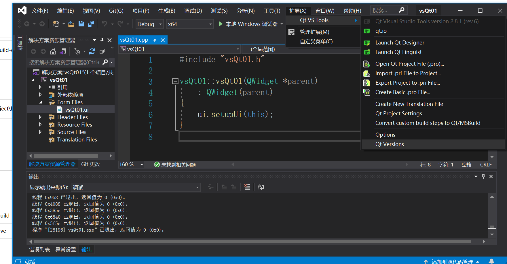
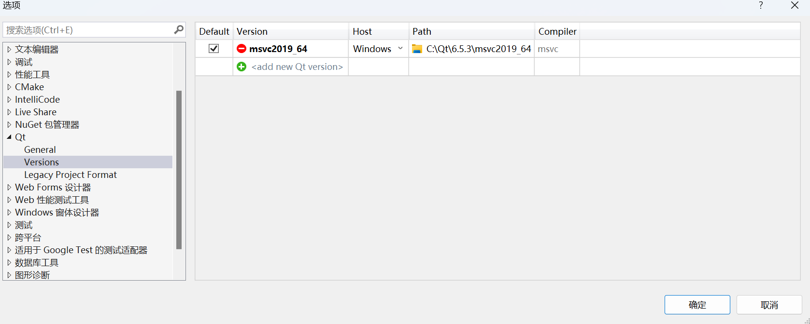
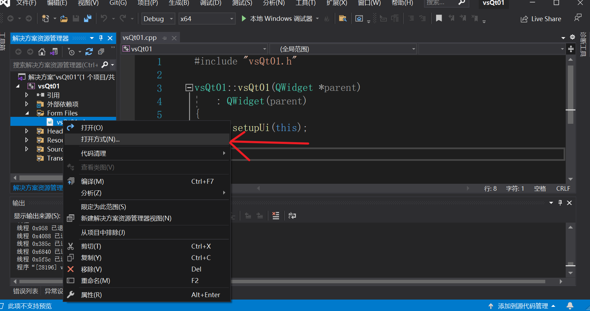
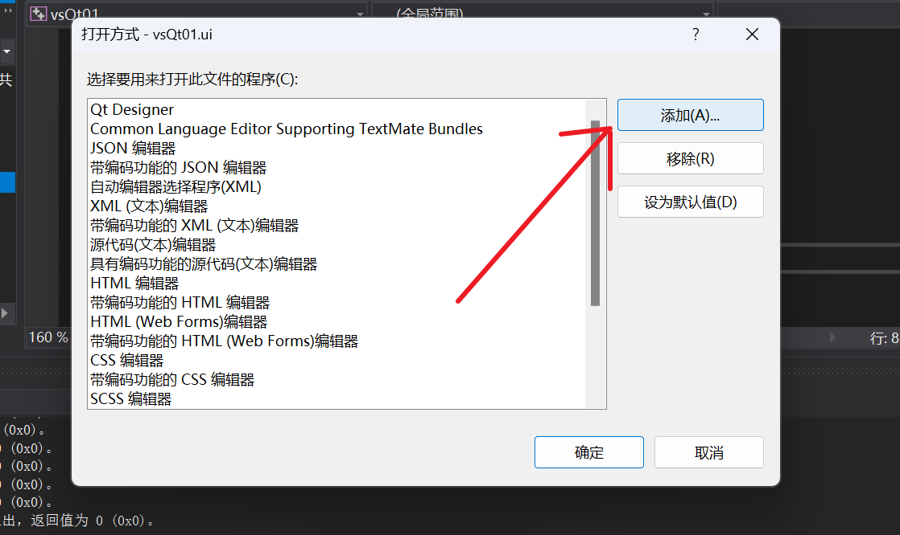
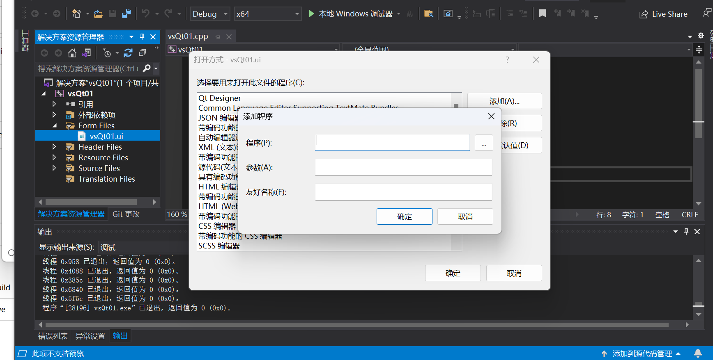
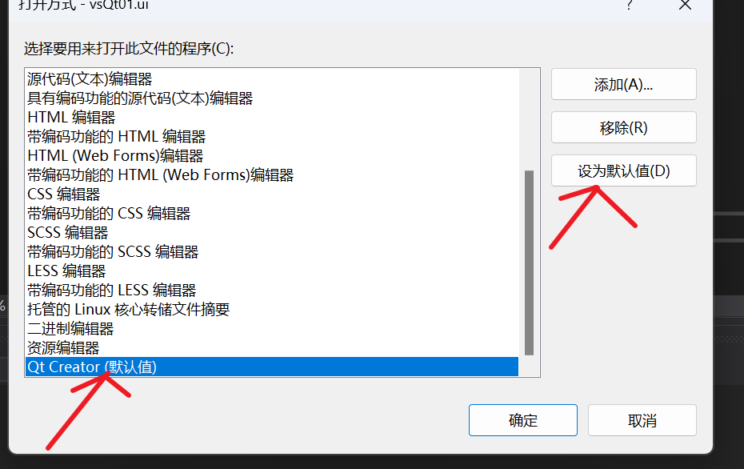
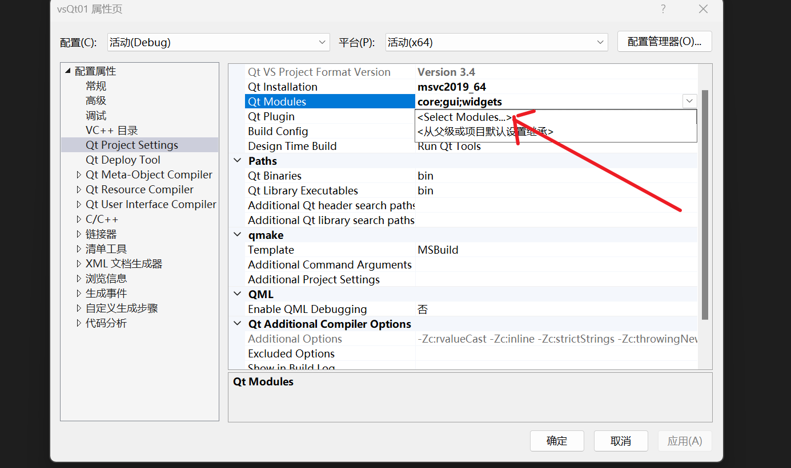

 

## QT安装

**1.找到对应的网站**

https://download.qt.io/archive/里面存放了QT版本和QT在线安装程序

**2.选择[online_installers](https://download.qt.io/archive/online_installers/)**

然后任意选择一个21年或者22的版本

然后打开该程序一直安装即可我的QT版本是6.5，addition library全选

**3.点击[Parent Directory](https://download.qt.io/)**，找到vsaddin目录，选择2.8.1，vs2019版本,再点击安装


## 编译器配置QT

QT creator中使用QT无需配置

但如果你想在vs2019中使用QT，是需要先配置QT的环境

1.先打开vs，并按照如下图片进行操作，最后点击QT versions



2.第一步操作之后，会出现下面的图像，你需要点击 ADD new QT version，然后将找到QT下载的msvc版本目录，然后将路径拷贝进去



3.按照如上操作之后，可以在vs2019中编译QT的代码，但是如果直接编辑ui文件就会报错，还需要将ui文件的默认打开方式设置为QT creator







这里输入QT creator的地址，它在QT下载目录的，tools下面的bin目录，然后添加程序成功之后



将其设置为默认值，

这样vs2019就配置成功了

## VS添加QT库

1. QT creator在pro文件里面添加

2. Vs2019在右键属性添加

   

## Qmake和Cmake

无跨平台的要求，qmake即可，如果需要跨平台最好cmake

现在最好使用cmake项目

## QT开发基础知识


### QT项目结构

**1.创建项目的时候**

QWidget、QMainWindow、QDialog。QWidget 是所有能看到的窗口或者控件的父类，QMainWindow、QDialog 都继承自它


**2.main函数中**

```c++
#include "widget.h"
#include <QApplication>

int main(int argc, char *argv[])
{
    QApplication a(argc, argv);
    Widget w;
    w.show();

    return a.exec();
}

```

Qt系统提供的类头文件没有.h后缀

Qt一个类对应一个头文件，类名和头文件名一致

QApplication 就是Qt里边每个应用程序有且仅有一个的应用程序对象

> 管理图形用户界面应用程序的控制流和主要设置。
>
> 是Qt生命，一个程序要确保一直运行，就肯定至少得有一个循环，**这就是**Qt**主消息循环**，在其中完成来自窗口系统和其它资源的**所有事件消息处理和调度**。它也处理**应用程序的初始化和结束**，并且**提供对话管理**。
>
> 对于任何一个使用Qt的图形用户界面应用程序，都正好存在一个QApplication 对象，不论这个应用程序在同一时刻有多少个窗口。

QApplication::exec()

> **程序进入消息循环**，等待对用户输入进行响应。这里main()把控制权转交给Qt，Qt完成事件处理工作，当应用程序退出的时候exec()的值就会返回。**在exec()中，Qt接受并处理用户和系统的事件并且把它们传递给适当的窗口部件。**


**3.Widget头文件**

```c++
#include <QWidget>

class MyWidget : public QWidget
{
    //引入Qt信号和槽机制的一个宏
    Q_OBJECT

public:
//构造函数中parent是指父窗口
//如果parent是0，那么窗口就是一个顶层的窗口
    MyWidget (QWidget *parent = 0);
    ~ MyWidget ();
};

```


**4.pro文件**

.pro就是工程文件(project)，它是qmake自动生成的用于生产makefile的配置文件，适用于QT creator。类似于VS中的.sln 和vsproj文件

```c++
		QT       += core gui    # 引入qt的模块 
            
        #如果qt版本号大于4，就引入widgets模块    
		greaterThan(QT_MAJOR_VERSION, 4): QT += widgets   
		
		#指定目标，生成可执行程序的名字
		TARGET = 01_hello
		
		#模板，生成什么文件，app表示应用程序exe,lib 就是生成库
		TEMPLATE = app
```

### QT 命名规范

类名：单词首字母大写，单词和单词之间直接连接，无需连接字符 。

```c++
      MyClass，QPushButton

      class MainWindow
```

Qt中内置的类型，头文件和类命名同名。

```c++
      #include <QString>

     QSring str;

     

     #include <QWidget>

     QWidget w;
```

函数名字，变量名：首字母小写，之后每个单词首字母大写，单词和单词之间直接连接，无需连接字符

```c++
    void connectTheSignal();
```

类的成员变量设置函数用使用 set+成员变量名，获取成员变量的函数直接用成员变量名（如果是bool类型，有可能会用一些表示状态的术语，如isVisilble，hasFocus）：

```c++
      //普通成员变量设置和获取

     void setText(QString text);

     QString text()const;

     //bool的成员变量设置和获取

     void setEnabled(bool enabled);

     bool isEnabled()const;
```

