# 设计模式

设计模式，**是一套被反复使用、多数人知晓的、经过分类编目的、代码设计经验的总结**。

描述了在软件设计过程中的**一些不断重复发生的问题**，以及该问题的解决方案。

是解决特定问题的一系列套路，是前辈们的代码设计经验的总结，具有一定的普遍性，可以反复使用。

其目的是**为了提高代码的可重用性、代码的可读性和代码的可靠性**。 

参考文章1：https://github.com/FengJungle/DesignPattern/tree/master

参考文章2：https://github.com/FengJungle/DesignPattern/tree/master

参考文章3：https://blog.csdn.net/weixin_45712636/article/details/124328504

## 设计模式的学习步骤

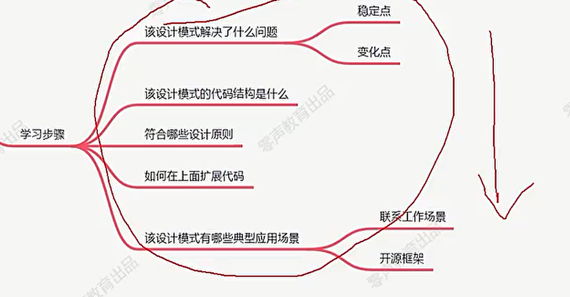

<font color='red'>注意：</font>

实际开发过程中可能会多个设计模式一起使用，如监听者，责任链

## 类基础

**类模型**：

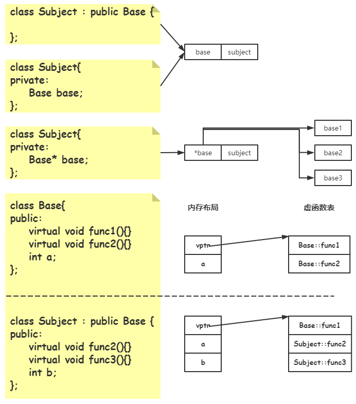

> 实现多态：
>
> Base *p = new Subject;
>
> 早绑定的含义就是p指向的是一个Base对象，而且是从Subject对象强制转为Base类型对象
>
> p->func2() ; 晚绑定就是p实际指向的是Subject方法，调用func2方法实际调用的Subject的方法

继承是子类继承父类

组合是类中存放某一个基类的指针，从上面的图中我们可以看到继承或者存放基类对象这两种方式，在内存中两个的数据都是存放在一片连续的空间，耦合度很高

## 设计原则

总原则：开闭原则（Open Close Principle）

开闭原则就是说对扩展开放，对修改关闭。在程序需要进行拓展的时候，不能去修改原有的代码，而是要扩展原有代码，实现一个热插拔的效果。所以一句话概括就是：为了使程序的扩展性好，易于维护和升级。想要达到这样的效果，我们需要使用接口和抽象类等，后面的具体设计中我们会提到这点。

### 依赖倒置

人话：这个是开闭原则的基础，具体内容：**面向接口编程，依赖于抽象而不依赖于具体**。写代码时用到具体类时，调用者不与具体类交互，而与具体类的上层接口（抽象类）交互。


实现接口依赖**抽象接口**，客户使用接口也依赖**抽象接口**

- 高层模块不应该依赖低层模块，两者都应该依赖抽象；
- 抽象不应该依赖具体实现，具体实现应该依赖于抽象；

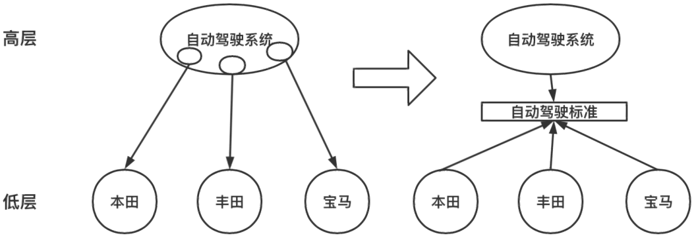  

- 自动驾驶系统公司是高层，汽车生产厂商为低层，它们不应该互相依赖，一方变动另一方也会跟着
  变动；而应该抽象一个自动驾驶行业标准，高层和低层都依赖它；这样以来就解耦了两方的变动；
  自动驾驶系统、汽车生产厂商都是具体实现，它们应该都依赖自动驾驶行业标准（抽象）；  

### 接口隔离原则

- 定义
  - `Interface Segregation Principle，ISP`
  - **客户端不应该被迫依赖于它不使用的方法**
  - **一个类对另一个类的依赖应该建立在最小的接口上**
  - 与单一职责原则的区别
    - 单一职责原则注重的是职责，而接口隔离原则注重的是对接口依赖的隔离。
    - 单一职责原则主要是约束类，它针对的是程序中的实现和细节；接口隔离原则主要约束接口，主要针对抽象和程序整体框架的构建。
- 作用
  - **将臃肿庞大的接口分解为多个粒度小的接口**，可以预防外来变更的扩散，提高系统的灵活性和可维护性。
  - 接口隔离提高了系统的内聚性，**减少了对外交互**，降低了系统的耦合性。
  - 使用多个专门的接口还能够体现对象的层次，因为可以通过接口的继承，实现对总接口的定义。
  - 能**减少项目工程中的代码冗余**。过大的大接口里面通常放置许多不用的方法，当实现这个接口的时候，被迫设计冗余的代码。


**人话：**

1.不应该强迫客户的程序依赖他们不需要的接口方法，对于用户不需要的接口使用protect或者private进行隔离。**一个接口应该只提供一种对外功能，不应该把所有操作都封装到一个接口中去。**

2.类与类的依赖应该建立在一个接口上面

### 迪米特法则

人话：一个类对自己依赖的类知道的越少越好。也就是说无论被依赖的类多么复杂，都应该将逻辑封装在方法的内部，通过public方法提供给外部，调用者只知道这个函数名称而不知道内部具体实现。这样当被依赖的类变化时，才能最小的影响该类。

- 定义
  - `Law of Demeter，LoD`, 又叫作**最少知道原则**（`Least Knowledge Principle，LKP`)
  - **如果两个软件实体无须直接通信，那么就不应当发生直接的相互调用（如：a的方法需要调用b的数据）**，可以通过第三方转发该调用。其目的是降低类之间的耦合度，提高模块的相对独立性。
- 作用
  - 降低了类之间的耦合度，提高了模块的相对独立性。
  - 由于亲合度降低，从而提高了类的可复用率和系统的扩展性。

### 单一职责原则

人话：**不要存在多于一个导致类变更的原因，也就是说每个类应该实现单一的职责，如若不然，就应该把类拆分。**

- 定义
  - `Single Responsibility Principle，SRP`
  - 单一职责原则规定**一个类应该有且仅有一个引起它变化的原因**，否则类应该被拆分。
  - 如果一个对象承担了太多的职责，至少存在以下两个缺点
    - 一个职责的变化可能会削弱或者抑制这个类实现其他职责的能力；
    - **当客户端需要该对象的某一个职责时，不得不将其他不需要的职责全都包含进来，从而造成冗余代码**或代码的浪费。
- 作用
  - 降低类的复杂度。一个类只负责一项职责，其逻辑肯定要比负责多项职责简单得多。
  - **提高类的可读性**。复杂性降低，自然其可读性会提高。
  - 提高系统的可维护性。可读性提高，那自然更容易维护了。
  - 变更引起的风险降低。变更是必然的，如果单一职责原则遵守得好，当修改一个功能时，可以显著降低对其他功能的影响。

### 里氏替换原则

- 定义
  - `Liskov Substitution Principle，LSP`
  - **继承必须确保基类所拥有的性质在子类中仍然成立**。即, 子类可以扩展父类的功能，但不能改变父类原有的功能。
- 作用
  - 是实现开闭原则的重要方式之一。
  - 克服了继承中重写父类造成的可复用性变差的缺点。
  - 类的扩展不会给已有的系统引入新的错误，降低了代码出错的可能性。


例如原来的add函数的功能是做加法，只是可能原来是年相加现在是日相加，子类继承父类之后不能将这个方法的含义变成了减法

### 开发封闭原则

类的改动是通过增加代码进行的，而不是修改源代码

### 合成复用原则

- 定义
  - `Composite Reuse Principle，CRP`, 又叫**组合/聚合复用原则**（`Composition/Aggregate Reuse Principle，CARP`）。
  - 在软件复用时，要尽量**先使用组合或者聚合等关联关系**来实现，其次才考虑使用继承关系来实现。
- 作用
  - 通常类的复用分为**继承复用**和**合成复用**两种，继承复用虽然有简单和易实现的优点，但它也存在以下缺点:
    - **继承复用破坏了类的封装性**。因为继承会将父类的实现细节暴露给子类，父类对子类是透明的，所以这种复用又称为“白箱”复用。
    - **子类与父类的耦合度高。父类的实现的任何改变都会导致子类的实现发生变化**，这不利于类的扩展与维护。
    - 它**限制了复用的灵活性。从父类继承而来的实现是静态的，在编译时已经定义，所以在运行时不可能发生变化。**
  - 采用组合或聚合复用时，可以**将已有对象纳入新对象中，使之成为新对象的一部分，新对象可以调用已有对象的功能**，它有以下优点:
    - 它维持了类的封装性。因为**成分对象的内部细节是新对象看不见的**，所以这种复用又称为“黑箱”复用。
    - 新旧类之间的耦合度低。这种复用所需的依赖较少，**新对象存取成分对象的唯一方法是通过成分对象的接口**。
    - 复用的灵活性高。这种复用可以在运行时动态进行，新对象可以动态地引用与成分对象类型相同的对象。

### 面向接口（不是设计原则）

- 不将变量类型声明为某个特定的具体类，而是声明为某个接口；
- 客户程序无需获知对象的具体类型，只需要知道对象所具有的接口；
- 减少系统中各部分的依赖关系，从而实现“高内聚、松耦合”的类型设计方案；  

这里的接口指的就是抽象类，通过具体类中有某一个抽象类指针，而且知道这个基类的某些抽象接口，那么通过依赖注入给这个抽象类指针指向派生类对象就可以实现，根据传入具体的派生类指针来实现不同的抽象接口

## 设计模式分类

- `创建型模式`：用于描述“怎样创建对象”，它的主要特点是“**将对象的创建与使用分离**”。 如, 单例、原型、工厂方法、抽象工厂、建造者等 5 种。
- `结构型模式`：用于描述如何将类或对象**按某种布局组成更大的结构**。 如, 代理、适配器、桥接、装饰、外观、享元、组合等 7 种。
- `行为型模式`：用于描述**类或对象之间怎样相互协作**共同完成单个对象都无法单独完成的任务，以及怎样分配职责。如, 模板方法、策略、命令、责任链、状态、观察者、中介者、迭代器、访问者、备忘录、解释器等 11 种。


## 创建型模式

### 单例模式

#### 1.c++类的所有构造函数

1. 默认构造函数

   > Student();*//没有参数* 
   >
   > Student(int num=0;int age=0);*//所有参数均有默认值*

   当一个类没有构造函数时候编译器自动为该类加上一个构造函数

2. 普通构造函数

   > C++用于构建类的新对象时需要调用的函数
   >
   > ```cpp
   > Student(int num，int age）;//有参数
   > ```

3. 拷贝构造函数

   当一个类**没有拷贝构造函数**时，会自动生成一个默认拷贝构造函数，主要默认拷贝构造函数是浅拷贝

   在何时会触发拷贝构造函数

   > 1).当用一个对象去初始化同类的另一个对象时，会引发复制构造函数被调用。例如，下面的两条语句都会引发复制构造函数的调用，用以初始化 c2。
   >
   > ```c++
   > Complex c2(c1);
   > Complex c2 = c1;
   > ```
   >
   > 
   > 这两条语句是等价的。
   >
   > **注意**：
   >
   > 第二条语句是初始化语句，不是赋值语句。赋值语句的等号左边是一个早已有定义的变量，赋值语句不会引发复制构造函数的调用。例如：
   >
   > ```c++
   > Complex c1, c2;
   > c1=c2;
   > 这条语句不会引发复制构造函数的调用，因为 c1 早已生成，已经初始化过了。
   > ```
   >
   > 2）.如果函数 F 的参数是类 A 的对象，那么当 F 被调用时，类 A 的复制构造函数将被调用。换句话说，**作为形参的类A的对象，是用复制构造函数初始化的**，而且调用复制构造函数时的参数，就是调用函数时所给的实参。
   >
   >  
   >
   > ```c++
   > #include<iostream>
   > using namespace std;
   > class A{
   > public:
   >     A(){};
   >     A(A & a){
   >         cout<<"Copy constructor called"<<endl;
   >     }
   > };
   > void Func(A a){ }
   > int main(){
   >     A a;
   >     Func(a);
   >     return 0;
   > }
   > ————————————————
   > 输出结果为：
   > Copy constructor called
   > ```
   >
   > 这是因为 Func 函数的形参 a 在初始化时调用了复制构造函数。
   >
   >  
   >
   > **注意：**
   >
   > 以对象作为函数的形参，在函数被调用时，生成的形参要用复制构造函数初始化，这会带来时间上的开销。如果用对象的引用而不是对象作为形参，就没有这个问题了。但是以引用作为形参有一定的风险，因为这种情况下如果形参的值发生改变，实参的值也会跟着改变。
   >
   >  **如果要确保实参的值不会改变，又希望避免复制构造函数带来的开销，解决办法就是将形参声明为对象的 const 引用**。例如：
   >
   > ```cpp
   > void Function(const Complex & c)
   > {
   >     ...
   > }
   > ```
   >
   >  
   >
   > 3). 如果函数的返冋值是类 A 的对象，则函数返冋时，类 A 的复制构造函数被调用。换言之，**作为函数返回值的对象是用复制构造函数初始化 的**，而调用复制构造函数时的实参，就是 return 语句所返回的对象。例如下面的程序：
   >
   > ```c++
   > #include<iostream>
   > using namespace std;
   > class A {
   > public:
   >     int v;
   >     A(int n) { v = n; };
   >     A(const A & a) {
   >         v = a.v;
   >         cout << "Copy constructor called" << endl;
   >     }
   > };
   > A Func() {
   >     A a(4);
   >     return a;
   > }
   > int main() {
   >     cout << Func().v << endl;
   >     return 0;
   > }
   > ————————————————
   > 输出结果
   >     
   > Copy constructor called
   >    
   > ```
   >
   > 

   

4. 转换构造函数

   > 一个构造函数接收一个不同于其类类型的形参，可以视为将其形参转换成类的一个对象。像这样的构造函数称为转换构造函数。在 C++ string 类中可以找到使用转换构造函数的实用示例。string 类提供一个将 C 字符串转换为 string 的转换构造函数
   >
   > ```c++
   > class string
   > {
   >     //仅显示转换构造函数
   >     public:
   >         string(char *);//形参时其他类型变量，且只有一个形参
   > };
   > ```
   >
   > 
   >

5. 移动构造函数

   > 所谓移动语义，指的就是**以移动而非深拷贝的方式初始化含有指针成员的类对象**。简单的理解，移动语义指的就是将其他对象（通常是临时对象）拥有的内存资源“移为已用”。事实上，对于程序执行过程中产生的临时对象，往往只用于传递数据（没有其它的用处），并且会很快会被销毁。因此在使用临时对象初始化新对象时，**我们可以将其包含的指针成员指向的内存资源直接移给新对象所有**，无需再新拷贝一份，这大大提高了初始化的执行效率。
   >
   > ```c++
   > #include <cstring>
   > 
   > using namespace std;
   > 
   > class Str{
   >     public:
   >         char *str;
   >         Str(Str &&s)//移动构造函数
   >         {
   >         }
   >         ~Str()
   >         {
   >         }
   > };
   > 
   > ```
   >
   > 


#### 2.单例模式实现

懒汉式：懒汉式单例. 类加载时没有生成单例, 第一次调用 getInstance 方法时才去创建（**延迟加载**）

```c++
    LazySingleton* getInstance() { 
        if (!instance_) {
            if (!instance_) instance_ = new LazySingleton(); 
        }
        return instance_; 
    }
```

**饿汉式**：饿汉式单例. 类一旦加载就创建一个单例

```c++
HungrySingleton* HungrySingleton::instance_ = new HungrySingleton();
```


版本1：最基础构造函数，释放的时候不能主动释放资源

```c++
class Singleton {
public:
    static Singleton * GetInstance() {
    if (_instance == nullptr) {
        _instance = new Singleton();
        return _instance;
    } 

}
private:
    Singleton() {}; //构造
    ~Singleton() {};
    Singleton(const Singleton &clone){}; //拷⻉构造
    Singleton& operator=(const Singleton&) {};
    SingleTon(singleton &&) = delete; //移动构造函数 delete关键字代表不要这个类型的构造
    static Singleton * _instance;
};
Singleton* Singleton::_instance = nullptr;//静态成员需要初始化
```

版本2：增加处理析构的方法

```c++
class Singleton {
public:
    static Singleton * GetInstance() {
    if (_instance == nullptr) {
        _instance = new Singleton();
        atexit(Destructor);//atexit 就是程序退出的时候会调用Destructor函数
        return _instance;    
    } 

} 

private:
    static void Destructor() {
        if (nullptr ! = _instance) { //
            delete _instance;
            _instance = nullptr;
        }
    } 
    Singleton();//构造
    ~Singleton() {}
    Singleton(const Singleton &cpy); //拷⻉构造
    Singleton& operator=(const Singleton& other) {}
static Singleton * _instance;
}
Singleton* Singleton::_instance = nullptr;//静态成员需要初始化
```

版本3：增加线程安全

```c++
#include <mutex>
class Singleton { // 懒汉模式 lazy load
public:
    static Singleton * GetInstance() {
     //在下面加锁虽然也可以防止线程不安全，每一个线程进入GetInstance函数都要
     //先申请锁，然后执行完了这个函数之后再释放锁，
     //但是只有new的时候需要加锁，防止同时new多个，如果只是获取类的实例对象则不用加锁
     //所以为了性能要求，不在此处加锁
    // std::lock_guard<std::mutex> lock(_mutex); // 3.1 切换线程
    if (_instance == nullptr) {
    	std::lock_guard<std::mutex> lock(_mutex); // 3.2
    	if (_instance == nullptr) {
    		_instance = new Singleton();
            // 1. 分配内存
            // 2. 调用构造函数
            // 3. 返回指针
            // 多线程环境下 cpu reorder操作
    		atexit(Destructor);
    	}
    } 
    return _instance;
    }
private:
    static void Destructor() {
    	if (nullptr ! = _instance) {
    	delete _instance;
    	_instance = nullptr;
    	}
    } 
    Singleton(){} //构造
    Singleton(const Singleton &cpy){} //拷⻉构造
    Singleton& operator=(const Singleton&) {}
    static Singleton * _instance;
    static std::mutex _mutex;
};
Singleton* Singleton::_instance = nullptr;//静态成员需要初始化
std::mutex Singleton::_mutex; //互斥锁初始化
```

**版本5：c++ effective作者**

```c++
// c++11 magic static 特性：如果当变量在初始化的时候，并发同时进⼊声明语句，并发线程将
会阻塞等待初始化结束。
// c++ effective
class Singleton
{ 
public:
    static Singleton& GetInstance() {
        static Singleton instance;
        return instance;
		}
private:
    Singleton(){}
    ~Singleton() {}
    Singleton(const Singleton&) {}
    Singleton& operator=(const Singleton&) {}
};
// 继承 Singleton
// g++ Singleton.cpp -o singleton -std=c++11
/*该版本具备 版本5 所有优点：
1. 利⽤静态局部变量特性，延迟加载；
2. 利⽤静态局部变量特性，系统⾃动回收内存，⾃动调⽤析构函数；
3. 静态局部变量初始化时，没有 new 操作带来的cpu指令reorder操作；
4. c++11 静态局部变量初始化时，具备线程安全；
```

### 简单工厂模式

#### 1.定义

- 含义

  `Factory Method` 定义一个用于创建产品的接口，由子类决定生产什么产品。

  - 优点:
    - 用户只需要知道具体工厂的名称就可得到所要的产品，无须知道产品的具体创建过程；
    - 在系统增加新的产品时只需要添加具体产品类和对应的具体工厂类，无须对原工厂进行任何修改，**满足开闭原则**；
  - 缺点:
    - 每增加一个产品就要增加一个具体产品类和一个对应的具体工厂类，这增加了系统的复杂度。

- 应用场景

  - 客户只知道创建产品的工厂名，而不需要知道具体的产品名。

  - 创建对象的任务由多个具体子工厂中的某一个完成，而抽象工厂只提供创建产品的接口。

  - 解决创建过程比较复杂，希望对外隐藏这些细节的场景；

    > 比如连接池、线程池
    > 隐藏对象真实类型；
    > 对象创建会有很多参数来决定如何创建；
    > 创建对象有复杂的依赖关系；  

- 扩展

  - 当需要生成的产品不多且不会增加，一个具体工厂类就可以完成任务时，可删除抽象工厂类。这时工厂方法模式将退化到**简单工厂模式**。

#### 2.工厂模式结构

 从工厂方法模式简介中，可以知道该模式有以下几种角色：

- **抽象工厂（AbstractFactory）**：所有生产具体产品的工厂类的基类，提供工厂类的公共方法；
- **具体工厂（ConcreteFactory）**：生产具体的产品
- **抽象产品（AbstractProduct）**：所有产品的基类，提供产品类的公共方法
- **具体产品（ConcreteProduct）**：具体的产品类 工厂方法模式UML类图如下：

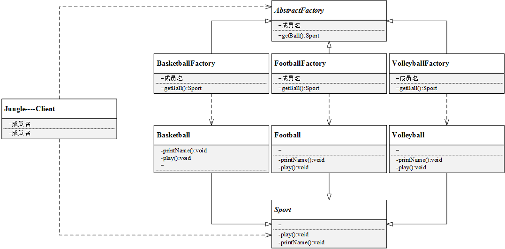

#### 3.实现

1. 定义抽象产品类AbstractSportProduct，方法不提供实现

   ```c++
   //抽象产品类AbstractProduct
   
   /// @brief 抽象产品 - 定义了产品的规范，描述了产品的主要特性和功能
   class AbstractSportProduct
   {
   public:
   	AbstractSportProduct(){
    
   	}
   	virtual ~AbstractSportProduct(){}
   	//抽象方法：
   	virtual void printName() = 0;
   	virtual void play(){} = 0;
   };
   ```

   

2. 定义三个具体产品类

   ```c++
   /// @brief 具体产品 - 实现了抽象产品角色所定义的接口，由具体工厂来创建，它同具体工厂之间一一对应
   
   //具体产品类Basketball
   class Basketball :public AbstractSportProduct
   {
   public:
   	Basketball(){
   		printName();
   		play();
   	}
   	//具体实现方法
   	void printName(){
   		printf("Jungle get Basketball\n");
   	}
   	void play(){
   		printf("Jungle play Basketball\n\n");
   	}
   };
    
   //具体产品类Football
   class Football :public AbstractSportProduct
   {
   public:
   	Football(){
   		printName();
   		play();
   	}
   	//具体实现方法
   	void printName(){
   		printf("Jungle get Football\n");
   	}
   	void play(){
   		printf("Jungle play Football\n\n");
   	}
   };
    
   //具体产品类Volleyball
   class Volleyball :public AbstractSportProduct
   {
   public:
   	Volleyball(){
   		printName();
   		play();
   	}
   	//具体实现方法
   	void printName(){
   		printf("Jungle get Volleyball\n");
   	}
   	void play(){
   		printf("Jungle play Volleyball\n\n");
   	}
   };
   ```

   

3. 定义抽象工厂类AbstractFactory，方法为纯虚方法

   ```c++
   /// @brief 抽象工厂 - 提供了创建产品的接口
   //抽象工厂类
   class AbstractFactory
   {
   public:
   	virtual AbstractSportProduct *getSportProduct() = 0;
   	virtual ~AbstractFactory(){}
   };
   ```

   

4. 定义三个具体工厂类（一个工厂类对应一个产品）

   ```c++
   /// @brief 具体工厂 - 实现抽象工厂中的抽象方法，完成具体产品的创建
   //具体工厂类BasketballFactory
   class BasketballFactory :public AbstractFactory
   {
   public:
   	BasketballFactory(){
   		printf("BasketballFactory\n");
   	}
   	AbstractSportProduct *getSportProduct(){
   		printf("basketball");
   		return new Basketball();
   	}
   };
    
   //具体工厂类FootballFactory
   class FootballFactory :public AbstractFactory
   {
   public:
   	FootballFactory(){
   		printf("FootballFactory\n");
   	}
   	AbstractSportProduct *getSportProduct(){
   		return new Football();
   	}
   };
    
   //具体工厂类VolleyballFactory
   class VolleyballFactory :public AbstractFactory
   {
   public:
   	VolleyballFactory(){
   		printf("VolleyballFactory\n");
   	}
   	AbstractSportProduct *getSportProduct(){
   		return new Volleyball();
   	}
   };
   ```

5. 客户端使用方法示例

   ```c++
   #include <iostream>
   #include "FactoryMethod.h"
    
   int main()
   {
   	printf("工厂方法模式\n");
   	
   	//定义工厂类对象和产品类对象
   	AbstractFactory *fac = nullptr;
   	AbstractSportProduct *product = nullptr;
    
   	fac = new BasketballFactory();
   	product = fac->getSportProduct();
   	delete fac;
   	fac = nullptr;
   	delete product;
   	product = nullptr;
    
   	fac = new FootballFactory();
   	product = fac->getSportProduct();
   	delete fac;
   	fac = nullptr;
   	delete product;
   	product = nullptr;
    
   	fac = new VolleyballFactory();
   	product = fac->getSportProduct();	
   	delete fac;
   	fac = nullptr;
   	delete product;
   	product = nullptr;
    
   	system("pause");
   	return 0;
   }
   ```

**输出效果：**

```c++
工厂方法模式
BasketballFactory
basketballJungle get Basketball
Jungle play Basketball

FootballFactory
Jungle get Football
Jungle play Football

VolleyballFactory
Jungle get Volleyball
Jungle play Volleyball
```


#### 4.总结

如果Jungle想玩棒球（Baseball），只需要增加一个棒球工厂（BaseballFacory），然后在客户端代码中修改具体工厂类的类名，而原有的类的代码无需修改。由此可看到，相较简单工厂模式，工厂方法模式更加符合开闭原则。工厂方法是使用频率最高的设计模式之一，是很多开源框架和API类库的核心模式。

优点：

- 工厂方法用于创建客户所需产品，同时向客户隐藏某个具体产品类将被实例化的细节，用户只需关心所需产品对应的工厂；
- 工厂自主决定创建何种产品，并且创建过程封装在具体工厂对象内部，多态性设计是工厂方法模式的关键；
- 新加入产品时，无需修改原有代码，增强了系统的可扩展性，符合开闭原则。

缺点：

- 添加新产品时需要同时添加新的产品工厂，系统中类的数量成对增加，增加了系统的复杂度，更多的类需要编译和运行，增加了系统的额外开销；
- 工厂和产品都引入了抽象层，客户端代码中均使用的抽象层（AbstractFactory和AbstractSportProduct ），增加了系统的抽象层次和理解难度。


#### 5.扩展

思来想去工厂方法依然会让用户接触到产品类的实例，我不想让用户接触到具体某个产品类的实例

```c++
#include <string>
// 实现导出数据的接口, 导出数据的格式包含 xml，json，文本格式txt 后面可能扩展excel格式csv
class IExport {
public:
    virtual bool Export(const std::string &data) = 0;
    virtual ~IExport(){}
};

class ExportXml : public IExport {
public:
    virtual bool Export(const std::string &data) {
        return true;//忽略具体逻辑
    }
};

class ExportJson : public IExport {
public:
    virtual bool Export(const std::string &data) {
        return true;//忽略具体逻辑
    }
};

class ExportTxt : public IExport {
public:
    virtual bool Export(const std::string &data) {
        return true;//忽略具体逻辑
    }
};

class IExportFactory {
public:
    virtual IExport * NewExport(/* ... */) = 0;
};

class ExportXmlFactory : public IExportFactory {
public:
    IExport * NewExport(/* ... */) {
        // 可能有其它操作，或者许多参数
        IExport * temp = new ExportXml;
        // 可能之后有什么操作
        return temp;
    }
};

class ExportJsonFactory : public IExportFactory {
public:
    IExport * NewExport(/* ... */) {
        // 可能有其它操作，或者许多参数
        IExport * temp = new ExportJson;
        // 可能之后有什么操作
        return temp;
    }
};

class ExportTxtFactory : public IExportFactory {
public:
    IExport * NewExport(/* ... */) {
        // 可能有其它操作，或者许多参数
        IExport * temp = new ExportTxt;
        // 可能之后有什么操作
        return temp;
    }
};

//更像是一个过程，在内部封装了一个模板方法
//用户只需要向这个类中送具体类型的工厂，然后调用抽象产品的抽象方法就能实现数据的导出
//对用户的细节隐藏的更深了，


//这样只需要给用户一个工厂的头文件，一个抽象的产品头文件
//是否可以在每一个具体工厂的头文件中使用前置声明，如声明一个ExportJson类
//然后再具体工厂的实现文件再包含对应ExportJson类的头文件
//这样调用者就看不到具体产品的定义

//但是你如果想导出为不同类型的数据，用户还是需要知道有那些Export的类型
class ExportData {
public:
    ExportData(IExportFactory *factory) : _factory(factory) {}
    ~ExportData() {
        if (_factory) {
            delete _factory;
            _factory = nullptr;
        }
    }
    bool Export(const std::string &data) { // 稳定的流程 往基类放 
        IExport * e = _factory->NewExport();//还可以将e 声明为类的成员变量
        e->Export(data);
    }
private:
    IExportFactory *_factory;
};

int main() {
    ExportData ed(new ExportTxtFactory);
    ed.Export("hello world");
    return 0;
} 
```


### 抽象工厂方法

回顾之前的设计模式，简单工厂模式所有逻辑都封装在工厂类中，工厂根据客户提供的产品名字创建对应产品的对象实例；工厂方法模式将产品的创建过程放到了具体工厂类中，每一个工厂可以创建一个具体产品，由此可能会创建许多工厂类。很多时候，**一个工厂不只是生产一种产品，而是生产一类产品**，比如一个体育用品工厂，可以生产篮球、足球、排球等多种产品。此时我们可以把这些相关的产品归纳为一个“产品族”，由同一个工厂来生产，这即是今天要学习的抽象工厂模式。

#### 1.定义

简言之，一个工厂可以提供创建多种相关产品的接口，而无需像工厂方法一样，为每一个产品都提供一个具体工厂。

#### 2.抽象工厂结构

抽象工厂模式结构与工厂方法模式结构类似，不同之处在于，一个具体工厂可以生产多种同类相关的产品：

- **抽象工厂（AbstractFactory）**：所有生产具体产品的工厂类的基类，提供工厂类的公共方法；
- **具体工厂（ConcreteFactory）**：生产具体的产品
- **抽象产品（AbstractProduct）**：所有产品的基类，提供产品类的公共方法
- **具体产品（ConcreteProduct）**：具体的产品类
  抽象工厂模式UML类图如下：

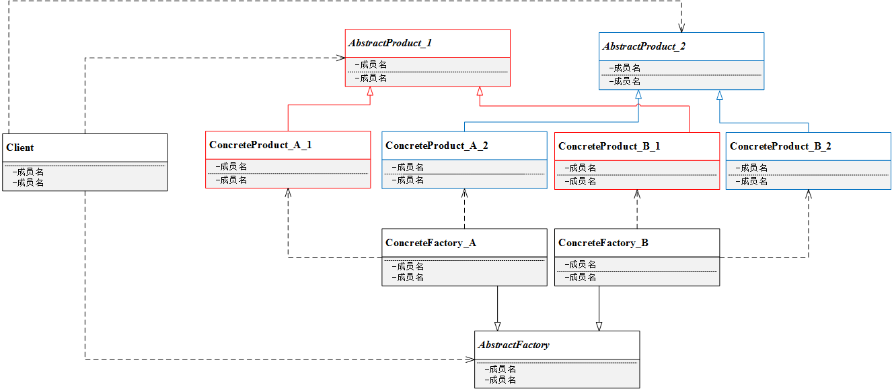


结合抽象工厂模式定义和UML，可以看到具体工厂ConcreteFactory_A可以生产两种产品，分别是ConcreteProduct_A_1和ConcreteProduct_A_2，另一个具体工厂ConcreteFactory_B同理。客户端使用时，需要声明一个抽象工厂*AbstractFactory*和两个抽象产品*AbstractProduct*。


#### 3.抽象工厂模式代码实例

考虑这样一个场景，如下图

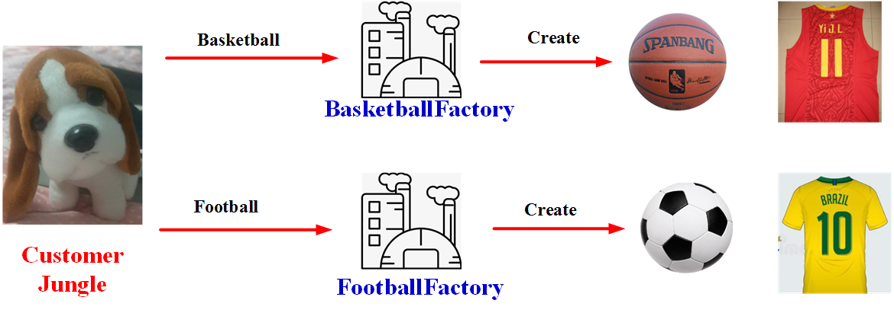

> Jungle想要进行户外运动，它可以选择打篮球和踢足球。
> 但这次Jungle不想弄脏原本穿的T恤，所以Jungle还需要穿球衣，打篮球就穿篮球衣，踢足球就穿足球衣。
> 篮球保管室可以提供篮球和篮球衣，足球保管室可以提供足球和足球衣。
> Jungle只要根据心情去某个保管室，就可以换上球衣、拿上球，然后就可以愉快地玩耍了。


1. 产品类Ball

   > - 抽象产品类AbstractBall, 球类的基类，定义抽象方法play
   >
   > ```c++
   > //抽象产品类AbstractBall
   > class AbstractBall
   > {
   > public:
   >     AbstractBall(){}
   >     //抽象方法：
   >     virtual void play() = 0;
   >     virtual ~AbstractBall() {}
   > };
   > ```
   >
   > - 具体产品类， 分别为Basketball和Football，具体实现方法play
   >
   > ```c++
   > //具体产品类Basketball
   > class Basketball :public AbstractBall
   > {
   > public:
   > 	Basketball(){
   > 		play();
   > 	}
   > 	//具体实现方法
   > 	void play(){
   > 		printf("Jungle play Basketball\n\n");
   > 	}
   > };
   >  
   > //具体产品类Football
   > class Football :public AbstractBall
   > {
   > public:
   > 	Football(){
   > 		play();
   > 	}
   > 	//具体实现方法
   > 	void play(){
   > 		printf("Jungle play Football\n\n");
   > 	}
   > };
   > ```

2. 产品类shirt

   > - 抽象产品类AbstractShirt：球衣类的基类，定义抽象方法wearShirt
   >
   > ```c++
   > //抽象产品类AbstractShirt
   > class AbstractShirt
   > {
   > public:
   >     AbstractShirt(){}
   >     //抽象方法：
   >     virtual void wearShirt() = 0;
   >     virtual ~AbstractShirt(){}
   > };
   > ```
   >
   > 
   >
   > - 具体产品类BasketballShirt和FootballShirt，具体实现方法wearShirt
   >
   > ```c++
   > //具体产品类BasketballShirt
   > class BasketballShirt :public AbstractShirt
   > {
   > public:
   > 	BasketballShirt(){
   > 		wearShirt();
   > 	}
   > 	//具体实现方法
   > 	void wearShirt(){
   > 		printf("Jungle wear Basketball Shirt\n\n");
   > 	}
   > };
   >  
   > //具体产品类FootballShirt
   > class FootballShirt :public AbstractShirt
   > {
   > public:
   > 	FootballShirt(){
   > 		wearShirt();
   > 	}
   > 	//具体实现方法
   > 	void wearShirt(){
   > 		printf("Jungle wear Football Shirt\n\n");
   > 	}
   > };
   > ```

3. 工厂类

   > - 定义抽象工厂AbstractFactory，声明两个方法getBall和getShirt
   >
   > ```c++
   > //抽象工厂类
   > class AbstractFactory
   > {
   > public:
   >     virtual AbstractBall *getBall() = 0;
   >     virtual AbstractShirt *getShirt() = 0;
   >     virtual ~AbstractFactory(){}
   > };
   > ```
   >
   > 
   >
   > - 定义具体工厂BasketballFactory和FootballFactory，重新具体实现两个方法getBall和getShirt
   >
   > ```c++
   > //具体工厂类BasketballFactory
   > class BasketballFactory :public AbstractFactory
   > {
   > public:
   > 	BasketballFactory(){
   > 		printf("BasketballFactory\n");
   > 	}
   > 	AbstractBall *getBall(){
   > 		printf("Jungle get basketball\n");
   > 		return new Basketball();
   > 	}
   > 	AbstractShirt *getShirt(){
   > 		printf("Jungle get basketball shirt\n");
   > 		return new BasketballShirt();
   > 	}
   > };
   >  
   > //具体工厂类BasketballFactory
   > class FootballFactory :public AbstractFactory
   > {
   > public:
   > 	FootballFactory(){
   > 		printf("FootballFactory\n");
   > 	}
   > 	AbstractBall *getBall(){
   > 		printf("Jungle get football\n");
   > 		return new Football();
   > 	}
   > 	AbstractShirt *getShirt(){
   > 		printf("Jungle get football shirt\n");
   > 		return new FootballShirt();
   > 	}
   > };
   > ```

4. 客户端使用

   ```c++
   #include <iostream>
   #include "AbstractFactory.h"
    
   int main()
   {
       printf("抽象工厂模式\n");
   
       //定义工厂类对象和产品类对象
       AbstractFactory *fac = nullptr;
       AbstractBall *ball = nullptr;
       AbstractShirt *shirt = nullptr;
   
       fac = new BasketballFactory();
       ball = fac->getBall();
       shirt = fac->getShirt();
       delete ball;
       ball = nullptr;
       delete shirt;
       shirt = nullptr;
       delete fac;
       fac = nullptr;
   
       fac = new FootballFactory();
       ball = fac->getBall();
       shirt = fac->getShirt();
       delete ball;
       ball = nullptr;
       delete shirt;
       shirt = nullptr;
       delete fac;
       fac = nullptr;
   
       system("pause");
       return 0;
   }
   ```

5. 输出效果

   ```c++
   抽象工厂模式
   BasketballFactory
   Jungle get basketball
   Jungle play Basketball
   
   Jungle get basketball shirt
   Jungle wear Basketball Shirt
   
   FootballFactory
   Jungle get football
   Jungle play Football
   
   Jungle get football shirt
   Jungle wear Football Shirt
   ```


#### 4.总结

抽象工厂模式中，如果需要新增加一个系列的产品，比如足球系列，只需增加一族新的具体产品类（抽象和具体）并提供一个对应的工厂类即可。但是，如果要在已有的产品族里增加另一个产品，比如Jungle打篮球，除了需要篮球和篮球衣外，**Jungle还想换双篮球鞋**，这时候该怎么办呢？是不是要去修改BasketballFactory呢？（应该需要，需要再去类中增加一个获取篮球鞋的接口）

**优点：**

- 工厂方法用于创建客户所需产品，同时向客户隐藏某个具体产品类将被实例化的细节，用户只需关心所需产品对应的工厂；
- 新加入产品系列时，无需修改原有系统，增强了系统的可扩展性，符合开闭原则。

**缺点：**

- 在已有产品系列中添加新产品时需要修改抽象层代码，对原有系统改动较大，违背开闭原则（如上面增加篮球鞋，就需要我们再篮球的工厂类中新增获取篮球鞋的接口）

**适用环境：**

- 一系列/一族产品需要被同时使用时，适合使用抽象工厂模式；
- 产品结构稳定，设计完成之后不会向系统中新增或剔除某个产品


### 建造者模式

#### 1.定义

> 建造者模式：
>
> 将一个复杂对象的构建与它的表示分离，使得同样的构建过程可以创建不同的表示。

“**同样的构建过程可以创建不同的表示**”？？这句话是什么意思呢？想象一下，建造一栋房子，建造过程无非都是打地基、筑墙、安装门窗等过程，但不同的客户可能希望不同的风格或者过程，最终建造出来的房子当然就呈现不同的风格啦！

#### 2.建造者模式结构

建造者模式的结构包含以下几个角色：

- **抽象建造者（AbstractBuilder）**：创建一个Product对象的各个部件指定的抽象接口；
- **具体建造者（ConcreteBuilder）**：实现AbstractBuilder的接口，实现各个部件的具体构造方法和装配方法，并返回创建结果。
- **产品（Product）**：具体的产品对象
- **指挥者（Director）**： 构建一个使用Builder接口的对象，安排复杂对象的构建过程，**客户端一般只需要与Director交互，指定建造者类型，然后通过构造函数或者setter方法将具体建造者对象传入Director**。它主要作用是：隔离客户与对象的生产过程，并负责控制产品对象的生产过程。

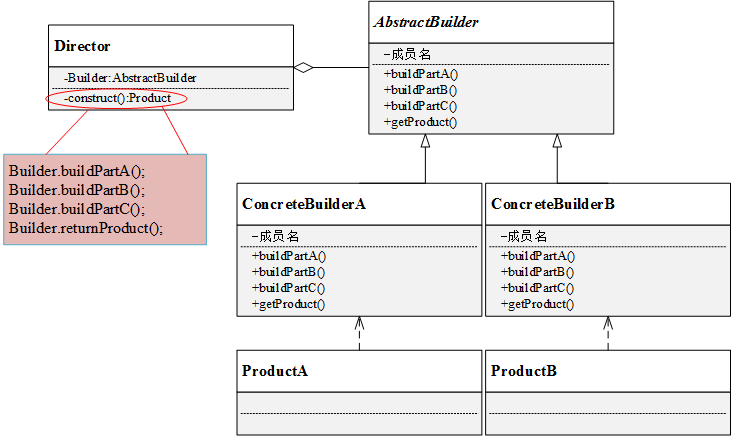

#### 3.代码

> Jungle想要建造一栋简易的房子（地板、墙和天花板），两个工程师带着各自的方案找上门来，直接给Jungle看方案和效果图。
> 犹豫再三，Jungle最终选定了一位工程师……交房之日，Jungle满意的看着建好的房子，
> 开始思考：这房子究竟是怎么建成的呢？这地板、墙和天花板是怎么建造的呢？
> 工程师笑着说：“It's none of your business”

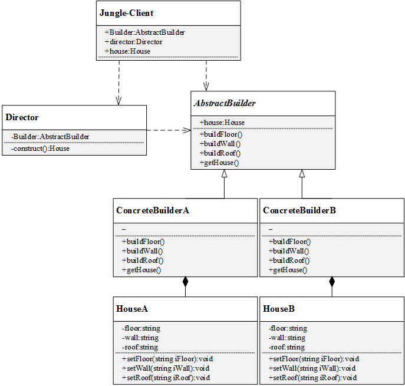


1. 定义产品类House

   ```c++
   //产品类House
   class House
   {
   public:
   	House(){}
   	void setFloor(string iFloor){
   		this->floor = iFloor;
   	}
   	void setWall(string iWall){
   		this->wall = iWall;
   	}
   	void setRoof(string iRoof){
   		this->roof = iRoof;
   	}
   	//打印House信息
   	void printfHouseInfo(){
   		printf("Floor:%s\t\n", this->floor.c_str());
   		printf("Wall:%s\t\n", this->wall.c_str());
   		printf("Roof:%s\t\n", this->roof.c_str());
   	}
   private:
   	string floor;
   	string wall;
   	string roof;
   };
   ```

   House是本实例中的产品，具有floor、wall和roof三个属性。

2. 定义建造者

   ```c++
   //抽象建造者AbstractBuilder
   class AbstractBuilder
   {
   public:
       AbstractBuilder(){
           house = new House();
       }
       virtual ~AbstractBuilder(){}
       //抽象方法：
       virtual void buildFloor() = 0;
       virtual void buildWall() = 0;
       virtual void buildRoof() = 0;
       virtual House *getHouse() = 0;
   
       House *house;
   };
   
   //具体建造者ConcreteBuilderA
   class ConcreteBuilderA :public AbstractBuilder
   {
   public:
   	ConcreteBuilderA(){
   		printf("ConcreteBuilderA\n");
   	}
   	//具体实现方法
   	void buildFloor(){
   		this->house->setFloor("Floor_A");
   	}
   	void buildWall(){
   		this->house->setWall("Wall_A");
   	}
   	void buildRoof(){
   		this->house->setRoof("Roof_A");
   	}
   	House *getHouse(){
   		return this->house;
   	}
   };
    
   //具体建造者ConcreteBuilderB
   class ConcreteBuilderB :public AbstractBuilder
   {
   public:
   	ConcreteBuilderB(){
   		printf("ConcreteBuilderB\n");
   	}
   	//具体实现方法
   	void buildFloor(){
   		this->house->setFloor("Floor_B");
   	}
   	void buildWall(){
   		this->house->setWall("Wall_B");
   	}
   	void buildRoof(){
   		this->house->setRoof("Roof_B");
   	}
   	House *getHouse(){
   		return this->house;
   	}
   };
   ```

   

3. 定义指挥者

   ```c++
   //指挥者Director
   class Director
   {
   public:
       Director(){}
       //具体实现方法
       void setBuilder(AbstractBuilder *iBuilder){
           this->builder = iBuilder;
       }
       //封装组装流程，返回建造结果
       House *construct(){
           builder->buildFloor();
           builder->buildWall();
           builder->buildRoof();
           return builder->getHouse();
       }
   private:
   	AbstractBuilder *builder;
   };
   ```

   

4. 客户端代码

   ```c++
   #include "BuilderPattern.h"
    
   int main()
   {
       //抽象建造者
       AbstractBuilder *builder;
       //指挥者
       Director *director = new Director();
       //产品：House
       House *house;
   
       //指定具体建造者A
       builder = new ConcreteBuilderA();
       director->setBuilder(builder);
       house = director->construct();
       house->printfHouseInfo();
       delete builder;
       builder = nullptr;
       delete house;
       house = nullptr;
   
       //指定具体建造者B
       builder = new ConcreteBuilderB();
       director->setBuilder(builder);
       house = director->construct();
       house->printfHouseInfo();
       delete builder;
       builder = nullptr;
       delete house;
       house = nullptr;
   
       delete director;
       director = nullptr;
   
       system("pause");
       return 0;
   }
   ```

   

#### 4.总结

从客户端代码可以看到，客户端只需指定具体建造者，并作为参数传递给指挥者，通过指挥者即可得到结果。客户端无需关心House的建造方法和具体流程。如果要更换建造风格，只需更换具体建造者即可，不同建造者之间并无任何关联，方便替换。从代码优化角度来看，其实可以不需要指挥者Director的角色，而直接把construct方法放入具体建造者当中。

优点：

- 建造者模式中，客户端不需要知道产品内部组成细节，将产品本身和产品的创建过程分离，使同样的创建过程可以创建不同的产品对象；
- 不同建造者相互独立，并无任何挂链，方便替换。

缺点：

- 建造者模式所创建的产品一般具有较多的共同点，其组成部分相似，如果产品之间的差异性很大，则不适合使用建造者模式，因此其使用范围受到一定的限制。
- 如果产品的内部变化复杂，可能会导致需要定义很多具体建造者类来实现这种变化，导致系统变得很庞大

适用环境：

- 需要生成的产品对象有复杂的内部结构（通常包含多个成员变量）；
- 产品对象内部属性有一定的生成顺序；
- 同一个创建流程适用于多种不同的产品。


## 结构型模式

### 代理模式

> “代理”这个词不陌生吧？买化妆品、买奶粉、买包包，都可以通过代理代购，甚至有专门的代购网站；
> 或者要购置一些自己不太清楚原理好坏的物品，可以找相关代理负责帮忙购买，当然了，得支付一定费用。

在软件设计模式中，也有一种模式可以提供与代购网站类似的功能。当客户端不能或者不便直接访问一个对象时，可以通过一个称为“代理”的第三方来间接访问，这样的设计模式称为代理模式。

#### 1.定义

代理模式在软件设计中广泛应用，而且产生的变种很多，如远程代理、虚拟代理、缓冲代理、保护代理等。

```
代理模式：
给某一个对象提供一个代理或占位符，并由代理对象来控制对原对象的访问。
```

代理模式是一种对象结构型模式，在该模式中引入了一个代理对象，在**客户端**和**目标访问对象**之间起到中介的作用。**代理对象可以屏蔽或删除客户不想访问的内容和服务**，也可以根据客户需求增加新的内容和服务。

#### 2.代理模式结构

代理模式的关键是代理类（Proxy）。代理模式中引入了抽象层，客户端针对抽象层编程，这样使得客户端可以一致对待真实对象和代理对象。代理模式主要有**抽象主题角色（Subject）**、**代理主题角色（(Proxy)**和**真实主题角色（RealSubject）**组成，其UML图如下：

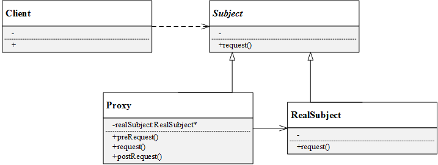

- **抽象主题角色（Subject）**：声明了代理主题角色和真实主题角色共同的一些接口，因此在任何可以使用真实主题对象的地方都可以使用代理主题角色（想一想代购是不是也是这样？），客户端通常针对抽象主题编程；
- **代理主题角色（Proxy）**：代理主题角色通过关联关系引用真实主题角色，因此可以控制和操纵真实主题对象；代理主题角色中提供一个与真实主题角色相同的接口（以在需要时代替真实主题角色），同时还可以在调用对真实主题对象的操作之前或之后增加新的服务和功能；
- **真实主题角色（RealSubject）**：真实主题角色是代理角色所代表的真实对象，提供真正的业务操作，客户端可以通过代理主题角色间接地调用真实主题角色中定义的操作。

在实际开发过程中，代理模式产生了很多类型：

- 远程代理（Remote Proxy）：为一个位于不同地址空间的对象提供一个本地的代理对象。不同的地址空间可以在相同或不同的主机中。
- 虚拟代理（Virtual Proxy）：当创建一个对象需要消耗大量资源时，可以先创建一个消耗较少资源的虚拟代理来表示，当真正需要时再创建。
- 保护代理（Protect Proxy）：给不同的用户提供不同的对象访问权限。 缓冲代理（Cache Proxy）：为某一个目标操作的结果提供临时存储空间，以使更多用户可以共享这些结果。
- 智能引用代理（Smart Reference Proxy）：当一个对象被引用时提供一些额外的操作，比如将对象被调用的次数记录下来等。

#### 3.代码

在某应用软件中需要记录业务方法的调用日志，在不修改现有业务的基础上位每个类提供一个**日志记录代理类**，在代理类中输出日志，例如在业务方法method()调用之前输出“方法method()被调用，调用时间为2019-10-28 07:33:30”，调用之后输出“方法method()”调用成功。在代理类中调用真实业务类的业务方法，使用代理模式设计该日志记录模块的结构。

在这个案例中，真实主题角色是真实业务类，在代理类中调用真实主题角色的method()方法。该实例的UML图如下：

[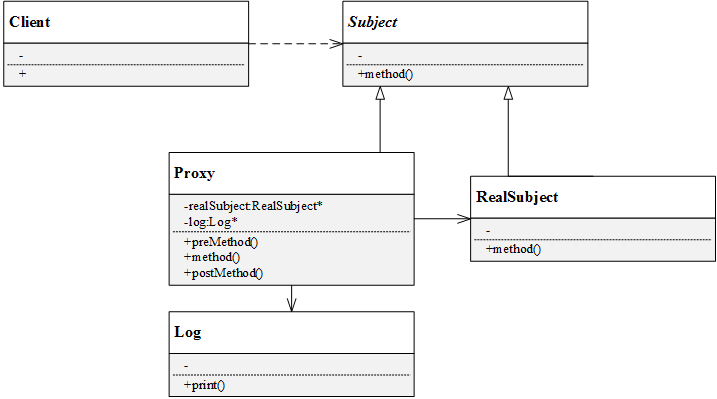](https://github.com/FengJungle/DesignPattern/blob/master/13.ProxyPattern/1.Picture/代理模式实例UML图.png)

1. 抽象主题角色

   声明抽象方法method():

   ```c++
   // 抽象主题角色
   class Subject
   {
   public:
   	Subject(){}
       virtual ~Subject(){}
   	virtual void method() = 0;
   };
   ```

2. 真实主题角色

   实现具体业务方法method()：

   ```c++
   // 真实主题角色
   class RealSubject :public Subject
   {
   public:
   	RealSubject(){}
   	void method(){
   		printf("调用业务方法\n");
   	}
   };
   ```

3. 代理角色和log类

   ```c++
   // Log类
   class Log
   {
   public:
   	Log(){}
   	string getTime(){
   		time_t t = time(NULL);
   		char ch[64] = { 0 };
   		//年-月-日 时:分:秒
   		strftime(ch, sizeof(ch)-1, "%Y-%m-%d %H:%M:%S", localtime(&t));     
   		return ch;
   	}
   };
    
   // 代理类
   class Proxy:public Subject
   {
   public:
   	Proxy(){
   		realSubject = new RealSubject();
   		log = new Log();
   	}
   	Proxy(const Proxy& o) = delete;
   	Proxy& operator=(const Proxy&) = delete;
   	~Proxy(){
   		delete realSubject;
   		delete log;
   		realSubject = nullptr;
   		log = nullptr;
   	}
   	void preCallMethod(){
   		printf("方法method()被调用，调用时间为%s\n",log->getTime().c_str());//这里实际是日志代码
   	}
   	void method(){
   		preCallMethod();
   		realSubject->method();
   		postCallMethod();
   	}
   	void postCallMethod(){
   		printf("方法method()调用调用成功!\n");
   	}
   private:
   	RealSubject *realSubject;
   	Log* log;
   };
   ```

4. 客户端代码

   ```c++
   #include <iostream>
   #include "ProxyPattern.h"
    
   int main()
   {
   	Subject *subject;
   	subject = new Proxy();
   	subject->method();
    
   	printf("\n\n");
    
   	delete subject;
   	subject = nullptr;
    
   	system("pause");
   	return 0;
   }
   ```

   

#### 4.总结

- 优点：
  - 代理模式能够协调调用者和被调用者，降低系统耦合度；
  - 客户端针对抽象主题角色编程，如果要增加或替换代理类，无需修改源代码，符合开闭原则，系统扩展性好；
  - 远程代理优点：为两个位于不同地址空间的对象的访问提供解决方案，可以将一些资源消耗较多的对象移至性能较好的计算机上，提高系统整体性能；
  - 虚拟代理优点：通过一个资源消耗较少的对象来代表一个消耗资源较多的对象，节省系统运行开销；
  - 缓冲代理优点：为某一个操作结果提供临时的存储空间，可以在后续操作中使用这些结果，缩短了执行时间；
  - 保护代理优点：:控制对一个对象的访问权限，为不同客户提供不同的访问权限。
- 缺点：
  - 增加了代理类和代理对象，增加了代理对象中的某些处理流程，可能会使得系统响应变慢；
  - 有的代理模式（如远程代理）实现代码较为复杂。
- 适用环境：
  - 当客户端对象需要访问远程主机中的对象——可以使用远程代理；
  - 当需要用一个资源消耗较少的对象来代表一个资源消耗较多的对象——虚拟代理；
  - 当需要限制不同用户对一个独享的访问权限——保护代理；
  - 当需要为一个频繁访问的操作结果提供临时存储空间——缓冲代理；
  - 当需要为一个对象的访问提供一些额外的操作——智能引用代理。

### 外观模式

#### 1.定义

外观模式是一种使用频率较高的设计模式，它提供一个外观角色封装多个复杂的子系统，简化客户端与子系统之间的交互，方便客户端使用。外观模式可以降低系统的耦合度。如果没有外观类，不同的客户端在需要和多个不同的子系统交互，系统中将存在复杂的引用关系，如下图。引入了外观类，原有的复杂的引用关系都由外观类实现，不同的客户端只需要与外观类交互。

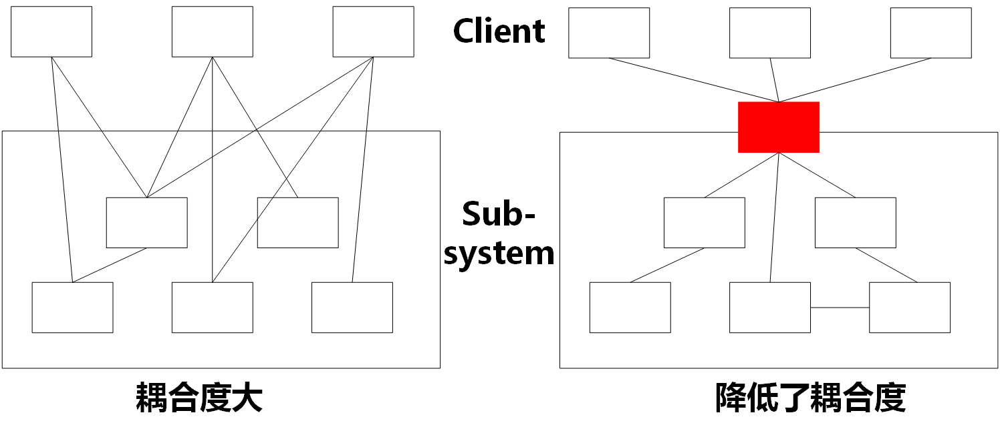

> 外观模式：
> 为子系统中的一组接口提供一个统一的入口。外观模式定义了一个高层接口，这个接口使得这一子系统更加容易使用。

#### 2.外观模式结构

外观模式的UML结构图如下所示：
[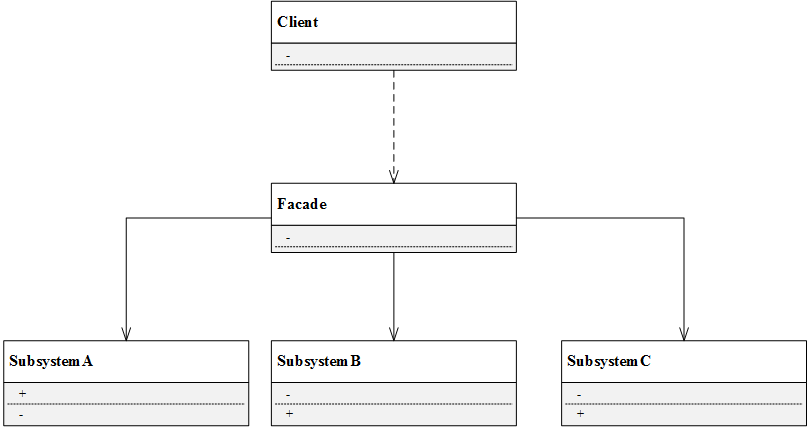](https://github.com/FengJungle/DesignPattern/blob/master/11.FacadePattern/1.Picture/外观模式.png)


外观模式一共有以下角色：

- **Facade（外观角色）**：外观角色可以知道多个相关子系统的功能，它将所有从客户端发来的请求委派给相应的子系统，传递给相应的子系统处理。
- **SubSystem（子系统角色）**：子系统是一个类，或者由多个类组成的类的集合，它实现子系统具体的功能。

#### 3.代码

电脑主机（Mainframe）中只需要按下主机的开机按钮（powerOn），即可调用其他硬件设备和软件的启动方法，如内存（Memory）的自检（selfCheck）、CPU的运行（run）、硬盘（HardDisk）的读取（read）、操作系统（OS）的载入（load）等。如果某一过程发生错误则电脑开机失败。

这里Jungle用外观模式来模拟该过程，该例子UML图如下： [](https://github.com/FengJungle/DesignPattern/blob/master/11.FacadePattern/1.Picture/外观模式实例UML图.png)


```c++
//子系统类
//本例中一共有4个子系统，因此设计4个类：Memory、CPU、HardDisk和OS，并且每个子系统都有自己独立的流程。

// subsystem: Memory
class Memory
{
public:
	Memory(){}
	void selfCheck(){
		printf("memory selfchecking......\n");
	}
};
 
// subsystem: CPU
class CPU
{
public:
	CPU(){}
	void run(){
		printf("running cpu......\n");
	}
};
 
// subsystem: hardDisk
class HardDisk
{
public:
	HardDisk(){}
	void read(){
		printf("reading hardDisk......\n");
	}
};
 
// subsystem: OS
class OS
{
public:
	OS(){}
	void load(){
		printf("loading os.....\n");
	}
};

//外观类设计
class Facade
{
public:
	Facade(){
		memory = new Memory();
		cpu = new CPU();
		hardDisk = new HardDisk();
		os = new OS();
	}
	~Facade(){
		delete memory;
		delete cpu;
		delete hardDisk;
		delete os;
		memory = nullptr;
		cpu = nullptr;
		hardDisk = nullptr;
		os = nullptr;
	}
	Facade(const Facade& facade) = delete;
	Facade operator=(const Facade& facade) = delete;
	void powerOn(){
		printf("power on……\n");
		memory->selfCheck();
		cpu->run();
		hardDisk->read();
		os->load();
		printf("ready!\n");
	}
private:
	Memory *memory;
	CPU *cpu;
	HardDisk *hardDisk;
	OS *os;
};
```

**客户端代码：**

```c++
#include <iostream>
#include "FacadePattern.h"
 
int main()
{
	Facade *facade = new Facade();
	facade->powerOn();
 
	printf("\n\n");
	delete facade;
	system("pause");
	return 0;
}
```

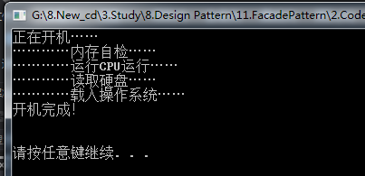


#### 4.总结

- 优点：
  - 外观模式使得客户端不必关心子系统组件，减少了与客户端交互的对象的数量，简化了客户端的编程；
  - 外观模式可以大大降低系统的耦合度；
  - 子系统的变化并不需要修改客户端，只需要适当修改外观类即可；
  - 子系统之间不会相互影响。
- 缺点：
  - 如果需要增加或者减少子系统，需要修改外观类，违反开闭原则；
  - 并不能限制客户端直接与子系统交互，但如果加强限制，又使得系统灵活度降低。
- 适用场景：
  - 为访问一系列复杂的子系统提供一个统一的、简单的入口，可以使用外观模式；
  - 客户端与多个子系统之间存在很大依赖，但在客户端编程，又会增加系统耦合度，且使客户端编程复杂，可以使用外观模式。


### 装饰器

> 成都的气温说降就降啊！还没立冬呢，温度骤然下降，只有10度了。扛不住了，Jungle要穿一件毛衣！
> 额，出门还是很冷！那再带个围巾！
> 天，上半身不冷了，下半身还那么冷~~~穿上秋裤！
> 出门前想了想，这种天气骑摩拜单车一定吹着手冷，于是Jungle又带上了手套……
> 看到了吗，天冷了，Jungle想加什么衣裤即加什么衣裤，各种装饰让Jungle不再感到寒冷。不过，不管Jungle穿再多衣服，Jungle始终还是那个Jungle，那个生活在成都的狗子，这一点是不变的！

看到上面的例子了吗？这就是装饰模式的典型应用，**穿戴再多服饰并不会改变Jungle的本质，但穿戴会让Jungle更加温暖和帅气，满足Jungle冷天出行的需求**。在软件设计中，对已有对象的功能进行扩展，以获得更加符合用户需求的对象，使得对象具有更加强大的功能，这就是装饰模式。

#### 1.定义

装饰模式可以在不改变一个对象本身功能的基础上给对象增加额外的新行为，比如手机，为防止摔坏，可以给手机贴膜或者带上保护套；为美观，可以在保护套上贴卡通贴纸；为便于携带可以增加挂绳，如下图。但这并不改变手机的本质。

> 装饰模式：
> 动态地给一个对象增加一些额外的职责。就扩展功能而言，装饰模式提供了一种比使用子类更加灵活的替代方案。 

装饰模式是一种用于**替代继承**的技术。通过一种无须定义子类的方式给对象动态增加职责，**使用对象之间的关联关系取代类之间的继承关系**。**装饰模式中引入了装饰类，在装饰类中既可以调用待装饰的原有对象的方法，还可以增加新的方法，以扩充原有类的功能。装饰器与顺序无关，而责任链与顺序有关**

#### 2.装饰模式结构

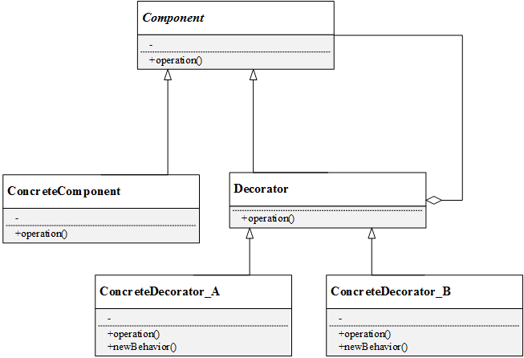


装饰模式中有如下角色：

- Component（抽象构件）：是具体构件类和装饰类的共同基类，声明了在具体构件中定义的方法，客户端可以一致的对待使用装饰前后的对象；
- ConcreteComponent（具体构件）：具体构件定义了构件具体的方法，装饰类可以给它增加更多的功能；
- Decorator（抽象装饰类）：用于给具体构件增加职责，但具体职责在其子类中实现。抽象装饰类通过聚合关系定义一个抽象构件的对象，通过该对象可以调用装饰之前构件的方法，并通过其子类扩展该方法，达到装饰的目的；
- ConcreteDecorator（具体装饰类）： 向构件增加新的功能。

以上面提到的手机为例，手机就是一个具体构件，而手机壳、手机贴纸和手机挂绳，都是具体的装饰类。以Jungle在冷天出门前精心打扮为例，Jungle本人是一个具体构件对象，各类衣裤围巾手套都是具体的装饰类对象。

#### 3.代码实现简单版

**抽象构件类：**

```c++
// 抽象构件
class Component
{
public:
	Component(){}
	virtual ~Component(){}
	virtual void operation() = 0;
};
```


**具体构件类：**

```c++
// 具体构件
class Phone :public Component
{
public:
	Phone(){}
	void operation(){
		printf("手机\n");
	}
};
```


**抽象装饰类：**

```c++
// 抽象装饰类
class Decorator :public Component
{
public:
	Decorator(){}
	Decorator(Component *c){
		this->component = c;
	}
	void operation(){
		this->component->operation();
	}
	Component *getComponent(){
		return this->component;
	}
	void setComponent(Component *c){
		this->component = c;
	}
private:
	Component *component;
};
```

抽象装饰类中有一个成员对象component，以及set和get方法。

**具体装饰类**

具体装饰类一共有三个，分别是手机壳装饰类DecoratorShell、贴纸装饰类DecoratorSticker和挂绳装饰类DecoratorRope。每一个具体装饰类都增加了各自新的职责newBehavior。

```c++
// 具体装饰类：手机壳
class DecoratorShell:public Decorator
{
public:
	DecoratorShell(){}
	DecoratorShell(Component *c){
		this->setComponent(c);
	}
	void operation(){
		this->getComponent()->operation();
		this->newBehavior();
	}
	void newBehavior(){
		printf("安装手机壳\n");
	}
};
 
 
// 具体装饰类：手机贴纸
class DecoratorSticker :public Decorator
{
public:
	DecoratorSticker(){}
	DecoratorSticker(Component *c){
		this->setComponent(c);
	}
	void operation(){
		this->getComponent()->operation();
		this->newBehavior();
	}
	void newBehavior(){
		printf("贴卡通贴纸ֽ\n");
	}
};
 
//  具体装饰类：挂绳
class DecoratorRope :public Decorator
{
public:
	DecoratorRope(){}
	DecoratorRope(Component *c){
		this->setComponent(c);
	}
	void operation(){
		this->getComponent()->operation();
		this->newBehavior();
	}
	void newBehavior(){
		printf("系手机挂绳\n");
	}
};
```

**客户端代码：**

```c++
#include <iostream>
#include "DecoratorPattern.h"
 
int main()
{
	printf("\nJungle's first phone\n");
	Component *c;
	Component *com_Shell;
	c = new Phone();
	com_Shell = new DecoratorShell(c);
	com_Shell->operation();
 
	printf("\nJungle's second phone'\n");
	Component *c2;
	Component *com_Shell2;
	c2 = new Phone();
	com_Shell2 = new DecoratorShell(c2);
	Component *com_Sticker;
	com_Sticker = new DecoratorSticker(com_Shell2);
	com_Sticker->operation();
 
	printf("\nJungle's third phone'\n");
	Component *c3;
	Component *com_Shell3;
	c3 = new Phone();
	com_Shell3 = new DecoratorShell(c3);
	Component *com_Sticker2;
	com_Sticker2 = new DecoratorSticker(com_Shell3);
	Component *com_Rope;
	com_Rope = new DecoratorRope(com_Sticker2);
	com_Rope->operation();
 
	printf("\n\n");
 
	delete c;
	delete com_Shell;
	delete c2;
	delete com_Shell2;
	delete com_Sticker;
	delete c3;
	delete com_Sticker2;
	delete com_Rope;
	
	system("pause");
	return 0;
}
```

结果：


#### 4.总结

- 优点：
  - 对于扩展一个类的新功能，装饰模式比继承更加灵活；
  - 动态扩展一个对象的功能；
  - 可以对一个对象进行多次装饰（如上述例子第二个手机和第三个手机）；
  - 具体构件类和具体装饰类可以独立变化和扩展，符合开闭原则。
- 缺点：
  - 装饰模式中会增加很多小的对象，对象的区别主要在于各种装饰的连接方式不同，而并不是职责不同，大量小对象的产生会占用较多的系统资源；
  - 装饰模式比继承模式更灵活，但也更容易出错，更难于排错。
- 适用场景：
  - 在不影响其他对象的情况下，给单个对象动态扩展职责；
  - 不适宜采用继承的方式进行扩展的时候，可以考虑使用装饰模式。


### 适配器

#### 1.定义

除了网卡适配器，你一定还听说过电源适配器吧？我国生活用电电压是220V，但我们的电脑、手机、平板、剃须刀（充电式）不会使用这么高的电压。这就需要电源适配器（充电器、变压器），使各个电子设备和220的供电电压兼容。电源适配器就充当了一个适配器的角色。

在软件系统设计中，**当需要组合使用的类不兼容时，也需要类似于变压器一样的适配器来协调这些不兼容者**，这就是适配器模式！

那么什么是适配器模式呢？

> 适配器模式：
>
> 将一个类的接口转换成客户希望的另一个接口。适配器模式让那些接口不兼容的类可以一起工作。

#### 2.适配器结构

适配器模式分为类适配器和对象适配器。

- 适配器类（Adapter）：适配器与适配者之间是继承或实现关系；
- 适配者类（Adaptee）：适配器与适配者之间是关联关系。
- 目标抽象类（Target）：定义客户所需要的接口。

类适配器和对象适配器的UML图如下。

**类适配器中，适配器类通过继承适配者类**，并重新实现适配者的具体接口来达到适配客户所需要的接口的目的。

**对象适配器中，适配器类通过在类中实例化一个适配者类的对象**，并将其封装在客户所需功能的接口里，达到最终的适配目的。

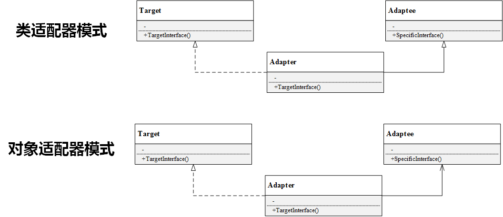

#### 3.对象适配器模式代码

> 路径规划包括两个阶段：首先读取并解析工程图文件，得到其中的点、直线坐标；其次根据需求计算加工路径。软件控制器（Controller）上，系统点击“路径规划”按钮就自动完成上述过程。
> Jungle已经封装好一个类DxfParser，该类可以读取后缀名为dxf的工程图文件，并解析其中的点、线，保存到路径列表里。另一个类PathPlanner用于计算加工路径。

这个例子中，Controller就是目标抽象类，DxfParser和PathPlanner是适配者类，这两个类提供的方法可以用于实现路径规划的需求。我们只需再定义一个适配器类Adapter即可

1.头文件定义

```c++
// 目标抽象类
class Controller
{
public:
	Controller(){}
	virtual ~Controller(){}
	virtual void pathPlanning() = 0;
private:
};


// 适配者类DxfParser
class DxfParser
{
public:
	DxfParser(){}
	void parseFile(){
		printf("Parse dxf file\n");
	}
};
 
// 适配者类PathPlanner
class PathPlanner
{
public:
	PathPlanner(){}
	void calculate(){
		printf("calculate path\n");
	}
};

// 适配器类Adapter
class Adapter:public Controller
{
public:
	Adapter(){
		dxfParser = new DxfParser();
		pathPlanner = new PathPlanner();
	}
	~Adapter(){
		delete dxfParser;
		delete pathPlanner;
	}
	Adapter(const Adapter& other) = delete;
	Adapter& operator=(const Adapter& ) = delete;
	void pathPlanning(){
		printf("pathPlanning\n");
		dxfParser->parseFile();
		pathPlanner->calculate();
	}
private:
	DxfParser   *dxfParser;
	PathPlanner *pathPlanner;
};
```

2.调用

```c++
#include <iostream>
#include "AdapterPattern.h"
 
int main()
{
	Controller *controller = new Adapter();
	controller->pathPlanning();
 
	system("pause");
	delete controller;
	return 0;
}
```

#### 4.类适配器模式代码

```c++
#pragma once

#include <stdio.h>

namespace adapter {
    
/// @brief 目标接口, 即当前系统业务所期待的接口
class AbstractTarget {
public:
    virtual ~AbstractTarget() {}
    virtual void Request() = 0;
};

/// @brief 被适配者
class Adaptee {
public:
    virtual void SpecificRequest() {
        printf("this is Adaptee::SpecificRequest!\n");
    }
};

/// @brief 适配器, 把适被配者接口转换成目标接口，让客户按目标接口的格式访问被适配者
class Adapter : public Adaptee, public AbstractTarget {
public:
    virtual void Request() {
        SpecificRequest();
    }
};

} // namespace adapter 

void Test_07_adapter_impl_1() {
    printf("-------------------- %s --------------------\n", __FUNCTION__);
    adapter::AbstractTarget* ptr = new adapter::Adapter();
    ptr->Request();
    delete ptr;
}

// -------------------- Test_07_adapter_impl_1 --------------------
// this is Adaptee::SpecificRequest!
```

#### 5.总结

- 优点：
  - 将目标类和适配者类解耦，引入一个适配器类实现代码重用，无需修改原有结构；
  - 增加类的透明和复用，对于客户端而言，适配者类是透明的；
  - 对象适配器可以把不同适配者适配到同一个目标（对象适配器）；
- 缺点：
  - 对类适配器来说，更换适配器的实现过程比较复杂。
- 适用环境：
  - 系统需要使用一些现有的类，但这些类的接口不符合系统需要，或者没有这些类的源代码；
  - 想创建一个重复使用的类，用于和一些彼此没有太大关联的类一起工作。


## 行为型模式

### 模板方法

#### 1.定义：

> - 含义
>
>   `TemplateMethod` **定义一个操作中的算法骨架，而将算法的一些步骤延迟到子类中**，使得**子类可以不改变该算法结构的情况下重定义该算法的某些特定步骤**。
>
>   - 优点
>     - 它**封装了不变部分，扩展可变部分**。它把认为是不变部分的算法封装到父类中实现，而把可变部分算法由子类继承实现，便于子类继续扩展。
>     - 它在父类中提取了公共的部分代码，便于代码复用。
>     - 部分方法是由子类实现的，因此子类可以通过扩展方式增加相应的功能，**符合开闭原则**。
>   - 缺点
>     - 对每个不同的实现都需要定义一个子类，这会导致**类的个数增加**，系统更加庞大，设计也更加抽象。
>     - 父类中的抽象方法由子类实现，**子类执行的结果会影响父类的结果**，这导致一种反向的控制结构，它提高了代码阅读的难度。
>
> - 应用场景
>
>   - 在面向对象程序设计过程中，程序员常常会遇到这种情况：设计一个系统时知道了算法所需的关键步骤，而且确定了这些步骤的执行顺序，但某些步骤的具体实现还未知，或者说某些步骤的实现与具体的环境相关。
>   - 生活中的例子: **一个人每天会起床、吃饭、做事、睡觉等，其中“做事”的内容每天可能不同**。
>   - 我们把这些规定了流程或格式的实例定义成模板，允许使用者根据自己的需求去更新它，例如，简历模板、论文模板、Word 中模板文件等。
>
> - 实现方式
>
>   抽象类负责给出一个算法的轮廓和骨架, 即定义两种类型的方法
>
>   - **模板方法**: 定义了算法的骨架，按某种顺序调用其包含的基本方法
>   - 基本方法:(不对外暴露，只对外暴露模板方法。下面这些方法只对子类可见，使用protect关键字)
>     - **抽象方法**：在抽象类中声明，由具体子类实现
>     - **具体方法**：在抽象类中已经实现，在具体子类中可以继承或重写它
>     - **钩子方法**：在抽象类中已经实现，包括用于判断的逻辑方法和需要子类重写的空方法两种

#### 2.**分析**


稳定点：算法的骨架也就是流程，

**稳定点要去抽象**

变化点：子流程需要变化，如原本的一个流程是1-2-3-4，在子类中重写2，3的逻辑，但是流程方向依然不变，

变化点要求扩展，扩展是通过继承和组合

代码结构：1. 

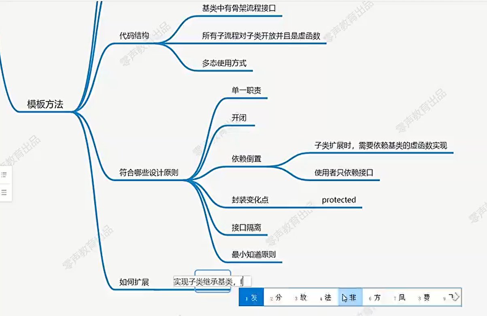

#### 3.示例 

```c++
#pragma once

#include <iostream>

namespace template_method {
    
/// @brief 抽象类, 给出一个算法的轮廓和骨架
class AbstractClass {
public:
    virtual ~AbstractClass() {}

    /// @brief 模板方法, 定义了算法的骨架，按某种顺序调用其包含的基本方法
    virtual void TemplateMethod() {
        SpecificMethodA();
        if (HookMethodB()) {
            HookMethodA();
        }
        AbstractMethod();
        SpecificMethodB();
    }

protected:
    /// @brief 基本方法, 可以有三种
    ///             - 抽象方法：在抽象类中申明，由具体子类实现
    ///             - 具体方法：在抽象类中已经实现，在具体子类中可以继承或重写它
    ///             - 钩子方法：在抽象类中已经实现，包括用于判断的逻辑方法和需要子类重写的空方法两种
    virtual void AbstractMethod() = 0;
    virtual void SpecificMethodA() {
        printf("this is AbstractClass::SpecificMethodA!\n");
    }
    virtual void SpecificMethodB() {
        printf("this is AbstractClass::SpecificMethodB!\n");
    }
    virtual void HookMethodA() {    // 通常为空实现
        printf("this is AbstractClass::HookMethodA!\n");
    }
    virtual bool HookMethodB() { return false; }
};

/// @brief 具体类, 实现抽象类中所定义的抽象方法和钩子方法
class ConcreteClass : public AbstractClass {
public:
    virtual void AbstractMethod() {
        printf("this is ConcreteClass::AbstractMethod!\n");
    }

protected:
    virtual void SpecificMethodB() {
        printf("this is ConcreteClass::SpecificMethodB!\n");
    }
    virtual void HookMethodA() {    // 通常为空实现
        printf("this is ConcreteClass::HookMethodA!\n");
    }
    virtual bool HookMethodB() { return true; }
};

} // namespace template_method

void Test_13_composite_impl_1() {
    printf("-------------------- %s --------------------\n", __FUNCTION__);
    template_method::AbstractClass* ptr = new template_method::ConcreteClass();
    ptr->TemplateMethod();

    delete ptr;
}

// -------------------- Test_13_template_method_impl_1 --------------------
// this is AbstractClass::SpecificMethodA!
// this is ConcreteClass::HookMethodA!
// this is ConcreteClass::AbstractMethod!
// this is ConcreteClass::SpecificMethodB!
```


### 监听者模式（观察者模式）

c++源码中类名带有listener的类，就是一个监听者也叫一个观察者

(https://www.cnblogs.com/mikewolf2002/archive/2012/10/17/2728279.html)

#### 1.定义

软件系统中的对象并不是孤立存在的，一个对象行为的改变可能会引起其他所关联的对象的状态或行为也发生改变，即“牵一发而动全身”。观察者模式建立了一种一对多的联动，一个对象改变时将自动通知其他对象，其他对象将作出反应。观察者模式中，发生改变的对象称为“观察目标”，被通知的对象称为“观察者”。一个观察目标可以有很多个观察者。

在现实世界中，许多对象并不是独立存在的，其中一个对象的行为发生改变可能会导致一个或者多个其他对象的行为也发生改变。例如，某种商品的物价上涨时会导致部分商家高兴，而消费者伤心；还有，当我们开车到交叉路口时，遇到红灯会停，遇到绿灯会行。这样的例子还有很多，例如，股票价格与股民、微信公众号与微信用户、气象局的天气预报与听众、小偷与警察等。

观察者模式定义如下：

- `Observer` **多个对象间存在一对多关系，当一个对象发生改变时，把这种改变通知给其他多个对象，从而影响其他对象的行为**。

  **观察者模式又被称为发布-订阅模式（Publish-Subscribe）、模型-视图模式（Model-View）、源-监听器模式（Source-Listener）、从属者模式（Dependents**）。

观察者模式由观察者和观察目标组成，为便于扩展，两个角色都设计了抽象层。观察者模式的UML图如下：

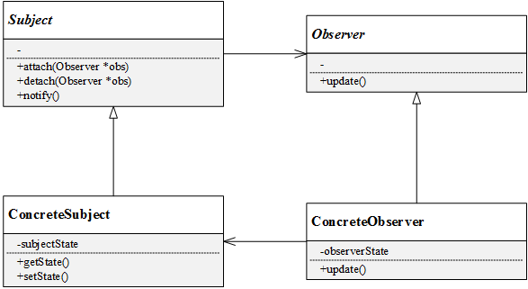

- **Subject（目标）**：是被观察的对象，目标中定义了一个观察者的集合，即一个目标可能会有多个观察者，通过attach()和detach()方法来增删观察者对象。目标声明了通知方法notify()，用于在自身状态发生改变时通知观察者。
- **ConcreteSubject（具体目标）**：具体目标实现了通知方法notify()，同时具体目标有记录自身状态的属性和成员方法；
- **Observer（观察者）**：观察者将对接收到的目标发生改变的通知做出自身的反应，抽象层声明了更新方法update()；
- **ConcreteObserver（具体观察者）**： 实现了更新方法update()，具体观察者中维护了一个具体目标对象的引用（指针），用于存储目标的状态。

<font color='red'>注意：</font>

在观察者subject 中你主动实现的内容应该仅有

> 实现属于你自己的观察者类
>
> 然后主动通过attach()添加到subject对象的观察者列表中
>
> 然后在某些时候通过detach删除观察者指针

但是被观察的类对象，一般是单例模式的对象

它的notify函数（不是我主动比如在main函数调用它，而是再某些情况下，被触发），可能某个全局线程由于某些事情调用，或者是收到某个数据包需要调用，比如经过某些其他工作线程算出了一个结果调用subject对象的notify函数，然后notify函数则调用observer的response函数，将某个结果传递给观察者，然后观察者受到这个结果 做出相应的处理，比如将这个结果打印到屏幕上

#### 2.典型代码

```c++
#pragma once

#include <vector>

namespace observer {

/// @brief 抽象观察者, 包含了一个更新自己的抽象方法，当接到具体主题的更改通知时被调用。
class AbstractObserver {
public:
    ~AbstractObserver() {}

    // 被告知时做出响应
    virtual void Response() = 0;
};

/// @brief 具体观察者, 实现抽象观察者中定义的抽象方法，以便在得到目标的更改通知时更新自身的状态。
class ConcreteObserverA : public AbstractObserver {
public:
    virtual void Response() {
        printf("this is ConcreteObserverA::Response!\n");
    }
};
class ConcreteObserverB : public AbstractObserver {
public:
    virtual void Response() {
        printf("this is ConcreteObserverB::Response!\n");
    }
};

/// @brief 抽象主题类, 它提供了一个用于保存观察者对象的聚集类和增加、删除观察者对象的方法，以及通知所有观察者的抽象方法
class AbstractSubject {
public:
    virtual ~AbstractSubject() {}

    virtual void NotifyObserver() = 0;

    void AddObserver(AbstractObserver* observer) {
        observers_.emplace_back(observer);
    }
    void RemoveObserver(AbstractObserver* observer) {
        for (auto it = observers_.begin(); it != observers_.end(); it++) {
            if ((*it) == observer) {
                observers_.erase(it++);
                break;
            }
        }
    }

protected:
    std::vector<AbstractObserver*> observers_;
};

/// @brief 具体主题类, 它实现抽象目标中的通知方法，当具体主题的内部状态发生改变时，通知所有注册过的观察者对象。
class ConcreteSubject : public AbstractSubject {
public:
    virtual void NotifyObserver() {
        for (auto* observer : observers_) {
            observer->Response();
        }
    }
};
    
} // namespace observer

void Test_18_observer_impl_1() {
    printf("-------------------- %s --------------------\n", __FUNCTION__);
    std::shared_ptr<observer::AbstractSubject> ptr_subject(new observer::ConcreteSubject());
    std::shared_ptr<observer::AbstractObserver> ptr_observer_A(new observer::ConcreteObserverA());
    std::shared_ptr<observer::AbstractObserver> ptr_observer_B(new observer::ConcreteObserverB());

    ptr_subject->AddObserver(ptr_observer_A.get());
    ptr_subject->AddObserver(ptr_observer_B.get());

    ptr_subject->NotifyObserver();
}
```


#### 3.观察者模式代码实例

背景：

> 玩过和平精英这款游戏吗？四人组队绝地求生，当一个队友发现物资时，可以发消息“我这里有物资”，其余三个队友听到后可以去取物资；当一个队友遇到危险时，也可以发消息“救救我”，其余三个队友得到消息后便立马赶去营救。本例Jungle将用观察者模式来模拟这个过程。

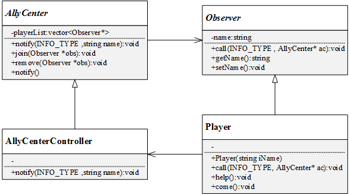

本例中，抽象观察者是Observer，声明了发现物资或者需要求救时的呼叫的方法call()，具体观察者是Player，即玩家，Player实现了呼叫call()方法，并且还定义了取物资come()和支援队友help()的方法。本例定义了AllyCenter作为抽象目标，它维护了一个玩家列表playerList，并且定义了加入战队和剔除玩家的方法。具体目标是联盟中心控制器AllyCenterController，它实现了通知notify()方法，该方法将队友call的消息传达给玩家列表里的其余队友，并作出相应的响应。

##### 3.1 公共头文件

通过一个枚举类型来定义两种消息类型，即发现物资和求助

```c++
#ifndef __COMMON_H__
#define __COMMON_H__
 
enum INFO_TYPE{
	NONE,
	RESOURCE,
	HELP
};
 
#endif //__COMMON_H__
```

##### 3.2 观察者


**抽象观察者Observer**:

```
// 抽象观察者 Observer
class Observer
{
public:
	virtual ~Observer(){}
	Observer(){}
	// 声明抽象方法
	virtual void call(INFO_TYPE infoType, AllyCenter* ac) = 0;
	string getName(){
		return name;
	}
	void setName(string iName){
		this->name = iName;
	}
private:
	string name;
};
```


**具体观察者Player**:

```c++
// 具体观察者 
class Player :public Observer
{
public:
	Player(){
		setName("none");
	}
	Player(string iName){
		setName(iName);
	}
	// 实现
	void call(INFO_TYPE infoType, AllyCenter* ac){
		switch (infoType){
		case RESOURCE:
			printf("%s :我这里有物资\n", getName().c_str());
			break;
		case HELP:
			printf("%s :救救我\n", getName().c_str());
			break;
		default:
			printf("Nothing\n");
		}
		ac->notify(infoType, getName());
	}
	// 实现具体方法
	void help(){
		printf("%s:坚持住，我来救你！\n", getName().c_str());
	}
	void come(){
		printf("%s:好的，我来取物资\n", getName().c_str());
	}
};
```

##### 3.3 目标类

**抽象目标AllyCenter：**

```c++
//声明

// 前向声明
class Observer;
class Player;
 
// 抽象目标：联盟中心
class AllyCenter
{
public:
	AllyCenter();
	virtual ~AllyCenter() {}
	// 声明通知方法
	virtual void notify(INFO_TYPE infoType, std::string name) = 0;
	// 加入玩家
	void join(Observer *player);
	// 移除玩家
	void remove(Observer *player);
 
protected:
	// 玩家列表
	std::vector<Observer *> playerList;
};

//实现
#include "AllyCenter.h"
#include "Observer.h"
 
AllyCenter::AllyCenter(){
	printf("大吉大利，今晚吃鸡!\n");
}
 
// 加入玩家
void AllyCenter::join(Observer* player){
	if (playerList.size() == 4){
		printf("玩家已满!\n");
		return;
	}
	printf("玩家 %s 加入\n", player->getName().c_str());
	playerList.push_back(player);
	if (playerList.size() == 4){
		printf("组队成功，不要怂，一起上！\n");
	}
}
// 移除玩家
void AllyCenter::remove(Observer* player){
	printf("玩家 %s 退出\n", player->getName().c_str());
	//playerList.remove(player);
}
```


**具体目标AllyCenterController：**

```c++
//声明

// 具体目标
class AllyCenterController :public AllyCenter
{
public:
	AllyCenterController();
	// 实现通知方法
	void notify(INFO_TYPE infoType, std::string name);
};

//实现
AllyCenterController::AllyCenterController(){}
 
// 实现通知方法
void AllyCenterController::notify(INFO_TYPE infoType, std::string name){
	switch (infoType){
	case RESOURCE:
		for each (Observer* obs in playerList){
			if (obs->getName() ! = name){
				((Player*)obs)->come();
			}
		}
		break;
	case HELP:
		for each (Observer* obs in playerList){
			if (obs->getName() ! = name){
				((Player*)obs)->help();
			}
		}
		break;
	default:
		printf("Nothing\n");
	}
}
```

##### 3.4 客户端代码

```c++
#include "Observer.h"
#include "AllyCenter.h"
 
int main()
{
	// 创建一个战队
	AllyCenterController *controller = new AllyCenterController();
 
	// 创建4个玩家，并加入战队
	Player *Jungle = new Player("Jungle");
	Player *Single = new Player("Single");
	Player *Jianmengtu = new Player("������");
	Player *SillyDog = new Player("ɵ�ӹ�");
	controller->join(Jungle);
	controller->join(Single);
	controller->join(Jianmengtu);
	controller->join(SillyDog);
 
	printf("\n\n");
 
	// Jungle发现物资，呼叫队友
	Jungle->call(RESOURCE, controller);
 
	printf("\n\n");
 
	// 傻子狗遇到危险，求救队友
	SillyDog->call(HELP, controller);
 
	printf("\n\n");
	system("pause");
 
	delete controller;
	delete Jungle;
	delete Single;
	delete Jianmengtu;
	delete SillyDog;
	controller = nullptr;
	Jungle     = nullptr;
	Single     = nullptr;
	Jianmengtu = nullptr;
	SillyDog   = nullptr;
 
	return 0;
}
```
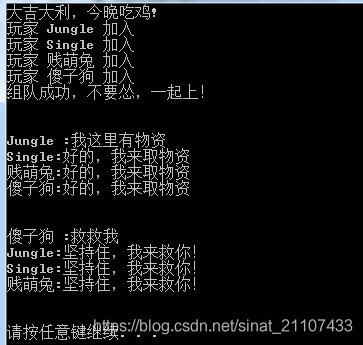

这种示例是观察者主动通过某种方式call（这是一种主动方式）去调用 subject的notify，通知其他观察者对象，

如果是subject和listener这种关系，这种是一对一的关系，并且listener中的方法如onResult，onEvent这些方法，只能是当某些时候触发subject的notify函数，而不能通过listener自己去调用subject的notify函数，然后在函数

#### 4.应用

观察者模式是一种使用频率非常高的设计模式，几乎无处不在。凡是涉及一对一、一对多的对象交互场景，都可以使用观察者会模式。比如购物车，浏览商品时，往购物车里添加一件商品，会引起UI多方面的变化（购物车里商品数量、对应商铺的显示、价格的显示等）；各种编程语言的GUI事件处理的实现；所有的浏览器事件（mouseover，keypress等）都是使用观察者模式的例子。

#### 5.总结

- 优点：
  - 观察者模式实现了稳定的消息更新和传递的机制，通过引入抽象层可以扩展不同的具体观察者角色；
  - 支持广播通信，所有已注册的观察者（添加到目标列表中的对象）都会得到消息更新的通知，简化了一对多设计的难度；
  - 符合开闭原则，增加新的观察者无需修改已有代码，在具体观察者与观察目标之间不存在关联关系的情况下增加新的观察目标也很方便。
- 缺点：
  - **代码中观察者和观察目标相互引用，存在循环依赖，观察目标会触发二者循环调用，有引起系统崩溃的风险；**
  - 如果一个观察目标对象有很多直接和简介观察者，将所有的观察者都通知到会耗费大量时间。
- 适用环境：
  - 一个对象的改变会引起其他对象的联动改变，但并不知道是哪些对象会产生改变以及产生什么样的改变；
  - 如果需要设计一个链式触发的系统，可是使用观察者模式；
  - 广播通信、消息更新通知等场景。

### 策略模式

#### 1.定义

> 同样是排序算法，你可以选择冒泡排序、选择排序、插入排序、快速排序等等，也即是说，为了实现排序这一个目的，有很多种算法可以选择。这些不同的排序算法构成了一个算法族，你可以在需要的时候，根据需求或者条件限制（内存、复杂度等）适时选择具体的算法。

在面向对象的设计里，该如何设计这样一个算法族呢？它包含了多种算法，在使用的时候又会根据条件来选择具体的算法？这就会用到软件设计模式中的——策略模式。

**定义：**

策略模式用于算法的自由切换和扩展，对应于解决某一问题的一个算法族，允许用户从该算法族中任意选择一个算法解决问题，同时还可以方便地更换算法或者增加新的算法。策略模式将算法族中的每一个算法都封装成一个类，每一个类称为一个策略（Strategy）。

> 策略模式：
> 定义一系列算法，将每一个算法封装起来，并让它们可以相互替换。策略模式让算法可以独立于使用它的客户而变化。

#### 2.结构

为了方便算法族中的不同算法在使用中具有一致性，在策略模式中会提供一个抽象层来声明公共接口，在具体的策略类中实现各个算法。策略模式由上下文类和策略类组成，其UML结构如下图：

[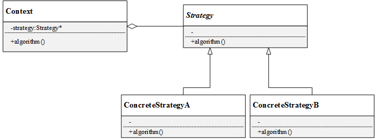](https://github.com/FengJungle/DesignPattern/blob/master/22.StrategyPattern/1.Picture/策略模式UML图.png)

- Context（上下文类） ：上下文类是使用算法的角色，可以在解决不同具体的问题时实例化不同的具体策略类对象；
- Strategy（抽象策略类）：声明算法的方法，抽象层的设计使上下文类可以无差别的调用不同的具体策略的方法；
- ConcreteStrategy（具体策略类）：实现具体的算法。

#### 3.代码实例

背景：

> 某系统提供了一个用于对数组进行操作的类，该类封装了对数组的常见操作，现以排序操作为例，使用策略模式设计该数组操作类，使得客户端可以动态更换排序算法，可以根据需要选择冒泡排序或者选择排序或者插入排序，也能够灵活增加新的排序算法 。

显然，在该实例中，可以冒泡排序、选择排序和插入排序分别封装为3个具体策略类，它们有共同的基类SortStrategy。还需要一个上下文类Context，Context中维护了一个SortStrategy的指针，在客户端需要的时候，通过Context的setSortStrategy()方法来实例化具体的排序类对象。该实例的UML结构图如下：

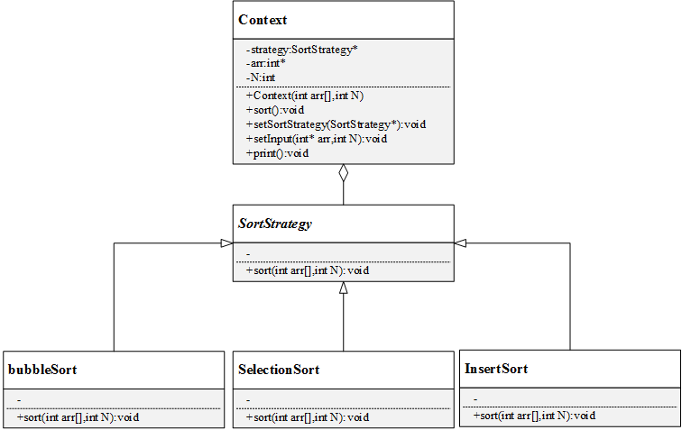

##### 3.1排序策略类

抽象排序策略类:

```c++
// 抽象策略类
class Strategy
{
public:
	Strategy(){}
	virtual ~Strategy(){}
	virtual void sort(int arr[], int N) = 0;
};
```


具体策略类：冒泡排序类:

```c++
// 具体策略：冒泡排序
class BubbleSort :public Strategy
{
public:
	BubbleSort(){
		printf("冒泡排序\n");
	}
	void sort(int arr[], int N){
		for (int i = 0; i<N; i++)
		{
			for (int j = 0; j<N - i - 1; j++)
			{
				if (arr[j]>arr[j + 1]){
					int tmp = arr[j];
					arr[j] = arr[j + 1];
					arr[j + 1] = tmp;
				}
			}
		}
	}
};
```


具体策略类：选择排序类

```c++
// 具体策略：选择排序
class SelectionSort :public Strategy
{
public:
	SelectionSort(){
		printf("选择排序\n");
	}
	void sort(int arr[], int N){
		int i, j, k;
		for (i = 0; i<N; i++)
		{
			k = i;
			for (j = i + 1; j<N; j++)
			{
				if (arr[j] < arr[k]){
					k = j;
				}
			}
			int temp = arr[i];
			arr[i] = arr[k];
			arr[k] = temp;
		}
	}
};
```

##### 3.2上下文类

该类用于对某个数组进行排序

```c++
#ifndef __CONTEXT_H__
#define __CONTEXT_H__
 
#include "Strategy.h"
#include <stdio.h>
 
// 上下文类
class Context
{
public:
	Context(){
		arr = nullptr;
		N = 0;
		sortStrategy = nullptr;
	}
	Context(int iArr[], int iN){
		this->arr = iArr;
		this->N = iN;
		sortStrategy = nullptr;
	}
	Context(const Context& context) = delete;
	Context& operator=(const Context&) = delete;
	~Context()
	{
		if(sortStrategy)
		{
			delete sortStrategy;
			sortStrategy = nullptr;
		}
	}
	void setSortStrategy(Strategy* iSortStrategy){
		if(sortStrategy)
		{
			delete sortStrategy;
			sortStrategy = nullptr;
		}
		this->sortStrategy = iSortStrategy;
	}
	void sort(){
		this->sortStrategy->sort(arr, N);
		printf("输出： ");
		this->print();
	}
	void setInput(int iArr[], int iN){
		this->arr = iArr;
		this->N = iN;
	}
	void print(){
		for (int i = 0; i < N; i++){
			printf("%3d ", arr[i]);
		}
		printf("\n");
	}
 
private:
	Strategy* sortStrategy;
	int* arr;
	int N;
};
 
#endif // __CONTEXT_H__
```

它是对外表现的类，客户主要使用的就是这个类，

如果想使用某一种算法进行排序，那么需要你主动调用setSortStrategy来进行设置sortStrategy的指向

##### 3.3 客户端代码

```c++
#include "Context.h"
#include <stdio.h>
#include <stdlib.h>
 
int main()
{
	Context* ctx = new Context();
	int arr[] = { 10, 23, -1, 0, 300, 87, 28, 77, -32, 2 };
	ctx->setInput(arr, sizeof(arr)/sizeof(int));
	printf("input:");
	ctx->print();
 
	// BubbleSort
	ctx->setSortStrategy(new BubbleSort());
	ctx->sort();
 
	// SelectionSort
	ctx->setSortStrategy(new SelectionSort());
	ctx->sort();
 
	// InsertSort
	ctx->setSortStrategy(new InsertSort());
	ctx->sort();
 
	printf("\n\n");
	system("pause");
 
	delete ctx;
	ctx = nullptr;
 
	return 0;
}
```

从客户端代码可以看到，客户端无需关心具体排序算法的细节，都是统一的调用上下文的sort()接口。另外，如果要增加新的排序算法，比如快速排序QuickSort，只需要从基类SortStrategy在派生一个类QuickSort，在QuickSort类中实现具体的sort()算法即可，扩展起来非常方便。

#### 4.总结

- 优点：
  - 符合开闭原则，策略模式易于扩展，增加新的算法时只需继承抽象策略类，新设计实现一个具体策略类即可；
  - 客户端可以无差别地通过公共接口调用，利用里式替换原则，灵活使用不同的算法策略；
  - 提供了一个算法族管理机制和维护机制。
- 缺点：
  - 客户端必须要知道所有的策略，以便在使用时按需实例化具体策略；
  - 系统会产生很多单独的类，增加系统中类的数量；
  - 客户端在同一时间只能使用一种策略。
- 适用环境：
  - 系统需要在一个算法族中动态选择一种算法，可以将这些算法封装到多个具体算法类中，这些算法类都有共同的基类，即可以通过一个统一的接口调用任意一个算法，客户端可以使用任意一个算法；
  - 不希望客户端知道复杂的、与算法相关的数据结构，在具体策略类中封装与算法相关的数据结构，可以提高算法的安全性。

### 责任链

生活中的例子：

> 应项目需求，公司安排Jungle去成都出差一段时间。这不，Jungle刚结束出差生活，回到公司准备报销。算了一下，Jungle一共有大概50万的一笔小额票据需要报销。按照公司规定，Jungle得先去找自己的组长签字。
> 组长一看，“啧啧啧，我只能处理10万金额以下的报销，你这单子我签个字，你还得找兵哥（主管）签字”，于是Jungle又跑去找兵哥。
> 兵哥看了，“啧啧啧，我最多只能管金额不超过30万的单子，你得找春总（经理）签字”。Jungle又不厌其烦地找到了春总。
> 春总一看，“呵，50万，不少啊！但60万以下我都能做主，这单子我给你签了！要是超过60万，你这狗子还得去找老板！”Jungle总算松了一口气，一级一级网上找领导，也是不容易呀！

在单位，每个领导都有不同的审批权限，不同额度的报销单层层上报，最终到有权处理该金额范围的领导手里，该单子才算审批完成。这是Jungle所在的公司（相信也是大部分公司）的制度。如果要用代码来模拟这种制度，有没有一种模式可以参考呢？

答案是：有！那就是职责链模式！

#### 1.定义

职责链模式又叫责任链模式。很多情况下，可以处理某个请求的对象可能不止一个，请求可以沿着某一条对象之间形成的关系一级一级由下家传递到上家，形成一条链——职责链。职责链可以是直线，也可以是环或树形结构。常见的职责链形式是直线。**链上的每一个对象都是请求的处理者，客户端要做的仅仅是发送请求，不需要关心请求的处理细节过程。由此，职责链模式将请求者和请求的接收者解耦**。

> 使多个对象都有机会处理请求，从而避免请求的发送者和接收者之间的耦合关系。将这些对象连成
> 一条链，并沿着这条链传递请求，直到有一个对象处理它为止。 ——《设计模式》GoF  

#### 2.职责链模式结构

职责链模式的UML结构如下图所示，职责链模式的核心在于引入了一个抽象处理者：

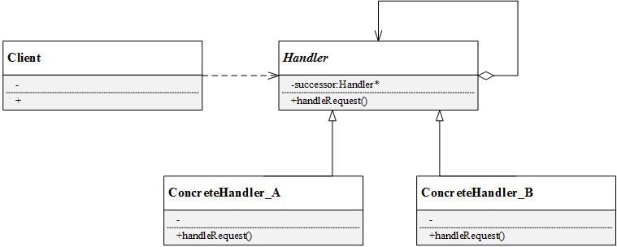

职责链模式中一共包含两个角色:

- **Handler（抽象处理者）**：抽象处理者一般为抽象类，声明了一个处理请求的接口handleRequest()，定义了一个抽象处理者类型的对象，作为其对下家的引用，通过该引用可以形成一条责任链。
- **ConcreteHandler（具体处理者）**： 是抽象处理者的子类，实现了处理请求的接口。在具体的实现中，如果该具体处理者能够处理该请求，就处理它，否则将该请求转发给后继者。具体处理者可以访问下一个对象。 由上述可知，在职责链模式中很多对象由每一个对象对其下家的引用连接起来形成一条链条，请求在这个链条上逐级传递，知道某一级能够处理这个请求为止。**客户端不知道也不必知道是哪一级处理者处理了该请求，因为每个处理者都有相同的接口handleRequest()**。接下来通过一个实例来进一步认识职责链模式。

#### 3.代码实现（简单版）

```c++
#pragma once

#include <iostream>
#include <string>

namespace responsibility {
    
/// @brief 抽象处理者, 定义一个处理请求的接口，包含抽象处理方法和一个后继连接
class AbstractHandler {
public:
    virtual ~AbstractHandler() {}
    virtual void SetNext(AbstractHandler* handler) {
        next_ = handler;
    }
    virtual AbstractHandler* GetNext() {
        return next_;
    }

    virtual void Request(const std::string& state) = 0;

private:
    AbstractHandler* next_ = nullptr;
};

/// @brief 具体处理者, 实现抽象处理者的处理方法，判断能否处理本次请求，如果可以处理请求则处理，否则将该请求转给它的后继者
class ConcreteHandlerA : public AbstractHandler {
public:
    virtual void Request(const std::string& state) {
        if (0 == state.compare("A")) {
            printf("this is ConcreteHandlerA::Request!\n");
        }
        else {
            if (GetNext()) {
                GetNext()->Request(state);
            }
            else {
                printf("From A, Nobody handle this request!\n");
            }
        }
    }
};
class ConcreteHandlerB : public AbstractHandler {
public:
    virtual void Request(const std::string& state) {
        if (0 == state.compare("B")) {
            printf("this is ConcreteHandlerB::Request!\n");
        }
        else {
            if (!GetNext()) {
                GetNext()->Request(state);
            }
            else {
                printf("From B, Nobody handle this request!\n");
            }
        }
    }
};

} // namespace responsibility

void Test_16_chain_of_responsibility_impl_1() {
    printf("-------------------- %s --------------------\n", __FUNCTION__);
    std::shared_ptr<responsibility::AbstractHandler> ptr_A(new responsibility::ConcreteHandlerA());
    std::shared_ptr<responsibility::AbstractHandler> ptr_B(new responsibility::ConcreteHandlerB());

    ptr_A->SetNext(ptr_B.get());
    ptr_A->Request("B");
}

// -------------------- Test_16_chain_of_responsibility_impl_1 --------------------
// this is ConcreteHandlerB::Request!
```

#### 4.实际问题

以引言中的例子为例，对于不同金额的票据，公司不同级别的领导处理情况如下：

```
金额0~10万：组长可处理
金额10~30万：主管处理
金额30~60万：经理处理
金额超过60万：老板处理
```

本节Jungle将用C++模拟该过程。该实例UML图如下：

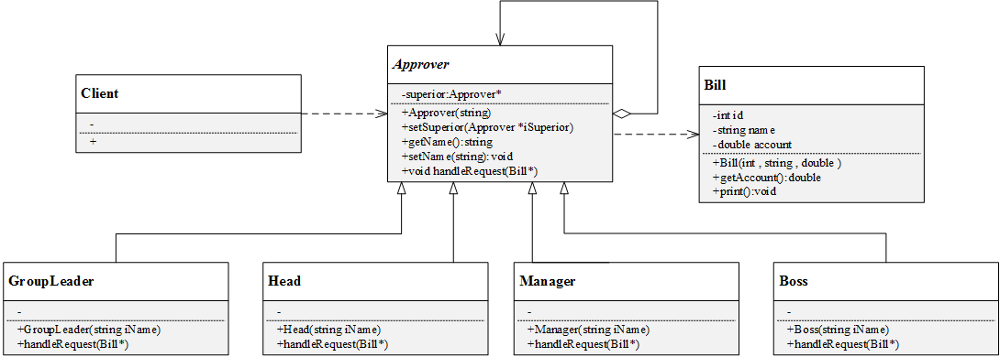

1. 票据类

   ```c++
   // 请求：票据
   class Bill
   {
   public:
   	Bill(){}
   	Bill(int iId, string iName, double iAccount){
   		id = iId;
   		name = iName;
   		account = iAccount;
   	}
   	double getAccount(){
   		return this->account;
   	}
   	void print(){
   		printf("\nID:\t%d\n", id);
   		printf("Name:\t%s\n", name.c_str());
   		printf("Account:\t%f\n", account);
   	}
   private:
   	int id;
   	string name;
   	double account;
   };
   ```

   

2. 抽象处理者

   ```c++
   // 抽象处理者
   class Approver
   {
   public:
   	Approver(){}
   	Approver(string iName){
   		setName(iName);
   	}
   	virtual ~Approver(){}
   	// 添加上级（就是责任链的下一级）
   	void setSuperior(Approver *iSuperior){
   		this->superior = iSuperior;
   	}
   	// 处理请求
   	virtual void handleRequest(Bill*) = 0;
   	string getName(){
   		return name;
   	}
   	void setName(string iName){
   		name = iName;
   	}
   protected:
   	Approver *superior;
   private:
   	string name;
   };
   ```

   

3. 具体处理者

   > #### 
   >
   > ```
   > // 具体处理者：组长
   > class GroupLeader :public Approver
   > {
   > public:
   > 	GroupLeader(){}
   > 	GroupLeader(string iName){
   > 		setName(iName);
   > 	}
   > 	// 处理请求
   > 	void handleRequest(Bill *bill){
   > 		if (bill->getAccount() < 10){
   > 			printf("组长 %s 处理了该票据，票据信息：",this->getName().c_str());
   > 			bill->print();
   > 		}
   > 		else{
   > 			printf("组长无权处理，转交上级……\n");
   > 			this->superior->handleRequest(bill);
   > 		}
   > 	}
   > };
   > ```
   >
   > 
   >
   > ```
   > // 具体处理者：主管
   > class Head :public Approver
   > {
   > public:
   > 	Head(){}
   > 	Head(string iName){
   > 		setName(iName);
   > 	}
   > 	// 处理请求
   > 	void handleRequest(Bill *bill){
   > 		if (bill->getAccount() >= 10 && bill->getAccount()<30){
   > 			printf("主管 %s 处理了该票据，票据信息：", this->getName().c_str());
   > 			bill->print();
   > 		}
   > 		else{
   > 			printf("主管无权处理，转交上级……\n");
   > 			this->superior->handleRequest(bill);
   > 		}
   > 	}
   > };
   > ```
   >
   > 
   >
   > ```
   > // 具体处理者：经理
   > class Manager :public Approver
   > {
   > public:
   > 	Manager(){}
   > 	Manager(string iName){
   > 		setName(iName);
   > 	}
   > 	// 处理请求
   > 	void handleRequest(Bill *bill){
   > 		if (bill->getAccount() >= 30 && bill->getAccount()<60){
   > 			printf("经理 %s 处理了该票据，票据信息：", this->getName().c_str());
   > 			bill->print();
   > 		}
   > 		else{
   > 			printf("经理无权处理，转交上级……\n");
   > 			this->superior->handleRequest(bill);
   > 		}
   > 	}
   > };
   > ```
   >
   > 
   >
   >  
   >
   > ```
   > // 具体处理者：老板
   > class Boss :public Approver
   > {
   > public:
   > 	Boss(){}
   > 	Boss(string iName){
   > 		setName(iName);
   > 	}
   > 	// 处理请求
   > 	void handleRequest(Bill *bill){
   > 		printf("老板 %s 处理了该票据，票据信息：", this->getName().c_str());
   > 		bill->print();
   > 	}
   > };
   > ```

4. 客户端代码示例

   客户端创建了四个角色，分别是组长、主管、经理和老板，并设置了上下级关系。然后创建了4张票据，金额不等，都先统一交给组长处理。

   ```c++
   #include <iostream>
   #include "ChainOfResponsibility.h"
    
   int main()
   {
   	// 请求处理者：组长，兵哥，春总，老板
   	Approver *zuzhang, *bingge, *chunzong, *laoban;
    
   	zuzhang = new GroupLeader("孙大哥");
   	bingge = new Head("兵哥");
   	chunzong = new Manager("春总");
   	laoban = new Boss("张老板");
    
   	zuzhang->setSuperior(bingge);
   	bingge->setSuperior(chunzong);
   	chunzong->setSuperior(laoban);
    	//上面这几个对象是一条直线，一个接着一个
       
   	// 创建报销单
   	Bill *bill1 = new Bill(1, "Jungle", 8); 
   	Bill *bill2 = new Bill(2, "Lucy", 14.4);
   	Bill *bill3 = new Bill(3, "Jack", 32.9);
   	Bill *bill4 = new Bill(4, "Tom", 89);
    
   	// 全部先交给组长审批
   	zuzhang->handleRequest(bill1); printf("\n");
   	zuzhang->handleRequest(bill2); printf("\n");
   	zuzhang->handleRequest(bill3); printf("\n");
   	zuzhang->handleRequest(bill4);
    
   	printf("\n\n");
    
   	delete zuzhang;
   	delete bingge;
   	delete chunzong;
   	delete laoban;
   	delete bill1;
   	delete bill2;
   	delete bill3;
   	delete bill4;
    
   	system("pause");
   	return 0;
   }
   ```

   输出结果：

   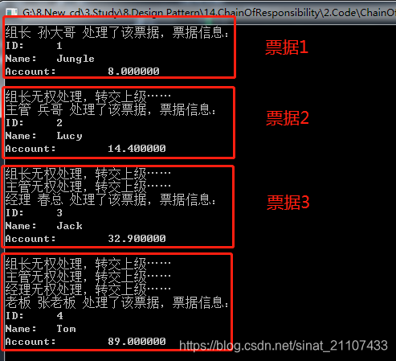

#### 5.模板方法加责任链

   ```c++
   #include <string>
   
   class Context {
   public:
       std::string name;
       int day;
   };
   
   // 稳定点 抽象  变化点 扩展
   class IHandler {
   public:
       virtual ~IHandler() {}
       void SetNextHandler(IHandler *next) { // 链表关系
           next = next;
       }
       // 抽象稳定点，对扩展开放
       // 模板模式：固定算法骨架，通过子类去扩展子流程
       bool Handle(const Context &ctx) {
           if (CanHandle(ctx)) {
               return HandleRequest(ctx);
           } else if (GetNextHandler()) {
               return GetNextHandler()->Handle(ctx);
           } else {
               // err
           }
           return false;
       }
   protected:
       virtual bool HandleRequest(const Context &ctx) = 0;
       virtual bool CanHandle(const Context &ctx) =0;
       IHandler * GetNextHandler() {
           return next;
       }
   private:
       IHandler *next;
   };
   
   // 能不能处理，以及怎么处理
   class HandleByMainProgram : public IHandler {
   protected:
       virtual bool HandleRequest(const Context &ctx){
           //
           return true;
       }
       virtual bool CanHandle(const Context &ctx) {
           //
           if (ctx.day <= 10)
               return true;
           return false;
       }
   };
   
   class HandleByProjMgr : public IHandler {
   protected:
       virtual bool HandleRequest(const Context &ctx){
           //
           return true;
       }
       virtual bool CanHandle(const Context &ctx) {
           //
           if (ctx.day <= 20)
               return true;
           return false;
       }
   };
   class HandleByBoss : public IHandler {
   protected:
       virtual bool HandleRequest(const Context &ctx){
           //
           return true;
       }
       virtual bool CanHandle(const Context &ctx) {
           //
           if (ctx.day < 30)
               return true;
           return false;
       }
   };
   
   class HandleByBeauty : public IHandler {
   protected:
       virtual bool HandleRequest(const Context &ctx){
           //
           return true;
       }
       virtual bool CanHandle(const Context &ctx) {
           //
           if (ctx.day <= 3)
               return true;
           return false;
       }
   };
   
   int main() {
       // IHandler * h1 = new HandleByMainProgram();
       // IHandler * h2 = new HandleByProjMgr();
       // IHandler * h3 = new HandleByBoss();
       // h1->SetNextHandler(h2);
       // h2->SetNextHandler(h3);
   // 抽象工厂
   // nginx http 处理 
       IHandler * h0 = new HandleByBeauty();
       IHandler * h1 = new HandleByMainProgram();
       IHandler * h2 = new HandleByProjMgr();
       IHandler * h3 = new HandleByBoss();
       h0->SetNextHandler(h1);
       h1->SetNextHandler(h2);
       h2->SetNextHandler(h3);
       // 设置下一指针 
       Context ctx;
       h0->Handle(ctx);
       
       return 0;
   }
   ```

#### 6.总结

优点：

- 将请求的接收者和处理者解耦，客户端无需知道具体处理者，只针对抽象处理者编程，简化了客户端编程过程，降低系统耦合度；
- 在系统中增加一个新的处理者时，只需要继承抽象处理者，重新实现handleRequest()接口，无需改动原有代码，符合开闭原则；
- 给对象分配职责时，职责链模式赋予系统更多灵活性。

缺点：

- 请求没有一个明确的接收者，有可能遇到请求无法响应的问题；
- 比较长的职责链，其处理过程会很长。
- 建立职责链的工作是在客户端进行，如果建立不当，可能导致循环调用或者调用失败。

适用环境：

- 有多个对象处理同一个请求，具体由谁来处理是在运行时决定，客户端只需发出请求到职责链上，而无需关心具体是谁来处理；
- 可动态指定一组对象处理请求，客户端可以动态创建职责链来处理请求，还可以改变职责链中各个处理者之间的上下级关系。