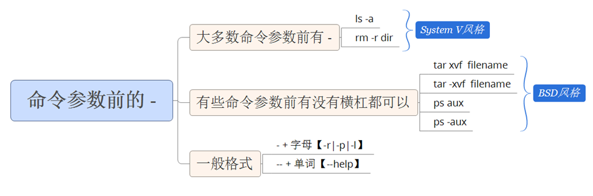
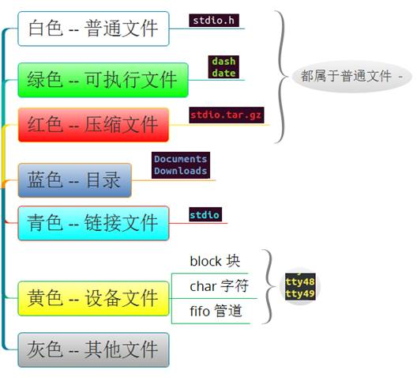
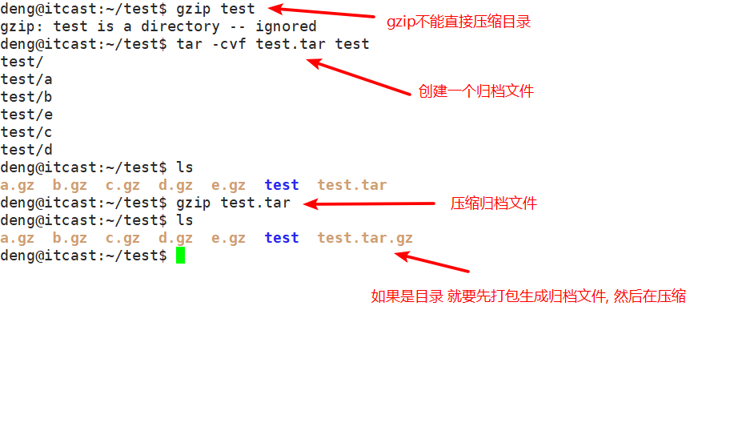
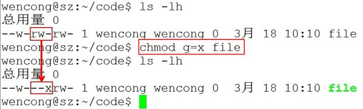

# linux 命令

## linux 命令格式

**command [ -options] [parameter1] …**

**说明:**

- command：命令名，相应功能的英文单词或单词的缩写
- [-options]：选项，可用来对命令进行控制，也可以省略，[]代表可选
- parameter1 …：传给命令的参数，可以是零个一个或多个



## 查看帮助文档

man 是 Linux 提供的一个手册，包含了绝大部分的命令、函数使用说明。

该手册分成很多章节（section），使用 man 时可以指定不同的章节来浏览不同的内容。

**man** **中各个** **section** **意义如下：**

> deng@itcast:~$ man man

1)．Standard commands（标准命令）

2)．System calls（系统调用，如open,write）

3)．Library functions（库函数，如printf,fopen）

4)．Special devices（设备文件的说明，/dev下各种设备）

5)．File formats（文件格式，如passwd）

6)．Games and toys（游戏和娱乐）

7)．Miscellaneous（杂项、惯例与协定等，例如Linux档案系统、网络协定、ASCII 码；environ全局变量）

8)．Administrative Commands（管理员命令，如ifconfig）

**man使用格式如下：**

man [选项] 命令名

**man设置了如下的功能键:**

| **功能键** | **功能**             |
| :--------- | :------------------- |
| 空格键     | 显示手册页的下一屏   |
| Enter键    | 一次滚动手册页的一行 |
| b          | 回滚一屏             |
| f          | 前滚一屏             |
| q          | 退出man命令          |
| h          | 列出所有功能键       |
| /word      | 搜索word字符串       |

使用示例：

```shell
man 1 ls //( 1：为数字“1”，代表第 1 个 section，标准命令 ) :
```

## 绝对路径与相对路径

Unix/Linux路径由到达定位文件的目录组成。在Unix/Linux系统中组成路径的目录分割符为斜杠“/”，而DOS则用反斜杠“\”来分割各个目录。

路径分为**绝对路径**和**相对路径**：

**1）绝对路径**

- 绝对路径是从目录树的树根“/”目录开始往下直至到达文件所经过的所有节点目录。
- 下级目录接在上级目录后面用“/”隔开。
- 注意：绝对路径都是从“/”开始的，所以第一个字符一定是“/”。

 

/home/test

test

/var/ftp/pub


**2）相对路径**

- 相对路径是指目标目录相对于当前目录的位置。
- 如果不在当前目录下，则需要使用两个特殊目录“.”和“..”了。目录“.”指向当前目录，而目录“..”指向上一层目录。


## 文件类型

Unix/Linux对数据文件(*.mp3、*.bmp)，程序文件(*.c、*.h、*.o)，设备文件（LCD、触摸屏、鼠标），网络文件( socket ) 等的管理都抽象为文件，使用统一的方式方法管理。 **Linux下一切皆文件。**

在Unix/Linux操作系统中也必须区分文件类型，通过文件类型可以判断文件属于可执行文件、文本文件还是数据文件。在Unix/Linux系统中文件可以没有扩展名。

**文件类型分类**

通常，Unix/Linux系统中常用的文件类型有7种：普通文件、目录文件、设备文件、管道文件、链接文件和套接字。



使用ls命令查看文件的类型


## 查看磁盘和文件系统空间

### du

du命令用于查看某个目录大小。

du命令的使用格式如下：

du [选项] 目录或文件名

| **选项** | **含义**                                           |
| :------- | :------------------------------------------------- |
| -a       | 递归显示指定目录中各文件和子目录中文件占用的数据块 |
| -s       | 显示指定文件或目录占用的数据块                     |
| -b       | 以字节为单位显示磁盘占用情况                       |
| -h       | 以K，M，G为单位，提高信息的可读性                  |


### df

df命令用于检测文件系统的磁盘空间占用和空余情况，可以显示所有文件系统对节点和磁盘块的使用情况。

| **选项** | **含义**                          |
| :------- | :-------------------------------- |
| -a       | 显示所有文件系统的磁盘使用情况    |
| -m       | 以1024字节为单位显示              |
| -h       | 以K，M，G为单位，提高信息的可读性 |


## 压缩打包命令

### tar

计算机中的数据经常需要备份，tar是Unix/Linux中最常用的备份工具，此命令可以把一系列文件归档到一个大文件中，也可以把档案文件解开以恢复数据。

tar使用格式

> tar [选项] 打包文件名 文件

tar命令很特殊，其选项前面可以使用“-”，也可以不使用。

常用参数：

| **参数** | **含义**                                                  |
| :------- | :-------------------------------------------------------- |
| -c       | 生成档案文件，创建打包文件                                |
| -v       | 列出归档解档的详细过程，显示进度                          |
| -f       | 指定档案文件名称，f后面一定是.tar文件，所以必须放选项最后 |
| -t       | 列出档案中包含的文件                                      |
| -x       | 解开档案文件                                              |
| -z       | 指定压缩包的格式为：file.tar.gz                           |

注意：除了f需要放在参数的最后，其它参数的顺序任意。

示例：

```
tar cvf test.tar a b c //tar -cvf 创建归档文件
tar -xvf tets.tar a b c //tar -xvf 解除归档文件(还原)
```

### gzip

tar与gzip命令结合使用实现文件打包、压缩。

tar只负责打包文件，但不压缩，用gzip压缩tar打包后的文件，其扩展名一般用xxxx.tar.gz。

gzip使用格式如下：

> gzip [选项] 被压缩文件

常用选项：

| **选项** | **含义**       |
| :------- | :------------- |
| -d       | 解压           |
| -r       | 压缩所有子目录 |




tar这个命令并没有压缩的功能，它只是一个打包的命令，但是在tar命令中增加一个选项(-z)可以调用gzip实现了一个压缩的功能，实行一个先打包后压缩的过程。

**压缩用法：**tar cvzf 压缩包包名 文件1 文件2 ...


## 查找命令

### find

**按文件名查询：使用参数 -name**

**命令：find + 路径 + -name +“文件名”**

示例：find /home -name “a.txt”


**按文件类型查询：使用参数 -type**

**命令：find + 路径 + -type + 类型**

类型

普通文件类型用 **f** 表示而不是-

d -> 目录

l -> 符号链接

b -> 块设备文件

c -> 字符设备文件

s -> socket文件，网络套接字

p -> 管道

查找指定目录下的普通文件： find /home -type f

示例集合：

```
find /etc -name grub.conf   查找/etc目录下的grub.conf文件
find / -name "*.conf"       查找/下所有.conf文件
find  / -iname grub.conf    查找/目录下的grub.conf文件，忽略大小写
find / -maxdepth 2 -name grub.conf     可以使用-maxdepath参数来控制查找的层次，就是说只查当前目录和子目录,最多查2级目录
```

### grep

Linux系统中grep命令是一种强大的文本搜索工具，grep允许对文本文件进行模式查找。如果找到匹配模式， grep打印包含模式的所有行。

grep一般格式为：

**grep [-选项] ‘搜索内容串’ 文件名**

在grep命令中输入字符串参数时，最好引号或双引号括起来。例如：grep ‘a ’1.txt。

 

常用选项说明：

| **选项** | **含义**                                 |
| :------- | :--------------------------------------- |
| -v       | 显示不包含匹配文本的所有行（相当于求反） |
| -n       | 显示匹配行及行号                         |
| -i       | 忽略大小写                               |

### 管道

管道(**|**)：一个命令的输出可以通过管道做为另一个命令的输入。

管道我们可以理解现实生活中的管子，管子的一头塞东西进去，另一头取出来，这里“ | ”的左右分为两端，左端塞东西(写)，右端取东西(读)。

> cat /etc/passwd | less

## 文件权限管理

### 文件权限

文件权限就是文件的访问控制权限，即哪些用户和组群可以访问文件以及可以执行什么样的操作。

Unix/Linux系统是一个典型的多用户系统，不同的用户处于不同的地位，对文件和目录有不同的访问权限。为了保护系统的安全性，Unix/Linux系统除了对用户权限作了严格的界定外，还在用户身份认证、访问控制、传输安全、文件读写权限等方面作了周密的控制。

在 Unix/Linux中的每一个文件或目录都包含有访问权限，这些访问权限决定了谁能访问和如何访问这些文件和目录。

### 访问用户分类

通过设定权限可以从以下三种访问方式限制访问权限：

**1）只允许用户自己访问（所有者）**

所有者就是创建文件的用户，用户是所有用户所创建文件的所有者，用户可以允许所在的用户组能访问用户的文件。

**2）允许一个预先指定的用户组中的用户访问（用户组）**

用户都组合成用户组，例如，某一类或某一项目中的所有用户都能够被系统管理员归为一个用户组，一个用户能够授予所在用户组的其他成员的文件访问权限。

**3）允许系统中的任何用户访问（其他用户）**

用户也将自己的文件向系统内的所有用户开放，在这种情况下，系统内的所有用户都能够访问用户的目录或文件。在这种意义上，系统内的其他所有用户就是 other 用户类


### 访问权限说明

用户能够控制一个给定的文件或目录的访问程度，一个文件或目录可能有读、写及执行权限：

- 读权限（r）

对文件而言，具有读取文件内容的权限；对目录来说，具有浏览目录的权限。

- 写权限（w）

对文件而言，具有新增、修改文件内容的权限；对目录来说，具有删除、移动目录内文件的权限。

- 可执行权限（x）

对文件而言，具有执行文件的权限；对目录了来说该用户具有进入目录的权限。

注意：通常，Unix/Linux系统只允许文件的属主(所有者)或超级用户改变文件的读写权限。

### chmod(掌握)

chmod 修改文件权限有两种使用格式：字母法与数字法。

**字母法：**chmod u/g/o/a +/-/= rwx 文件

| **[ u/g/o/a ]** | **含义**                                                  |
| :-------------- | :-------------------------------------------------------- |
| u               | user 表示该文件的所有者                                   |
| g               | group 表示与该文件的所有者属于同一组( group )者，即用户组 |
| o               | other 表示其他以外的人                                    |
| a               | all 表示这三者皆是                                        |

| **[ +-= ]** | **含义** |
| :---------- | :------- |
| +           | 增加权限 |
| -           | 撤销权限 |
| =           | 设定权限 |

| **rwx** | **含义**                                                     |
| :------ | :----------------------------------------------------------- |
| r       | read 表示可读取，对于一个目录，如果没有r权限，那么就意味着不能通过ls查看这个目录内部的内容。 |
| w       | write 表示可写入，对于一个目录，如果没有w权限，那么就意味着不能在目录下创建新的文件。 |
| x       | excute 表示可执行，对于一个目录，如果没有x权限，那么就意味着不能通过cd进入这个目录。 |

**chmod o+w file** 给文件file的其它用户增加写权限：


**chmod u-r file** 给文件file的拥有者减去读的权限：


**chmod g=x file**设置文件file的所属组权限为可执行，同时去除读、写权限：



**数字法：**“rwx” 这些权限也可以用数字来代替

| r    | 读取权限，数字代号为 "4"      |
| :--- | :---------------------------- |
| w    | 写入权限，数字代号为 "2"      |
| x    | 执行权限，数字代号为 "1"      |
| -    | 不具任何权限，数字t代号为 "0" |

如执行：chmod u=rwx,g=rx,o=r filename

就等同于：chmod u=7,g=5,o=4 filename(不可以执行，只是一种示例)

也可以直接使用chmod 751 filename

## 重定向

重定向

标准输入 代码 0 默认设备为键盘
​ 标准输出 代码 1 默认设备为屏幕
​ 错误输出 代码 2 默认设备为屏幕

```
ls /etc/passwd > output.txt 标准正确输出重定向到output.txt
ls /etc/shadow >> output.txt 标准正确输出追加重定向到output.txt
ls dddddd 2> error.txt 标准错误输出重定向到error.txt
ls dddddd 2> /dev/null 标准错误输出重定向到黑洞


```

## scp命令

**1、从本地复制到远程**

命令格式：

```
scp local_file remote_username@remote_ip:remote_folder 
或者 
scp local_file remote_username@remote_ip:remote_file 
或者 
scp local_file remote_ip:remote_folder 
或者 
scp local_file remote_ip:remote_file 
```


- 第1,2个指定了用户名，命令执行后需要再输入密码，第1个仅指定了远程的目录，文件名字不变，第2个指定了文件名；
- 第3,4个没有指定用户名，命令执行后需要输入用户名和密码，第3个仅指定了远程的目录，文件名字不变，第4个指定了文件名；


## 关闭防火墙

**1:查看防火状态**

**systemctl status firewalld**

**service  iptables status**

**2:暂时关闭防火墙**

**systemctl stop firewalld**

**service  iptables stop**

**3:永久关闭防火墙**

**systemctl disable firewalld**

chkconfig iptables off

**4:重启防火墙**

**systemctl enable firewalld**

**service iptables restart**


## 暂停程序

一、暂停命令：Ctrl+Z
在Linux系统中，可以使用Ctrl+Z组合键来暂停正在运行的程序。当你按下这个组合键后，正在运行的程序会被暂停，并返回到终端提示符下，以供你继续输入其他命令。暂停的程序仍然在内存中，只是不再执行。

**例如**，你正在执行一个长时间运行的命令，但突然需要执行其他命令，你可以按下Ctrl+Z来暂停该程序，然后执行其他命令。在需要的时候，你可以使用继续命令将程序恢复到执行状态。

二、继续命令：bg和fg
在Linux系统中，有两个继续命令可以将暂停的程序恢复到执行状态，分别是bg和fg。

1. bg命令：bg命令用于将一个被暂停的程序以后台方式继续执行。使用bg命令后，该程序会继续执行，但不会占用终端，你可以继续输入其他命令。

> 使用bg命令的格式如下：
> bg [job ID]
> 其中，[job ID]是被暂停程序的作业号。你可以使用jobs命令来查看当前正在运行的作业和它们的作业号。
>
> 例如，你可以使用jobs命令来查看暂停的程序的作业号，然后使用bg命令将其恢复到后台执行。


2. fg命令：fg命令用于将一个被暂停的程序以前台方式继续执行。使用fg命令后，该程序会继续在当前终端中执行，并占用该终端。

> 使用fg命令的格式如下：
> fg [job ID]
> 其中，[job ID]是被暂停程序的作业号。你可以使用jobs命令来查看当前正在运行的作业和它们的作业号。
>
> 例如，你可以使用jobs命令来查看暂停的程序的作业号，然后使用fg命令将其恢复到前台执行。

总结：
在Linux系统中，暂停和继续命令可以控制正在运行的程序的执行状态。暂停命令Ctrl+Z可以将程序暂时中断，并返回到终端提示符下；继续命令bg和fg可以将暂停的程序恢复到执行状态，分别以后台和前台方式执行。掌握这些命令，可以更加灵活地控制程序的执行。

## 其它命令

### n(掌握)

ln命令主要用于创建链接文件。Linux链接文件类似于Windows下的快捷方式。

链接文件分为软链接和硬链接：

- 软链接：软链接不占用磁盘空间，源文件删除则软链接失效。
- 硬链接：硬链接只能链接普通文件，不能链接目录。

使用格式：

ln 源文件 链接文件

ln -s 源文件 链接文件

如果没有-s选项代表建立一个硬链接文件，两个文件占用相同大小的硬盘空间，即使删除了源文件，链接文件还是存在，所以-s选项是更常见的形式。

注意：如果软链接文件和源文件不在同一个目录，源文件最好要使用绝对路径，不要使用相对路径。

