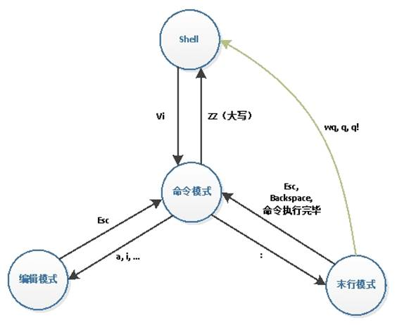

# vim操作

## vim的工作模式

vi有三种基本工作模式: **命令模式、文本输入模式(编辑模式)、末行模式**。

### 1.命令模式

任何时候,不管用户处于何种模式,只要按一下ESC键,即可使vi进入命令模式。我们在shell环境(提示符为$)下输入启动vim命令，进入编辑器时，也是处于该模式下。

在命令模式下，用户可以输入各种合法的vi命令，用于管理自己的文档。此时从键盘上输入的任何字符都被当做编辑命令来解释，若输入的字符是合法的vi命令，则vi在接受用户命令之后完成相应的动作。但需注意的是，所输入的命令并不在屏幕上显示出来。若输入的字符不是vi的合法命令，vi会响铃报警。

### 2.编辑模式

在命令模式下输入插入命令i（I）、附加命令a（A） 、打开命令o（O）、替换命s（S）都可以进入文本输入模式，此时vi窗口的最后一行会显示“插入”。

在该模式下,用户输入的任何字符都被vi当做文件内容保存起来，并将其显示在屏幕上。在文本输入过程中，若想回到命令模式下，按键**ESC**即可。

### 3.末行模式

末行模式下，用户可以对文件进行一些附加处理。尽管命令模式下的命令可以完成很多功能，但要执行一些如字符串查找、替换、显示行号等操作还是必须要进入末行模式的。

在命令模式下，输入冒号即可进入末行模式。此时vi窗口的状态行会显示出冒号，等待用户输入命令。用户输入完成后，按回车执行，之后vi编辑器又自动返回到命令模式下。

## 基本操作

**1 打开文件**

**vim filename**：打开或新建文件，并将光标置于第一行行首，如果文件不存在，则会新建文件。

**2 编辑文件**

如果通过vi打开一个已经存在的文件，首先进入命令模式，此时输入的任何字符都被视为命令，不能输入内容。

在命令模式输入i

**3 保存文件**

一定要先退出插入模式(按Esc进入命令模式)，然后(小写状态下)，shift + zz （按住 “shift” + 按两下“z”键），或者（大写状态下：ZZ） 即可保存退出当前文件。

## 实用操作

### 1.命令模式下的操作

**1）切换到编辑模式**

| 按键    | 功能                                   |
| :------ | :------------------------------------- |
| i       | 光标位置当前处插入文字                 |
| I       | 光标所在行首插入文字                   |
| o(字母) | 光标下一行插入文字（新行）             |
| O(字母) | 光标上一行插入文字（新行）             |
| a       | 光标位置右边插入文字                   |
| A       | 光标所在行尾插入文字                   |
| s       | 删除光标后边的字符，从光标当前位置插入 |
| S       | 删除光标所在当前行，从行首插入         |

**2) 光标移动**

| **按键** | **功能**                             |
| :------- | :----------------------------------- |
| Ctrl + f | 向前滚动一个屏幕                     |
| Ctrl + b | 向后滚动一个屏幕                     |
| gg       | 到文件第一行行首                     |
| G(大写)  | 到文件最后一行行首，G必须为大写      |
| mG或mgg  | 到指定行，m为目标行数                |
| 0(数字)  | 光标移到到行首（第一个字符位置）     |
| $        | 光标移到到行尾                       |
| l(小写L) | 向右移动光标                         |
| h        | 向左移动光标                         |
| k        | 向上移动光标                         |
| j        | 向下移动光标                         |
| ^        | 光标移到到行首（第一个有效字符位置） |

**3）复制粘贴**

| **按键** | **功能**                     |
| :------- | :--------------------------- |
| [n]yy    | 复制从当前行开始的 n 行      |
| p        | 把粘贴板上的内容插入到当前行 |

**4）删除**

| **按键**    | **功能**                                                     |
| :---------- | :----------------------------------------------------------- |
| [n]x        | 删除光标后 n 个字符                                          |
| [n]X        | 删除光标前 n 个字符                                          |
| D           | 删除光标所在开始到此行尾的字符                               |
| [n]dd       | 删除从当前行开始的 n 行（准确来讲，是剪切，剪切不粘贴即为删除） |
| dG          | 删除光标所在开始到文件尾的所有字符                           |
| dw          | 删除光标开始位置的字,包含光标所在字符                        |
| d0(0为数字) | 删除光标前本行所有内容,不包含光标所在字符                    |
| dgg         | 删除光标所在开始到文件首行第一个字符开始的所有字符           |

**5）撤销恢复**

| **按键**  | **功能**            |
| :-------- | :------------------ |
| **.**(点) | 执行上一次操作      |
| u         | 撤销前一个命令      |
| ctrl+r    | 反撤销              |
| 100 + .   | 执行上一次操作100次 |

**6）保存退出**

| **按键**      | **功能** |
| :------------ | :------- |
| ZZ(shift+z+z) | 保存退出 |

 

**7）查找**

| **按键** | **功能**                                   |
| :------- | :----------------------------------------- |
| /字符串  | 从当前光标位置向下查找（n，N查找内容切换） |
| ?字符串  | 从当前光标位置向上查找（n，N查找内容切换） |

**8）替换**

| **按键** | **功能**                                |
| :------- | :-------------------------------------- |
| r        | 替换当前字符                            |
| R        | 替换当前行光标后的字符(ESC退出替换模式) |

**9）可视模式**

| **按键**  | **功能**                                                     |
| :-------- | :----------------------------------------------------------- |
| v         | 按字符移动，选中文本，可配合h、j、k、l选择内容，使用d删除，使用y复制 |
| Shift + v | 行选（以行为单位）选中文本，可配合h、j、k、l选择内容，使用d删除，使用y复制 |
| Ctrl + v  | 列选 选中文本，可配合h、j、k、l选择内容，使用d删除，使用y复制 |

### 2.末行模式

**1）保存退出**

| **按键**    | **功能**                                     |
| :---------- | :------------------------------------------- |
| :wq         | 保存退出                                     |
| :x(小写)    | 保存退出                                     |
| :w filename | 保存到指定文件                               |
| :q          | 退出，如果文件修改但没有保存，会提示无法退出 |
| :q!         | 退出，不保存                                 |
|             |                                              |

all 表示所有

**2）替换**

| **按键**         | **功能**                               |
| :--------------- | :------------------------------------- |
| :s/abc/123/      | 光标所在行的第一个abc替换为123         |
| :s/abc/123/g     | 光标所在行的所有abc替换为123           |
| :1,10s/abc/123/g | 将第一行至第10行之间的abc全部替换成123 |
| :%s/abc/123/g    | 当前文件的所有abc替换为123             |
| :%s/abc/123/gc   | 同上，但是每次替换需要用户确认         |
| :1,$s/abc/123/g  | 当前文件的所有abc替换为123             |

 

**3）分屏**

| **按键**           | **功能**                       |
| :----------------- | :----------------------------- |
| :sp                | 当前文件水平分屏               |
| :vsp               | 当前文件垂直分屏               |
| : sp 文件名        | 当前文件和另一个文件水平分屏   |
| : vsp 文件名       | 当前文件和另一个文件垂直分屏   |
| ctrl-w-w           | 在多个窗口切换光标             |
| :wall/:wqall/:qall | 保存/保存退出/退出所有分屏窗口 |
| vim -O a.c b.c     | 垂直分屏                       |
| vim -o a.c b.c     | 水平分屏                       |

 

**4) 其它用法(扩展)**

| 按键                         | 功能                                             |
| :--------------------------- | :----------------------------------------------- |
| :!man 3 printf               | 在vim中执行命令 （q退出）                        |
| :r !ls -l                    | 将ls -l执行的结果写入当前文件中                  |
| :r /etc/passwd               | 将/etc/passwd文件中的内容写入到当前文件中        |
| :w /tmp/txt                  | 将当前文件内容写入到/tmp/txt文件中               |
| :w! /tmp/txt                 | 强制将当前文件内容写入到/tmp/txt文件中           |
| :1,10s/^/\/\//g              | 将第1行到10行行首添加// (^表示行首) /\/\转移字符 |
| :1,10s#^#//#g                | 将第1行到10行行首添加// (#可以临时代替/ 分隔)    |
| :%s/;/\r{\r\treturn0;\r}\r/g | 将;替换成{ return 0; }                           |
| :1,10s#//##g                 | 将第1行到10行行首去掉// (#可以临时代替/ 分隔)    |

