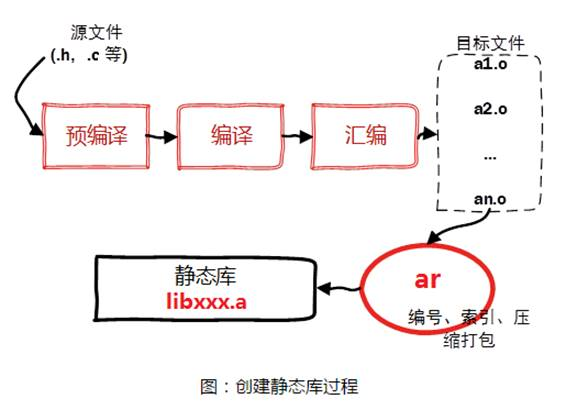
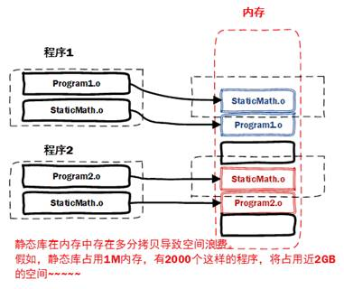
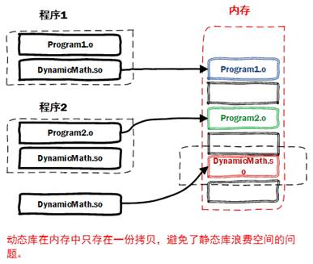
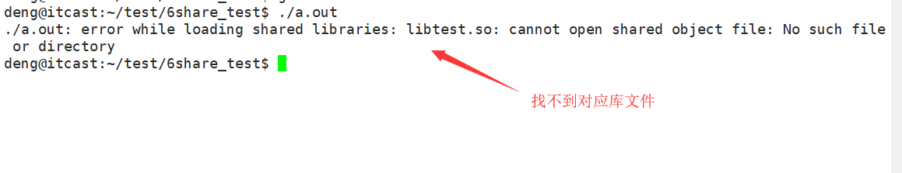

# 编译与链接基础

## gcc编译器简介

编辑器(如vi、记事本)是指我用它来写程序的（编辑代码），而我们写的代码语句，电脑是不懂的，我们需要把它转成电脑能懂的语句，编译器就是这样的转化工具。就是说，我们用编辑器编写程序，由编译器编译后才可以运行！

编译器是将易于编写、阅读和维护的高级计算机语言翻译为计算机能解读、运行的低级机器语言的程序。

gcc（GNU Compiler Collection，GNU 编译器套件），是由 GNU 开发的编程语言编译器。gcc原本作为GNU操作系统的官方编译器，现已被大多数类Unix操作系统（如Linux、BSD、Mac OS X等）采纳为标准的编译器，gcc同样适用于微软的Windows。

gcc最初用于编译C语言，随着项目的发展gcc已经成为了能够编译C、C++、Java、Ada、fortran、Object C、Object C++、Go语言的编译器大家族。

> 编译命令格式：
>
> gcc [options] file...
>
> g++ [options] file...
>
> - 命令、选项和源文件之间使用空格分隔
> - 一行命令中可以有零个、一个或多个选项
> - 文件名可以包含文件的绝对路径，也可以使用相对路径
> - 如果命令中不包含输出可执行文件的文件名，可执行文件的文件名会自动生成一个默认名，Linux平台为a.out，Windows平台为a.exe

## GCC工作流程和常用选项

gcc编译器从拿到一个c源文件到生成一个可执行程序，中间一共经历了四个步骤：


四个步骤并不是gcc独立完成的，而是在内部调用了其他工具，从而完成了整个工作流程：


gcc常用选项

| **选项**       | **作用**                                      |
| :------------- | :-------------------------------------------- |
| -o file        | 指定生成的输出文件名为file                    |
| -E             | 只进行预处理                                  |
| -S(大写)       | 只进行预处理和编译                            |
| -c(小写)       | 只进行预处理、编译和汇编                      |
| -v / --version | 查看gcc版本号                                 |
| -g             | 包含调试信息                                  |
| -On n=0~3      | 编译优化，n越大优化得越多                     |
| -Wall          | 提示更多警告信息                              |
| -D             | 编译时定义宏                                  |
| -L             | **表示要连接的库所在目录**                    |
| -I             | **I(大写i) 表示指定头文件的目录**             |
| -l             | **(小写L)指定链接时需要的库，去掉前缀和后缀** |

## 静态连接和动态连接

链接分为两种：**静态链接**、**动态链接**。

**1）静态链接**

静态链接：**由链接器在链接时将库的内容加入到可执行程序中**。

优点：

- 对运行环境的依赖性较小，具有较好的兼容性（如果在另外一台主机上运行可能不再需要再拷贝底层）

缺点：

- 生成的程序比较大，需要更多的系统资源，在装入内存时会消耗更多的时间
- 库函数有了更新，必须重新编译应用程序

**2）动态链接**

动态链接：**连接器在链接时仅仅建立与所需库函数的之间的链接关系，在程序运行时才将所需资源调入可执行程序。**

优点：

- 在需要的时候才会调入对应的资源函数
- 简化程序的升级；有着较小的程序体积
- **实现进程之间的资源共享（避免重复拷贝），多进程恭喜一个动态库，而静态链接每一个都拷贝一个静态库**

缺点：

- 依赖动态库，不能独立运行，如果拷贝可执行文件到另外的主机需要将动态库一起拷贝
- 动态库依赖版本问题严重

**）静态、动态编译可执行程序对比**

前面我们编写的应用程序大量用到了标准库函数，系统默认采用动态链接的方式进行编译程序，若想采用静态编译，加入-static参数。

结果对比：


## 静态库和动态库

所谓“程序库”，简单说，就是包含了数据和执行码的文件。其不能单独执行，可以作为其它执行程序的一部分来完成某些功能。

库的存在可以使得程序模块化，可以加快程序的再编译，可以实现代码重用,可以使得程序便于升级。

程序库可分**静态库(static library)**和**共享库(shared library)**。


### 1.静态库

静态库可以认为是一些目标代码的集合，是在可执行程序运行前就已经加入到执行码中，成为执行程序的一部分。

按照习惯,一般以“.a”做为文件后缀名。静态库的命名一般分为三个部分：

- 前缀：lib
- 库名称：自己定义即可
- 后缀：.a

所以最终的静态库的名字应该为：**libxxx.a**

**1） 静态库制作**



步骤1：将c源文件生成对应的.o文件

```
 gcc -c add.c -o add.o
 gcc -c sub.c -o sub.o
```

步骤2：使用打包工具ar将准备好的.o文件打包为.a文件 libtest.a

```
ar -rcs libtest.a add.o sub.o mul.o div.o
```

**在使用ar工具是时候需要添加参数：rcs**

- r更新
- c创建
- s建立索引

**2）静态库使用**

静态库制作完成之后，需要将.a文件和头文件一起发布给用户。

假设测试文件为main.c，静态库文件为libtest.a头文件为head.h

编译命令：

```
gcc main.c -L./ -I./ -ltest -o test
```

参数说明：

- -L：表示要连接的库所在目录
- -I./: I(大写i) 表示指定头文件的目录为当前目录
- -l(小写L)：指定链接时需要的库，去掉前缀和后缀



### 2.动态库

共享库在程序编译时并不会被连接到目标代码中，而是在程序运行是才被载入。不同的应用程序如果调用相同的库，那么在内存里只需要有一份该共享库的实例，规避了空间浪费问题。

**动态库在程序运行是才被载入**，**也解决了静态库对程序的更新、部署和发布页会带来麻烦。用户只需要更新动态库即可，增量更新**。

按照习惯,一般以“.so”做为文件后缀名。共享库的命名一般分为三个部分：

- 前缀：lib
- 库名称：自己定义即可
- 后缀：.so



所以最终的动态库的名字应该为：libxxx.so

**1）动态库制作**

步骤一：生成目标文件，此时要加编译选项：-fPIC（fpic）

```
gcc -fPIC -c add.c -o add.o
gcc -fPIC -c sub.c -o sub.o
```

参数：-fPIC 创建与地址无关的编译程序（pic，position independent code），是为了能够在多个应用程序间共享。

步骤二：生成共享库，此时要加链接器选项: -shared（指定生成动态链接库）

```
gcc -shared add.o sub.o mul.o div.o -o libtest.so
```

步骤三: 通过nm命令查看对应的函数

```
 nm libtest.so | grep add
 显示如下
 00000000000006b0 T add
```

**ldd查看可执行文件的依赖的动态库**

```
ldd test
```

**2）动态库测试**

引用动态库编译成可执行文件（跟静态库方式一样）

```
gcc test.c -L. -I. -ltest (-I. 大写i -ltest 小写L)
```

然后运行：./a.out，发现竟然报错了！！！



这是因为：

- 当系统加载可执行代码时候，能够知道其所依赖的库的名字，但是还需要知道绝对路径。此时就需要系统动态载入器(dynamic linker/loader)。
- 对于elf格式的可执行程序，是由ld-linux.so*来完成的，它先后搜索elf文件的 DT_RPATH段 — 环境变量LD_LIBRARY_PATH — /etc/ld.so.cache文件列表 — **/lib/, /usr/lib64（64位机，如果是32位机器则是/usr/lib目录）**目录找到库文件后将其载入内存。

**3）如何让系统找到动态库**

- 拷贝自己制作的共享库到/lib或者/usr/lib(不能是/lib64目录)或者拷贝到usr/local/lib
- 临时设置LD_LIBRARY_PATH：

> export LD_LIBRARY_PATH=$LD_LIBRARY_PATH:库路径

- 永久设置,把export LD_LIBRARY_PATH=$LD_LIBRARY_PATH:库路径，设置到~/.bashrc或者 /etc/profile文件中

将其添加到 /etc/ld.so.conf文件中

编辑/etc/ld.so.conf文件，加入库文件所在目录的路径

运行sudo ldconfig -v，该命令会重建/etc/ld.so.cache文件


- 使用符号链接， 但是一定要使用绝对路径，将动态库链接到/lib下

```
 sudo ln -s /home/deng/test/6share_test/libtest.so /lib/libtest.so
```

