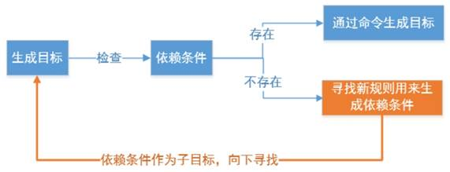
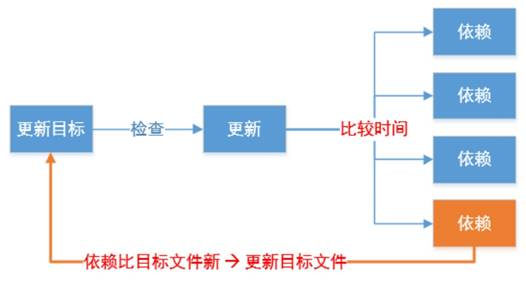

# make

## 简介

一个工程中的源文件不计其数，其按类型、功能、模块分别放在若干个目录中，makefile定义了一系列的规则来指定，哪些文件需要先编译，哪些文件需要后编译，哪些文件需要重新编译，甚至于进行更复杂的功能操作，因为 makefile就像一个[Shell脚本](https://baike.baidu.com/item/Shell脚本)一样，其中也可以执行操作系统的[命令](https://baike.baidu.com/item/命令/8135974)。

Makefile带来的好处就是——“自动化编译”，一旦写好，只需要一个make命令，整个工程完全自动编译，极大的提高了软件开发的效率。make是一个命令工具，是一个解释makefile中指令的命令工具，一般来说，大多数的[IDE](https://baike.baidu.com/item/IDE)都有这个命令，比如：Delphi的make，[Visual C++](https://baike.baidu.com/item/Visual C%2B%2B)的nmake，Linux下GNU的make。可见，makefile都成为了一种在工程方面的编译方法。

**make主要解决两个问题：**

*1) 大量代码的关系维护*

大项目中源代码比较多，手工维护、编译时间长而且编译命令复杂，难以记忆及维护

把代码维护命令及编译命令写在makefile文件中，然后再用make工具解析此文件自动执行相应命令，可实现代码的合理编译

*2) 减少重复编译时间*

n 在改动其中一个文件的时候，能判断哪些文件被修改过，可以只对该文件进行重新编译，然后重新链接所有的目标文件，节省编译时间

**Makefile文件命名规则**

makefile和Makefile都可以，推荐使用Makefile。

## makefile的语法规则

**一条规则：**

```
目标：依赖文件列表

	命令列表
```

1）目标：

- 通常是要产生的文件名称，目标可以是可执行文件或其它obj文件，也可是一个动作的名称

2）依赖文件：

- 用来输入从而产生目标的文件
- 一个目标通常有几个依赖文件（可以没有）

3）命令：

- make执行的动作，一个规则可以含几个命令（可以没有）
- 有多个命令时，每个命令占一行

## make命令格式

make是一个命令工具，它解释Makefile 中的指令（应该说是规则）。

make命令格式：

```
make [ -f file ][ options ][ targets ]
```

1.[ -f file ]：

- make默认在工作目录中寻找名为GNUmakefile、makefile、Makefile的文件作为makefile输入文件
- -f 可以指定以上名字以外的文件作为makefile输入文件


2.[ options ]

- -v： 显示make工具的版本信息
- -w： 在处理makefile之前和之后显示工作路径
- -C dir：读取makefile之前改变工作路径至dir目录
- -n：只打印要执行的命令但不执行
- -s：执行但不显示执行的命令
- -j: 多线程编译常用-j9(实际是根据你系统最大可支持多线程的数目来编译)

3.[ targets ]：

- 若使用make命令时没有指定目标，则make工具默认会实现makefile文件内的第一个目标，然后退出
- 指定了make工具要实现的目标，目标可以是一个或多个（多个目标间用空格隔开）。

## make工作原理

1**）若想生成目标**, 检查规则中的依赖条件是否存在,如不存在,则寻找是否**有规则用来 生成该依赖文件**




2） 要检查规则中的目标是否需要更新，就必须先检查它的所有依赖,依赖中有任一个被更新,则目标必须更新，是通过文件最后一次修改时间来进行判断的




**如果依赖又是另外一条规则的目标，则继续向下寻找依赖的依赖是否更新时间相同**

**示例：**

1.最简单的makefile

```
test:test.c add.c sub.c mul.c div.c
    gcc test.c add.c sub.c mul.c div.c -o test
```

缺点：效率低，修改一个文件，所有文件会被全部编译

2.优化后的makefile

```

test:test.o add.o sub.o mul.o div.o
    gcc test.o add.o sub.o mul.o div.o -o test

test.o:test.c
    gcc -c test.c
add.o:add.c
    gcc -c add.c
sub.o:sub.c
    gcc -c sub.c
mul.o:mul.c
    gcc -c mul.c
div.o:div.c
    gcc -c div.c
```

分析如果在命令行使用make test，它就会去寻找test的依赖文件，然后发现依赖的文件又是另外的目标，如add.o又是下面规则的一个目标，则转而去判断add.o和它的依赖add.c的时间是否一致，如果修改时间不一致则执行命令gcc -c add.c，然后再去判断mul.o是否为最新的依赖等等

**总结：**

分析各个目标和依赖之间的关系

根据依赖关系自底向上执行命令

根据修改时间比目标新,确定更新

如果目标不依赖任何条件,则执行对应命令,以示更新

## makefile变量

在Makefile中使用变量有点类似于C语言中的宏定义，使用该变量相当于内容替换，使用变量可以使Makefile易于维护,修改内容变得简单变量定义及使用。

1）定义变量方法：

变量名=变量值


2）引用变量：

$(变量名)或${变量名}

 

3）makefile的变量名：

- makefile变量名可以以数字开头
- 变量是大小写敏感的
- 变量一般都在makefile的头部定义
- 变量几乎可在makefile的任何地方使用

示例：

```
#变量
OBJS=add.o sub.o mul.o div.o test.o
TARGET=test

$(TARGET):$(OBJS)
    gcc $(OBJS) -o $(TARGET) 

add.o:add.c
    gcc -c add.c -o add.o

sub.o:sub.c
    gcc -c sub.c -o sub.o

mul.o:mul.c
    gcc -c mul.c -o mul.o

div.o:div.c
    gcc -c div.c -o div.o

test.o:test.c
    gcc -c test.c -o test.o

clean:
    rm -rf $(OBJS) $(TARGET)
```


# cmake

