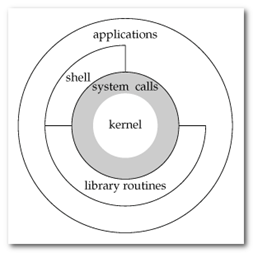
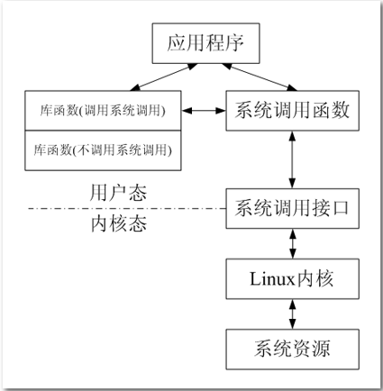
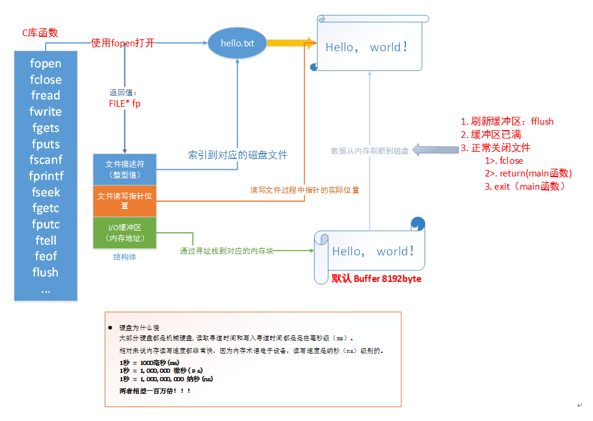
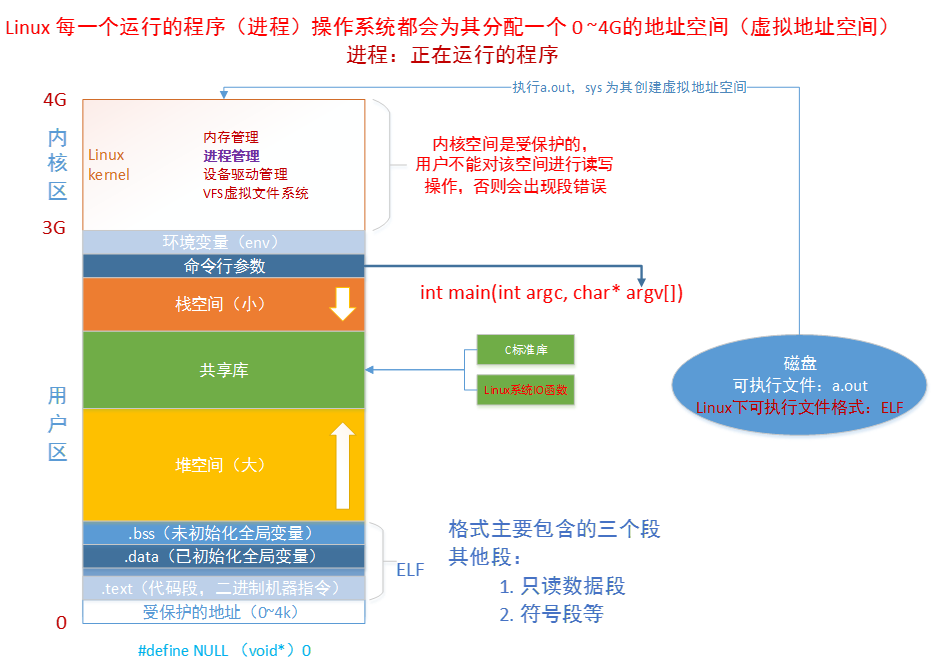

# 系统调用

## 系统调用简介

**1.简介**

系统调用，顾名思义，说的是**操作系统提供给用户程序调用的一组“特殊”接口**。用户程序可以通过这组“特殊”接口来获得操作系统内核提供的服务，比如用户可以通过文件系统相关的调用请求系统打开文件、关闭文件或读写文件，可以通过时钟相关的系统调用获得系统时间或设置定时器等。

从逻辑上来说，系统调用可被看成是一个**内核与用户空间程序交互的接口——它好比一个中间人，把用户进程的请求传达给内核，待内核把请求处理完毕后再将处理结果送回给用户空间**。

系统服务之所以需要通过系统调用来提供给用户空间的根本原因是为了对系统进行“保护”，因为我们知道 Linux 的运行空间分为内核空间与用户空间，它们各自运行在不同的级别中，逻辑上相互隔离。

所以用户进程在通常情况下不允许访问内核数据，也无法使用内核函数，它们只能在用户空间操作用户数据，调用用户空间函数。

**比如**我们熟悉的“hello world”程序（执行时）就是标准的用户空间进程，它使用的打印函数 printf 就属于用户空间函数，打印的字符“hello word”字符串也属于用户空间数据。

但是很多情况下，用户进程需要获得系统服务（调用系统程序），这时就必须利用系统提供给用户的“特殊接口”——系统调用了，它的特殊性主要在于规定了用户进程进入内核的具体位置。

换句话说，用户访问内核的路径是事先规定好的，只能从规定位置进入内核，而不准许肆意跳入内核。有了这样的陷入内核的统一访问路径限制才能保证内核安全无误。我们可以形象地描述这种机制：作为一个游客，你可以买票要求进入野生动物园，但你必须老老实实地坐在观光车上，按照规定的路线观光游览。当然，不准下车，因为那样太危险，不是让你丢掉小命，就是让你吓坏了野生动物。

**2.实现**

系统调用是属于操作系统内核的一部分的，必须以某种方式提供给进程让它们去调用。CPU 可以在不同的特权级别下运行，而相应的操作系统也有不同的运行级别，**用户态和内核态**。运行在内核态的进程可以毫无限制的访问各种资源，而在用户态下的用户进程的各种操作都有着限制，比如不能随意的访问内存、不能开闭中断以及切换运行进程。显然，属于内核的系统调用一定是运行在内核态下，但是如何切换到内核态呢？

答案是软件中断。软件中断和我们常说的中断（硬件中断）不同之处在于，它是通过软件指令触发而并非外设引发的中断，也就是说，又是编程人员开发出的一种异常（该异常为正常的异常）。**操作系统一般是通过软件中断从用户态切换到内核态。**

## 系统调用和库函数的区别

Linux 下对文件操作有两种方式：**系统调用（system call）**和**库函数调用（Library functions）**。

库函数由两类函数组成：

1）不需要调用系统调用

不需要切换到内核空间即可完成函数全部功能，并且将结果反馈给应用程序，如strcpy、bzero 等字符串操作函数。

2）需要调用系统调用

需要切换到内核空间，这类函数通过封装系统调用去实现相应功能，如 printf、fread等。

系统调用是需要时间的，程序中频繁的使用系统调用会降低程序的运行效率。当运行内核代码时，CPU工作在内核态，在系统调用发生前需要保存用户态的栈和内存环境，然后转入内核态工作。系统调用结束后，又要切换回用户态。这种环境的切换（由用户态切换到内核态）会消耗掉许多时间 。

## c库的IO函数

库函数访问文件的时候根据需要，设置不同类型的缓冲区，从而减少了直接调用 IO 系统调用的次数，提高了访问效率。

这个过程类似于快递员给某个区域（内核空间）送快递一样，快递员有两种方式送：

1）来一件快递就马上送到目的地，来一件送一件，这样导致来回走比较频繁（系统调用）

2）等快递攒着差不多后（缓冲区），才一次性送到目的地（库函数调用）

## 虚拟地址空间

每个进程都会分配虚拟地址空间，在32位机器上，该地址空间为4G 。

**在进程里平时所说的指针变量，保存的就是虚拟地址。当应用程序使用虚拟地址访问内存时，处理器（CPU）会将其转化成物理地址（MMU）**。

MMU：将虚拟的地址转化为物理地址。

这样做的好处在于：

- 进程隔离，更好的保护系统安全运行
- 屏蔽物理差异带来的麻烦，方便操作系统和编译器安排进程地址