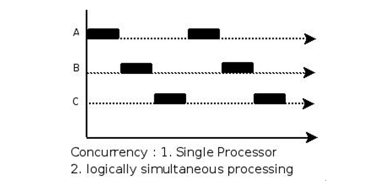
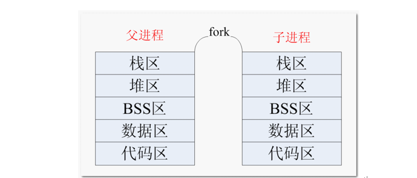
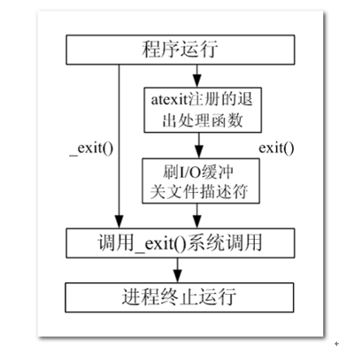

#  进程

## 单道、多道程序设计

1.单道程序设计

所有进程一个一个排队执行。若A阻塞，B只能等待，即使CPU处于空闲状态。而在人机交互时阻塞的出现是必然的。所有这种模型在系统资源利用上及其不合理，在计算机发展历史上存在不久，大部分便被淘汰了。

2.多道程序设计

在计算机内存中同时存放几道相互独立的程序，它们在管理程序控制之下，相互穿插的运行。多道程序设计必须有硬件基础作为保证。

在计算机中**时钟中断**即为多道程序设计模型的理论基础。并发时，任意进程在执行期间都不希望放弃cpu。因此系统需要一种强制让进程让出cpu资源的手段。时钟中断有硬件基础作为保障，对进程而言不可抗拒。 操作系统中的中断处理函数，来负责调度程序执行。

在多道程序设计模型中，**多个进程轮流使用CPU (分时复用CPU资源)**。而当下常见CPU为纳秒级，1秒可以执行大约10亿条指令。由于人眼的反应速度是毫秒级，所以看似同时在运行。

## 并发与并行

**并行(parallel)：**指在同一时刻，有**多条指令在多个处理器上同时执行**（多核cpu才支持）


**并发(concurrency)**：指在**同一时刻只能有一条指令执行，但多个进程指令被快速的轮换执**行**，**使得在宏观上具有多个进程同时执行的效果，但在微观上并不是同时执行的，只是把时间分成若干段，使多个进程快速交替的执行。




## MMU

MMU是Memory Management Unit的缩写，中文名是[内存管理](https://baike.baidu.com/item/内存管理)单元，它是[中央处理器](https://baike.baidu.com/item/中央处理器)（CPU）中用来管理[虚拟存储器](https://baike.baidu.com/item/虚拟存储器)、物理存储器的控制线路，同时也负责[虚拟地址](https://baike.baidu.com/item/虚拟地址)映射为[物理地址](https://baike.baidu.com/item/物理地址)，以及提供硬件机制的内存访问授权，多用户多进程操作系统。


如上图，想要获取内存的数据，cpu将虚拟地址发送给MMU，MMP将虚拟地址转化为实际的物理地址后获取其中的数据


## 进程和程序

### 简介

我们平时写的 C 语言代码，通过编译器编译，最终它会成为一个可执行程序，当这个可执行程序运行起来后（没有结束之前），它就成为了一个进程。

程序是存放在存储介质上的一个可执行文件，而进程是程序执行的过程。进程的状态是变化的，其包括进程的创建、调度和消亡。程序是静态的，进程是动态的。

所谓进程进程就是进行中的程序，程序只是一个文件，需要运行起来才是一个进程，同一个程序也可以加载为不同的进程(彼此之间互不影响)。

在 Linux 系统中，操作系统是通过进程去完成一个一个的任务，**进程是管理事务的基本单元。**

进程拥有自己独立的**处理环境**（如：当前需要用到哪些环境变量，程序运行的目录在哪，当前是哪个用户在运行此程序等）和**系统资源**（如：处理器 CPU 占用率、存储器、I/O设备、数据、程序）。

我们可以这么理解，公司相当于操作系统，部门相当于进程，公司通过部门来管理（系统通过进程管理），对于各个部门，每个部门有各自的资源，如人员、电脑设备、打印机等。

### 进程控制块PCB

进程运行时，内核为进程每个进程分配一个PCB（进程控制块），维护进程相关的信息，Linux内核的进程控制块是task_struct结构体。

在 /usr/src/linux-headers-xxx/include/linux/sched.h 文件中可以查看struct task_struct 结构体定义：


其内部成员有很多，我们掌握以下部分即可：

- **进程id**。系统中每个进程有唯一的id，在C语言中用pid_t类型表示，其实就是一个非负整数。
- **进程的状态，有就绪、运行、挂起、停止等状态**。
- **进程切换时需要保存和恢复的一些CPU寄存器**。
- 描述虚拟地址空间的信息。
- 描述控制终端的信息。
- 当前工作目录（Current Working Directory）。
- umask掩码。
- **文件描述符表，包含很多指向file结构体的指针**。
- 和信号相关的信息。
- 用户id和组id。
- 会话（Session）和进程组。
- 进程可以使用的资源上限（Resource Limit）。

### 进程状态

进程状态反映进程执行过程的变化。这些状态随着进程的执行和外界条件的变化而转换。

在三态模型中，进程状态分为三个基本状态，即**运行态，就绪态，阻塞态**。

在五态模型中，进程分为**新建态、终止态，运行态，就绪态，阻塞态**。


**1.TASK_RUNNING：**进程正在被CPU执行。当一个进程刚被创建时会处于TASK_RUNNABLE，表示己经准备就绪，正等待被调度。

**2.TASK_INTERRUPTIBLE（可中断）：**进程正在睡眠（也就是说它被阻塞）等待某些条件的达成。一旦这些条件达成，内核就会把进程状态设置为运行。处于**此状态的进程也会因为接收到信号而提前被唤醒**，**比如给一个TASK_INTERRUPTIBLE状态的进程发送SIGKILL信号，这个进程将先被唤醒（进入TASK_RUNNABLE状态），然后再响应SIGKILL信号而退出**（变为TASK_ZOMBIE状态），并不会从TASK_INTERRUPTIBLE状态直接退出。

3.**TASK_UNINTERRUPTIBLE（不可中断）：**处于等待中的进程，待资源满足时被唤醒，**但不可以由其它进程通过信号或中断唤醒**。由于不接受外来的任何信号，**因此无法用kill杀掉这些处于该状态的进程**。而**TASK_UNINTERRUPTIBLE状态存在的意义就在于**，**内核的某些处理流程是不能被打断的**。如果响应异步信号，程序的执行流程中就会被插入一段用于处理异步信号的流程，于是原有的流程就被中断了，这可能使某些设备陷入不可控的状态。处于TASK_UNINTERRUPTIBLE状态一般总是非常短暂的，通过ps命令基本上不可能捕捉到。意思 我有一个进程需要等待你输入值我才能重新运行，在这个过程中我回一直阻塞，哪怕你强制kill我，也无法kill掉

4.**TASK_ZOMBIE（僵死）：**表示进程已经结束了，**但是其父进程还没有调用wait或waitpid来释放进程描述符**。为了父进程能够获知它的消息，子进程的进程描述符仍然被保留着。一旦父进程调用了wait，进程描述符就会被释放。

5.**TASK_STOPPED（停止）：**进程停止执行。当进程接收到SIGSTOP，SIGTSTP，SIGTTIN，SIGTTOU等信号的时候。此外，**在调试期间接收到任何信号**，都会使进程进入这种状态。**当接收到SIGCONT信号，会重新回到TASK_RUNNABLE**。

### 进程命令

**1.ps命令**

ps命令可以查看进程的详细状况，常用选项(选项可以不加“-”)如下：

| **选项** | **含义**                                 |
| :------- | :--------------------------------------- |
| -a       | 显示终端上的所有进程，包括其他用户的进程 |
| -u       | 显示进程的详细状态                       |
| -x       | 显示没有控制终端的进程                   |
| -w       | 显示加宽，以便显示更多的信息             |
| -r       | 只显示正在运行的进程                     |

示例：如何查看进程状态


stat中的参数意义如下：

| **参数** | **含义**                               |
| :------- | :------------------------------------- |
| D        | 不可中断 Uninterruptible（usually IO） |
| R        | 正在运行，或在队列中的进程             |
| S(大写)  | 处于休眠状态                           |
| T        | 停止或被追踪                           |
| Z        | 僵尸进程                               |
| W        | 进入内存交换（从内核2.6开始无效）      |
| X        | 死掉的进程                             |
| <        | 高优先级                               |
| N        | 低优先级                               |
| s        | 包含子进程                             |
| +        | 位于前台的进程组                       |

**2.top命令**

top命令用来动态显示运行中的进程。top命令能够在运行后，在指定的时间间隔更新显示信息。可以在使用top命令时加上-d 来指定显示信息更新的时间间隔。

在top命令执行后，可以按下按键得到对显示的结果进行排序：

| **按键** | **含义**                           |
| :------- | :--------------------------------- |
| M        | 根据内存使用量来排序               |
| P        | 根据CPU占有率来排序                |
| T        | 根据进程运行时间的长短来排序       |
| U        | 可以根据后面输入的用户名来筛选进程 |
| K        | 可以根据后面输入的PID来杀死进程。  |
| q        | 退出                               |
| h        | 获得帮助                           |


**3.kill命令**

命令功能: 发送指定的信号到相应进程。

查看信号编号: kill -l(字母)


使用kill [-signal] pid杀死对应的进程

信号值从0到15，其中9为绝对终止，可以处理一般信号无法终止的进程

### 进程号与相关函数

#### 1.概念

每个进程都由一个进程号来标识，其类型为 pid_t（整型），进程号的范围：0～32767。进程号总是唯一的，但进程号可以重用。当一个进程终止后，其进程号就可以再次使用。


**进程号（PID）**：

标识进程的一个非负整型数。

**父进程号（PPID）**：

任何进程（ 除 init 进程）都是由另一个进程创建，该进程称为被创建进程的父进程，对应的进程号称为父进程号（PPID）。如，A 进程创建了 B 进程，A 的进程号就是 B 进程的父进程号。

**进程组号（PGID）**：

进程组是一个或多个进程的集合。他们之间相互关联，进程组可以接收同一终端的各种信号，关联的进程有一个进程组号（PGID） 。这个过程有点类似于 QQ 群，组相当于 QQ 群，各个进程相当于各个好友，把各个好友都拉入这个 QQ 群里，主要是方便管理，特别是通知某些事时，只要在群里吼一声，所有人都收到，简单粗暴。但是，这个进程组号和 QQ 群号是有点区别的，默认的情况下，当前的进程号会当做当前的进程组号。

#### 2.函数

getpid函数

```
#include <sys/types.h>
#include <unistd.h>

pid_t getpid(void);
功能：
    获取本进程号（PID）
参数：
    无
返回值：
    本进程号
```

getppid函数

```
#include <sys/types.h>
#include <unistd.h>

pid_t getppid(void);
功能：
    获取调用此函数的进程的父进程号（PPID）
参数：
    无
返回值：
    调用此函数的进程的父进程号（PPID）
```

getpgid

```

#include <sys/types.h>
#include <unistd.h>

pid_t getpgid(pid_t pid);
功能：
    获取进程组号（PGID）
参数：
    pid：进程号
返回值：
    参数为 0 时返回当前进程组号，否则返回参数指定的进程的进程组号
```

### 子进程

#### 1.子进程的创建

系统允许一个进程创建新进程，新进程即为子进程，子进程还可以创建新的子进程，形成进程树结构模型。

```
#include <sys/types.h>
#include <unistd.h>

pid_t fork(void);
功能：
    用于从一个已存在的进程中创建一个新进程，新进程称为子进程，原进程称为父进程。
参数：
    无
返回值：
    成功：子进程中返回 0，父进程中返回子进程 ID。pid_t，为整型。
    失败：返回-1。
    失败的两个主要原因是：通过判断errno
        1）当前的进程数已经达到了系统规定的上限，这时 errno 的值被设置为 EAGAIN。
        2）系统内存不足，这时 errno 的值被设置为 ENOMEM。
```

#### 2.父子进程关系

使用 fork() 函数得到的子进程是父进程的一个复制品，它从父进程处继承了整个进程的地址空间：**包括进程上下文（进程执行活动全过程的静态描述）、进程堆栈、打开的文件描述符、信号控制设定、进程优先级、进程组号等**。

子进程所独有的内容是它的**进程号，计时器**等（只有小量信息）



简单来说， 一个进程调用 fork() 函数后，**系统先给新的进程分配资源，例如存储数据和代码的空间。然后把原来的进程的所有值都复制到新的新进程中，只有少数值与原来的进程的值不同**。相当于克隆了一个自己。

实际上，更准确来说，Linux 的 fork() 使用是通过**写时拷贝 (copy- on-write) 实现**。写时拷贝是一种**可以推迟甚至避免拷贝数据的技术**。内核此时并不复制整个进程的地址空间，而是让父子进程共享同一个地址空间。只用在需要写入的时候才会复制地址空间，从而使各个进行拥有各自的地址空间。也就是说，资源的复制是在需要写入的时候才会进行，在此之前，只有以只读方式共享。

**注意**：fork之后父子进程共享文件，**fork产生的子进程与父进程相同的文件文件描述符指向相同的文件表，引用计数增加，共享文件文件偏移指针。**

#### 3.区分父子进程

子进程是父进程的一个复制品，可以简单认为父子进程的代码一样的。那大家想过没有，这样的话，父进程做了什么事情，子进程也做什么事情（如上面的例子），是不是不能实现满足我们实现多任务的要求呀，那我们是不是要想个办法区别父子进程呀，这就通过 fork() 的返回值。

**fork() 函数被调用一次，但返回两次。两次返回的区别是：子进程的返回值是 0，而父进程的返回值则是新子进程的进程 ID。**

测试程序：

```
int main()
{
    pid_t pid;
    pid = fork();
    if (pid < 0)
    {   // 没有创建成功  
        perror("fork");
        return 0;
    }

    if (0 == pid)
    { // 子进程  
        while (1)
        {
            printf("I am son\n");
            sleep(1);
        }
    }
    else if (pid > 0)
    { // 父进程  
        while (1)
        {
            printf("I am father\n");
            sleep(1);
        }
    }

    return 0;
}

```

通过运行结果，可以看到，父子进程各做一件事（各自打印一句话）。这里，我们只是看到只有一份代码，实际上，fork() 以后，有两个地址空间在独立运行着，有点类似于有两个独立的程序（父子进程）在运行着。

一般来说，在 fork() 之后是父进程先执行还是子进程先执行是不确定的。这取决于内核所使用的调度算法。

需要注意的是，在子进程的地址空间里，子进程是从 fork() 这个函数后才开始执行代码。

#### 4.父子进程拥有独立的空间

父子进程各自的地址空间是独立的，子进程将父进程的地址空间拷贝到了自己的虚拟地址空间，所以fork之前变量的地址都相同，而且子进程改变了其中变量的值，不会影响到父进程

```
int main()
{
    pid_t id = fork();
    int a = 100;
    if(id<0)
    {
        printf("fork error\n");
    }
    if(id==0)
    {
        a = 111;
        printf("son a = %d,b=%d\n",a,b);
        printf("son a address %p, b address %p \n",&a,&b);
    }else{
        sleep(1);
        printf("father a = %d,b=%d\n",a,b);
        printf("father a address %p, b address %p \n",&a,&b);
    }
}
```


从这里也可以看出来指针保存的地址是虚拟地址空间的地址，每一个进程都拥有一个虚拟地址空间。

#### 5.进程退出相关函数

**1.进程退出函数**

```
#include <stdlib.h>
void exit(int status);

#include <unistd.h>
void _exit(int status);
功能：
    结束调用此函数的进程。
参数：
    status：返回给父进程的参数（低 8 位有效），至于这个参数是多少根据需要来填写。
返回值：
    无
```

exit() 和 *_exit() 函数功能和用法是一样的，无非时所包含的头文件不一样，还有的区别就是：exit()属于标准库函数，*_exit()属于系统调用函数。



**2.等待子进程退出**

在每个进程退出的时候，内核释放该进程所有的资源、包括打开的文件、占用的内存等。但是仍然为其保留一定的信息，这些信息主要主要指进程控制块PCB的信息（包括进程号、退出状态、运行时间等）。

父进程可以通过调用wait或waitpid得到它的退出状态同时彻底清除掉这个进程。

wait() 和 waitpid() 函数的功能一样，区别在于，wait() 函数会阻塞，waitpid() 可以设置不阻塞，waitpid() 还可以指定等待哪个子进程结束。

注意：一次wait或waitpid调用只能清理一个子进程，清理多个子进程应使用循环。

- wait函数

```
#include <sys/types.h>
#include <sys/wait.h>

pid_t wait(int *status);
功能：
    等待任意一个子进程结束，如果任意一个子进程结束了，此函数会回收该子进程的资源。
参数：
    status : 进程退出时的状态信息。
返回值：
    成功：已经结束子进程的进程号
    失败： -1
```

调用 wait() 函数的进程会挂起（阻塞），直到它的一个子进程退出或收到一个不能被忽视的信号时才被唤醒（相当于继续往下执行）。

若调用进程没有子进程，该函数立即返回；若它的子进程已经结束，该函数同样会立即返回，并且会回收那个早已结束进程的资源。

所以，wait()函数的主要功能为回收已经结束子进程的资源。

如果参数 status 的值不是 NULL，wait() 就会把子进程退出时的状态取出并存入其中，这是一个整数值（int），指出了子进程是正常退出还是被非正常结束的。（可以理解为子进程调用exit传入其中的status值）

这个退出信息在一个 int 中包含了多个字段，直接使用这个值是没有意义的，我们需要用宏定义取出其中的每个字段。

**宏函数可分为如下三组：**

```
1) WIFEXITED(status)

为非0 → 进程正常结束

WEXITSTATUS(status)

如上宏(WIFEXITED)为真，使用此宏 → 获取进程退出状态 (exit的参数)

2) WIFSIGNALED(status)

为非0 → 进程异常终止

WTERMSIG(status)

如上宏(WIFSIGNALED)为真，使用此宏 → 取得使进程终止的那个信号的编号。

3) WIFSTOPPED(status)

为非0 → 进程处于暂停状态

WSTOPSIG(status)

如上宏为真，使用此宏 → 取得使进程暂停的那个信号的编号。

WIFCONTINUED(status)

如上宏为真 → 进程暂停后已经继续运行
```

**waitpid函数**

```
#include <sys/types.h>
#include <sys/wait.h>

pid_t waitpid(pid_t pid, int *status, int options);
功能：
    等待子进程终止，如果子进程终止了，此函数会回收子进程的资源。

参数：
    pid : 参数 pid 的值有以下几种类型：
      pid > 0  等待进程 ID 等于 pid 的子进程。
      pid = 0  等待 同一个 进程组中的任何子进程，如果子进程已经加入了别的进程组，waitpid 不会等待它。
      pid = -1 等待任一子进程，此时 waitpid 和 wait 作用一样。
      pid < -1 等待指定进程组中的任何子进程，这个进程组的 ID 等于 pid 的绝对值。

    status : 进程退出时的状态信息。和 wait() 用法一样。

    options : options 提供了一些额外的选项来控制 waitpid()。
            0：同 wait()，阻塞父进程，等待子进程退出。
            WNOHANG：没有任何已经结束的子进程，则立即返回。
            WUNTRACED：如果子进程暂停了则此函数马上返回，并且不予以理会子进程的结束状态。（由于涉及到一些跟踪调试方面的知识，加之极少用到）
                 
返回值：
    waitpid() 的返回值比 wait() 稍微复杂一些，一共有 3 种情况：
        1) 当正常返回的时候，waitpid() 返回收集到的已经回收子进程的进程号；
        2) 如果设置了选项 WNOHANG，而调用中 waitpid() 发现没有已退出的子进程可等待，则返回 0；
        3) 如果调用中出错，则返回-1，这时 errno 会被设置成相应的值以指示错误所在，如：当 pid 所对应的子进程不存在，或此进程存在，但不是调用进程的子进程，waitpid() 就会出错返回，这时 errno 被设置为 ECHILD；

```

### 孤儿进程

**父进程运行结束，但子进程还在运行（未运行结束）的子进程就称为孤儿进程（Orphan Process）**。

每当出现一个孤儿进程的时候，**内核就把孤儿进程的父进程设置为 init进程** ，**而 init 进程会循环地 wait() 它的已经退出的子进程**。这样，当一个孤儿进程凄凉地结束了其生命周期的时候，init 进程就会代表党和政府出面处理它的一切善后工作。

因此孤儿进程并不会有什么危害。

### 进程替换

在 Windows 平台下，我们可以通过双击运行可执行程序，让这个可执行程序成为一个进程；而在 Linux 平台，我们可以通过 ./ 运行，让一个可执行程序成为一个进程。

但是，如果我们本来就运行着一个程序（进程），我们如何在这**个进程内部启动一个外部程序**，由内核将这个外部程序读入内存，使其执行起来成为一个进程呢？这里我们通过 exec 函数族实现。

exec 函数族，顾名思义，就是一簇函数，在 Linux 中，并不存在 exec() 函数，exec 指的是一组函数，一共有 6 个：

```

#include <unistd.h>
extern char **environ;

int execl(const char *path, const char *arg, .../* (char  *) NULL */);
int execlp(const char *file, const char *arg, ... /* (char  *) NULL */);
int execle(const char *path, const char *arg, .../*, (char *) NULL, char * const envp[] */);
int execv(const char *path, char *const argv[]);
int execvp(const char *file, char *const argv[]);
int execvpe(const char *file, char *const argv[], char *const envp[]);

int execve(const char *filename, char *const argv[], char *const envp[]);
```

其中只有 **execve() 是真正意义上的系统调用，**其它都是在此基础上经过包装的库函数。

exec 函数族的作用是根据指定的文件名或目录名找到可执行文件，并用它来取代调用进程的内容，换句话说，**就是在调用进程内部执行一个可执行文件**。

**进程调用一种 exec 函数时，该进程完全由新程序替换，而新程序则从其 main 函数开始执行**。因为调用 exec 并不创建新进程，所以前后的进程 **ID （当然还有父进程号、进程组号、当前工作目录……）并未改变**。exec 只是用另一个新程序替换了**当前进程的正文、数据、堆和栈段（**进程替换）。


exec 函数族与一般的函数不同，exec 函数族中的函数执行成功后不会返回，而且，exec 函数族下面的代码执行不到（这句话的意思是原来进程调用exec函数以后的代码无法被执行，进程代码变为新进程的代码）。只有调用失败了，它们才会返回 -1，失败后从原程序的调用点接着往下执行。


### 示例

**1）编写测试程序,测试fork之前打开文件，父子进程之间是否共享文件**

提示：

- 子进程write
- 父进程read
- [文件IO](./文件_IO.md)->linux 文件IO，原子操作章节

```
最开始的代码
int main()
{
    int fd = open("a.txt",O_RDWR);
    pid_t id = fork();
    if(id<0)
    {
        printf("fork error\n");
    }
    if(id==0)
    {
        const char a[] = "world";
        write(fd,a,5);

    }else{
        sleep(1);
        char a[6]={0};
        int b = read(fd,(void *)a,5);
        printf("b = %d\n",b);
        cout<<a<<endl;
        //printf("%s",a);
    }
}
```

错点：

1. 文件描述符的概念，同时子进程被fork之后，继承了父进程的文件描述符，这意味着父子进程都有一个指向同一个打开文件的文件描述符(文件描述符引用数)，因此你需要在父子进程中都关闭这个文件描述符，才算关闭了打开的文件，或者在公共区域关闭文件描述符。
2. 父子进程都是相同的文件描述符，自然文件偏移量也相同，write之后，文件偏移指针就指向了末尾，也就无法读出数据

> 文件在内核中依靠三个结构体来维护
>
> 父进程fork之后的子进程都指向了同一个文件表项，自然他们的文件偏移量是相同的

修改后的代码

```
int main()
{
    int fd = open("a.txt",O_RDWR);//程序目录下一定要有一个a.txt不然会错误1
    pid_t id = fork();
    if(id<0)
    {
        printf("fork error\n");
    }
    if(id==0)
    {
        const char a[] = "world";
        write(fd,a,5);
        close(fd);
    }else{
        sleep(1);
        char a[6]={0};
        lseek(fd, 0, SEEK_SET); // 重新定位文件指针到文件开头
        int b = read(fd,(void *)a,5);
        printf("b = %d\n",b);
        cout<<a<<endl;
        close(fd);
    }
}
```


**2) 文件操作**

统计出指定目录中普通文件的个数.(递归)

[文件_目录操作](./文件_目录.md)->linux 文件IO，原子操作章节


# 进程通信

## 进程通信概念

进程是一个独立的资源分配单元，不同进程（这里所说的进程通常指的是用户进程）之间的资源是独立的，没有关联，不能在一个进程中直接访问另一个进程的资源。

但是，进程不是孤立的，不同的进程需要进行信息的交互和状态的传递等，因此需要进程间通信( IPC：Inter Processes Communication )。

进程间通信的目的：

- 数据传输：一个进程需要将它的数据发送给另一个进程。
- 通知事件：一个进程需要向另一个或一组进程发送消息，通知它（它们）发生了某种事件（如进程终止时要通知父进程）。
- 资源共享：多个进程之间共享同样的资源。为了做到这一点，需要内核提供互斥和同步机制。
- 进程控制：有些进程希望完全控制另一个进程的执行（如 Debug 进程），此时控制进程希望能够拦截另一个进程的所有陷入和异常，并能够及时知道它的状态改变。

**Linux 操作系统支持的主要进程间通信的通信机制：**


## 管道

### 无名管道

管道也叫无名管道，它是是 UNIX 系统 IPC（进程间通信） 的最古老形式，所有的 UNIX 系统都支持这种通信机制。

**管道有如下特点：**

1) 半双工，数据在同一时刻只能在一个方向上流动。
2) 数据只能从管道的一端写入，从另一端读出。
3) 写入管道中的数据遵循先入先出的规则。
4) 管道所传送的数据是无格式的，这要求管道的读出方与写入方必须事先约定好数据的格式，如多少字节算一个消息等。
5) 管道不是普通的文件，不属于某个文件系统，其只存在于**内存**中。
6) 管道在内存中对应一个缓冲区。不同的系统其大小不一定相同。
7) 从管道读数据是一次性操作，数据一旦被读走，它就从管道中被抛弃，释放空间以便写更多的数据。
8) 管道没有名字，只能在具有公共祖先的进程（父进程与子进程，或者两个兄弟进程，具有亲缘关系）之间使用。

对于管道特点的理解，我们可以类比现实生活中管子，管子的一端塞东西，管子的另一端取东西。

管道是一种特殊类型的文件，在应用层体现为两个打开的文件描述符。

#### **1.pipe函数**

```c++
#include <unistd.h>

int pipe(int pipefd[2]);
功能：创建无名管道。

参数：
    pipefd : 为 int 型数组的首地址，其存放了管道的文件描述符 pipefd[0]、pipefd[1]。
    
    当一个管道建立时，它会创建两个文件描述符 fd[0] 和 fd[1]。其中 fd[0] 固定用于读管道，而 fd[1] 固定用于写管道。一般文件 I/O的函数都可以用来操作管道(lseek() 除外)。

返回值：
    成功：0
    失败：-1
```

示例：子进程给父进程传递数据

```c++
int main()
{
    int fd_pipe[2] = { 0 };
    pid_t pid;
    
    if (pipe(fd_pipe) < 0)
    {// 创建管道
        perror("pipe");
    }

    pid = fork(); // 创建进程
    if (pid == 0)
    { // 子进程
        char buf[] = "I am mike";
        // 往管道写端写数据
        write(fd_pipe[1], buf, strlen(buf));

        _exit(0);
    }
    else if (pid > 0)
    {// 父进程
        wait(NULL); // 等待子进程结束，回收其资源
        char str[50] = { 0 };

        // 从管道里读数据
        read(fd_pipe[0], str, sizeof(str));

        printf("str=[%s]\n", str); // 打印数据
    }

    return 0;
}
```


#### **2.读写特点**

使用管道需要注意以下4种特殊情况（假设都是阻塞I/O操作，没有设置O_NONBLOCK标志，打开文件所选择的flag）：

1) 如果所有指向管道写端的文件描述符都关闭了（管道写端引用计数为0），而仍然有进程从管道的读端读数据，那么管道中剩余的数据都被读取后，再次read会返回0，就像读到文件末尾一样。
2) 如果有指向管道写端的文件描述符没关闭（管道写端引用计数大于0），而持有管道写端的进程也没有向管道中写数据，这时有进程从管道读端读数据，那么管道中剩余的数据都被读取后，再次read会阻塞，直到管道中有数据可读了才读取数据并返回。
3) 如果所有指向管道读端的文件描述符都关闭了（管道读端引用计数为0），这时有进程向管道的写端write，那么该进程会收到信号SIGPIPE，通常会导致进程异常终止。当然也可以对SIGPIPE信号实施捕捉，不终止进程。具体方法信号章节详细介绍。
4) 如果有指向管道读端的文件描述符没关闭（管道读端引用计数大于0），而持有管道读端的进程也没有从管道中读数据，这时有进程向管道写端写数据，那么在管道被写满时再次write会阻塞，直到管道中有空位置了才写入数据并返回。

**总结：**

**读管道：**

Ø 管道中有数据，read返回实际读到的字节数。

Ø 管道中无数据：

u 管道写端被全部关闭，read返回0 (相当于读到文件结尾)

u 写端没有全部被关闭，read阻塞等待(不久的将来可能有数据递达，此时会让出cpu)

**写管道：**

Ø 管道读端全部被关闭， 进程异常终止(**也可使用捕捉SIGPIPE信号，使进程终止**)

Ø 管道读端没有全部关闭：

u 管道已满，write阻塞。

u 管道未满，write将数据写入，并返回实际写入的字节数。


<font color='red'>注：设置管道为非阻塞的方法</font>

```c++
//获取原来的flags
int flags = fcntl(fd[0], F_GETFL);
// 设置新的flags
flag |= O_NONBLOCK;
// flags = flags | O_NONBLOCK;
fcntl(fd[0], F_SETFL, flags);
```

结论： 如果写端没有关闭，读端设置为非阻塞， 如果没有数据，直接返回-1。

### 有名管道

管道，由于没有名字，只能用于亲缘关系的进程间通信。为了克服这个缺点，提出了命名管道（FIFO），也叫有名管道、FIFO文件。

命名管道（FIFO）不同于无名管道之处在于它提供了一个路径名与之关联，以 FIFO 的文件形式存在于文件系统中，这样，即使与 FIFO 的创建进程不存在亲缘关系的进程，只要可以访问该路径，就能够彼此通过 FIFO 相互通信，因此，通过 FIFO 不相关的进程也能交换数据。

 

命名管道（FIFO)和无名管道（pipe）有一些特点是相同的，不一样的地方在于：

1) FIFO 在文件系统中作为一个特殊的文件而存在，但 FIFO 中的内容却存放在**内存**中。
2) 当使用 FIFO 的进程退出后，FIFO 文件将继续保存在文件系统中以便以后使用。
3) FIFO 有名字，不相关的进程可以通过打开命名管道进行通信。

#### 1.mkfifo函数

```c++
#include <sys/types.h>
#include <sys/stat.h>

int mkfifo(const char *pathname, mode_t mode);
功能：
    命名管道的创建。
参数：
    pathname : 普通的路径名，也就是创建后 FIFO 的名字。
    mode : 文件的权限，与打开普通文件的 open() 函数中的 mode 参数相同。(0666)
        //0644是一个8进制  6代表着0110，所以二进制为0110 0100 0100 分别代表所有者权限，所属组权限，其他权限
        //如：S_IRGRP 是用户组读 也就是0400 >> 3，正好是将100 000 000左移3位变成了000 100 000，也就是用户组权限
返回值：
    成功：0   状态码
    失败：如果文件已经存在，则会出错且返回 -1。
```

一旦通过mkfifo函数创建一个有名管道就可以通过read和write该文件从而实现进程通信

#### 2.读写特点

flags=O_RDONLY：open将会调用阻塞，除非有另外一个进程以写的方式打开同一个FIFO，否则一直等待。
flags=O_WRONLY：open将会调用阻塞，除非有另外一个进程以读的方式打开同一个FIFO，否则一直等待。
flags=O_RDONLY|O_NONBLOCK：如果此时没有其他进程以写的方式打开FIFO，此时open也会成功返回，此时FIFO被读打开，而不会返回错误。
flags=O_WRONLY|O_NONBLOCK：立即返回，如果此时没有其他进程以读的方式打开，open会失败打开，此时FIFO没有被打开，返回-1。

 

阻塞模式下：

**读管道：**

Ø 管道中有数据，read返回实际读到的字节数。

Ø 管道中无数据：

u 管道写端被全部关闭，read返回0 (相当于读到文件结尾)

u 写端没有全部被关闭，read阻塞等待

**写管道：**

Ø 管道读端全部被关闭， 进程异常终止(也可使用捕捉SIGPIPE信号，使进程终止)

Ø 管道读端没有全部关闭：

u 管道已满，write阻塞。

u 管道未满，write将数据写入，并返回实际写入的字节数。

#### 3.缺陷

有名管道能被多个不相关的进程打开，如果两个进程同时以只写的形式打开管道文件并向其中写入数据

内核会对写入操作进行序列化，以防止数据交错在一起。这意味着在任何给定的时间点，只有一个写操作会实际写入到管道中。一旦这个写操作完成，另一个写操作才会发生。这是由操作系统自动管理的，以确保数据的完整性。

然而，虽然写入是原子的，这个“原子性”通常只保证到某个特定的大小限制，这个限制依赖于具体的系统实现。POSIX标准保证至少能原子地写入 `PIPE_BUF` 字节，这个值在不同的系统中可能不同，但至少为 512 字节。如果写入的数据超过了 `PIPE_BUF` 的大小，那么写入操作可能就不再是原子的，数据可能会发生交错，导致接收到的数据是两个进程写入数据的混合。

如果需要写入大量数据，或者对写入操作的原子性有严格要求，进程间应该使用某种形式的同步机制（如锁、信号量等），以避免数据冲突和保证数据完整性。

## 共享存储映射

存储映射I/O (Memory-mapped I/O) 使一个磁盘文件与存储空间中的一个缓冲区相映射。


于是当从缓冲区中取数据，就相当于读文件中的相应字节。于此类似，将数据存入缓冲区，则相应的字节就自动写入文件。这样，就可在不适用read和write函数的情况下，使用地址（指针）完成I/O操作。

共享内存可以说是最有用的进程间通信方式，也是最快的IPC形式, 因为进程可以直接读写内存，而不需要任何数据的拷贝。

### 相关函数

(1) mmap函数

```
#include <sys/mman.h>

void *mmap(void *addr, size_t length, int prot, int flags, int fd, off_t offset);
功能:
    一个文件或者其它对象映射进内存
参数：
    addr :  指定映射的起始地址, 通常设为NULL, 由系统指定
    length：映射到内存的文件长度
    prot：  映射区的保护方式, 最常用的 :
        a) 读：PROT_READ
        b) 写：PROT_WRITE
        c) 读写：PROT_READ | PROT_WRITE
    flags：  映射区的特性, 可以是
        a) MAP_SHARED : 写入映射区的数据会复制回文件, 且允许其他映射该文件的进程共享。
        b) MAP_PRIVATE : 对映射区的写入操作会产生一个映射区的复制(copy - on - write), 对此区域所做的修改不会写回原文件。
    fd：由open返回的文件描述符, 代表要映射的文件。
    offset：以文件开始处的偏移量, 必须是4k的整数倍, 通常为0, 表示从文件头开始映射
返回值：
    成功：返回创建的映射区首地址
    失败：MAP_FAILED宏

```

**关于函数的使用总结：**

1) 第一个参数写成NULL
2) 第二个参数要映射的文件大小 > 0
3) 第三个参数：PROT_READ 、PROT_WRITE
4) 第四个参数：MAP_SHARED 或者 MAP_PRIVATE
5) 第五个参数：打开的文件对应的文件描述符
6) 第六个参数：4k的整数倍，通常为0

 

(2) munmap函数

```
#include <sys/mman.h>

int munmap(void *addr, size_t length);
功能：
    释放内存映射区
参数：
    addr：使用mmap函数创建的映射区的首地址
    length：映射区的大小
返回值：
    成功：0
    失败：-1
```

注意不能对mmap返回的addr做任何偏移操作，否则该函数会报段错误

### 使用

**1.注意事项**

1) 创建映射区的过程中，隐含着一次对映射文件的读操作。
2) 当MAP_SHARED时，要求：映射区的权限应 <=文件打开的权限(出于对映射区的保护)。而MAP_PRIVATE则无所谓，因为mmap中的权限是对内存的限制。
3) 映射区的释放与文件关闭无关。只要映射建立成功，文件可以立即关闭。
4) 特别注意，当映射文件大小为0时，不能创建映射区。所以，用于映射的文件必须要有实际大小。mmap使用时常常会出现总线错误，通常是由于共享文件存储空间大小引起的。
5) munmap传入的地址一定是mmap的返回地址。坚决杜绝指针++操作。
6) 如果文件偏移量必须为4K的整数倍。
7) mmap创建映射区出错概率非常高，一定要检查返回值，确保映射区建立成功再进行后续操作。


**2.举例说明**

1. 共享映射的方式操作文件

   ```c++
    int fd = open("xxx.txt", O_RDWR); //读写文件
       int len = lseek(fd, 0, SEEK_END);   //获取文件大小
   
       //一个文件映射到内存，ptr指向此内存
       void * ptr = mmap(NULL, len, PROT_READ | PROT_WRITE, MAP_SHARED, fd, 0);
       if (ptr == MAP_FAILED)
       {
           perror("mmap error");
           exit(1);
       }
   
       close(fd); //关闭文件
   
       char buf[4096];
       printf("buf = %s\n", (char*)ptr); // 从内存中读数据，等价于从文件中读取内容
   
       strcpy((char*)ptr, "this is a test");//写内容
   
       int ret = munmap(ptr, len);
       if (ret == -1)
       {
           perror("munmap error");
           exit(1);
       }
   
   ```

2. 共享映射实现父子进程通信

   ```c++
       int fd = open("xxx.txt", O_RDWR);// 打开一个文件
       int len = lseek(fd, 0, SEEK_END);//获取文件大小
   
       // 创建内存映射区
       void *ptr = mmap(NULL, len, PROT_READ | PROT_WRITE, MAP_SHARED, fd, 0);
       if (ptr == MAP_FAILED)
       {
           perror("mmap error");
           exit(1);
       }
       close(fd); //关闭文件
   
       // 创建子进程
       pid_t pid = fork();
       if (pid == 0) //子进程
       {
           sleep(1); //演示，保证父进程先执行
   
           // 读数据
           printf("%s\n", (char*)ptr);
       }
       else if (pid > 0) //父进程
       {
           // 写数据
           strcpy((char*)ptr, "i am u father!!");
   
           // 回收子进程资源
           wait(NULL);
       }
   
       // 释放内存映射区，父子进程都需要做的操作
       //虽然内存映射区的地址在父子进程中是一样的，但是这仅仅是虚拟地址空间相同，而虚拟地址空间每个进程都只维护自己的
       int ret = munmap(ptr, len);
       if (ret == -1)
       {
           perror("munmap error");
           exit(1);
       }
   ```

3. 匿名映射实现父子进程通信

   > 通过使用我们发现，使用映射区来完成文件读写操作十分方便，父子进程间通信也较容易。但缺陷是，每次创建映射区一定要依赖一个文件才能实现。
   >
   > 通常为了建立映射区要open一个temp文件，创建好了再unlink、close掉，比较麻烦。 可以直接使用匿名映射来代替。
   >
   > 其实Linux系统给我们提供了创建匿名映射区的方法，无需依赖一个文件即可创建映射区。同样需要借助标志位参数flags来指定。
   >
   > 使用**MAP_ANONYMOUS (或MAP_ANON)**。
   >
   > ```
   > int *p = mmap(NULL, 4, PROT_READ|PROT_WRITE, MAP_SHARED|MAP_ANONYMOUS, -1, 0);
   > ```
   >
   > - 4"随意举例，该位置表示映射区大小，可依实际需要填写。
   > - MAP_ANONYMOUS和MAP_ANON这两个宏是Linux操作系统特有的宏。在类Unix系统中如无该宏定义，可使用如下两步来完成匿名映射区的建立。
   > - 匿名映射只能针对父子进程

   ```c++
   // 创建匿名内存映射区
       int len = 4096;
       void *ptr = mmap(NULL, len, PROT_READ | PROT_WRITE, MAP_SHARED | MAP_ANON, -1, 0);
       if (ptr == MAP_FAILED)
       {
           perror("mmap error");
           exit(1);
       }
   
       // 创建子进程
       pid_t pid = fork();
       if (pid > 0) //父进程
       {
           // 写数据
           strcpy((char*)ptr, "hello mike!!");
           // 回收
           wait(NULL);
       }
       else if (pid == 0)//子进程
       {
           sleep(1);
           // 读数据
           printf("%s\n", (char*)ptr);
       }
   
       // 释放内存映射区
       int ret = munmap(ptr, len);
       if (ret == -1)
       {
           perror("munmap error");
           exit(1);
       }
   ```

   

## 信号量（重点）

### 概述

**信号的概念**

信号是 Linux 进程间通信的最古老的方式。信号是**软件中断，它是在软件层次上对中断机制的一种模拟**，是一种异步通信的方式 。**信号可以导致一个正在运行的进程被另一个正在运行的异步进程中断，转而处理某一个突发事件。**

“中断”在我们生活中经常遇到，譬如，我正在房间里打游戏，突然送快递的来了，把正在玩游戏的我给“中断”了，我去签收快递( 处理中断 )，处理完成后，再继续玩我的游戏。


**信号的特点**

- 简单
- 不能携带大量信息
- 满足某个特设条件才发送

信号可以直接进行用户空间进程和内核空间进程的交互，内核进程可以利用它来通知用户空间进程发生了哪些系统事件。

一个完整的信号周期包括三个部分：信号的产生，信号在进程中的注册，信号在进程中的注销，执行信号处理函数。如下图所示：


### 信号的编号

Unix早期版本就提供了信号机制，但不可靠，信号可能丢失。Berkeley 和 AT&T都对信号模型做了更改，增加了可靠信号机制。但彼此不兼容。POSIX.1对可靠信号例程进行了标准化。

Linux 可使用命令：kill -l（"l" 为字母），查看相应的信号。


不存在编号为0的信号。其中1-31号信号称之为常规信号（也叫普通信号或标准信号），34-64称之为实时信号，驱动编程与硬件相关。名字上区别不大。而前32个名字各不相同。

2） Linux常规信号一览表 :（速览）

| **编号** | **信号**             | **对应事件**                                                 | **默认动作**               |
| :------- | :------------------- | :----------------------------------------------------------- | :------------------------- |
| 1        | SIGHUP               | 用户退出shell时，由该shell启动的所有进程将收到这个信号       | 终止进程                   |
| 2        | **SIGINT**           | 当用户按下了**<Ctrl+C>**组合键时，用户终端向正在运行中的由该终端启动的程序发出此信号 | 终止进程                   |
| 3        | **SIGQUIT**          | 用户按下**<ctrl+\>**组合键时产生该信号，用户终端向正在运行中的由该终端启动的程序发出些信号 | 终止进程                   |
| 4        | SIGILL               | CPU检测到某进程执行了非法指令                                | 终止进程并产生core文件     |
| 5        | SIGTRAP              | 该信号由断点指令或其他 trap指令产生                          | 终止进程并产生core文件     |
| 6        | SIGABRT              | 调用abort函数时产生该信号                                    | 终止进程并产生core文件     |
| 7        | SIGBUS               | 非法访问内存地址，包括内存对齐出错                           | 终止进程并产生core文件     |
| 8        | SIGFPE               | 在发生致命的运算错误时发出。不仅包括浮点运算错误，还包括溢出及除数为0等所有的算法错误 | 终止进程并产生core文件     |
| 9        | SIGKILL              | 无条件终止进程。本信号不能被忽略，处理和阻塞                 | 终止进程，可以杀死任何进程 |
| 10       | SIGUSE1              | 用户定义的信号。即程序员可以在程序中定义并使用该信号         | 终止进程                   |
| 11       | **SIGSEGV**          | 指示进程进行了无效内存访问(段错误)                           | 终止进程并产生core文件     |
| 12       | SIGUSR2              | 另外一个用户自定义信号，程序员可以在程序中定义并使用该信号   | 终止进程                   |
| 13       | **SIGPIPE**          | Broken pipe向一个没有读端的管道写数据                        | 终止进程                   |
| 14       | SIGALRM              | 定时器超时，超时的时间 由系统调用alarm设置                   | 终止进程                   |
| 15       | SIGTERM              | 程序结束信号，与SIGKILL不同的是，该信号可以被阻塞和终止。通常用来要示程序正常退出。执行shell命令Kill时，缺省产生这个信号 | 终止进程                   |
| 16       | SIGSTKFLT            | Linux早期版本出现的信号，现仍保留向后兼容                    | 终止进程                   |
| 17       | **SIGCHLD**          | 子进程结束时，父进程会收到这个信号                           | 忽略这个信号               |
| 18       | SIGCONT              | 如果进程已停止，则使其继续运行                               | 继续/忽略                  |
| 19       | SIGSTOP              | 停止进程的执行。信号不能被忽略，处理和阻塞                   | 为终止进程                 |
| 20       | SIGTSTP              | 停止终端交互进程的运行。按下<ctrl+z>组合键时发出这个信号     | 暂停进程                   |
| 21       | SIGTTIN              | 后台进程读终端控制台                                         | 暂停进程                   |
| 22       | SIGTTOU              | 该信号类似于SIGTTIN，在后台进程要向终端输出数据时发生        | 暂停进程                   |
| 23       | SIGURG               | 套接字上有紧急数据时，向当前正在运行的进程发出些信号，报告有紧急数据到达。如网络带外数据到达 | 忽略该信号                 |
| 24       | SIGXCPU              | 进程执行时间超过了分配给该进程的CPU时间 ，系统产生该信号并发送给该进程 | 终止进程                   |
| 25       | SIGXFSZ              | 超过文件的最大长度设置                                       | 终止进程                   |
| 26       | SIGVTALRM            | 虚拟时钟超时时产生该信号。类似于SIGALRM，但是该信号只计算该进程占用CPU的使用时间 | 终止进程                   |
| 27       | SGIPROF              | 类似于SIGVTALRM，它不公包括该进程占用CPU时间还包括执行系统调用时间 | 终止进程                   |
| 28       | SIGWINCH             | 窗口变化大小时发出                                           | 忽略该信号                 |
| 29       | SIGIO                | 此信号向进程指示发出了一个异步IO事件                         | 忽略该信号                 |
| 30       | SIGPWR               | 关机                                                         | 终止进程                   |
| 31       | SIGSYS               | 无效的系统调用                                               | 终止进程并产生core文件     |
| 34~64    | SIGRTMIN ～ SIGRTMAX | LINUX的实时信号，它们没有固定的含义（可以由用户自定义）      |                            |

### 信号的要素

每个信号必备4要素，分别是：

1）编号 2）名称 3）事件 4）默认处理动作

可通过**man 7 signal**查看帮助文档获取：


在标准信号中，有一些信号是有三个“Value”，第一个值通常对alpha和sparc架构有效，中间值针对x86、arm和其他架构，最后一个应用于mips架构。一个‘-’表示在对应架构上尚未定义该信号。

不同的操作系统定义了不同的系统信号。因此有些信号出现在Unix系统内，也出现在Linux中，而有的信号出现在FreeBSD或Mac OS中却没有出现在Linux下。这里我们只研究Linux系统中的信号。

 

Action为默认动作：

- Term：终止进程
- Ign： 忽略信号 (默认即时对该种信号忽略操作)
- Core：终止进程，生成Core文件。(查验死亡原因，用于gdb调试)
- Stop：停止（暂停）进程
- Cont：继续运行进程

注意通过man 7 signal命令查看帮助文档，其中可看到 : The signals **SIGKILL** and **SIGSTOP** cannot be caught, blocked, or ignored.

这里特别强调了**9) SIGKILL** **和19) SIGSTOP信号，不允许忽略和捕捉，只能执行默认动作。甚至不能将其设置为阻塞。**

另外需清楚，只有每个信号所对应的事件发生了，该信号才会被递送(但不一定递达)，不应乱发信号！！

**同时应该以宏来使用信号最好**

### 信号状态

**1) 产生**

a) 当用户按某些终端键时，将产生信号。

终端上按“Ctrl+c”组合键通常产生中断信号 SIGINT

终端上按“Ctrl+\”键通常产生中断信号 SIGQUIT

终端上按“Ctrl+z”键通常产生中断信号 SIGSTOP 等。

b) 硬件异常将产生信号。

除数为 0，无效的内存访问等。这些情况通常由硬件检测到，并通知内核，然后内核产生适当的信号发送给相应的进程。

c) 软件异常将产生信号。

当检测到某种软件条件已发生(如：定时器alarm)，并将其通知有关进程时，产生信号。

d) 调用系统函数(如：kill、raise、abort)将发送信号。

注意：接收信号进程和发送信号进程的所有者必须相同，或发送信号进程的所有者必须是超级用户。

e) 运行 kill /killall命令将发送信号。

此程序实际上是使用 kill 函数来发送信号。也常用此命令终止一个失控的后台进程。

 

**2) 未决状态：没有被处理，信号产生 但是还没有被信号处理函数处理**

**3) 递达状态：信号被处理了**

### 信号产生函数

1. kill函数

   > ```c++
   > #include <sys/types.h>
   > #include <signal.h>
   > 
   > int kill(pid_t pid, int sig);
   > 功能：给指定进程发送指定信号(不一定杀死)
   > 
   > 参数：
   >     pid : 取值有 4 种情况 :
   >         pid > 0:  将信号传送给进程 ID 为pid的进程。
   >         pid = 0 :  将信号传送给当前进程所在进程组中的所有进程。
   >         pid = -1 : 将信号传送给系统内所有的进程。
   >         pid < -1 : 将信号传给指定进程组的所有进程。这个进程组号等于 pid 的绝对值。
   >     sig : 信号的编号，这里可以填数字编号，也可以填信号的宏定义，可以通过命令 kill - l("l" 为字母)进行相应查看。不推荐直接使用数字，应使用宏名，因为不同操作系统信号编号可能不同，但名称一致。
   > 
   > 返回值：
   >     成功：0
   >     失败：-1
   > ```
   >
   > super用户(root)可以发送信号给任意用户，普通用户是不能向系统用户发送信号的。
   >
   > kill -9 (root用户的pid) 是不可以的。同样，普通用户也不能向其他普通用户发送信号，终止其进程。 只能向自己创建的进程发送信号。
   >
   > 普通用户基本规则是：发送者实际或有效用户ID == 接收者实际或有效用户ID

2. raise函数

   > ```c++
   > #include <signal.h>
   > 
   > int raise(int sig);
   > 功能：给当前进程发送指定信号(自己给自己发)，等价于 kill(getpid(), sig)
   >          // 如果要杀死父进程，可以使用getppid获取父进程id
   > 参数：
   >     sig：信号编号
   > 返回值：
   >     成功：0
   >     失败：非0值
   > ```
   >
   > 

3. abort函数

   > ```c++
   > #include <stdlib.h>
   > 
   > void abort(void);
   > 功能：给自己发送异常终止信号 6) SIGABRT，并产生core文件，等价于kill(getpid(), SIGABRT);
   > 
   > 参数：无
   > 
   > 返回值：无
   > ```
   >
   > 

4. <font color='red'>alarm函数(闹钟)</font>

   > ```c++
   > #include <unistd.h>
   > 
   > unsigned int alarm(unsigned int seconds);
   > 功能：
   >     设置定时器(闹钟)。在指定seconds后，内核会给当前进程发送14）SIGALRM信号。进程收到该信号，默认动作终止。每个进程都有且只有唯一的一个定时器。
   >     取消定时器alarm(0)，返回旧闹钟余下秒数。
   > 参数：
   >     seconds：指定的时间，以秒为单位
   > 返回值：
   >     返回0或剩余的秒数
   > ```
   >
   > 定时，与进程状态无关(自然定时法)！就绪、运行、挂起(阻塞、暂停)、终止、僵尸……无论进程处于何种状态，alarm都计时。
   >
   >  
   >
   > ```c++
   > int main()
   > {
   >     int seconds = 0;
   > 
   >     seconds = alarm(5);
   >     printf("seconds = %d\n", seconds);
   > 
   >     sleep(2);
   >     seconds = alarm(5);
   >     printf("seconds = %d\n", seconds);
   > 
   >     while (1);
   >     return 0;
   > }
   > ```
   >
   > 

5. <font color='red'>setitimer函数（定时器）</font>

   > ```c++
   > #include <sys/time.h>
   > 
   > int setitimer(int which,  const struct itimerval *new_value, struct itimerval *old_value);
   > 功能：
   >     设置定时器(闹钟)。 可代替alarm函数。精度微秒us，可以实现周期定时。
   > 参数：
   >     which：指定定时方式
   >         a) 自然定时：ITIMER_REAL → 14）SIGALRM计算自然时间
   >         b) 虚拟空间计时(用户空间)：ITIMER_VIRTUAL → 26）SIGVTALRM  只计算进程占用cpu的时间
   >         c) 运行时计时(用户 + 内核)：ITIMER_PROF → 27）SIGPROF计算占用cpu及执行系统调用的时间
   >     new_value：struct itimerval, 负责设定timeout时间
   >         struct itimerval {
   >             struct timerval it_interval; // 闹钟触发周期
   >             struct timerval it_value;    // 闹钟触发时间
   >         };
   >         struct timeval {
   >             long tv_sec;            // 秒
   >             long tv_usec;           // 微秒
   >         }
   >         itimerval.it_value： 设定第一次执行function也就是发送SIGALRM信号所延迟的秒数 
   >         itimerval.it_interval：  设定以后每几秒执行function，也就是每隔几秒发送SIGALRM
   > 
   >     old_value： 存放旧的timeout值，一般指定为NULL
   > 返回值：
   >     成功：0
   >     失败：-1
   > ```
   >
   >  
   >
   > 示例
   >
   > ```c++
   > void myfunc(int sig)
   > {
   >     printf("hello\n");
   > }
   > 
   > int main()
   > {
   >     struct itimerval new_value;
   > 
   >     //定时周期
   >     new_value.it_interval.tv_sec = 1;
   >     new_value.it_interval.tv_usec = 0;
   > 
   >     //第一次触发的时间
   >     new_value.it_value.tv_sec = 2;
   >     new_value.it_value.tv_usec = 0;
   > 
   >     signal(SIGALRM, myfunc); //信号处理
   >     setitimer(ITIMER_REAL, &new_value, NULL); //定时器设置
   > 
   >     while (1);
   > 
   >     return 0;
   > }
   > ```
   >
   > 

### 信号集

#### 概述

信号的实现手段导致信号有很强的延时性，但对于用户来说，时间非常短，不易察觉。

Linux内核的进程控制块PCB是一个结构体，task_struct, 除了包含**进程id，状态，工作目录，用户id，组id，文件描述符表，**还包含了信号相关的信息，主要指**阻塞信号集和未决信号集**。

这两个信号集都是内核使用**位图机制**来实现的。但操作系统不允许我们直接对其进行位操作。而需自定义另外一个集合，借助信号集操作函数来对PCB中的这两个信号集进行修改。

**1. 阻塞信号集(信号屏蔽字)**

将某些信号加入集合，对他们设置屏蔽，当屏蔽x信号后，再收到该信号，该信号的处理将推后(处理发生在解除屏蔽后)，就是进程或者内核会记录收到了该信号，等解除屏蔽后就处理该信号，<font color='red'>但是如果在屏蔽过程中多次受到该信号则解除屏蔽后只会处理一次信号，其他则丢失。</font>

**2. 未决信号集**

信号产生，未决信号集中描述该信号的位立刻翻转为1(以一个32位字来表示32位信号)，表示信号处于未决状态。当信号被处理对应位翻转回为0。这一时刻往往非常短暂。

信号产生后由于某些原因(主要是阻塞)不能抵达。这类信号的集合称之为未决信号集。在屏蔽解除前，信号一直处于未决状态。


#### 自定义信号集函数

为了方便对多个信号进行处理，一个用户进程常常需要对多个信号做出处理，在 Linux 系统中引入了信号集（信号的集合）。

信号集是一个能表示多个信号的数据类型，sigset_t set，set即一个信号集。既然是一个集合，就需要对集合进行添加/删除等操作。

相关函数说明如下：

```c++
#include <signal.h>  

int sigemptyset(sigset_t *set);       //将set集合置空
int sigfillset(sigset_t *set)；          //将所有信号加入set集合
int sigaddset(sigset_t *set, int signo);  //将signo信号加入到set集合
int sigdelset(sigset_t *set, int signo);   //从set集合中移除signo信号
int sigismember(const sigset_t *set, int signo); //判断信号是否存在
```

除sigismember外，其余操作函数中的set均为传出参数。sigset_t类型的本质是位图。但不应该直接使用位操作，而应该使用上述函数，保证跨系统操作有效。


#### 设置阻塞信号函数

信号阻塞集也称信号屏蔽集、信号掩码。每个进程都有一个阻塞集，创建子进程时子进程将继承父进程的阻塞集。信号阻塞集用来描述哪些信号递送到该进程的时候被阻塞（在信号发生时记住它，直到进程准备好时再将信号通知进程）。

所谓阻塞并不是禁止传送信号, 而是暂缓信号的传送。若将被阻塞的信号从信号阻塞集中删除，且对应的信号在被阻塞时发生了，进程将会收到相应的信号。

```c++
#include <signal.h>

int sigprocmask(int how, const sigset_t *set, sigset_t *oldset);
功能：
    检查或修改信号阻塞集，根据 how 指定的方法对进程的阻塞集合进行修改，新的信号阻塞集由 set 指定，而原先的信号阻塞集合由 oldset 保存。

参数：
    how : 信号阻塞集合的修改方法，有 3 种情况：
        SIG_BLOCK：向信号阻塞集合中添加 set 信号集，新的信号掩码是set和旧信号掩码的并集。相当于 mask = mask|set。
        SIG_UNBLOCK：从信号阻塞集合中删除 set 信号集，从当前信号掩码中去除 set 中的信号。相当于 mask = mask & ~ set。
        SIG_SETMASK：将信号阻塞集合设为 set 信号集，相当于原来信号阻塞集的内容清空，然后按照 set 中的信号重新设置信号阻塞集。相当于mask = set。
    set : 要操作的信号集地址。
        若 set 为 NULL，则不改变信号阻塞集合，函数只把当前信号阻塞集合保存到 oldset 中。
    oldset : 保存原先信号阻塞集地址

返回值：
    成功：0，
    失败：-1，失败时错误代码只可能是 EINVAL，表示参数 how 不合法。
```


#### 获取未决信号集合函数

```c++
#include <signal.h>

int sigpending(sigset_t *set);
功能：读取当前进程的未决信号集
参数：
    set：未决信号集
返回值：
    成功：0
    失败：-1

```

#### 示例程序

```c++
#include <stdio.h>
#include <sys/types.h>
#include <signal.h>
#include <unistd.h>
#include <sys/time.h>

void func(int signum)
{
    printf("func,get the sign num %d\n", signum);
}

void func2(int signum)
{
    printf("func2,get the sign num %d\n", signum);
}
void fun(int signum)
{
    printf("fun,get the sign num is %d\n", signum);
}
int main()
{
    int ret = -1;

    // 自定义信号集合
    sigset_t set, oldset;
    sigset_t unset;
    // 清空信号集合
    sigemptyset(&set);
    sigemptyset(&oldset);
    sigemptyset(&unset);
    // 注册信号处理函数.捕捉2号信号ctrl + c,3号信号ctrl + \ a
    signal(SIGINT, func);
    signal(SIGQUIT, func2);

    // 获取当前信号的未决信号
    printf("当前进程的未决信号集合\n");
    ret = sigpending(&unset);
    if (-1 == ret)
    {
        perror("get sigpending error");
    }
    for (int i = 1; i < 32; i++)
    {
        if (1 == sigismember(&unset, i))
        {
            printf("当前未决信号集合 %d", i);
        }
    }

    printf("输入enter阻塞信号集合2，3\n");
    getchar();
    
    // 添加信号到信号集合中
    sigaddset(&set, SIGINT);
    sigaddset(&set, SIGQUIT);

    // 将新添加的信号添加到阻塞信号集合中
    if (-1 == sigprocmask(SIG_BLOCK, &set, &oldset))
    {
        perror("set sigproc errpr\n");
    }
    printf("阻塞信号成功\n");
   
    printf("输入任意角查看当前进程的未决信号集合\n");
    getchar();

    printf("当前进程的未决信号集合\n");
    ret = sigpending(&unset);
    if (-1 == ret)
    {
        perror("get sigpending error");
    }
    for (int i = 1; i < 32; i++)
    {
        if (1 == sigismember(&unset, i))
        {
            printf("当前未决信号集合 %d\n", i);
        }
    }

    printf("输入enter解除阻塞信号集合2，3\n");
    getchar();

    if (-1 == sigprocmask(SIG_SETMASK, &oldset, NULL))
    {
        perror("unset sigproc errpr\n");
    }
    printf("解除阻塞信号成功\n");
    printf("输入任意键退出\n");
    getchar();
}
```


### 信号捕捉

一个进程收到一个信号的时候，可以用如下方法进行处理：

1）执行系统默认动作

对大多数信号来说，系统默认动作是用来终止该进程。

2）忽略此信号(丢弃)

接收到此信号后没有任何动作。

3）执行自定义信号处理函数(捕获)

用用户定义的信号处理函数处理该信号。

【注意】：**SIGKILL 和 SIGSTOP** 不能更改信号的处理方式，因为它们向用户提供了一种**使进程终止的可靠方法。**

 

内核实现信号捕捉过程：（或者是执行信号处理函数的过程）


#### signal函数

```c++
#include <signal.h>

typedef void(*sighandler_t)(int);
sighandler_t signal(int signum, sighandler_t handler);
功能：
    注册信号处理函数（不可用于 SIGKILL、SIGSTOP 信号），即确定收到信号后处理函数的入口地址。此函数不会阻塞。

参数：
    signum：信号的编号，这里可以填数字编号，也可以填信号的宏定义，可以通过命令 kill - l("l" 为字母)进行相应查看。
    handler : 取值有 3 种情况：
          SIG_IGN：忽略该信号
          SIG_DFL：执行系统默认动作
          信号处理函数名：自定义信号处理函数，如：func
          回调函数的定义如下：
            void func(int signo)
            {
                // signo 为触发的信号，为 signal() 第一个参数的值
            }

返回值：
    成功：第一次返回 NULL，下一次返回此信号上一次注册的信号处理函数的地址。如果需要使用此返回值，必须在前面先声明此函数指针的类型。
    失败：返回 SIG_ERR
```

该函数由ANSI定义，由于历史原因在不同版本的Unix和不同版本的Linux中可能有不同的行为。因此应该尽量避免使用它，取而代之使用sigaction函数。


示例程序:

```c++
// 信号处理函数
void signal_handler(int signo)
{
    if (signo == SIGINT)
    {
        printf("recv SIGINT\n");
    }
    else if (signo == SIGQUIT)
    {
        printf("recv SIGQUIT\n");
    }
}

int main()
{
    printf("wait for SIGINT OR SIGQUIT\n");

    /* SIGINT: Ctrl+c ; SIGQUIT: Ctrl+\ */
    // 信号注册函数
    signal(SIGINT, signal_handler);
    signal(SIGQUIT, signal_handler);

    while (1); //不让程序结束

    return 0;
}
```

### sigaction函数

```c++
#include <signal.h>

int sigaction(int signum, const struct sigaction *act, struct sigaction *oldact);
功能：
    检查或修改指定信号的设置（或同时执行这两种操作）。

参数：
    signum：要操作的信号。
    act：   要设置的对信号的新处理方式（传入参数）。
    oldact：原来对信号的处理方式（传出参数）。

    如果 act 指针非空，则要改变指定信号的处理方式（设置），如果 oldact 指针非空，则系统将此前指定信号的处理方式存入 oldact。

返回值：
    成功：0
    失败：-1
```

**struct sigaction结构体：**

```c++
struct sigaction {
    void(*sa_handler)(int); //旧的信号处理函数指针
    void(*sa_sigaction)(int, siginfo_t *, void *); //新的信号处理函数指针
    sigset_t   sa_mask;      //信号阻塞集
    int        sa_flags;     //信号处理的方式
    void(*sa_restorer)(void); //已弃用
};
```

1) sa_handler、sa_sigaction：信号处理函数指针，和 signal() 里的函数指针用法一样，应根据情况给sa_sigaction、sa_handler 两者之一赋值，其取值如下：

a) SIG_IGN：忽略该信号

b) SIG_DFL：执行系统默认动作

c) 处理函数名：自定义信号处理函数

2) sa_mask：信号阻塞集，在信号处理函数执行过程中，临时屏蔽指定的信号。
3) sa_flags：用于指定信号处理的行为，通常设置为0，表使用默认属性。它可以是一下值的“按位或”组合：

Ø SA_RESTART：使被信号打断的系统调用自动重新发起（已经废弃）

Ø SA_NOCLDSTOP：使父进程在它的子进程暂停或继续运行时不会收到 SIGCHLD 信号。

Ø SA_NOCLDWAIT：使父进程在它的子进程退出时不会收到 SIGCHLD 信号，这时子进程如果退出也不会成为僵尸进程。

Ø SA_NODEFER：使对信号的屏蔽无效，即在信号处理函数执行期间仍能发出这个信号。

Ø SA_RESETHAND：信号处理之后重新设置为默认的处理方式。

Ø SA_SIGINFO：使用 sa_sigaction 成员而不是 sa_handler 作为信号处理函数。

### 不可重入、可重入函数

如果有一个函数不幸被设计成为这样：那么不同任务调用这个函数时可能修改其他任务调用这个函数的数据，从而导致不可预料的后果。这样的函数是不安全的函数，也叫不可重入函数。

 

满足下列条件的函数多数是不可重入（不安全）的：

- 函数体内使用了静态的数据结构；
- 函数体内调用了malloc() 或者 free() 函数(谨慎使用堆)；
- 函数体内调用了标准 I/O 函数。

相反，肯定有一个安全的函数，这个安全的函数又叫可重入函数。那么什么是可重入函数呢？所谓可重入是指一个可以被多个任务调用的过程，任务在调用时不必担心数据是否会出错。

保证函数的可重入性的方法：

- 在写函数时候尽量使用局部变量（例如寄存器、栈中的变量）；
- 对于要使用的全局变量要加以保护（如采取关中断、信号量等互斥方法），这样构成的函数就一定是一个可重入的函数。

### SIGCHLD信号

#### SIGCHLD信号产生的条件

1) 子进程终止时
2) 子进程接收到SIGSTOP信号停止时
3) 子进程处在停止态，接受到SIGCONT后唤醒时

#### 避免僵尸进程

1) 最简单的方法，父进程通过 wait() 和 waitpid() 等函数等待子进程结束，但是，这会导致父进程挂起。
2) 如果父进程要处理的事情很多，不能够挂起，通过 signal() 函数人为处理信号 SIGCHLD ， 只要有子进程退出自动调用指定好的回调函数，因为子进程结束后， 父进程会收到该信号 SIGCHLD ，可以在其回调函数里调用 wait() 或 waitpid() 回收。

示例程序:

```c++
void sig_child(int signo)
{
    pid_t  pid;

    //处理僵尸进程, -1 代表等待任意一个子进程, WNOHANG代表不阻塞
    while ((pid = waitpid(-1, NULL, WNOHANG)) > 0)
    {
        printf("child %d terminated.\n", pid);
    }
}

int main()
{
    pid_t pid;

    // 创建捕捉子进程退出信号
    // 只要子进程退出，触发SIGCHLD，自动调用sig_child()
    signal(SIGCHLD, sig_child);

    pid = fork();   // 创建进程
    if (pid < 0)
    { // 出错
        perror("fork error:");
        exit(1);
    }
    else if (pid == 0)
    { // 子进程
        printf("I am child process,pid id %d.I am exiting.\n", getpid());
        exit(0);
    }
    else if (pid > 0)
    { // 父进程
        sleep(2);   // 保证子进程先运行
        printf("I am father, i am exited\n\n");
        system("ps -ef | grep defunct"); // 查看有没有僵尸进程
    }

    return 0;
}
```

3）如果父进程不关心子进程什么时候结束，那么可以用signal（SIGCHLD, SIG_IGN）通知内核，自己对子进程的结束不感兴趣，父进程忽略此信号，那么子进程结束后，内核会回收， 并不再给父进程发送信号。

```c++
int main()
{
    pid_t pid;

    // 忽略子进程退出信号的信号
    // 那么子进程结束后，内核会回收， 并不再给父进程发送信号
    signal(SIGCHLD, SIG_IGN);

    pid = fork();   // 创建进程

    if (pid < 0)
    { // 出错
        perror("fork error:");
        exit(1);
    }
    else if (pid == 0)
    { // 子进程
        printf("I am child process,pid id %d.I am exiting.\n", getpid());
        exit(0);

    }
    else if (pid > 0)
    { // 父进程
        sleep(2);   // 保证子进程先运行
        printf("I am father, i am exited\n\n");
        system("ps -ef | grep defunct"); // 查看有没有僵尸进程
    }

    return 0;
}

```

# 进程组

  

## 终端概念

在UNIX系统中，用户通过终端登录系统后得到一个Shell进程，这个终端成为**Shell进程的控制终端**（Controlling Terminal），进程中，控制终端是保存在PCB中的信息，而fork会复制PCB中的信息，因此由Shell进程启动的其它进程的控制终端也是这个终端。

默认情况下（没有重定向），每个进程的标准输入、标准输出和标准错误输出都指向控制终端，进程从标准输入读也就是读用户的键盘输入，进程往标准输出或标准错误输出写也就是输出到显示器上。

信号中还讲过，在控制终端输入一些特殊的控制键可以给前台进程发信号，例如Ctrl+C表示SIGINT，Ctrl+\表示SIGQUIT。

<font color='red'>注意：</font>

**当控制终端关闭的时候，与这个终端相关联的所有进程全部都终止**

## 进程组

进程组，也称之为作业。BSD于1980年前后向Unix中增加的一个新特性。**代表一个或多个进程的集合。**

每个进程都属于一个进程组。在waitpid函数和kill函数的参数中都曾使用到。操作系统设计的进程组的概念，是为了简化对多个进程的管理。

当父进程，创建子进程的时候，默认子进程与父进程属于同一进程组。进程组ID为第一个进程ID(组长进程)。所以，组长进程标识：其进程组ID为其进程ID

可以使用**kill -SIGKILL -进程组ID**(负的)来将整个进程组内的进程全部杀死：


## 会话

### 概念

会话是一个或多个进程组的集合。

- 一个会话可以有一个控制终端。这通常是终端设备或伪终端设备；
- 建立与控制终端连接的会话首进程被称为控制进程；
- 一个会话中的几个进程组可被分为一个前台进程组以及一个或多个后台进程组；
- 如果一个会话有一个控制终端，则它有一个前台进程组，其它进程组为后台进程组；
- 如果终端接口检测到断开连接，则将挂断信号发送至控制进程（会话首进程）。


### 创建会话的注意事项

1) 调用进程不能是进程组组长，该进程变成新会话首进程(session header)
2) 该调用进程是组长进程，则出错返回
3) 该进程成为一个新进程组的组长进程
4) 需有root权限(ubuntu不需要)
5) 新会话丢弃原有的控制终端，该会话没有控制终端
6) 建立新会话时，先调用fork, 父进程终止，子进程调用setsid

### API介绍

1. getsid

   ```c++
   #include <unistd.h>
   
   pid_t getsid(pid_t pid);
   功能：获取进程所属的会话ID
   参数：
       pid：进程号，pid为0表示查看当前进程session ID
   返回值：
       成功：返回调用进程的会话ID
       失败：-1
       
   ```

   **组长进程不能成为新会话首进程，新会话首进程必定会成为组长进程。**

2. etsid函数

   ```c++
   #include <unistd.h>
   
   pid_t setsid(void);
   功能：
       创建一个会话，并以自己的ID设置进程组ID，同时也是新会话的ID。调用了setsid函数的进程，既是新的会长，也是新的组长。
   参数：无
   返回值：
       成功：返回调用进程的会话ID
       失败：-1
   
   ```

   

## 守护进程（重点）

### 概念

守护进程（Daemon Process），也就是通常说的 Daemon 进程（精灵进程），是 Linux 中的**后台服务进程**（相当于是服务器的常驻进程）。它是一个生存期较长的进程，通常独立于控制终端并且周期性地执行某种任务或等待处理某些发生的事件。一般采用以d结尾的名字。

守护进程是个特殊的孤儿进程，这种进程脱离终端，为什么要脱离终端呢？之所以脱离于终端是为了避免进程被任何终端所产生的信息所打断，其在执行过程中的信息也不在任何终端上显示。由于在 Linux 中，每一个系统与用户进行交流的界面称为终端，每一个从此终端开始运行的进程都会依附于这个终端，这个终端就称为这些进程的控制终端，当控制终端被关闭时，相应的进程都会自动关闭。

Linux 的大多数服务器就是用守护进程实现的。比如，Internet 服务器 inetd，Web 服务器 httpd 等。


### 守护进程的模型

1) 创建子进程，父进程退出(必须)

- 所有工作在子进程中进行形式上脱离了控制终端（不占据shell终端，但是通过ps aux依然能够发现终端存在）

2) 在子进程中创建新会话(必须)

- setsid()函数
- 使子进程完全独立出来，脱离控制（**守护进程应该避免因为控制终端关闭而关闭服务**）

3) 改变当前目录为根目录(不是必须)

- chdir()函数
- 防止占用可卸载的文件系统，也可以换成其它路径(避免工作目录是可移动磁盘上，这样取下设备服务无法运行)

4) 重设文件权限掩码(不是必须) **可不用**

- umask()函数
- 防止继承的文件创建屏蔽字拒绝某些权限
- 增加守护进程灵活性

5) 关闭文件描述符(不是必须)

- 继承的打开文件不会用到，浪费系统资源，无法卸载，主要是关闭标准输入，输出，错误输出

6) 开始执行守护进程核心工作(必须)

- 守护进程的核心任务就是执行一个长期运气的工作，对所有的终端用户都提供服务，并且不会随着终端关闭而关闭

```c++
#include <stdio.h>
#include <unistd.h>
#include <sys/types.h>
#include <sys/stat.h>

int main()
{
    // 1.创建子进程且推出父进程，形式上子进程脱离了控制终端
    pid_t pid = -1;
    pid = fork();
    if (pid < 0)
    {
        return -1;
    }

    if (pid > 0)
    {
        // 父进程退出
        _exit(0);
    }

    // 这里的printf不会打印到控制终端的标准输出
    printf("im a ");

    // 2.创建新会话,此时守护进程彻底脱离控制终端,ps ajx |grep a.out 查看发现已经没有pts/2
    pid = setsid();
    if (pid < 0)
    {
        return -1;
    }

    // 3. 更改当前工作目录
    chdir("\\");

    // 4.重设文件掩码
    umask(0);

    // 5. 关闭文件描述符0 1 2
    close(STDIN_FILENO);
    close(STDOUT_FILENO);
    close(STDERR_FILENO);

    // 6.工作代码
    while (1)
    {
        /* code */
    }
}
```

### 使用示例

写一个守护进程, 每隔2s获取一次系统时间, 将这个时间写入到磁盘文件：

```c++
/*
* time_t rawtime;
* time ( &rawtime  ); --- 获取时间，以秒计，从1970年1月一日起算，存于rawtime
* localtime ( &rawtime  ); //转为当地时间，tm 时间结构
* asctime() // 转为标准ASCII时间格式：
*/
void write_time(int num)
{
    time_t rawtime;
    struct tm * timeinfo;
    // 获取时间
    time(&rawtime);
#if 0
    // 转为本地时间
    timeinfo = localtime(&rawtime);
    // 转为标准ASCII时间格式
    char *cur = asctime(timeinfo);
#else
    char* cur = ctime(&rawtime);
#endif

    // 将得到的时间写入文件中
    int fd = open("/home/edu/timelog.txt", O_RDWR | O_CREAT | O_APPEND, 0664);
    if (fd == -1)
    {
        perror("open error");
        exit(1);
    }
    // 写文件
    int ret = write(fd, cur, strlen(cur) + 1);
    if (ret == -1)
    {
        perror("write error");
        exit(1);
    }
    // 关闭文件
    close(fd);
}

int main(int argc, const char* argv[])
{
    pid_t pid = fork();
    if (pid == -1)
    {
        perror("fork error");
        exit(1);
    }

    if (pid > 0)
    {
        // 父进程退出
        exit(1);
    }
    else if (pid == 0)
    {
        // 子进程
        // 提升为会长，同时也是新进程组的组长
        setsid();

        // 更改进程的执行目录
        chdir("/home/edu");

        // 更改掩码
        umask(0022);

        // 关闭文件描述符
        close(STDIN_FILENO);
        close(STDOUT_FILENO);
        close(STDERR_FILENO);

        // 注册信号捕捉函数
        //先注册，再定时
        struct sigaction sigact;
        sigact.sa_flags = 0;
        sigemptyset(&sigact.sa_mask);
        sigact.sa_handler = write_time;
        sigaction(SIGALRM, &sigact, NULL);

        // 设置定时器
        struct itimerval act;
        // 定时周期
        act.it_interval.tv_sec = 2;
        act.it_interval.tv_usec = 0;
        // 设置第一次触发定时器时间
        act.it_value.tv_sec = 2;
        act.it_value.tv_usec = 0;
        // 开始计时
        setitimer(ITIMER_REAL, &act, NULL);

        // 防止子进程退出
        while (1);
    }

    return 0;
}
```

