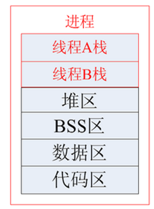
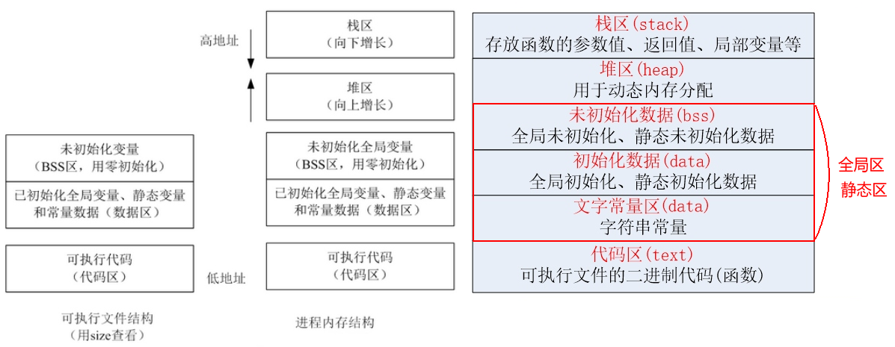
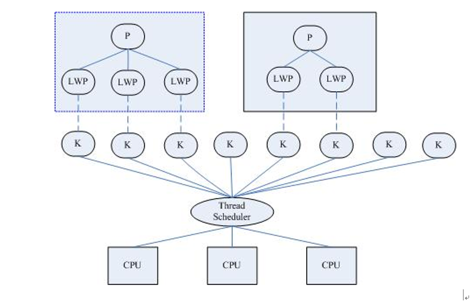
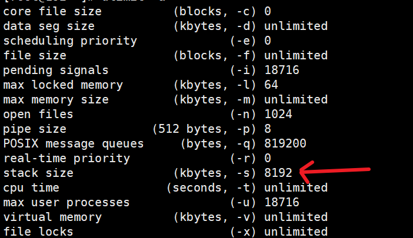

# 线程

## 线程简介

### 概念

在许多经典的操作系统教科书中，总是把进程定义为程序的执行实例，它并不执行什么, 只是维护应用程序所需的各种资源，而线程则是真正的执行实体。

所以，线程是轻量级的进程（LWP：light weight process），在Linux环境下线程的本质仍是进程。

为了让进程完成一定的工作，进程必须至少包含一个线程。





进程，直观点说，保存在硬盘上的程序运行以后，会在内存空间里形成一个独立的内存体，这个内存体有自己的地址空间，有自己的堆，上级挂靠单位是操作系统。操作系统会以进程为单位，分配系统资源，所以我们也说，**进程是CPU分配资源的最小单位**。

线程存在于进程当中(进程可以认为是线程的容器)，是**操作系统调度执行的最小单位**。说通俗点，线程就是干活的。

进程是具有一定独立功能的程序关于某个数据集合上的一次运行活动，进程是系统进行资源分配和调度的一个独立单位。

线程是进程的一个实体，是 CPU 调度和分派的基本单位，它是比进程更小的能独立运行的基本单位。线程自己基本上不拥有系统资源，只拥有一点在运行中必不可少的资源（**如程序计数器，一组寄存器和栈**），但是它可与同属一个进程的其他的线程**共享进程所拥有的全部资源**。

如果说进程是一个资源管家，负责从主人那里要资源的话，那么线程就是干活的苦力。一个管家必须完成一项工作，就需要最少一个苦力，也就是说，一个进程最少包含一个线程，也可以包含多个线程。苦力要干活，就需要依托于管家，所以说一个线程，必须属于某一个进程。

进程有自己的地址空间，线程使用进程的地址空间，也就是说，进程里的资源，线程都是有权访问的，比如说堆啊，栈啊，静态存储区什么的。

总结：

> 进程是操作系统分配资源的最小单位
>
> 线程是操作系统调度的最小单位

### 线程特点

当 Linux 最初开发时，在内核中并不能真正支持线程。但是它的确可以通过 clone() 系统调用将进程作为可调度的实体。这个调用创建了调用进程（calling process）的一个拷贝，这个拷贝与调用进程共享相同的地址空间。

类Unix系统中，早期是没有“线程”概念的，80年代才引入，借助进程机制实现出了线程的概念。

 

因此在这类系统中，进程和线程关系密切：

1) 线程是轻量级进程(light-weight process)，也有PCB，**创建线程使用的底层函数和进程一样，都是clone**
2) 从内核里看进程和线程是一样的，都有各自不同的PCB.
3) 进程可以蜕变成线程
4) 在linux下，线程最是小的执行单位；进程是最小的分配资源单位



查看指定进程的LWP号：

> ps  -Lf  pid

实际上，无论是创建进程的fork，还是创建线程的pthread_create，底层实现都是调用同一个内核函数 clone 。

Ø **如果复制对方的地址空间，那么就产出一个“进程”**；

Ø 如果共享对方的地址空间，就产生一个“线程”。

Linux内核是不区分进程和线程的, 只在用户层面上进行区分。所以，**线程所有操作函数 pthread_* 是库函数，而非系统调用**。

### 线程共享与非共享的资源

- 共享资源

  > 1) 文件描述符表
  > 2) 每种信号的处理方式
  > 3) 当前工作目录
  > 4) 用户ID和组ID
  >
  > 内存地址空间 (.text/.data/.bss/heap/共享库)

- 非共享资源

  > 1) 线程id
  > 2) 处理器现场和栈指针(内核栈)
  > 3) 独立的栈空间(用户空间栈)
  > 4) errno变量
  > 5) 信号屏蔽字
  > 6) 调度优先级

### 线程的优缺点

**优点：**

> 提高程序并发性
>
> 开销小
>
> 数据通信、共享数据方便


**缺点：**

> 库函数，不稳定
>
> 调试、编写困难、gdb不支持
>
> 对信号支持不好

优点相对突出，缺点均不是硬伤。Linux下由于实现方法导致进程、线程差别不是很大。

## 线程操作API

### 线程号

就像每个进程都有一个进程号一样，每个线程也有一个线程号。进程号在整个系统中是唯一的，但线程号不同，线程号只在它所属的进程环境中有效。

进程号用 pid_t 数据类型表示，是一个非负整数。线程号则用 pthread_t 数据类型来表示，Linux 使用无符号长整数表示。

有的系统在实现pthread_t 的时候，用一个结构体来表示，**所以在可移植的操作系统实现不能把它做为整数处理**。


1.pthread_self函数：

```c++
#include <pthread.h>

pthread_t pthread_self(void);
功能：
    获取线程号。
参数：
    无
返回值：
    调用线程的线程 ID 。
    
```

 

2.pthread_equal函数:

```
int pthread_equal(pthread_t t1, pthread_t t2);
功能：
    判断线程号 t1 和 t2 是否相等。为了方便移植，尽量使用函数来比较线程 ID。
参数：
    t1，t2：待判断的线程号。
返回值：
    相等：  非 0
    不相等：0
```

注意不能使用他t1 == t2来判断两个线程是否相等，因为pthread可能是结构体

### 线程的创建

pthread_create函数：

```c++
#include <pthread.h>

int pthread_create(pthread_t *thread,
            const pthread_attr_t *attr,
            void *(*start_routine)(void *),
            void *arg );
功能：
    创建一个线程。
参数：
    thread：线程标识符地址。
    attr：线程属性结构体地址，通常设置为 NULL。
    start_routine：线程函数的入口地址。
    arg：传给线程函数的参数。
返回值：
    成功：0
    失败：非 0
```

在一个线程中调用pthread_create()创建新的线程后，当前线程从pthread_create()返回继续往下执行，而新的线程所执行的代码由我们传给pthread_create的函数指针start_routine决定。

由于pthread_create的错误码不保存在errno中，因此不能直接用perror()打印错误信息，可以先用strerror()把错误码转换成错误信息再打印。

**参考程序**

```c++

// 回调函数
void *thread_fun(void * arg)
{
    sleep(1);
    int num = *((int *)arg);
    printf("int the new thread: num = %d\n", num);

    return NULL;
}

int main()
{
    pthread_t tid;
    int test = 100;

    // 返回错误号
    int ret = pthread_create(&tid, NULL, thread_fun, (void *)&test);
    if (ret != 0)
    {
        printf("error number: %d\n", ret);
        // 根据错误号打印错误信息
        printf("error information: %s\n", strerror(ret));
    }

    while (1);

    return 0;
}
```

### 线程资源的回收

pthread_join函数：

```c++
#include <pthread.h>

int pthread_join(pthread_t thread, void **retval);
功能：
    等待线程结束（此函数会阻塞），并回收线程资源，类似进程的 wait() 函数。如果线程已经结束，那么该函数会立即返回。
参数：
    thread：被等待的线程号。
    retval：用来存储线程函数结束所返回指针的地址。
返回值：
    成功：0
    失败：非 0
```

因为线程函数只能返回一个地址，**所以可以通过将状态返回值的地址返回给主线程，但注意返回值的地址一定要是全局静态区的数据，不能是栈的数据，因为栈中变量的地址会在函数结束后销毁**

**参考程序**

```c++

void *thead(void *arg)
{
    static int num = 123; //静态变量

    printf("after 2 seceonds, thread will return\n");
    sleep(2);

    return &num;
}

int main()
{
    pthread_t tid;
    int ret = 0;
    void *value = NULL;

    // 创建线程
    pthread_create(&tid, NULL, thead, NULL);


    // 等待线程号为 tid 的线程，如果此线程结束就回收其资源
    // &value保存线程退出的返回值
    pthread_join(tid, &value);

    printf("value = %d\n", *((int *)value));

    return 0;
}
```

调用该函数的线程将挂起等待，直到id为thread的线程终止。thread线程以不同的方法终止，通过pthread_join得到的终止状态是不同的，总结如下：

1) 如果thread线程通过return返回，retval所指向的单元里存放的是thread线程函数的返回值。
2) 如果thread线程被别的线程调用pthread_cancel异常终止掉，retval所指向的单元里存放的是常数PTHREAD_CANCELED。
3) 如果thread线程是自己调用pthread_exit终止的，retval所指向的单元存放的是传给pthread_exit的参数。

### 线程分离

一般情况下，线程终止后，其终止状态一直保留到其它线程调用pthread_join获取它的状态为止。但是线程也可以被置为detach状态，这样的线程一旦终止就立刻回收它占用的所有资源，而不保留终止状态。

**不能对一个已经处于detach状态的线程调用pthread_join，这样的调用将返回EINVAL错误。也就是说，如果已经对一个线程调用了pthread_detach就不能再调用pthread_join了。**

```c++

#include <pthread.h>

int pthread_detach(pthread_t thread);
功能：
    使调用线程与当前进程分离，分离后不代表此线程不依赖与当前进程，线程分离的目的是将线程资源的回收工作交由系统自动来完成，也就是说当被分离的线程结束之后，系统会自动回收它的资源。所以，此函数不会阻塞。
参数：
    thread：线程号。
返回值：
    成功：0
    失败：非0
```

### 线程退出

在进程中我们可以调用exit函数或_exit函数来结束进程（如果在线程中调用exit则整个进程都会退出），在一个线程中我们可以通过以下三种在不终止整个进程的情况下停止它的控制流。

- 线程从执行函数中返回。
- 线程调用pthread_exit退出线程。
- 线程可以被同一进程中的其它线程取消。

pthread_exit函数：

```c
#include <pthread.h>

void pthread_exit(void *retval);
功能：
    退出调用线程。一个进程中的多个线程是共享该进程的数据段，因此，通常线程退出后所占用的资源并不会释放。
参数：
    retval：存储线程退出状态的指针。
返回值：无  

```

参考程序:

```c++
void *thread(void *arg)
{
    static int num = 123; //静态变量
    int i = 0;
    while (1)
    {
        printf("I am runing\n");
        sleep(1);
        i++;
        if (i == 3)
        {
            pthread_exit((void *)&num);
            // return &num;
        }
    }

    return NULL;
}

int main(int argc, char *argv[])
{
    int ret = 0;
    pthread_t tid;
    void *value = NULL;

    pthread_create(&tid, NULL, thread, NULL);


    pthread_join(tid, &value);
    printf("value = %d\n", *(int *)value);

    return 0;
}

```

### 线程取消

```c++
#include <pthread.h>

int pthread_cancel(pthread_t thread);
功能：
    杀死(取消)线程
参数：
    thread : 目标线程ID。
返回值：
    成功：0
    失败：出错编号
```

注意：线程的取消并不是实时的（就是你调用了它，并不会马上取消一个线程），而又一定的延时。需要等待线程到达某个取消点(检查点)。

类似于玩游戏存档，必须到达指定的场所(存档点，如：客栈、仓库、城里等)才能存储进度。

杀死线程也不是立刻就能完成，必须要到达取消点。

取消点：是线程检查是否被取消，并按请求进行动作的一个位置。通常是一些系统调用creat，open，pause，close，read，write..... 执行命令**man 7 pthreads**可以查看具备这些取消点的系统调用列表。

可粗略认为一个系统调用(进入内核)即为一个取消点。

参考程序:

```c++
void *thread_cancel(void *arg)
{
    while (1)
    {
        pthread_testcancel(); //设置取消点
    }
    return NULL;
}

int main()
{
    pthread_t tid;
    pthread_create(&tid, NULL, thread_cancel, NULL); //创建线程

    sleep(3);                   //3秒后
    pthread_cancel(tid); //取消tid线程

    pthread_join(tid, NULL);

    return 0;
}
```

## 线程属性(了解)

栈大小可以通过ulimit -a来查看，为8M

 

Linux下线程的属性是可以根据实际项目需要，进行设置，之前我们讨论的线程都是采用线程的默认属性，默认属性已经可以解决绝大多数开发时遇到的问题。

如我们对程序的性能提出更高的要求那么需要设置线程属性，比如可以通过设置线程栈的大小来降低内存的使用，增加最大线程个数。

```
typedef struct
{
    int             etachstate;     //线程的分离状态
    int             schedpolicy;    //线程调度策略
    struct sched_param  schedparam; //线程的调度参数
    int             inheritsched;   //线程的继承性
    int             scope;      //线程的作用域
    size_t          guardsize;  //线程栈末尾的警戒缓冲区大小
    int             stackaddr_set; //线程的栈设置
    void*           stackaddr;  //线程栈的位置
    size_t          stacksize;  //线程栈的大小
} pthread_attr_t;
```

主要结构体成员：

1) 线程分离状态
2) 线程栈大小（默认平均分配）
3) 线程栈警戒缓冲区大小（位于栈末尾）
4) 线程栈最低地址


属性值不能直接设置，须使用相关函数进行操作，初始化的函数为pthread_attr_init，这个函数必须在pthread_create函数之前调用。之后须用pthread_attr_destroy函数来释放资源。

线程属性主要包括如下属性：作用域（scope）、栈尺寸（stack size）、栈地址（stack address）、优先级（priority）、分离的状态（detached state）、调度策略和参数（scheduling policy and parameters）。默认的属性为非绑定、非分离、缺省的堆栈、与父进程同样级别的优先级。

### 属性的初始化与销毁

```c++
#include <pthread.h>

int pthread_attr_init(pthread_attr_t *attr);
功能：
    初始化线程属性函数，注意：应先初始化线程属性，再pthread_create创建线程
参数：
    attr：线程属性结构体
返回值：
    成功：0
    失败：错误号

int pthread_attr_destroy(pthread_attr_t *attr);
功能：
    销毁线程属性所占用的资源函数
参数：
    attr：线程属性结构体
返回值：
    成功：0
    失败：错误号
```

### 设置线程分离属性

线程的分离状态决定一个线程以什么样的方式来终止自己。

- 非分离状态：线程的默认属性是非分离状态，这种情况下，原有的线程等待创建的线程结束。只有当pthread_join()函数返回时，创建的线程才算终止，才能释放自己占用的系统资源。
- 分离状态：分离线程没有被其他的线程所等待，自己运行结束了，线程也就终止了，马上释放系统资源。应该根据自己的需要，选择适当的分离状态。

相关函数：

```
#include <pthread.h>

int pthread_attr_setdetachstate(pthread_attr_t *attr, int detachstate);
功能：设置线程分离状态
参数：
    attr：已初始化的线程属性
    detachstate：    分离状态
        PTHREAD_CREATE_DETACHED（分离线程）
        PTHREAD_CREATE_JOINABLE（非分离线程）
返回值：
    成功：0
    失败：非0

int pthread_attr_getdetachstate(const pthread_attr_t *attr, int *detachstate);
功能：获取线程分离状态
参数：
    attr：已初始化的线程属性
    detachstate：    分离状态
        PTHREAD_CREATE_DETACHED（分离线程）
        PTHREAD _CREATE_JOINABLE（非分离线程）
返回值：
    成功：0
    失败：非0

```

这里要注意的一点是，如果设置一个线程为分离线程，而这个线程运行又非常快，它很可能在pthread_create函数返回之前就终止了，它终止以后就可能将线程号和系统资源移交给其他的线程使用，这样调用pthread_create的线程就得到了错误的线程号。

要避免这种情况可以采取一定的同步措施，最简单的方法之一是可以在被创建的线程里调用pthread_cond_timedwait函数，让这个线程等待一会儿，留出足够的时间让函数pthread_create返回。

设置一段等待时间，是在多线程编程里常用的方法。但是注意不要使用诸如wait()之类的函数，它们是使整个进程睡眠，并不能解决线程同步的问题。

## 线程使用注意事项

1) 主线程退出其他线程不退出，主线程应调用pthread_exit
2) 避免僵尸线程

a) pthread_join

b) pthread_detach

c) pthread_create指定分离属性

被join线程可能在join函数返回前就释放完自己的所有内存资源，所以不应当返回被回收线程栈中的值**就是不要尝试获取被回收线程普通局部变量的值，比如返回一个整型变量a的地址，但是a的地址已经被释放，此时如果你用*p获取变量a存放的值可能是未知的，但是你可以使用全局变量或者静态局部变量**;

3) malloc和mmap申请的内存可以被其他线程释放
4) 应避免在多线程模型中调用fork，除非马上exec，子进程中只有调用fork的线程存在，其他线程t在子进程中均pthread_exit
5) 信号的复杂语义很难和多线程共存，应避免在多线程引入信号机制