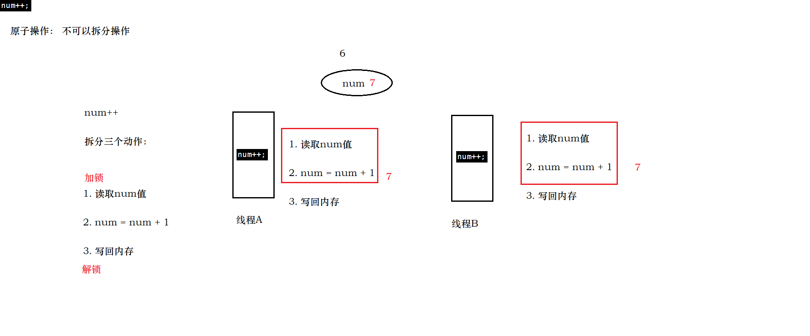
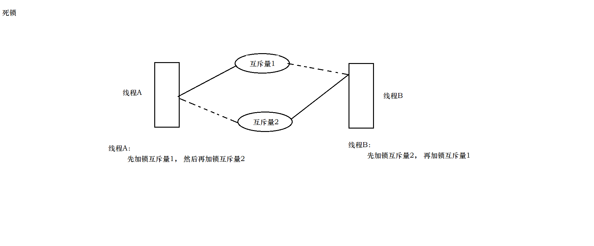
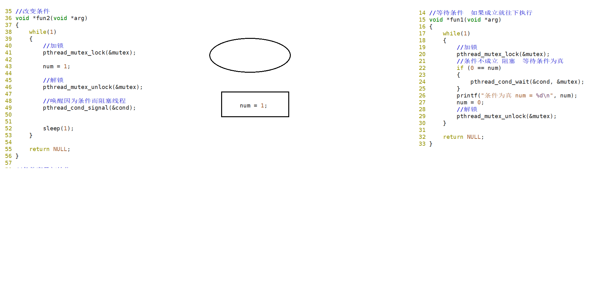
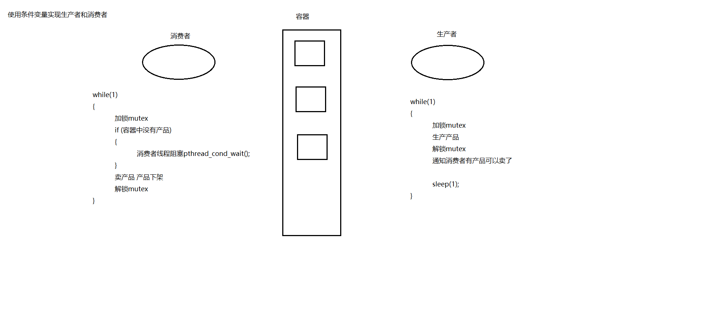
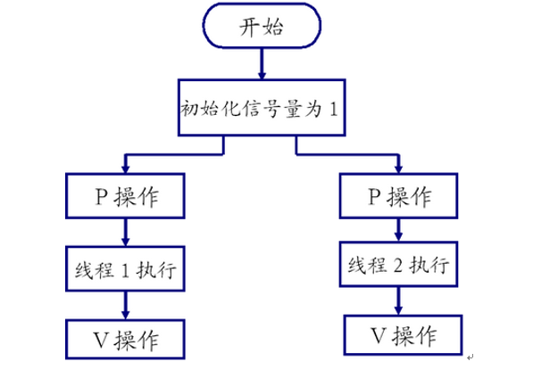
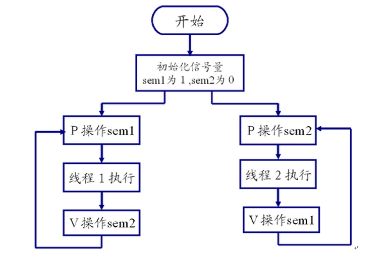
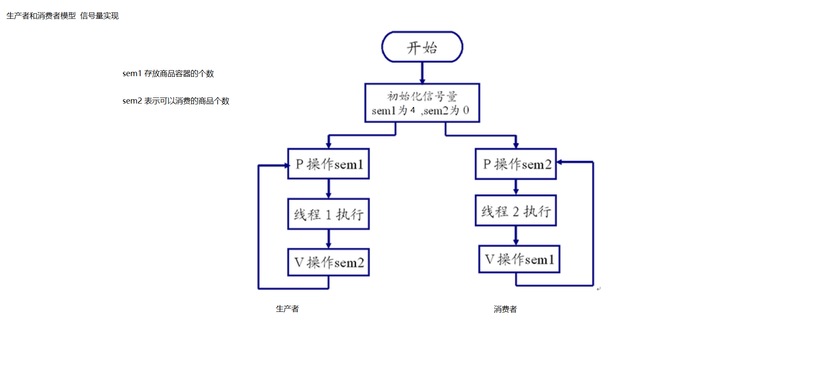
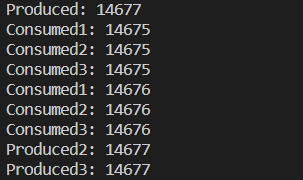

 

# 锁,条件变量,信号量

## 互斥锁

### 同步与互斥的概念

现代操作系统基本都是多任务操作系统，即同时有大量可调度实体在运行。在多任务操作系统中，同时运行的多个任务可能：

- 都需要访问/使用同一种资源
- 多个任务之间有依赖关系，某个任务的运行依赖于另一个任务

这两种情形是多任务编程中遇到的最基本的问题，也是多任务编程中的核心问题，同步和互斥就是用于解决这两个问题的。

**互斥：**是指散步在不同任务之间的若干程序片断，当某个任务运行其中一个程序片段时，其它任务就不能运行它们之中的任一程序片段，只能等到该任务运行完这个程序片段后才可以运行。最基本的场景就是：**一个公共资源同一时刻只能被一个进程或线程使用，多个进程或线程不能同时使用公共资源。**

**同步：**是指散步在不同任务之间的若干程序片断，它们的运行必须严格按照规定的某种先后次序来运行，这种先后次序依赖于要完成的特定的任务。最基本的场景就是：**两个或两个以上的进程或线程在运行过程中协同步调，按预定的先后次序运行。比如 A 任务的运行依赖于 B 任务产生的数据。**

显然，同步是一种更为复杂的互斥，而互斥是一种特殊的同步。也就是说互斥是两个任务之间不可以同时运行，他们会相互排斥，必须等待一个线程运行完毕，另一个才能运行，而同步也是不能同时运行，但他是必须要按照某种次序来运行相应的线程（也是一种互斥）！因此互斥具有唯一性和排它性，但互斥并不限制任务的运行顺序，即任务是无序的，而同步的任务之间则有顺序关系。

### 互斥锁的作用

在多任务操作系统中，同时运行的多个任务可能都需要使用同一种资源。这个过程有点类似于，公司部门里，我在使用着打印机打印东西的同时（还没有打印完），别人刚好也在此刻使用打印机打印东西，如果不做任何处理的话，打印出来的东西肯定是错乱的。

下面我们用程序模拟一下这个过程，线程一需要打印“ hello ”，线程二需要打印“ world ”，不加任何处理的话，打印出来的内容会错乱：

```c++
// 打印机，公共资源
void printer(char *str)
{
    while (*str != '\0')
    {
        putchar(*str);
        fflush(stdout);
        str++;
        sleep(1);
    }
    printf("\n");
}

// 线程一
void *thread_fun_1(void *arg)
{
    char *str = "hello";
    printer(str); //打印
}

// 线程二
void *thread_fun_2(void *arg)
{
    char *str = "world";
    printer(str); //打印
}

int main()
{
    pthread_t tid1, tid2;

    // 创建 2 个线程
    pthread_create(&tid1, NULL, thread_fun_1, NULL);
    pthread_create(&tid2, NULL, thread_fun_2, NULL);

    // 等待线程结束，回收其资源
    pthread_join(tid1, NULL);
    pthread_join(tid2, NULL);

    return 0;
}
```

实际上，打印机是有做处理的，我在打印着的时候别人是不允许打印的，只有等我打印结束后别人才允许打印。这个过程有点类似于，把打印机放在一个房间里，给这个房间安把锁，这个锁默认是打开的。当 A 需要打印时，他先过来检查这把锁有没有锁着，没有的话就进去，同时上锁在房间里打印。而在这时，刚好 B 也需要打印，B 同样先检查锁，发现锁是锁住的，他就在门外等着。而当 A 打印结束后，他会开锁出来，这时候 B 才进去上锁打印。


**如果没有锁可能会出现下面这样的情况**




### 互斥锁相关函数

而在线程里也有这么一把锁：互斥锁（mutex），也叫互斥量，互斥锁是一种简单的加锁的方法来控制对共享资源的访问，互斥锁只有两种状态,即**加锁**( lock )和**解锁**( unlock )。


互斥锁的操作流程如下：

1）在访问共享资源后临界区域前，对互斥锁进行加锁。

2）在访问完成后释放互斥锁导上的锁。

3）对互斥锁进行加锁后，任何其他试图再次对互斥锁加锁的线程将会被阻塞，直到锁被释放。

互斥锁的数据类型是： pthread_mutex_t。

1. ### **pthread_mutex_init 函数**

   > 初始化互斥锁：
   >
   > ```
   > #include <pthread.h>
   > 
   > int pthread_mutex_init(pthread_mutex_t *restrict mutex,
   >     const pthread_mutexattr_t *restrict attr);
   > 功能：
   >     初始化一个互斥锁。
   > 参数：
   >     mutex：互斥锁地址。类型是 pthread_mutex_t 。
   >     attr：设置互斥量的属性，通常可采用默认属性，即可将 attr 设为 NULL。
   > 
   >     可以使用宏 PTHREAD_MUTEX_INITIALIZER 静态初始化互斥锁，比如：
   >     pthread_mutex_t  mutex = PTHREAD_MUTEX_INITIALIZER;
   > 
   > 这种方法等价于使用 NULL 指定的 attr 参数调用 pthread_mutex_init() 来完成动态初始化，不同之处在于 PTHREAD_MUTEX_INITIALIZER 宏不进行错误检查。
   > 
   > 返回值：
   >     成功：0，成功申请的锁默认是打开的。
   >     失败：非 0 错误码
   > ```
   >
   > 
   >
   > > restrict，C语言中的一种类型[限定符](https://baike.baidu.com/item/限定符/1924249)（Type Qualifiers），用于告诉编译器，对象已经被指针所引用，不能通过除该指针外所有其他直接或间接的方式修改该对象的内容。

2. ### pthread_mutex_destroy函数

   > ```c++
   > #include <pthread.h>
   > 
   > int pthread_mutex_destroy(pthread_mutex_t *mutex);
   > 功能：
   >     销毁指定的一个互斥锁。互斥锁在使用完毕后，必须要对互斥锁进行销毁，以释放资源。
   > 参数：
   >     mutex：互斥锁地址。
   > 返回值：
   >     成功：0
   >     失败：非 0 错误码
   > ```
   >
   > 

3. ### pthread_mutex_lock函数

   > ```c++
   > #include <pthread.h>
   > 
   > int pthread_mutex_lock(pthread_mutex_t *mutex);
   > 功能：
   >     对互斥锁上锁，若互斥锁已经上锁，则调用者阻塞，直到互斥锁解锁后再上锁。
   > 参数：
   >     mutex：互斥锁地址。
   > 返回值：
   >     成功：0
   >     失败：非 0 错误码
   > 
   > int pthread_mutex_trylock(pthread_mutex_t *mutex);
   >    调用该函数时，若互斥锁未加锁，则上锁，返回 0；
   >    若互斥锁已加锁，则函数直接返回失败，即 EBUSY。
   > ```
   >
   > 

4. **pthread_mutex_unlock函数**

   > ```c++
   > #include <pthread.h>
   > 
   > int pthread_mutex_unlock(pthread_mutex_t *mutex);
   > 功能：
   >     对指定的互斥锁解锁。
   > 参数：
   >     mutex：互斥锁地址。
   > 返回值：
   >     成功：0
   >     失败：非0错误码
   > ```
   >
   > 

### 测试程序

```c++
pthread_mutex_t mutex; //互斥锁

// 打印机
void printer(char *str)
{
    pthread_mutex_lock(&mutex); //上锁
    while (*str != '\0')
    {
        putchar(*str);
        fflush(stdout);
        str++;
        sleep(1);
    }
    printf("\n");
    pthread_mutex_unlock(&mutex); //解锁
}

// 线程一
void *thread_fun_1(void *arg)
{
    char *str = "hello";
    printer(str); //打印
}

// 线程二
void *thread_fun_2(void *arg)
{
    char *str = "world";
    printer(str); //打印
}

int main(void)
{
    pthread_t tid1, tid2;

    pthread_mutex_init(&mutex, NULL); //初始化互斥锁

    // 创建 2 个线程
    pthread_create(&tid1, NULL, thread_fun_1, NULL);
    pthread_create(&tid2, NULL, thread_fun_2, NULL);

    // 等待线程结束，回收其资源
    pthread_join(tid1, NULL);
    pthread_join(tid2, NULL);

    pthread_mutex_destroy(&mutex); //销毁互斥锁

    return 0;
}
```

### 死锁

**1）什么是死锁**

死锁是指两个或两个以上的进程在执行过程中，由于竞争资源或者由于彼此通信而造成的一种阻塞的现象，若无外力作用，它们都将无法推进下去。此时称系统处于死锁状态或系统产生了死锁，这些永远在互相等待的进程称为死锁进程。

 

**2）死锁引起的原因**

竞争不可抢占资源引起死锁

也就是我们说的第一种情况，而这都在等待对方占有的不可抢占的资源。

竞争可消耗资源引起死锁

有p1，p2，p3三个进程，p1向p2发送消息并接受p3发送的消息，p2向p3发送消息并接受p1的消息，p3向p1发送消息并接受p2的消息，如果设置是先接到消息后发送消息，则所有的消息都不能发送，这就造成死锁。

进程推进顺序不当引起死锁

有进程p1，p2，都需要资源A，B，本来可以p1运行A --> p1运行B --> p2运行A --> p2运行B，但是顺序换了，p1运行A时p2运行B，容易发生第一种死锁。互相抢占资源。

**3）死锁的必要条件**

互斥条件

某资源只能被一个进程使用，其他进程请求该资源时，只能等待，直到资源使用完毕后释放资源。

请求和保持条件

程序已经保持了至少一个资源，但是又提出了新要求，而这个资源被其他进程占用，自己占用资源却保持不放。

不可抢占条件

进程已获得的资源没有使用完，不能被抢占。

循环等待条件

必然存在一个循环链。

**4）处理死锁的思路**

预防死锁

破坏死锁的四个必要条件中的一个或多个来预防死锁。

避免死锁

和预防死锁的区别就是，在资源动态分配过程中，用某种方式防止系统进入不安全的状态。

检测死锁

运行时出现死锁，能及时发现死锁，把程序解脱出来

解除死锁

发生死锁后，解脱进程，通常撤销进程，回收资源，再分配给正处于阻塞状态的进程。

**5）预防死锁的方法**

***破坏请求和保持条件\***

协议1：

所有进程开始前，必须一次性地申请所需的所有资源，这样运行期间就不会再提出资源要求，破坏了请求条件，即使有一种资源不能满足需求，也不会给它分配正在空闲的资源，这样它就没有资源，就破坏了保持条件，从而预防死锁的发生。

协议2：

允许一个进程只获得初期的资源就开始运行，然后再把运行完的资源释放出来。然后再请求新的资源。

**破坏不可抢占条件**

当一个已经保持了某种不可抢占资源的进程，提出新资源请求不能被满足时，它必须释放已经保持的所有资源，以后需要时再重新申请。

**破坏循环等待条件**

对系统中的所有资源类型进行线性排序，然后规定每个进程必须按序列号递增的顺序请求资源。假如进程请求到了一些序列号较高的资源，然后有请求一个序列较低的资源时，必须先释放相同和更高序号的资源后才能申请低序号的资源。多个同类资源必须一起请求。


**6）死锁的场景**




## 读写锁

### 读写锁概述

当有一个线程已经持有互斥锁时，互斥锁将所有试图进入临界区的线程都阻塞住。但是考虑一种情形，当前持有互斥锁的线程只是要读访问共享资源，而同时有其它几个线程也想读取这个共享资源，但是由于互斥锁的排它性，所有其它线程都无法获取锁，也就无法读访问共享资源了，但是实际上多个线程同时读访问共享资源并不会导致问题。

在对数据的读写操作中，更多的是读操作，写操作较少，例如对数据库数据的读写应用。为了满足当前能够允许多个读出，但只允许一个写入的需求，线程提供了**读写锁**来实现。

读写锁的特点如下：

1）如果有其它线程读数据，则允许其它线程执行读操作，但不允许写操作。

2）如果有其它线程写数据，则其它线程都不允许读、写操作。


读写锁分为读锁和写锁，规则如下：

1）如果某线程申请了读锁，其它线程可以再申请读锁，但不能申请写锁。

2）如果某线程申请了写锁，其它线程不能申请读锁，也不能申请写锁。

 

POSIX 定义的读写锁的数据类型是： pthread_rwlock_t。

### 读写锁相关函数

1. ### pthread_rwlock_init函数

   > ```c++
   > include <pthread.h>
   > 
   > int pthread_rwlock_init(pthread_rwlock_t *restrict rwlock,
   >     const pthread_rwlockattr_t *restrict attr);
   > 功能：
   >     用来初始化 rwlock 所指向的读写锁。
   > 
   > 参数：
   >     rwlock：指向要初始化的读写锁指针。
   >     attr：读写锁的属性指针。如果 attr 为 NULL 则会使用默认的属性初始化读写锁，否则使用指定的 attr 初始化读写锁。
   > 
   >     可以使用宏 PTHREAD_RWLOCK_INITIALIZER 静态初始化读写锁，比如：
   >     pthread_rwlock_t my_rwlock = PTHREAD_RWLOCK_INITIALIZER;
   > 
   >     这种方法等价于使用 NULL 指定的 attr 参数调用 pthread_rwlock_init() 来完成动态初始化，不同之处在于PTHREAD_RWLOCK_INITIALIZER 宏不进行错误检查。
   > 
   > 返回值：
   >     成功：0，读写锁的状态将成为已初始化和已解锁。
   >     失败：非 0 错误码。
   > ```
   >
   > 


2. ### pthread_rwlock_destroy函数

   > ```c++
   > #include <pthread.h>
   > 
   > int pthread_rwlock_destroy(pthread_rwlock_t *rwlock);
   > 功能：
   >     用于销毁一个读写锁，并释放所有相关联的资源（所谓的所有指的是由 pthread_rwlock_init() 自动申请的资源） 。
   > 参数：
   >     rwlock：读写锁指针。
   > 返回值：
   >     成功：0
   >     失败：非 0 错误码
   > ```
   >
   > 

3. ### pthread_rwlock_rdlock函数

   > ```c++
   > #include <pthread.h>
   > 
   > int pthread_rwlock_rdlock(pthread_rwlock_t *rwlock);
   > 功能：
   >     以阻塞方式在读写锁上获取读锁（读锁定）。
   >     如果没有写者持有该锁，--并且没有写者阻塞在该锁上--，则调用线程会获取读锁。
   >     如果调用线程未获取读锁，则它将阻塞直到它获取了该锁。一个线程可以在一个读写锁上多次执行读锁定。
   >     线程可以成功调用 pthread_rwlock_rdlock() 函数 n 次，但是之后该线程必须调用 pthread_rwlock_unlock() 函数 n 次才能解除锁定。
   > 参数：
   >     rwlock：读写锁指针。
   > 返回值：
   >     成功：0
   >     失败：非 0 错误码
   > 
   > int pthread_rwlock_tryrdlock(pthread_rwlock_t *rwlock);
   >    用于尝试以非阻塞的方式来在读写锁上获取读锁。
   >    如果有任何的写者持有该锁或有写者阻塞在该读写锁上，则立即失败返回。
   > ```
   >
   > 

4. ### pthread_rwlock_wrlock函数

   > ```c++
   > #include <pthread.h>
   > 
   > int pthread_rwlock_wrlock(pthread_rwlock_t *rwlock);
   > 功能：
   >     在读写锁上获取写锁（写锁定）。
   >     如果没有写者持有该锁，并且没有读者持有该锁，则调用线程会获取写锁。
   >     如果调用线程未获取写锁，则它将阻塞直到它获取了该锁。
   > 参数：
   >     rwlock：读写锁指针。
   > 返回值：
   >     成功：0
   >     失败：非 0 错误码
   > 
   > int pthread_rwlock_trywrlock(pthread_rwlock_t *rwlock);
   >    用于尝试以非阻塞的方式来在读写锁上获取写锁。
   >    如果有任何的读者或写者持有该锁，则立即失败返回。
   > ```
   >
   > 

5. ### pthread_rwlock_unlock函数

   > ```c++
   > 
   > #include <pthread.h>
   > 
   > int pthread_rwlock_unlock(pthread_rwlock_t *rwlock);
   > 功能：
   >     无论是读锁或写锁，都可以通过此函数解锁。
   > 参数：
   >     rwlock：读写锁指针。
   > 返回值：
   >     成功：0
   >     失败：非 0 错误码
   > 
   > ```
   >
   > 

### 测试程序

下面是一个使用读写锁来实现4个线程读写一段数据是实例。

在此示例程序中，共创建了4个线程，其中两个线程用来写入数据，两个线程用来读取数据。当某个线程读操作时，其他线程允许读操作，却不允许写操作；当某个线程写操作时，其它线程都不允许读或写操作。

```c++
pthread_rwlock_t rwlock; //读写锁
int num = 1;

//读操作，其他线程允许读操作，却不允许写操作
void *fun1(void *arg)
{
    while (1)
    {
        pthread_rwlock_rdlock(&rwlock);
        printf("read num first===%d\n", num);
        pthread_rwlock_unlock(&rwlock);
        sleep(1);
    }
}

//读操作，其他线程允许读操作，却不允许写操作
void *fun2(void *arg)
{
    while (1)
    {
        pthread_rwlock_rdlock(&rwlock);
        printf("read num second===%d\n", num);
        pthread_rwlock_unlock(&rwlock);
        sleep(2);
    }
}

//写操作，其它线程都不允许读或写操作
void *fun3(void *arg)
{
    while (1)
    {

        pthread_rwlock_wrlock(&rwlock);
        num++;
        printf("write thread first\n");
        pthread_rwlock_unlock(&rwlock);
        sleep(2);
    }
}

//写操作，其它线程都不允许读或写操作
void *fun4(void *arg)
{
    while (1)
    {

        pthread_rwlock_wrlock(&rwlock);
        num++;
        printf("write thread second\n");
        pthread_rwlock_unlock(&rwlock);
        sleep(1);
    }
}

int main()
{
    pthread_t ptd1, ptd2, ptd3, ptd4;

    pthread_rwlock_init(&rwlock, NULL);//初始化一个读写锁

    //创建线程
    pthread_create(&ptd1, NULL, fun1, NULL);
    pthread_create(&ptd2, NULL, fun2, NULL);
    pthread_create(&ptd3, NULL, fun3, NULL);
    pthread_create(&ptd4, NULL, fun4, NULL);

    //等待线程结束，回收其资源
    pthread_join(ptd1, NULL);
    pthread_join(ptd2, NULL);
    pthread_join(ptd3, NULL);
    pthread_join(ptd4, NULL);

    pthread_rwlock_destroy(&rwlock);//销毁读写锁

    return 0;
}

```

## 条件变量

### 条件变量概述

与互斥锁不同，条件变量是用来等待而不是用来上锁的，**条件变量本身不是锁**！

条件变量用来自动阻塞一个线程，直到某特殊情况发生为止。通常条件变量和互斥锁同时使用。

条件变量的两个动作：

- 条件不满, 阻塞线程
- 当条件满足, 通知阻塞的线程开始工作

条件变量的类型: pthread_cond_t。


**条件变量案例分析**：



### 条件变量相关函数

1. **pthread_cond_init函数**

   > ```c++
   > #include <pthread.h>
   > 
   > int pthread_cond_init(pthread_cond_t *restrict cond,
   >     const pthread_condattr_t *restrict attr);
   > 功能：
   >     初始化一个条件变量
   > 参数：
   >     cond：指向要初始化的条件变量指针。
   >     attr：条件变量属性，通常为默认值，传NULL即可
   >         也可以使用静态初始化的方法，初始化条件变量：
   >         pthread_cond_t cond = PTHREAD_COND_INITIALIZER;
   > 返回值：
   >     成功：0
   >     失败：非0错误号
   > ```
   >
   > 

2. **pthread_cond_destroy函数**

   > ```c++
   > 
   > #include <pthread.h>
   > 
   > int pthread_cond_destroy(pthread_cond_t *cond);
   > 功能：
   >     销毁一个条件变量
   > 参数：
   >     cond：指向要初始化的条件变量指针
   > 返回值：
   >     成功：0
   >     失败：非0错误号
   > ```
   >
   > 

3. **pthread_cond_wait函数**

   > ```c++
   > #include <pthread.h>
   > 
   > int pthread_cond_wait(pthread_cond_t *restrict cond,
   >     pthread_mutex_t *restrict mutex);
   > 功能：
   >     阻塞等待一个条件变量
   >     a) 阻塞线程直到条件变量cond（参1）满足
   >     b) 释放已掌握的互斥锁（解锁互斥量）相当于pthread_mutex_unlock(&mutex);
   >             a) b) 两步为一个原子操作。
   >     c) 当被唤醒，pthread_cond_wait函数返回时，解除阻塞并重新申请获取互斥锁pthread_mutex_lock(&mutex);（被pthread_signal函数唤醒，然后尝试去获取互斥锁）
   > 
   > 参数：
   >     cond：指向要初始化的条件变量指针
   >     mutex：互斥锁
   > 
   > 返回值：
   >     成功：0
   >     失败：非0错误号
   > 
   > int pthread_cond_timedwait(pthread_cond_t *restrict cond,
   >     pthread_mutex_t *restrict mutex,
   >     const struct
   >                            .*restrict abstime);
   > 功能：
   >     限时等待一个条件变量
   > 
   > 参数：
   >     cond：指向要初始化的条件变量指针
   >     mutex：互斥锁
   >     abstime：绝对时间
   > 
   > 返回值：
   >     成功：0
   >     失败：非0错误号
   >     
   > ```
   >
   > ```c++
   > abstime补充说明：
   > 
   > struct timespec {
   >     time_t tv_sec;      /* seconds */ // 秒
   >     long   tv_nsec; /* nanosecondes*/ // 纳秒
   > }
   > 
   > time_t cur = time(NULL);        //获取当前时间。
   > struct timespec t;              //定义timespec 结构体变量t
   > t.tv_sec = cur + 1;             // 定时1秒
   > pthread_cond_timedwait(&cond, &t);
   > ```
   >
   > 

4. **pthread_cond_signal函数**

   > 唤醒至阻塞在条件变量上的线程
   >
   > ```
   > #include <pthread.h>
   > 
   > int pthread_cond_signal(pthread_cond_t *cond);
   > 功能：
   >     唤醒至少一个阻塞在条件变量上的线程
   > 参数：
   >     cond：指向要初始化的条件变量指针
   > 返回值：
   >     成功：0
   >     失败：非0错误号
   > 
   > int pthread_cond_broadcast(pthread_cond_t *cond);
   > 功能：
   >     唤醒全部阻塞在条件变量上的线程
   > 参数：
   >     cond：指向要初始化的条件变量指针
   > 返回值：
   >     成功：0
   >     失败：非0错误号
   > ```

### 生产者消费者条件变量模型

线程同步典型的案例即为生产者消费者模型，而借助条件变量来实现这一模型，是比较常见的一种方法。

假定有两个线程，一个模拟生产者行为，一个模拟消费者行为。两个线程同时操作一个共享资源（一般称之为汇聚），生产向其中添加产品，消费者从中消费掉产品。



```c++
// 节点结构
typedef struct node
{
    int data;
    struct node* next;//这里只能使用struct node来定义指针变量，同时只能是指针变量而不能是普通结构体变量，因为如果定义为普通变量是需要按大小分配地址，但是在next这里还不清楚该结构体的大小
}Node;

// 永远指向链表头部的指针
Node* head = NULL;

// 线程同步 - 互斥锁
pthread_mutex_t mutex;
// 阻塞线程 - 条件变量类型的变量
pthread_cond_t cond;

// 生产者
void* producer(void* arg)
{
    while (1)
    {
        // 创建一个链表的节点
        Node* pnew = (Node*)malloc(sizeof(Node));
        // 节点的初始化
        pnew->data = rand() % 1000; // 0-999

        // 使用互斥锁保护共享数据，如果不加锁那么同时添加数据和删除数据将会变得不可知
        pthread_mutex_lock(&mutex);
        // 指针域
        pnew->next = head;
        head = pnew;
        printf("====== produce: %lu, %d\n", pthread_self(), pnew->data);
        pthread_mutex_unlock(&mutex);

        // 通知阻塞的消费者线程，解除阻塞
        pthread_cond_signal(&cond);

        sleep(rand() % 3);
    }
    return NULL;
}

void* customer(void* arg)
{
    while (1)
    {
        pthread_mutex_lock(&mutex);
        // 判断链表是否为空
        if (head == NULL)
        {
            // 线程阻塞
            // 该函数会对互斥锁解锁
            pthread_cond_wait(&cond, &mutex);
            // 解除阻塞之后，对互斥锁做加锁操作
        }
        // 链表不为空 - 删掉一个节点 - 删除头结点
        Node* pdel = head;
        head = head->next;
        printf("------ customer: %lu, %d\n", pthread_self(), pdel->data);
        free(pdel);
        pthread_mutex_unlock(&mutex);
    }
    return NULL;
}

int main(int argc, const char* argv[])
{
    pthread_t p1, p2;
    // init
    pthread_mutex_init(&mutex, NULL);
    pthread_cond_init(&cond, NULL);

    // 创建生产者线程
    pthread_create(&p1, NULL, producer, NULL);
    // 创建消费者线程
    pthread_create(&p2, NULL, customer, NULL);

    // 阻塞回收子线程
    pthread_join(p1, NULL);
    pthread_join(p2, NULL);

    pthread_mutex_destroy(&mutex);
    pthread_cond_destroy(&cond);

    return 0;
}
```

### 条件变量优缺点

相较于mutex而言，条件变量可以减少竞争。

如直接使用mutex，除了生产者、消费者之间要竞争互斥量以外，消费者之间也需要竞争互斥量，但如果汇聚（链表）中没有数据，消费者之间竞争互斥锁是无意义的。我开始只考虑只有一个生产者和消费者的情况显然不会在现实中存在

有了条件变量机制以后，只有生产者完成生产，才会引起消费者之间的竞争。提高了程序效率。


## 信号量

### 信号量概述

信号量广泛用于进程或线程间的同步和互斥，信号量本质上是一个非负的整数计数器，它被用来控制对公共资源的访问。

编程时可根据操作信号量值的结果判断是否对公共资源具有访问的权限，当信号量值大于 0 时，则可以访问，否则将阻塞。

PV 原语是对信号量的操作，一次 P 操作使信号量减１，一次 V 操作使信号量加１。

信号量主要用于进程或线程间的同步和互斥这两种典型情况。

信号量数据类型为：sem_t。

信号量用于互斥：



信号量用于同步：



如此操作就可以确定线程1执行后才执行线程2实现了线程之间同步

### 信号量相关函数

1. **sem_init函数**

   > 初始化信号量:
   >
   > ```
   > #include <semaphore.h>
   > 
   > int sem_init(sem_t *sem, int pshared, unsigned int value);
   > 功能：
   >     创建一个信号量并初始化它的值。一个无名信号量在被使用前必须先初始化。
   > 参数：
   >     sem：信号量的地址。
   >     pshared：等于 0，信号量在线程间共享（常用）；不等于0，信号量在进程间共享。
   >     value：信号量的初始值。
   > 返回值：
   >     成功：0
   >     失败： - 1
   > ```

2. **sem_destroy函数**

   > 销毁信号量：
   >
   > ```
   > #include <semaphore.h>
   > 
   > int sem_destroy(sem_t *sem);
   > 功能：
   >     删除 sem 标识的信号量。
   > 参数：
   >     sem：信号量地址。
   > 返回值：
   >     成功：0
   >     失败： - 1
   > 
   > ```

3. **信号量P操作（减1）**

   > ```c++
   > #include <semaphore.h>
   > 
   > int sem_wait(sem_t *sem);
   > 功能：
   >     将信号量的值减 1。操作前，先检查信号量（sem）的值是否为 0，若信号量为 0，此函数会阻塞，直到信号量大于 0 时才进行减 1 操作。
   > 参数：
   >     sem：信号量的地址。
   > 返回值：
   >     成功：0
   >     失败： - 1
   > 
   > int sem_trywait(sem_t *sem);
   >    以非阻塞的方式来对信号量进行减 1 操作。
   >    若操作前，信号量的值等于 0，则对信号量的操作失败，函数立即返回。
   > 
   > int sem_timedwait(sem_t *sem, const struct timespec *abs_timeout);
   >    限时尝试将信号量的值减 1
   >    abs_timeout：绝对时间
   > 
   > ```
   >
   > ```c++
   > abs_timeout补充说明：
   > 
   > struct timespec {
   >     time_t tv_sec;      /* seconds */ // 秒
   >     long   tv_nsec; /* nanosecondes*/ // 纳秒
   > }
   > 
   > time_t cur = time(NULL);        //获取当前时间。
   > struct timespec t;              //定义timespec 结构体变量t
   > t.tv_sec = cur + 1;             // 定时1秒
   > sem_timedwait(&cond, &t);
   > ```
   >
   > 

4. **信号量V操作（加1）**

   > ```c++
   > #include <semaphore.h>
   > 
   > int sem_post(sem_t *sem);
   > 功能：
   >     将信号量的值加 1 并发出信号唤醒等待线程（sem_wait()）。
   > 参数：
   >     sem：信号量的地址。
   > 返回值：
   >     成功：0
   >     失败：-1
   > ```
   >
   > 

5. **获取信号量的值**

   > ```c++
   > #include <semaphore.h>
   > 
   > int sem_getvalue(sem_t *sem, int *sval);
   > 功能：
   >     获取 sem 标识的信号量的值，保存在 sval 中。
   > 参数：
   >     sem：信号量地址。
   >     sval：保存信号量值的地址。
   > 返回值：
   >     成功：0
   >     失败：-1
   > ```
   >
   > 

### 信号量版本生产者消费者模型



信号量的示例：

```c++
#include <stdio.h>
#include <stdlib.h>
#include <pthread.h>
#include <semaphore.h>

#define BUFFER_SIZE 5

sem_t empty, full;
int buffer[BUFFER_SIZE];
int in = 0, out = 0;

void *producer(void *arg)
{
    int item = 1;
    while (1)
    {
        sem_wait(&empty);
        buffer[in] = item;
        printf("Produced: %d\n", item);
        item++;
        in = (in + 1) % BUFFER_SIZE;
        sem_post(&full);
    }
}

void *consumer(void *arg)
{
    int item;
    while (1)
    {
        sem_wait(&full);
        item = buffer[out];
        printf("Consumed: %d\n", item);
        out = (out + 1) % BUFFER_SIZE;
        sem_post(&empty);
    }
}

int main()
{
    pthread_t producer_thread, consumer_thread;

    sem_init(&empty, 0, BUFFER_SIZE);
    sem_init(&full, 0, 0);

    pthread_create(&producer_thread, NULL, producer, NULL);
    pthread_create(&consumer_thread, NULL, consumer, NULL);

    pthread_join(producer_thread, NULL);
    pthread_join(consumer_thread, NULL);

    sem_destroy(&empty);
    sem_destroy(&full);

    return 0;
}
```

这里有一个问题就是empty的值为3，full的值为2，那么两个线程都不会被阻塞，并发执行可能会同时调用printf，可能会导致打印出来的数据有问题，为了防止这个问题就是加锁，如下面这种情况就是两个线程同时执行的问题

