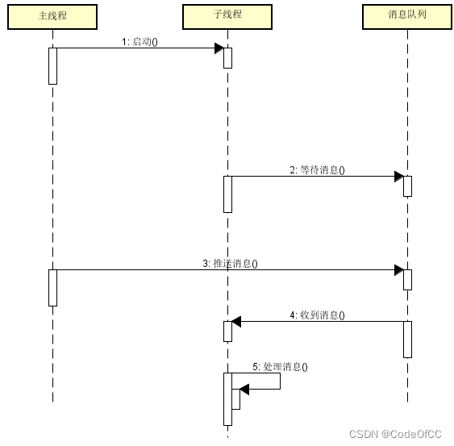
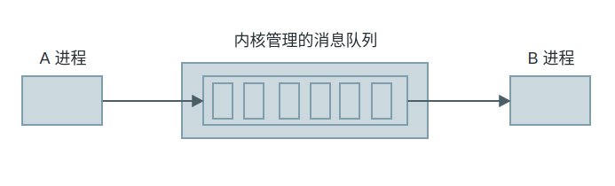
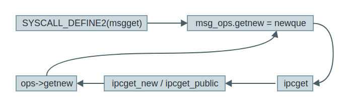
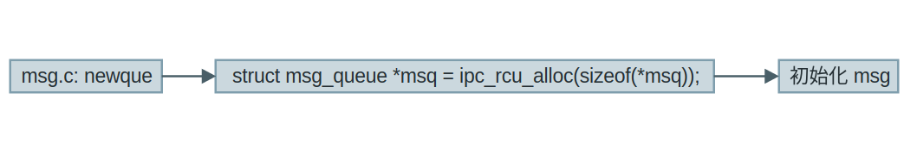
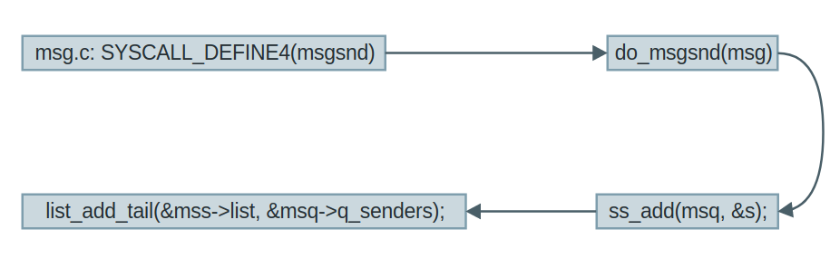
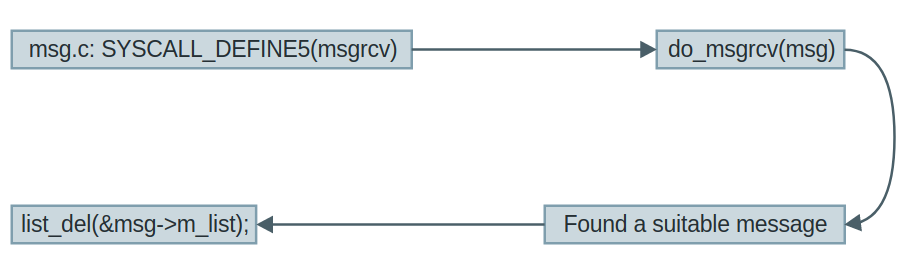

# 多线程消息队列

消息队列在多线程的场景有时会用到，尤其是[线程通信](https://so.csdn.net/so/search?q=线程通信&spm=1001.2101.3001.7020)跨线程调用的时候，就可以使用消息队列进行通信。C++实现一个能用的消息队列还是比较简单的，只需要一个队列一个互斥变量和一个条件变量，这些在标准库中都有提供。基于曾经写过的项目，总结出来最简单的消息队列的实现将在下文中介绍。

**消息队列感觉可以和线程池结合在一起就完全ok了**

https://blog.csdn.net/u013113678/article/details/127585569

## 如何实现

### 1.接口定义

一个基本的消息队列只需要3个接口：

（1）、推送消息
推送消息即是将消息写入队列，这个通常采用异步实现，推送之后立刻返回。如果要实现Windows的SendMessage则会比较复杂，最好的方式是放到外部实现，消息队列只提供异步推送消息。

```c++
void push(const T& msg);	
```

（2）、等待消息
等待队列的消息，这个方法是同步的，只有接收到消息才会返回。

//等待消息

```c++
void wait(T& msg);
```

（3）、轮询消息
轮询消息和等待消息一样也是接收消息，只是无论是否接收到消息轮询消息会立刻返回。轮询消息也是有一定的使用场景，尤其是接收消息线程需要一定的调度逻辑时就需要轮询消息避免线程堵塞。

```c++
bool poll(T& msg);
```

### 2.用到的对象

（1）、队列
我们使用一个队列来存放消息

```c++
#include<queue>
std::queue<T> _queue;
```

（2）、互斥变量
使用一个互斥变量确保队列的读写线程安全

```c++
#include<mutex>
std::mutex _mtx;
```

（3）、条件变量
采用条件变量结合互斥变量实现消息的等待和通知。

```c++
#include<condition_variable>
std::condition_variable _cv;
```

### 3.基本流程



## 完整代码

```c++
#include<mutex>
#include<condition_variable>
#include<queue>
/// <summary>
/// 消息队列
/// </summary>
/// <typeparam name="T">消息类型</typeparam>
template<class T> class MessageQueue {
public:
	/// <summary>
	/// 推入消息
	/// </summary>
	/// <param name="msg">消息对象</param>
	void push(const T& msg) {
		std::unique_lock<std::mutex>lck(_mtx);
		_queue.push(msg);
		_cv.notify_one();
	}
	/// <summary>
	/// 轮询消息
	/// </summary>
	/// <param name="msg">消息对象</param>
	/// <returns>是否接收到消息</returns>
	bool poll(T& msg) {
		std::unique_lock<std::mutex>lck(_mtx);
		if (_queue.size())
		{
			msg = _queue.front();
			_queue.pop();
			return true;
		}
		return false;
	}
	/// <summary>
	/// 等待消息
	/// </summary>
	/// <param name="msg">消息对象</param>
	void wait(T& msg) {
		std::unique_lock<std::mutex> lck(_mtx);
		while (!_queue.size()) _cv.wait(lck);
		msg = _queue.front();
		_queue.pop();
	}
	//队列长度
	size_t size() {
		std::unique_lock<std::mutex> lck(_mtx);
		return _queue.size();
	}
private:
	//队列
	std::queue<T> _queue;
	//互斥变量
	std::mutex _mtx;
	//条件变量
	std::condition_variable _cv;
};

```

## 使用示例

### （1）、等待消息

```c++
#include<thread>
//自定义消息对象
class MyMessage {
public:
	int type;
	void* param1;
	void* param2;
};

int main(int argc, char* argv[])
{
	//初始化消息队列
	MessageQueue<MyMessage> mq;
	//启动线程
	std::thread t1([&]() {
		MyMessage msg;
		while (1) {
			//等待队列的消息
			mq.wait(msg);
			printf("receive message type:%d\n", msg.type);
			if (msg.type == 1001)
				break;
		}
		printf("thread exited\n");
		});
	//发送消息给线程
	MyMessage msg;
	printf("send number message to thread.1001 exit\n");
	while (1)
	{
		scanf("%d", &msg.type);
		mq.push(msg);
		if (msg.type == 1001)
			break;
	}
	t1.join();
	return 0;
}

```

### 2.轮询消息

```c++
#include<thread>
//自定义消息对象
class MyMessage {
public:
	int type;
	void* param1;
	void* param2;
};
int main(int argc, char* argv[])
{
	//初始化消息队列
	MessageQueue<MyMessage> mq;
	//启动线程
	std::thread t1([&]() {
		MyMessage msg;
		while (1) {
			//轮询队列的消息
			if (mq.poll(msg))
			{
				printf("receive message type:%d\n", msg.type);
				if (msg.type == 1001)
					break;
			}
			std::this_thread::sleep_for(std::chrono::milliseconds(10));
		}
		printf("thread exited\n");
		});
	//发送消息给线程
	MyMessage msg;
	printf("send number message to thread.1001 exit\n");
	while (1)
	{
		scanf("%d", &msg.type);
		mq.push(msg);
		if (msg.type == 1001)
			break;
	}
	t1.join();
	return 0;
}

```

# 多进程消息队列

如果你在 Windows 上开发过应用程序，想必你应该听过消息队列这个概念。在 Windows 中每个程序都有一个消息队列，整个程序在一个 loop 中等待从消息队列中取消息并执行，所以称 Windows 上的程序为事件驱动型。同样在 Linux 开发中也有消息队列这个概念，不过 Linux 中的消息队列是用来进行 IPC 的，本质上跟共享内存一样也是内存维护的一片内存区域。这篇文章带你学习消息队列的相关操作和内核机制。


## linux自带消息队列

### 1.系统中的消息队列

**消息队列、共享内存 和 信号量** 被统称为 system-V IPC，V 是罗马数字5， 是 Unix 的AT&T 分支的其中一个版本，一般习惯称呼他们为 IPC对象，这些对象的操作接口都比较类似， 在系统中他们都使用一种叫做 key 的键值来唯一标识，而且他们都是“持续性”资源——即他们被创建之后， 不会因为进程的退出而消失，而会持续地存在，除非调用特殊的函数或者命令删除他们。

Linux的IPC对象（包括消息队列、共享内存和信号量）在内核内部使用链表维护， 不同的对象使用 `IPC标识符` 来标识，如消息队列标识符 msqid、共享内存标识符 shmid，信号量标识符 semid。

对于用户来说，内核提供了简洁的接口，不同的进程通过 `IPC关键字（key）` 即可访问具体的对象。

通过如下命令可以查看系统当前的IPC对象，没有使用的情况下可能为空：

```c++
# 查询系统当前的IPC对象
ipcs

# 以下是示例输出，没有使用的情况下可能为空
--------- 消息队列 -----------
键        msqid      拥有者  权限     已用字节数 消息
0x000004d2 98345      flyleaf    666        0            0

------------ 共享内存段 --------------
键        shmid      拥有者  权限     字节     连接数  状态

--------- 信号量数组 -----------
键        semid      拥有者  权限     nsems
```


### 2.消息队列原理

MQ 传递的是消息，消息即是我们需要在进程间传递的数据。MQ 采用链表来实现消息队列，该链表是由系统内核维护，系统中可能有很多的 MQ，每个 MQ 用**消息队列描述符**（消息队列 ID：qid）来区分，qid 是唯一的，用来区分不同的 MQ。在进行进程间通信时，一个进程将消息加到 MQ 尾端，另一个进程从消息队列中取消息（不一定以先进先出来取消息，也可以按照消息类型字段取消息），这样就实现了进程间的通信。如下 MQ 的模型：



进程 A 向内核维护的消息队列中发消息，进程 B 从消息队列中取消息，从而实现了 A 和 B 的进程间通信。了解了原理，来看看如何使用 MQ。

### 3.使用消息队列

MQ 的 API 操作与共享内存几乎是相同的，分为下面 4 个步骤：

1. 创建：msgget

   > 收发消息前需要具体的消息队列对象，msgget()函数的作用是创建或获取一个消息队列对象， 并返回消息队列标识符。函数原型如下：
   >
   > ```
   > int msgget(key_t key, int msgflg);
   > ```
   >
   > 若执行成功返回队列ID，失败返回-1。 它的两个输入参数说明如下：
   >
   > - key：消息队列的关键字，多个进程可以通过它访问同一个消息队列。 例如收发进程都使用同一个键值即可使用同一个消息队列进行通讯。 其中有个特殊值IPC_PRIVATE，它用于创建当前进程的私有消息队列。
   >
   > - msgflg：表示创建的消息队列的模式标志参数，主要有IPC_CREAT，IPC_EXCL和权限mode，
   >
   >   > - 如果是 `IPC_CREAT` 为真表示：如果内核中不存在关键字与key相等的消息队列，则新建一个消息队列； 如果存在这样的消息队列，返回此消息队列的标识符。
   >   > - 而如果为 `IPC_CREAT | IPC_EXCL` 表示如果内核中不存在键值与key相等的消息队列，则新建一个消息队列； 如果存在这样的消息队列则报错。
   >   > - mode指IPC对象存取权限，它使用Linux文件的数字权限表示方式，如0600，0666等。
   >
   >   这些参数是可以通过“｜”运算符联合起来的，因为它始终是int类型的参数。如msgflag使用参数 `IPC_CREAT | 0666` 时表示， 创建或返回已经存在的消息队列的标识符，且该消息队列的存取权限为0666， 即消息的所有者，所属组用户，其他用户均可对该消息进行读写。
   >
   > 注意
   >
   > - 选项 msgflg 是一个位掩码，因此 IPC_CREAT、IPC_EXCL 和权限 mode 可以用位或的方式叠加起来， 比如: `msgget(key, IPC_CREAT | 0666);` 表示如果 key 对应的消息队列不存在就创建， 且权限指定为 0666，若已存在则直接获取消息队列ID，此处的0666使用的是Linux文件权限的数字表示方式。
   > - 权限只有读和写，执行权限是无效的，例如 0777 跟 0666 是等价的。
   > - 当 key 被指定为 IPC_PRIVATE 时，系统会自动产生一个未用的 key 来对应一个新的消息队列对象， 这个消息队列一般用于进程内部间的通信。
   >
   > - 该函数可能返回以下错误代码：
   >   - EACCES：指定的消息队列已存在，但调用进程没有权限访问它
   >   - EEXIST：key指定的消息队列已存在，而msgflg中同时指定IPC_CREAT和IPC_EXCL标志
   >   - ENOENT：key指定的消息队列不存在同时msgflg中没有指定IPC_CREAT标志
   >   - ENOMEM：需要建立消息队列，但内存不足
   >   - ENOSPC：需要建立消息队列，但已达到系统的限制

2. 发送：msgsnd

   > 这个函数的主要作用就是将消息写入到消息队列，俗称发送一个消息。函数原型如下：
   >
   > ```
   > int msgsnd(int msqid, const void *msgp, size_t msgsz, int msgflg);
   > ```
   >
   > 参数说明：
   >
   > - msqid：消息队列标识符。
   >
   > - msgp：发送给队列的消息。msgp可以是任何类型的结构体，但第一个字段必须为long类型， 即表明此发送消息的类型，msgrcv()函数则根据此接收消息。msgp定义的参照格式如下：
   >
   >   ```
   >   /*msgp定义的参照格式*/
   >   struct s_msg{
   >       long type;  /* 必须大于0,消息类型 */
   >       char mtext[１];  /* 消息正文，可以是其他任何类型 */
   >   } msgp;
   >   ```
   >
   >   - msgsz：要发送消息的大小，不包含消息类型占用的4个字节，即mtext的长度。
   >   - msgflg：如果为0则表示：当消息队列满时，msgsnd()函数将会阻塞，直到消息能写进消息队列； 如果为IPC_NOWAIT则表示：当消息队列已满的时候，msgsnd()函数不等待立即返回； 如果为IPC_NOERROR：若发送的消息大于size字节，则把该消息截断，截断部分将被丢弃，且不通知发送进程。
   >
   > - 返回值：如果成功则返回0，如果失败则返回-1，并且错误原因存于error中。错误代码：
   >
   >   - EAGAIN：参数msgflg设为IPC_NOWAIT，而消息队列已满。
   >   - EIDRM：标识符为msqid的消息队列已被删除。
   >   - EACCESS：无权限写入消息队列。
   >   - EFAULT：参数msgp指向无效的内存地址。
   >   - EINTR：队列已满而处于等待情况下被信号中断。
   >   - EINVAL：无效的参数msqid、msgsz或参数消息类型type小于0。
   >
   > msgsnd()为阻塞函数，当消息队列容量满或消息个数满会阻塞。若消息队列已被删除，则返回EIDRM错误； 若被信号中断返回E_INTR错误。
   >
   > 如果设置IPC_NOWAIT消息队列满或个数满时会返回-1，并且置EAGAIN错误。
   >
   > msgsnd()解除阻塞的条件有以下三个条件：
   >
   > - 消息队列中有容纳该消息的空间。
   > - msqid代表的消息队列被删除。
   > - 调用msgsnd函数的进程被信号中断。

3. 接受：msgrcv

   > msgrcv()函数是从标识符为msqid的消息队列读取消息并将消息存储到msgp中， 读取后把此消息从消息队列中删除，也就是俗话说的接收消息。函数原型：
   >
   > ```
   > ssize_t msgrcv(int msqid, void *msgp, size_t msgsz, long msgtyp, int msgflg);
   > ```
   >
   > 参数说明：
   >
   > - msqid：消息队列标识符。
   > - msgp：存放消息的结构体，结构体类型要与msgsnd()函数发送的类型相同。
   > - msgsz：要接收消息的大小，不包含消息类型占用的4个字节。
   > - msgtyp有多个可选的值：如果为0则表示接收第一个消息，如果大于0则表示接收类型等于msgtyp的第一个消息， 而如果小于0则表示接收类型等于或者小于msgtyp绝对值的第一个消息。
   > - msgflg用于设置接收的处理方式，取值情况如下：
   >   - 0: 阻塞式接收消息，没有该类型的消息msgrcv函数一直阻塞等待
   >   - IPC_NOWAIT：若在消息队列中并没有相应类型的消息可以接收，则函数立即返回，此时错误码为ENOMSG
   >   - IPC_EXCEPT：与msgtype配合使用返回队列中第一个类型不为msgtype的消息
   >   - IPC_NOERROR：如果队列中满足条件的消息内容大于所请求的size字节，则把该消息截断，截断部分将被丢弃
   > - 返回值：msgrcv()函数如果接收消息成功则返回实际读取到的消息数据长度，否则返回-1，错误原因存于error中。错误代码：
   >   - E2BIG：消息数据长度大于msgsz而msgflag没有设置IPC_NOERROR
   >   - EIDRM：标识符为msqid的消息队列已被删除
   >   - EACCESS：无权限读取该消息队列
   >   - EFAULT：参数msgp指向无效的内存地址
   >   - ENOMSG：参数msgflg设为IPC_NOWAIT，而消息队列中无消息可读
   >   - EINTR：等待读取队列内的消息情况下被信号中断
   >
   > msgrcv()函数解除阻塞的条件也有三个：
   >
   > - 消息队列中有了满足条件的消息。
   > - msqid代表的消息队列被删除。
   > - 调用msgrcv()函数的进程被信号中断。

4. 删除及控制：msgctl

   > 消息队列是可以被用户操作的，比如设置或者获取消息队列的相关属性，那么可以通过msgctl()函数去处理它。函数原型：
   >
   > ```
   > int msgctl(int msqid, int cmd, struct msqid_ds *buf);
   > ```
   >
   > 参数说明：
   >
   > - msqid：消息队列标识符。
   >
   > - cmd 用于设置使用什么操作命令，它的取值有多个：
   >
   >   - IPC_STAT 获取该 MSG 的信息，获取到的信息会储存在结构体 msqid_ds类型的buf中。
   >   - IPC_SET 设置消息队列的属性，要设置的属性需先存储在结构体msqid_ds类型的buf中， 可设置的属性包括：msg_perm.uid、msg_perm.gid、msg_perm.mode以及msg_qbytes，储存在结构体msqid_ds中。
   >   - IPC_RMID 立即删除该 MSG，并且唤醒所有阻塞在该 MSG上的进程，同时忽略第三个参数。
   >   - IPC_INFO 获得关于当前系统中 MSG 的限制值信息。
   >   - MSG_INFO 获得关于当前系统中 MSG 的相关资源消耗信息。
   >   - MSG_STAT 同 IPC_STAT，但 msgid为该消息队列在内核中记录所有消息队列信息的数组的下标， 因此通过迭代所有的下标可以获得系统中所有消息队列的相关信息。
   >
   > - buf：相关信息结构体缓冲区。
   >
   >   - 返回值：
   >
   >   - 成功：0
   >
   >   - 出错：-1，错误原因存于error中，错误代码：
   >
   >     > - EACCESS：参数cmd为IPC_STAT，确无权限读取该消息队列。
   >     > - EFAULT：参数buf指向无效的内存地址。
   >     > - EIDRM：标识符为msqid的消息队列已被删除。
   >     > - EINVAL：无效的参数cmd或msqid。


### 4.示例

下来通过示例来讲解消息队列的使用，使用方法一般是:

发送者:

1. 获取消息队列的 ID
2. 将数据放入一个附带有标识的特殊的结构体，发送给消息队列。

接收者:

1. 获取消息队列的 ID
2. 将指定标识的消息读出。

当发送者和接收者都不再使用消息队列时，及时删除它以释放系统资源。

本次实验主要是两个进程（无血缘关系的进程）通过消息队列进行消息的传递， 一个进程发送消息，一个进程接收消息，并将其打印出来。

#### 4.1 发送进程

```c++
include <sys/types.h>
#include <sys/ipc.h>
#include <sys/msg.h>
#include <stdio.h>
#include <stdlib.h>
#include <unistd.h>
#include <string.h>


#define BUFFER_SIZE 512

struct message
{
    long msg_type;
    char msg_text[BUFFER_SIZE];
};
int main()
{
    int qid;
    struct message msg;

    /*创建消息队列*/
    if ((qid = msgget((key_t)1234, IPC_CREAT|0666)) == -1)
    {
        perror("msgget\n");
        exit(1);
    }

    printf("Open queue %d\n",qid);

    while(1)
    {
        printf("Enter some message to the queue:");
        if ((fgets(msg.msg_text, BUFFER_SIZE, stdin)) == NULL)
        {
            printf("\nGet message end.\n");
            exit(1);
        }

        msg.msg_type = getpid();
        /*添加消息到消息队列*/
        if ((msgsnd(qid, &msg, strlen(msg.msg_text), 0)) < 0)
        {
            perror("\nSend message error.\n");
            exit(1);
        }
        else
        {
            printf("Send message.\n");
        }

        if (strncmp(msg.msg_text, "quit", 4) == 0)
        {
            printf("\nQuit get message.\n");
            break;
        }
    }

    exit(0);
}
```

- 第22行，调用msgget()函数创建/获取了一个key值为1234的消息队列，该队列的属性“0666”表示任何人都可读写， 创建/获取到的队列ID存储在变量qid中。
- 第47行，调用msgsndb()函数把进程号以及前面用户输入的字符串，通过msg结构体添加到前面得到的qid队列中。
- 第51行，若用户发送的消息为quit，那么退出循环结束进程。

#### 4.2 接受进程

```c++
#include <sys/types.h>
#include <sys/ipc.h>
#include <sys/msg.h>
#include <stdio.h>
#include <stdlib.h>
#include <unistd.h>
#include <string.h>

#define BUFFER_SIZE 512

struct message
{
    long msg_type;
    char msg_text[BUFFER_SIZE];
};

int main()
{
    int qid;
    struct message msg;

    /*创建消息队列*/
    if ((qid = msgget((key_t)1234, IPC_CREAT|0666)) == -1)
    {
        perror("msgget");
        exit(1);
    }

    printf("Open queue %d\n", qid);

    do
    {
        /*读取消息队列*/
        memset(msg.msg_text, 0, BUFFER_SIZE);

        if (msgrcv(qid, (void*)&msg, BUFFER_SIZE, 0, 0) < 0)
        {
            perror("msgrcv");
            exit(1);
        }

        printf("The message from process %ld : %s", msg.msg_type, msg.msg_text);

    } while(strncmp(msg.msg_text, "quit", 4));

    /*从系统内核中删除消息队列 */
    if ((msgctl(qid, IPC_RMID, NULL)) < 0)
    {
        perror("msgctl");
        exit(1);
    }
    else
    {
        printf("Delete msg qid: %d.\n", qid);
    }

    exit(0);

}
```

本代码重点说明如下：

- 第23行，调用msgget()函数创建/获取队列qid。可以注意到，此处跟发送进程是完全一样的，无论哪个进程先运行， 若key值为1234的队列不存在则创建，把以实验时两个进程并没有先后启动顺序的要求。
- 第36行，在循环中调用msgrcv()函数接收qid队列的msg结构体消息，此处使用阻塞方式接收， 若队列中没有消息，会停留在本行代码等待。
- 第47行，若前面接收到用户的消息为quit，会退出循环，在本行代码调用msgctl()删除消息队列并退出本进程。

#### 4.3 输入

```
# 输入消息测试，
Open queue 98345
Enter some message to the queue:embedfire
Send message.
Enter some message to the queue:test
Send message.
Enter some message to the queue:hello world
Send message.
# 发送quit消息并结束进程
Enter some message to the queue:quit
Send message.

Quit get message.
```

可以通过 ipcs -q 命令来查看系统中存在的消息队列，若以上队列没有关闭，它的查看结果如下：

```
# 查询系统当前存在的队列
ipcs -q

# 以下为输出：
--------- 消息队列 -----------
键        msqid      拥有者  权限     已用字节数 消息
0x000004d2 98345      flyleaf    666        0            0

# 可查看到key键值 0x04d2(1234)，qid 98345 与进程中创建的一致。
```

### 5.消息队列内核实现

#### 5.1. struct msg_queue

消息队列在内核中用下面的数据结构表示

```c
// Linux 3.4: _msg_sm.h
struct msg_queue {
	struct list_head list_elem;
	struct msg_mgr *msg_mgr;
	u32 max_msgs;		/* Node message depth */
	u32 msgq_id;		/* Node environment pointer */
	struct list_head msg_free_list;	/* Free MsgFrames ready to be filled */

	/* Filled MsgFramess waiting to be read */
	struct list_head msg_used_list;
	void *arg;		/* Handle passed to mgr on_exit callback */
	struct sync_object *sync_event;	/* Signalled when message is ready */
	struct sync_object *sync_done;	/* For synchronizing cleanup */
	struct sync_object *sync_done_ack;	/* For synchronizing cleanup */
	struct ntfy_object *ntfy_obj;	/* For notification of message ready */
	bool done;		/* TRUE <==> deleting the object */
	u32 io_msg_pend;	/* Number of pending MSG_get/put calls */
};
```

可以看到消息队列实际上就是一个链表。

#### 5.2. 分配获取消息队列

首先上层应用通过调用 `msgget` 来进行系统调用，然后陷入内核：

```
int	msgget(key, msgflg)
	key_t key;
	int msgflg;
{
	return INLINE_SYSCALL (ipc, 5, IPCOP_msgget, key, msgflg, 0, NULL);
}
```

消息队列的内核实现机制和共享内存几乎相同：在内核开辟一片内存空间存放消息队列，不同的进程使用这个消息队列（内存空间）来通信，与共享内存使用相同的一组回调函数 `ipc_ops`。

`msgget` 的基本的调用过程如下：



比较重要的是最后一步回调 `newque` 函数，这个函数在内核中分配了一个消息队列 msg：



#### 5.3. 发送消息

上层的 `msgsnd` 系统调用最后会调用到内核的 `do_msgsnd` 函数，过程如下：



具体的过程这里就不分析了，主要就是在链表中添加一项。

#### 5.4. 接受消息

上层的 `msgrcv` 系统调用最后会调用到内核的 `do_msgrcv` 函数，过程如下：



同样接收消息会从链表中删除一项，具体的过程可以根据这个路线仔细分析

## rabbitMq
