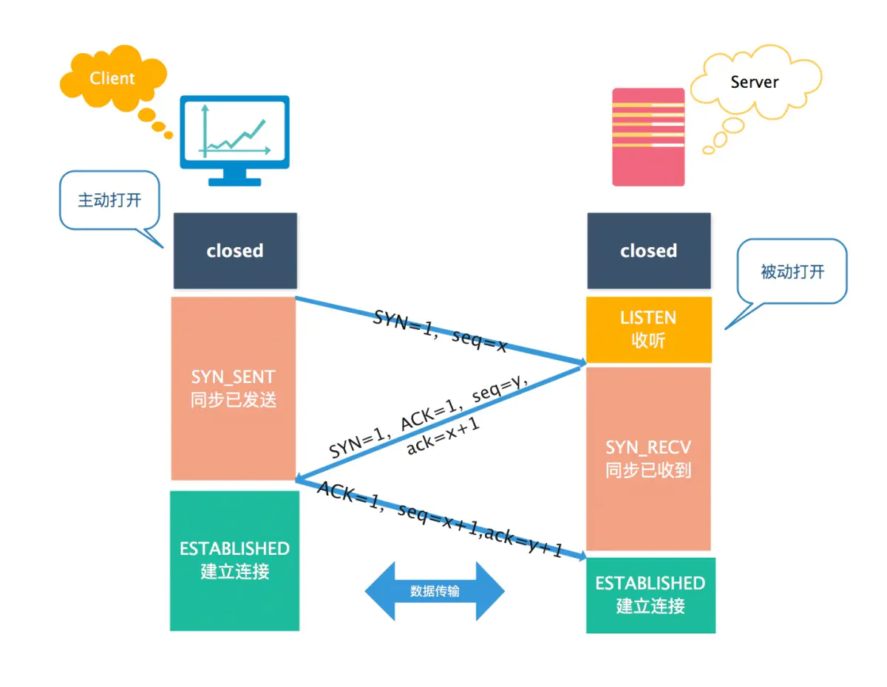
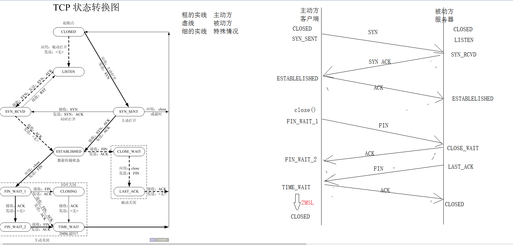

## TCP

最大报文长度MSS: 一般出现在三次握手的前两次,用来告知对方发送数据的最大长度

MTU: 最大传输单元 网卡

### tcp服务器初始化流程


 


后续的读写都是再连接套接字上完成，监听套接字只负责监听请求连接


上图描述；客户请求连接到最后数据交互的过程，客户先和服务端监听套接字建立连接，再没有三次握手的时候客户端处于监听套接字的未完成连接队列，再三次握手成功后客户端进入已完成连接队列，然后accep函数从改队列中提取连接，并生成新的 已连接套接字通过该套接字进行数据传输 

**注：通过accep返回的新套接字的端口号和最开始服务端套接字的端口号相同**


### TCP三次握手

 **流程：**

TCP 是面向连接的协议，所以使用 TCP 前必须先建立连接，而建立连接是通过三次握手来进行的
先建立连接，后使用TCP。建立连接是通过三次握手来进行的，客户端和服务端总共发3个包。

三次握手的主要作用是确认双方接收和发送能力是否正常、指定自己的初始化序列号、为后面可靠性传输做准备



一开始，客户端和服务端都处于 CLOSED 状态。先是服务端主动监听某个端口，处于 LISTEN 状态

SYN和ACK是TCP头部中的标志位，而ack和seq则是确认应答号和序列号，它们不是一个意思，

**三次握手的第一个报文：SYN报文**


客户端会随机初始化序号（client_isn），将此序号置于 TCP 首部的「序列号」字段中，同时把 SYN 标志位置为 1 ，表示 SYN 报文。接着把第一个 SYN 报文发送给服务端，表示向服务端发起连接，**该报文不包含应用层数据，之后客户端处于 SYN-SENT 状态**。

**(TCP规定SYN=1时不能携带数据但要消耗一个序号)**

**三次握手的第二个报文：SYN+ACK报文**


服务端收到**连接请求报文**（也是数据包）后由标志位SYN=1知道客户端请求建立连接，首先服务端也随机初始化自己的序号（server_isn），将此序号填入 TCP 首部的「序列号」字段中，其次把 TCP 首部的「确认应答号也就是ACK号」字段填入 client_isn + 1, 接着把 SYN 和 ACK 标志位置为 1。最后把该报文发给客户端，**该报文也不包含应用层数据，之后服务端处于 SYN-RCVD 状态**。

**三次握手的第三个报文 ACK报文**


客户端收到服务端报文后，还要向服务端回应最后一个应答报文，**首先该应答报文 TCP 首部 ACK 标志位置为 1 ，其次「确认应答号」字段填入 server_isn + 1** ，最后把报文发送给服务端，**这次报文可以携带客户到服务器的数据，之后客户端处于 ESTABLISHED 状态。服务器收到客户端的应答报文后，也进入 ESTABLISHED 状态**。

**第三次握手是可以携带数据的，前两次握手是不可以携带数据的**

**一旦完成三次握手，双方都处于 ESTABLISHED 状态，此时连接就已建立完成，客户端和服务端就可以相互发送数据了。**

注：**虽然SYN包的数据长度是0，但是依然会占据一个序号**

**总结**

> TCP 连接的三次握手机制，最重要的知识点，必须得会，通讯过程以及客户端、服务器的对应的状态都需要记住哈。
> TCp 提供可靠的连接服务，连接是通过三次握手进行初始化的。三次握手的目的就是同步连接双方的序列号和确认号并交换 TCP 窗口大小信息。
> 流程：
> ● 第一次握手 (发送连接请求报文SYN=1, 初始序号随机seq=x，ACK=0)，发送完毕后，客户端就进入 SYN_SENT 状态
> ● 第二次握手 (发送连接确认报文SYN=1, ACK=1, seq=y, ACKnum=x+1)， 发送完毕后，服务器端就进入 SYN_RCV 状态。
> ● 第三次握手 (发出连接确认报文ACK=1，ACKnum=y+1，序号seq=x+1)，发送完毕后，客户端进入 ESTABLISHED 状态，当服务器端接收到这个包时，也进入 ESTABLISHED 状态。
> 注：ACK也好，ack也好，只不过是个代号而已
> ACK是确认值(Acknowledgement)，为1便是确认连接。
> ack是确认编号(Acknowledgement Number)，即接收到的上一次远端主机传来的seq然后+1，再发送给远端主机。提示远端主机已经成功接收上一次所有数据。

#### 三次握手丢失后分别会出现什么现象？

1. 第一次握手丢失

   > 如果第一次握手丢失 即服务端收不到客户端的第一个SYN报文。在这之后，**如果客户端迟迟收不到服务端的 SYN-ACK 报文（第二次握手），就会触发「超时重传」机制，重传 SYN 报文。**

2. 第二次握手丢失

   > 当服务端收到客户端的第一次握手后，就会回 SYN-ACK 报文给客户端，这个就是第二次握手，此时服务端会进入 SYN_RCVD 状态。
   > **第二次握手的 SYN-ACK 报文其实有两个目的 ：**
   > **ACK， 是对第一次握手的确认报文；**
   > **SYN，是服务端发起建立 TCP 连接的报文；**
   >
   > 如果客户端迟迟没有收到第二次握手，那么客户端就觉得可能自己的 SYN 报文（第一次握手）丢失了，**于是客户端就会触发超时重传机制，重传 SYN 报文。（现象1）** 
   >
   > 如果第二次握手丢失了，**服务端就收不到第三次握手，于是服务端这边会触发超时重传机制，重传 SYN-ACK 报文。（现象2）**

3. 第三次握手丢失

   > 服务端：
   > *第三次的ACK在网络中丢失，那么服务端该TCP连接的状态为SYN_RECV,并且会根据 TCP的超时重传机制，会等待3秒、6秒、12秒后重新发送SYN+ACK包，以便客户端重新发送ACK包。
   > *如果重发指定次数之后，仍然未收到 客户端的ACK应答，那么一段时间后，服务端自动关闭这个连接。
   > *客户端：
   > 客户端认为这个连接已经建立，如果客户端向服务端发送数据，服务端将以RST包（Reset，标示复位，用于异常的关闭连接）响应。此时，客户端知道第三次握手失败。

#### 为什么不是两次握手

三次握手的原因：
**• 三次握手才可以阻止重复历史连接的初始化（主要原因）**
**• 三次握手才可以同步双方的初始序列号**
**• 三次握手才可以避免资源浪费**

**原因一：:防止已失效的连接请求报文段突然又传送到了服务端，因而产生错误**

已经失效的客户端发出的请求信息，由于某种原因传输到了服务器端，服务器端以为是客户端发出的有效请求，接收后产生错误。


**原因二：同步双方初始序列号**
TCP 协议的通信双方， 都必须维护一个「序列号」， 序列号是可靠传输的一个关键因素，它的作用：
• 接收方可以去除重复的数据；
• 接收方可以根据数据包的序列号按序接收；
• 可以标识发送出去的数据包中， 哪些是已经被对方收到的（通过 ACK 报文中的序列号知道）；

四次握手其实也能够可靠的同步双方的初始化序号，但由于第二步和第三步可以优化成一步，所以就成了「三次握手」。
而两次握手只保证了一方的初始序列号能被对方成功接收，没办法保证双方的初始序列号都能被确认接收。

**原因三：避免资源浪费**
如果只有「两次握手」，当客户端的 SYN 请求连接在网络中阻塞，客户端没有接收到 ACK 报文，就会重新发送 SYN ，由于没有第三次握手，服务器不清楚客户端是否收到了自己发送的建立连接的 ACK 确认信号，所以每收到一个 SYN 就只能先主动建立一个连接。
如果客户端的 SYN 阻塞了，重复发送多次 SYN 报文，那么服务器在收到请求后就会建立多个冗余的无效链接，造成不必要的资源浪费。
即两次握手会造成消息滞留情况下，服务器重复接受无用的连接请求 SYN 报文，而造成重复分配资源


#### TCP为什么不是四次握手

因为三次握手已经可以确认双方的发送接收能力正常，双方都知道彼此已经准备好，而且也可以完成对双方初始序号值得确认，也就无需再第四次握手了。
第一次握手：服务端确认“自己收、客户端发”报文功能正常。
第二次握手：客户端确认“自己发、自己收、服务端收、客户端发”报文功能正常，客户端认为连接已建立。
第三次握手：服务端确认“自己发、客户端收”报文功能正常，此时双方均建立连接，可以正常通信。

### TCP 四次挥手

这个非常麻烦，可以看小林coding的网络篇

https://xiaolincoding.com/network/3_tcp/tcp_interview.html#%E4%BB%80%E4%B9%88%E6%98%AF-tcp-%E8%BF%9E%E6%8E%A5


### 多进程服务器端

**要使用包裹函数**

```c++

#include <stdio.h>
#include <sys/socket.h>
#include <unistd.h>
#include <signal.h>
#include <sys/wait.h>
#include "wrap.h"
void free_process(int sig)
{
	pid_t pid;
	while(1)
	{
		pid = waitpid(-1,NULL,WNOHANG);
		if(pid <=0 )//小于0 子进程全部退出了 =0没有进程没有退出
		{
			break;
		}
		else
		{
			printf("child pid =%d\n",pid);
		}
	}


}
int main(int argc, char *argv[])
{
	//防止父进程还没有注册信号处理函数，就有子进程退出，设置收到SIGCHLD信号阻塞
	sigset_t set;
	sigemptyset(&set);
	sigaddset(&set,SIGCHLD);
	sigprocmask(SIG_BLOCK,&set,NULL);
	//创建套接字,绑定
	int lfd = tcp4bind(8008,NULL);
	//监听
	Listen(lfd,128);
	//提取
	//回射
	struct sockaddr_in cliaddr;
	socklen_t len = sizeof(cliaddr);
	while(1)
	{
		char ip[16]="";
		//提取连接,
		int cfd = Accept(lfd,(struct sockaddr *)&cliaddr,&len);
		printf("new client ip=%s port=%d\n",inet_ntop(AF_INET,&cliaddr.sin_addr.s_addr,ip,16),
				ntohs(cliaddr.sin_port));
		//fork创建子进程
		pid_t pid;
		pid = fork();
		if(pid < 0)
		{
			perror("");
			exit(0);
		}
		else if(pid == 0)//子进程
		{
			//关闭lfd
			close(lfd);
			while(1)
			{
			char buf[1024]="";

			int n = read(cfd,buf,sizeof(buf));
			if(n < 0)
			{
				perror("");
				close(cfd);
				exit(0);
			}
			else if(n == 0)//对方关闭j
			{
				printf("client close\n");
				close(cfd);
				exit(0);
			
			}
			else
			{
				printf("%s\n",buf);
				write(cfd,buf,n);
			//	exit(0);	
			}
			}
		
		}
		else//父进程
		{
			close(cfd);
			//回收
			//注册信号回调
			struct sigaction act;
			act.sa_flags =0;
			act.sa_handler = free_process;
			sigemptyset(&act.sa_mask);
			sigaction(SIGCHLD,&act,NULL);
			sigprocmask(SIG_UNBLOCK,&set,NULL);
		
		}
	}
	//关闭


	return 0;
}


```


### 多线程服务器

```c++
#include <stdio.h>
#include <pthread.h>
#include "wrap.h"
typedef struct c_info
{
	int cfd;
	struct sockaddr_in cliaddr;

}CINFO;
void* client_fun(void *arg);
int main(int argc, char *argv[])
{
	if(argc < 2)
	{
		printf("argc < 2???   \n ./a.out 8000 \n");
		return 0;
	}
	pthread_attr_t attr;
	pthread_attr_init(&attr);
	pthread_attr_setdetachstate(&attr,PTHREAD_CREATE_DETACHED);
	short port = atoi(argv[1]);
	int lfd = tcp4bind(port,NULL);//创建套接字 绑定 
	Listen(lfd,128);
	struct sockaddr_in cliaddr;
	socklen_t len = sizeof(cliaddr);
	CINFO *info;
	while(1)
	{
		int cfd = Accept(lfd,(struct sockaddr *)&cliaddr,&len);
		char ip[16]="";
		pthread_t pthid;
		info = malloc(sizeof(CINFO));
		info->cfd = cfd;
		info->cliaddr= cliaddr;
		pthread_create(&pthid,&attr,client_fun,info);
	
	}

	return 0;
}

void* client_fun(void *arg)
{
	CINFO *info = (CINFO *)arg;
	char ip[16]="";

	printf("new client ip=%s port=%d\n",inet_ntop(AF_INET,&(info->cliaddr.sin_addr.s_addr),ip,16),
		ntohs(info->cliaddr.sin_port));
	while(1)
	{
		char buf[1024]="";
		int count=0;
		count = read(info->cfd,buf,sizeof(buf));
		if(count < 0)
		{
			perror("");
			break;
		
		}
		else if(count == 0)
		{
			printf("client close\n");
			break;
		}
		else
		{
			printf("%s\n", buf);
			write(info->cfd,buf,count);
		
		}
	
	
	}
	close(info->cfd);
	free(info);
}


```


### TCP状态转换图


**CLOSED****：**表示初始状态。

**LISTEN****：**该状态表示服务器端的某个SOCKET处于监听状态，可以接受连接。

**SYN_SENT****：**这个状态与SYN_RCVD遥相呼应，当客户端SOCKET执行CONNECT连接时，它首先发送SYN报文，随即进入到了SYN_SENT状态，并等待服务端的发送三次握手中的第2个报文。SYN_SENT状态表示客户端已发送SYN报文。

**SYN_RCVD:** 该状态表示接收到SYN报文，在正常情况下，这个状态是服务器端的SOCKET在建立TCP连接时的三次握手会话过程中的一个中间状态，很短暂。此种状态时，当收到客户端的ACK报文后，会进入到ESTABLISHED状态。

**ESTABLISHED****：**表示连接已经建立。

**FIN_WAIT_1:** FIN_WAIT_1和FIN_WAIT_2状态的真正含义都是表示等待对方的FIN报文。区别是：

FIN_WAIT_1状态是当socket在ESTABLISHED状态时，想主动关闭连接，向对方发送了FIN报文，此时该socket进入到FIN_WAIT_1状态。

FIN_WAIT_2状态是当对方回应ACK后，该socket进入到FIN_WAIT_2状态，正常情况下，对方应马上回应ACK报文，所以FIN_WAIT_1状态一般较难见到，而FIN_WAIT_2状态可用netstat看到。

**FIN_WAIT_2****：主动关闭链接的一方，发出FIN****收到ACK****以后进入该状态****。称之为半连接或半关闭状态。**该状态下的socket只能接收数据，不能发。

**TIME_WAIT:** 表示收到了对方的FIN报文，并发送出了ACK报文，等2MSL后即可回到CLOSED可用状态。如果FIN_WAIT_1状态下，收到对方同时带 FIN标志和ACK标志的报文时，可以直接进入到TIME_WAIT状态，而无须经过FIN_WAIT_2状态。

**CLOSING:** 这种状态较特殊，属于一种较罕见的状态。正常情况下，当你发送FIN报文后，按理来说是应该先收到（或同时收到）对方的 ACK报文，再收到对方的FIN报文。但是CLOSING状态表示你发送FIN报文后，并没有收到对方的ACK报文，反而却也收到了对方的FIN报文。什么情况下会出现此种情况呢？如果双方几乎在同时close一个SOCKET的话，那么就出现了双方同时发送FIN报文的情况，也即会出现CLOSING状态，表示双方都正在关闭SOCKET连接。

**CLOSE_WAIT:** 此种状态表示在等待关闭。当对方关闭一个SOCKET后发送FIN报文给自己，系统会回应一个ACK报文给对方，此时则进入到CLOSE_WAIT状态。接下来呢，察看是否还有数据发送给对方，如果没有可以 close这个SOCKET，发送FIN报文给对方，即关闭连接。所以在CLOSE_WAIT状态下，需要关闭连接。

**LAST_ACK:** 该状态是被动关闭一方在发送FIN报文后，最后等待对方的ACK报文。当收到ACK报文后，即可以进入到CLOSED可用状态。



### TCP半关闭状态

当TCP链接中A发送FIN请求关闭，B端回应ACK后（A端进入FIN_WAIT_2状态），B没有立即发送FIN给A时，A方处在半链接状态，此时A可以接收B发送的数据，但是A已不能再向B发送数据。


从程序的角度，可以使用API来控制实现半连接状态。

```c++
#include <sys/socket.h>
int shutdown(int sockfd, int how);
sockfd: 需要关闭的socket的描述符
how:	允许为shutdown操作选择以下几种方式:
	SHUT_RD(0)：	关闭sockfd上的读功能，此选项将不允许sockfd进行读操作。
					该套接字不再接收数据，任何当前在套接字接受缓冲区的数据将被无声的丢弃掉。
	SHUT_WR(1):		关闭sockfd的写功能，此选项将不允许sockfd进行写操作。进程不能在对此套接字发出写操作。
	SHUT_RDWR(2):	关闭sockfd的读写功能。相当于调用shutdown两次：首先是以SHUT_RD,然后以SHUT_WR。

```

使用close中止一个连接，但它只是减少描述符的引用计数，并不直接关闭连接，只有当描述符的引用计数为0时才关闭连接。

**shutdown不考虑描述符的引用计数，直接关闭描述符**。也可选择中止一个方向的连接，只中止读或只中止写。

**注意:**

1. 如果有多个进程共享一个套接字，close每被调用一次，计数减1，直到计数为0时，也就是所用进程都调用了close，套接字将被释放。 
2. 在多进程中如果一个进程调用了shutdown(sfd, SHUT_RDWR)后，其它的进程将无法进行通信。但，如果一个进程close(sfd)将不会影响到其它进程。

### 端口复用

在server的TCP连接没有完全断开之前不允许重新监听是不合理的。因为，TCP连接没有完全断开指的是connfd（127.0.0.1:6666）没有完全断开，而我们重新监听的是lis-tenfd（0.0.0.0:6666），虽然是占用同一个端口，但IP地址不同，connfd对应的是与某个客户端通讯的一个具体的IP地址，而listenfd对应的是wildcard address。解决这个问题的方法是使用setsockopt()设置socket描述符的选项SO_REUSEADDR为1，表示允许创建端口号相同但IP地址不同的多个socket描述符。

在server代码的socket()和bind()调用之间插入如下代码：

```c++
  int opt = 1;

  setsockopt(listenfd, SOL_SOCKET, SO_REUSEADDR, &opt, sizeof(opt));
```


### 心跳检测机制

​	在TCP网络通信中，经常会出现客户端和服务器之间的非正常断开，需要实时检测查询链接状态。常用的解决方法就是在程序中加入心跳机制。

**Heart-Beat线程**

这个是最常用的简单方法。在接收和发送数据时个人设计一个守护进程(线程)，定时发送Heart-Beat包，客户端/服务器收到该小包后，立刻返回相应的包即可检测对方是否实时在线。

该方法的好处是通用，但缺点就是会改变现有的通讯协议！**大家一般都是使用业务层心跳来处理**，主要是灵活可控。

UNIX网络编程不推荐使用SO_KEEPALIVE来做心跳检测，还是在业务层以心跳包做检测比较好，也方便控制。

**设置TCP属性**：

​	SO_KEEPALIVE 保持连接检测对方主机是否崩溃，避免（服务器）永远阻塞于TCP连接的输入。设置该选项后，如果2小时内在此套接口的任一方向都没有数据交换，TCP就自动给对方发一个保持存活探测分节(keepalive probe)。这是一个对方必须响应的TCP分节.它会导致以下三种情况：对方接收一切正常：以期望的ACK响应。2小时后，TCP将发出另一个探测分节。对方已崩溃且已重新启动：以RST响应。套接口的待处理错误被置为ECONNRESET，套接 口本身则被关闭。对方无任何响应：源自berkeley的TCP发送另外8个探测分节，相隔75秒一个，试图得到一个响应。在发出第一个探测分节11分钟 15秒后若仍无响应就放弃。套接口的待处理错误被置为ETIMEOUT，套接口本身则被关闭。如ICMP错误是“host unreachable(主机不可达)”，说明对方主机并没有崩溃，但是不可达，这种情况下待处理错误被置为EHOSTUNREACH。

根据上面的介绍我们可以知道对端以一种非优雅的方式断开连接的时候，我们可以设置SO_KEEPALIVE属性使得我们在2小时以后发现对方的TCP连接是否依然存在。

```c++
  keepAlive = 1;

  setsockopt(listenfd, SOL_SOCKET, SO_KEEPALIVE, (void*)&keepAlive, sizeof(keepAlive));
```


## 包裹函数

封装了socket的函数并进行了相关的判断，方便调用  

```c++
#include <stdlib.h>
#include <stdio.h>
#include <unistd.h>
#include <errno.h>
#include <string.h>
#include <sys/socket.h>
#include <arpa/inet.h>
#include <strings.h>

void perr_exit(const char *s)
{
	perror(s);
	exit(-1);
}

int Accept(int fd, struct sockaddr *sa, socklen_t *salenptr)
{
	int n;

again:
	if ((n = accept(fd, sa, salenptr)) < 0) {
		if ((errno == ECONNABORTED) || (errno == EINTR))//如果是被信号中断和软件层次中断,不能退出
			goto again;
		else
			perr_exit("accept error");
	}
	return n;
}

int Bind(int fd, const struct sockaddr *sa, socklen_t salen)
{
    int n;

	if ((n = bind(fd, sa, salen)) < 0)
		perr_exit("bind error");

    return n;
}

int Connect(int fd, const struct sockaddr *sa, socklen_t salen)
{
    int n;

	if ((n = connect(fd, sa, salen)) < 0)
		perr_exit("connect error");

    return n;
}

int Listen(int fd, int backlog)
{
    int n;

	if ((n = listen(fd, backlog)) < 0)
		perr_exit("listen error");

    return n;
}

int Socket(int family, int type, int protocol)
{
	int n;

	if ((n = socket(family, type, protocol)) < 0)
		perr_exit("socket error");

	return n;
}

ssize_t Read(int fd, void *ptr, size_t nbytes)
{
	ssize_t n;

again:
	if ( (n = read(fd, ptr, nbytes)) == -1) {
		if (errno == EINTR)//如果是被信号中断,不应该退出
			goto again;
		else
			return -1;
	}
	return n;
}

ssize_t Write(int fd, const void *ptr, size_t nbytes)
{
	ssize_t n;

again:
	if ( (n = write(fd, ptr, nbytes)) == -1) {
		if (errno == EINTR)
			goto again;
		else
			return -1;
	}
	return n;
}

int Close(int fd)
{
    int n;
	if ((n = close(fd)) == -1)
		perr_exit("close error");

    return n;
}

/*参三: 应该读取固定的字节数数据*/
ssize_t Readn(int fd, void *vptr, size_t n)
{
	size_t  nleft;              //usigned int 剩余未读取的字节数
	ssize_t nread;              //int 实际读到的字节数
	char   *ptr;

	ptr = vptr;
	nleft = n;

	while (nleft > 0) {
		if ((nread = read(fd, ptr, nleft)) < 0) {
			if (errno == EINTR)
				nread = 0;
			else
				return -1;
		} else if (nread == 0)
			break;

		nleft -= nread;
		ptr += nread;
	}
	return n - nleft;
}
/*:固定的字节数数据*/
ssize_t Writen(int fd, const void *vptr, size_t n)
{
	size_t nleft;
	ssize_t nwritten;
	const char *ptr;

	ptr = vptr;
	nleft = n;
	while (nleft > 0) {
		if ( (nwritten = write(fd, ptr, nleft)) <= 0) {
			if (nwritten < 0 && errno == EINTR)
				nwritten = 0;
			else
				return -1;
		}

		nleft -= nwritten;
		ptr += nwritten;
	}
	return n;
}

//一次性读取一个字符
//但是我觉得有点问题是一次性读100个数据放在read_buf中，但是如果第二次调用该函数传入的另外的文件描述符，返回的数据却是第一次文件描述符中读取的字符，所以这个函数不能单独使用，只能在连续从一个文件描述符中 一个一个读取数据的时候使用
static ssize_t my_read(int fd, char *ptr)
{
	static int read_cnt;
	static char *read_ptr;
	static char read_buf[100];

	if (read_cnt < = 0) {
again:
		if ( (read_cnt = read(fd, read_buf, sizeof(read_buf))) < 0) {
			if (errno == EINTR)
				goto again;
			return -1;
		} else if (read_cnt == 0)//如果read读取的数据为0，则代表对方关闭，读取的数据为0则说明发过来的数据包中的应用层数据为空，只有传输层和网络层的包头信息
			return 0;
		read_ptr = read_buf;
	}
	read_cnt--;
	*ptr = *read_ptr++;

	return 1;
}

//读取一行
ssize_t Readline(int fd, void *vptr, size_t maxlen)
{
	ssize_t n, rc;
	char    c, *ptr;

	ptr = vptr;
	for (n = 1; n < maxlen; n++) {
		if ( (rc = my_read(fd, &c)) == 1) {
			*ptr++ = c;
			if (c  == '\n')
				break;
		} else if (rc == 0) {
			*ptr = 0;
			return n - 1;
		} else
			return -1;
	}
	*ptr  = 0;

	return n;
}

int tcp4bind(short port,const char *IP)
{
    struct sockaddr_in serv_addr;
    int lfd = Socket(AF_INET,SOCK_STREAM,0);
    bzero(&serv_addr,sizeof(serv_addr));
    if(IP == NULL){
        //如果这样使用 0.0.0.0,任意ip将可以连接
        serv_addr.sin_addr.s_addr = INADDR_ANY;
    }else{
        if(inet_pton(AF_INET,IP,&serv_addr.sin_addr.s_addr) <= 0){
            perror(IP);//转换失败
            exit(1);
        }
    }
    serv_addr.sin_family = AF_INET;
    serv_addr.sin_port   = htons(port);
   // int opt = 1;
	//setsockopt(lfd, SOL_SOCKET, SO_REUSEADDR, &opt, sizeof(opt));

    Bind(lfd,(struct sockaddr *)&serv_addr,sizeof(serv_addr));
    return lfd;
}


```

## 高并发服务器

阻塞等待 消耗资源-》 多进程 多线程模型

非阻塞忙轮询 消耗cpu

多路IO：

​	多路IO转接(多路IO复用): 内核监听多个文件描述符的属性(读写缓冲区)变化

​	如果某个文件描述符的读缓冲区变化了,这个时候就是可以读了,将这个事件告知应用层


### select原型的高并发服务器

 

```c++
#include <sys/select.h>
 /* According to earlier standards */
       #include <sys/time.h>
       #include <sys/types.h>
       #include <unistd.h>

       int select(int nfds, fd_set *readfds, fd_set *writefds,
                  fd_set *exceptfds, struct timeval *timeout);
功能: 监听多个文件描述符的属性变化(读,写,异常)
       void FD_CLR(int fd, fd_set *set);
       int  FD_ISSET(int fd, fd_set *set);
       void FD_SET(int fd, fd_set *set);
       void FD_ZERO(fd_set *set);

参数:
    nfds  : 最大文件描述符+1
    readfds : 需要监听的读的文件描述符存放集合
    writefds :需要监听的写的文件描述符存放集合   NULL
    exceptfds : 需要监听的异常的文件描述符存放集合  NULL
    timeout: 多长时间监听一次   固定的时间,限时等待   NULL 永久监听
    struct timeval {
               long    tv_sec;         /* seconds */ 秒
               long    tv_usec;        /* microseconds */微妙
           };

返回值: 返回的是变化的文件描述符的个数
注意: 变化的文件描述符会存在监听的集合中,未变化的文件描述符会从集合中删除
```

**分析：**

使用select模型实现多路IO复用主要监视的文件描述符可分为 两类

1. 一类是监听socket，如果它发生了变化则意味则有新的连接请求到来，你需要去accept客户端，并将返回的新socket添加到监听集合中
2. 一类是普通socket，加入发生了变化可能是有新数据到达接受缓冲区，这个时候你只需要去读取该数据

**优缺点：**

优点: 

​	跨平台

缺点:

文件描述符1024的限制  由于 FD_SETSIZE的限制

只是返回变化的文件描述符的个数,具体哪个那个变化需要遍历

每次都需要将需要监听的文件描述集合由应用层符拷贝到内核

**大量并发,少量活跃,select效率低**

 

1.假设现在 4-1023个文件描述符需要监听,但是5-1000这些文件描述符关闭了?

**答**：可以通过额外增加一个数组，数组中存放的都是select集合中未关闭的文件描述符，如数组存放的数据是4，100，1023，如果遍历fd_set则需要从0开始遍历，如果遍历数组则只需要遍历未关闭的几个数组中有哪一个发生了变化

2.假设现在 4-1023个文件描述符需要监听,但是只有 5,1002 发来消息-

无解

### 基于epoll的高并发服务器

**特点：**


**API：**

 a> 创建红黑树

```c++
   #include <sys/epoll.h>

	int epoll_create(int size);

  参数:

   size : 监听的文件描述符的上限, 2.6版本之后写1即可（因为内核不care你传入的参数）,

  返回: 返回树的句柄
```

b> 上树 下树 修改节点

```c++
  epoll_ctl

\#include <sys/epoll.h>

int epoll_ctl(int epfd, int op, int fd, struct epoll_event *event);

参数:

   epfd : 树的句柄

   op : EPOLL_CTL_ADD 上树  EPOLL_CTL_DEL 下树 EPOLL_CTL_MOD 修改

   fd : 上树,下树的文件描述符

   event :  上树的节点

   typedef union epoll_data {

        void    *ptr;

        int     fd;

        uint32_t   u32;

        uint64_t   u64;

      } epoll_data_t;

      struct epoll_event {

        uint32_t   events;   /* Epoll events */ 需要监听的事件

        epoll_data_t data;    /* User data variable */ 需要监听的文件描述符

      };
```

将cfd上树

```c++
  int epfd = epoll_create(1);

struct epoll_event ev;

ev. data.fd = cfd;

ev.events = EPOLLIN;

epoll_ctl(epfd, EPOLL_CTL_ADD,cfd, &ev);
```

c> 监听

```c++
   #include <sys/epoll.h>

    int epoll_wait(int epfd, struct epoll_event *events,

           int maxevents, int timeout);

  功能: 监听树上文件描述符的变化

   epfd : 数的句柄

   events : 接收变化的节点的数组的首地址

   maxevents : 数组元素的个数

   timeout : -1 永久监听 大于等于0 限时等待

返回值: 返回的是变化的文件描述符个数
```

#### 服务器代码（边沿触发）

```c++
#include <stdio.h>
#include <unistd.h>
#include <arpa/inet.h>
#include <sys/socket.h>
#include <stdlib.h>
#include <string.h>
#include <errno.h>
#include <sys/epoll.h>
#include <errno.h>
#include <fcntl.h>

int main()
{
    int listen_fd, client_fd, epoll_fd;
    char buf[1024];
    // 1.创建socket
    listen_fd = socket(AF_INET, SOCK_STREAM, 0);

    // 设置端口复用
    int opt = 1;
    setsockopt(listen_fd, SOL_SOCKET, SO_REUSEADDR, &opt, sizeof(opt));
    // 2.绑定地址
    struct sockaddr_in serv_addr, clent_addr;
    socklen_t serv_len, clent_len;
    clent_len = sizeof(clent_addr);

    memset(&serv_addr, 0, sizeof(serv_addr));
    serv_addr.sin_family = AF_INET;
    serv_addr.sin_port = htons(8102);
    serv_addr.sin_addr.s_addr = inet_addr("127.0.0.1");
    if (bind(listen_fd, (struct sockaddr *)&serv_addr, sizeof(serv_addr)) < 0)
    {
        printf("bind error,errno %d", errno);
    }

    // 3.listen socket
    if (listen(listen_fd, 10) < 0)
    {
        printf("listen error,errno %d", errno);
    }

    // 创建树，并将监听套接字放入epoll树
    epoll_fd = epoll_create(2048);
    struct epoll_event evet;
    evet.events = EPOLLIN;
    evet.data.fd = listen_fd;
    epoll_ctl(epoll_fd, EPOLL_CTL_ADD, listen_fd, &evet);

    // 只开辟一次空间
    void *event_addr = malloc(sizeof(epoll_event) * 1024);
    // 循环接受连接
    while (1)
    {
        struct epoll_event *events;
        events = (epoll_event *)event_addr; //(epoll_event *)malloc(sizeof(epoll_event) * 1024);
        int n = 0;
        n = epoll_wait(epoll_fd, events, 1024, -1);
        if (n < 0)
        {
            printf("epoll_wait error, errno %d", errno);
        }

        for (int i = 0; i < n; i++)
        {
            // 判断是否监听套接字发生了变化，且发生的事件有EPOLLIN
            if (events[i].data.fd == listen_fd && events[i].events & EPOLLIN)
            {
                client_fd = accept(listen_fd, (sockaddr *)&clent_addr, &clent_len);
                if (client_fd < 0)
                {
                    printf("accept error, errno %d", errno);
                }
                printf("new connect arrive,port %d,ip %s\n", ntohs(clent_addr.sin_port), inet_ntoa(clent_addr.sin_addr));
                //设置cfd为非阻塞
                int flags = fcntl(client_fd,F_GETFL);//获取的cfd的标志位
                flags |= O_NONBLOCK;
                fcntl(client_fd,F_SETFL,flags);

                //添加client_fd到epoll中
                struct epoll_event cln_evet;
                cln_evet.events = EPOLLIN;
                cln_evet.data.fd = client_fd;
                epoll_ctl(epoll_fd, EPOLL_CTL_ADD, client_fd, &cln_evet);
            }
            // 对应连接套接字也需要判断发生的事件是否有EPOLLIN
            else if (events[i].events & EPOLLIN)
            {
                while(1)
                {
                    char buf[4] = {0};
                    //如果读一个缓冲区,缓冲区没有数据,如果是带阻塞,就阻塞等待,如果
                    //是非阻塞,返回值等于-1,并且会将errno 值设置为EAGAIN
                    int len = 0;
                    len = read(events[i].data.fd, buf, 128);
                    if (len < 0)
                    {
                        //如果缓冲区读干净了,这个时候应该跳出while(1)循环,继续监听
                        if(errno = EAGAIN)
                        {
                            break;;

                        }
                        //普通错误
                        perror("");
                        //printf("clnt read %d error\n", events[i].data.fd);
                        close(events[i].data.fd);
                        // 删除的时候第四个参数可以传入NULL，不需要再传入节点
                        epoll_ctl(epoll_fd, EPOLL_CTL_DEL, events[i].data.fd, NULL);
                    }
                    else if (len == 0)//客户端关闭
                    {
                        printf("clnt close %d\n", events[i].data.fd);
                        close(events[i].data.fd);
                        epoll_ctl(epoll_fd, EPOLL_CTL_DEL, events[i].data.fd, NULL);
                    }
                    else
                    {
                        write(STDOUT_FILENO,buf,4);
                        write(events[i].data.fd, buf, len);
                    }
                }

            }
        }
        // free(events);
    }
    free(event_addr);
    return 0;
}
```

#### 水平触发，边沿触发

水平触发 LT

边沿触发 ET

因为设置为水平触发,只要缓存区有数据epoll_wait就会被触发,**epoll_wait是一个系统调用,尽量少调用**

所以尽量使用边沿触发,边沿出触发数据来一次只触发一次,这个时候要求一次性将数据读完,所以while循环读,读到最后read默认阻塞,不能让read阻塞,因为阻塞后进程就不能再去监听,

**设置cfd为非阻塞,read读到最后一次返回值为-1.判断errno的值为EAGAIN,代表数据读干净**


