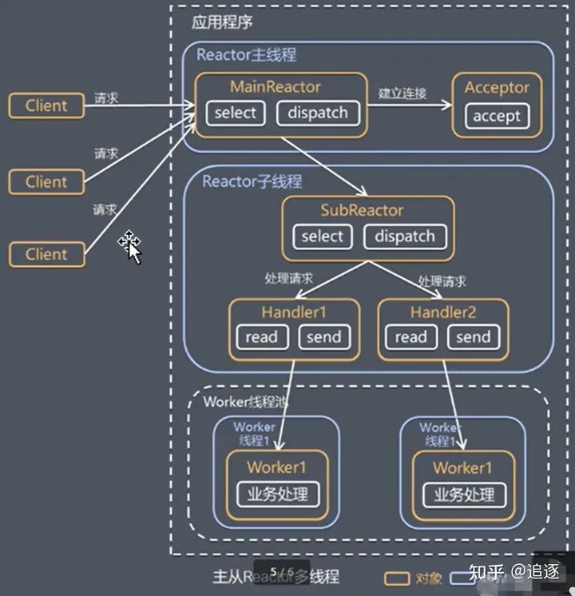

## Reactor

I/O复用结合线程池就是Reactor模式基本设计思想

Reactor模式是事件驱动架构的一种具体实现方法，简而言之，**就是一个单线程进行循环监听就绪IO事件，并将就绪IO事件分发给对应的回调函数**。

### **传统I/O服务模型**:


一般所有的网络服务，一般分为如下几个步骤：

- 读请求（read request）
- 读解析（read decode）
- 处理程序（process service）
- 应答编码 （encode reply）
- 发送应答（send reply）

**单线程模式**

对于很多小伙伴来说，最简单，最传统的方式就是一个方法来处理所有的请求，这种实现方式最简单，也是最保险的方式。

这种方式实现起来虽然简单，但是性能不行，如果其中有一个请求因为某种原因阻塞了，则他后面的所有请求都会阻塞在那里，同时他也没法利用多 CPU 的性能，性能严重不足。

**多线程模式**

单线程的性能肯定不行，那就调整为多线程方式。

每来一个请求就会创建一个线程来处理，这种方式虽然不会像 **单线程模式** 一样，一个线程会阻塞所有的请求，但是他依然很大的问题：

- 当客户端多，并发大的时候，需要创建大量线程来处理，线程的创建和销毁也很消耗资源，会导致整个系统的的资源占用较大
- 同样无法应对高性能和高并发

既然多线程模式需要创建这么多线程，那么我们控制创建线程的个数，采用资源复用 **线程池** 的方式，也就是我们不需要再为每一个连接创建一个线程，而是创建一个线程池，将连接分配给线程，然后一个线程可以处理多个链接。

这种线程池的方式虽然解决了系统资源占用的问题，但是他依然带了了一个新的问题，每一个线程如何高效地处理请求呢？

我们提到过在单个线程中如果当前连接在进行`read`操作时，如果没有数据可读，则会发生阻塞，那么线程就没有办法继续处理其他连接的业务了。那么怎么解决？将 `read` 操作改为非阻塞的方式，既然改为了非阻塞方式，那线程如何知道`read` 操作有数据可读了呢？

- 第一种方式，则是不断的去轮询，但是轮询要消耗 CPU的，而且随着轮询的线程多了，轮询的效率会越来越低
- 第二种方式，事件驱动（reactor模式）。当线程关心的事件发生了，比如`read` 有数据可读了，则通知相对应的线程进行处理

### Reactor模式


**说明**

Reactor模式称为反应器模式或应答者模式，是基于事件驱动的设计模式，拥有一个或多个并发输入源，有一个服务处理器和多个请求处理器，服务处理器会同步的将输入的请求事件以多路复用的方式分发给相应的请求处理器。

Reactor设计模式是一种为处理并发服务请求，并将请求提交到一个或多个服务处理程序的事件设计模式。当客户端请求抵达后，服务处理程序使用多路分配策略，由一个非阻塞的线程来接收所有请求，然后将请求派发到相关的工作线程并进行处理的过程。

在事件驱动的应用中，将一个或多个客户端的请求分离和调度给应用程序，同步有序地接收并处理多个服务请求。对于高并发系统经常会使用到Reactor模式，用来替代常用的多线程处理方式以节省系统资源并提高系统的吞吐量。

### 单Reactor单线程


**工作流程**：

- Reactor 线程通过 select （IO多路复用接口）监听事件，收到事件后通过Dispatch 来分发事件，事件会分发给Acceptor和Handler 两个组件，具体是哪个组件要看事件的类型。
- 如果事件类型为建立连接，则将事件分发给Acceptor，Acceptor会通过 accept 方法 获取连接，并创建一个 Handler 对象来处理后续的响应事件。
- 如果时间类型不是建立连接，则将该事件交由当前连接的Handler来处理。

**优缺点分析**

**优点：**模型简单，没有多线程、进程通信和竞争的问题，全部都在一个线程中完成。

**缺点：**

1、性能问题，只有一个线程，无法发挥多核CPU的性能，Handler在处理某个连接业务时，整个进程无法处理其他连接事件，很容易导致性能瓶颈。

2、可靠性问题，线程意外终止或进入死循环，会导致整个系统通信模块不可用，不能接收和处理外部消息，造成节点故障。

### 单Reactor多线程


**工作流程**

1、Reactor对象通过select监听客户端请求事件，收到事件后，通过dispatch进行分发。

2、如果建立连接请求，则Acceptor通过accept处理连接请求，然后创建一个Handler对象处理完成连接后的各种事件。

3、如果不是连接请求，则由reactor分发调用连接对应的handler来处理。

4、handler只负责相应事件，不做具体的业务处理，通过read读取数据后，会分发给后面的worker线程池的某个线程处理业务。

5、worker线程池会分配独立线程完成真正的业务，并将结果返回给handler。

6、handler收到响应后，通过send分发将结果返回给client。

**优点：由于Handler使用了多线程模式，可以充分利用多核cpu的处理能力**

**缺点：多线程数据共享和访问比较复杂，rector处理所有的事件的监听和响应，在单线程运行，在高并发应用场景下，容易出现性能瓶颈。**

### **主从Reactor多线程**



**工作流程**

1、Reactor主线程MainReactor对象通过select监听连接事件，收到事件后，通过Acceptor处理连接事件。

2、当Acceptor处理连接事件后，MainReactor将连接分配给SubAcceptor。

3、SubAcceptor将连接加入到连接队列进行监听（进行各种IO操作），并创建handler进行各种事件处理。

4、当有新事件发生时，SubAcceptor就会调用对应的handler进行各种事件处理。

5、handler通过read读取数据，分发给后面的work线程处理。

6、work线程池分配独立的work线程进行业务处理，并返回结果。

7、handler收到响应的结果后，再通过send返回给client。

**注意：Reactor主线程可以对应多个Reactor子线程，即SubAcceptor。**

### **Reactor模式总结**

**3种模式用生活案例来理解**

1、单reactor单线程，前台接待员、服务员时同一个人，全程为顾客服务。

2、单reactor多线程，1个前台接待，多个服务员，接待员只负责接待。

3、主从reactor多线程，多个前台接待，多个服务员。

**Reactor模式的优点**

1、响应块，不必为单个同步时间所阻塞，虽然Reactor本身依然是同步的（因为需要监听连接请求）。

2、可以最大程度的避免复杂的多线程及同步问题，并且避免多线程/进程的切换开销。

3、扩展性好，可以方便的通过增加Reactor实例个数来充分利用CPU资源。

4、复用性好，Reactor模式本身与具体事件处理逻辑无关，具有很高的复用性。


## epoll反应堆

epoll还有一种更高级的使用方法，那就是借鉴封装的思想，简单的说就是当某个事情发生了，自动的去处理这个事情。这样的思想对我们的编码来说就是设置回调，将文件描述符，对应的事件，和事件产生时的处理函数封装到一起，这样当某个文件描述符的事件发生了，回调函数会自动被触发，这就是所谓的反应堆思想。

```c++
	
typedef union epoll_data {
               void        *ptr;
               int          fd;
               uint32_t     u32;
               uint64_t     u64;
           } epoll_data_t;

```

我们之前使用的是共用体上的fd域,如果是要实现封装思想,光有fd是不够的,所以转换思路,看第一个域ptr,是一个泛型指针,指针可以指向一块内存区域,这块区域可以代表一个结构体,既然是结构体,那么我们就可以自定义了,将我们非常需要的文件描述符,事件类型,回调函数都封装在结构体上(我们在信号一章就见识过struct sigaction上有掩码和回调函数等信息),这样当我们要监控的文件描述符对应的事件发生之后,我们去调用回调函数就可以了，这样就可以将文件描述符对应事件的处理代码梳理的非常清晰。

**总结：**

反应堆就是**文件描述符  事件  回调函数 封装在一起，使用结构体来封装**


```c++
//反应堆简单版
#include <stdio.h>
#include <unistd.h>
#include <stdlib.h>
#include <fcntl.h>
#include <string.h>
#include <sys/types.h>
#include <sys/stat.h>
#include <sys/socket.h>
#include <arpa/inet.h>
#include <sys/epoll.h>
#include "wrap.h"

#define _BUF_LEN_  1024
#define _EVENT_SIZE_ 1024

//全局epoll树的根
int gepfd = 0;

//事件驱动结构体
typedef struct xx_event{
    int fd;
    int events;
    void (*call_back)(int fd,int events,void *arg);
    void *arg;
    char buf[1024];
    int buflen;
    int epfd;
}xevent;

xevent myevents[_EVENT_SIZE_+1];

void readData(int fd,int events,void *arg);

//添加事件
//eventadd(lfd,EPOLLIN,initAccept,&myevents[_EVENT_SIZE_-1],&myevents[_EVENT_SIZE_-1]);
void eventadd(int fd,int events,void (*call_back)(int ,int ,void *),void *arg,xevent *ev)
{
    ev->fd = fd;
    ev->events = events;
    //ev->arg = arg;//代表结构体自己,可以通过arg得到结构体的所有信息
    ev->call_back = call_back;

    struct epoll_event epv;
    epv.events = events;
    epv.data.ptr = ev;//核心思想
    epoll_ctl(gepfd,EPOLL_CTL_ADD,fd,&epv);//上树
}

//修改事件
//eventset(fd,EPOLLOUT,senddata,arg,ev);
void eventset(int fd,int events,void (*call_back)(int ,int ,void *),void *arg,xevent *ev)
{
    ev->fd = fd;
    ev->events = events;
    //ev->arg = arg;
    ev->call_back = call_back;

    struct epoll_event epv;
    epv.events = events;
    epv.data.ptr = ev;
    epoll_ctl(gepfd,EPOLL_CTL_MOD,fd,&epv);//修改
}

//删除事件
void eventdel(xevent *ev,int fd,int events)
{
	printf("begin call %s\n",__FUNCTION__);

    ev->fd = 0;
    ev->events = 0;
    ev->call_back = NULL;
    memset(ev->buf,0x00,sizeof(ev->buf));
    ev->buflen = 0;

    struct epoll_event epv;
    epv.data.ptr = NULL;
    epv.events = events;
    epoll_ctl(gepfd,EPOLL_CTL_DEL,fd,&epv);//下树
}

//发送数据
void senddata(int fd,int events,void *arg)
{
    printf("begin call %s\n",__FUNCTION__);

    xevent *ev = arg;
    Write(fd,ev->buf,ev->buflen);
    eventset(fd,EPOLLIN,readData,arg,ev);
}

//读数据
void readData(int fd,int events,void *arg)
{
    printf("begin call %s\n",__FUNCTION__);
    xevent *ev = arg;

    ev->buflen = Read(fd,ev->buf,sizeof(ev->buf));
    if(ev->buflen>0) //读到数据
	{	
		//void eventset(int fd,int events,void (*call_back)(int ,int ,void *),void *arg,xevent *ev)
        eventset(fd,EPOLLOUT,senddata,arg,ev);

    }
	else if(ev->buflen==0) //对方关闭连接
	{
        Close(fd);
        eventdel(ev,fd,EPOLLIN);
    }

}
//新连接处理
void initAccept(int fd,int events,void *arg)
{
    printf("begin call %s,gepfd =%d\n",__FUNCTION__,gepfd);//__FUNCTION__ 函数名

    int i;
    struct sockaddr_in addr;
    socklen_t len = sizeof(addr);
    int cfd = Accept(fd,(struct sockaddr*)&addr,&len);//是否会阻塞？
	
	//查找myevents数组中可用的位置
    for(i = 0 ; i < _EVENT_SIZE_; i ++)
	{
        if(myevents[i].fd==0)
		{
            break;
        }
    }

    //设置读事件
    eventadd(cfd,EPOLLIN,readData,&myevents[i],&myevents[i]);
}

int main(int argc,char *argv[])
{
	//创建socket
    int lfd = Socket(AF_INET,SOCK_STREAM,0);

    //端口复用
    int opt = 1;
    setsockopt(lfd,SOL_SOCKET,SO_REUSEADDR,&opt,sizeof(opt));

	//绑定
    struct sockaddr_in servaddr;
    servaddr.sin_family = AF_INET;
    servaddr.sin_port = htons(8888);
    servaddr.sin_addr.s_addr = htonl(INADDR_ANY);
    Bind(lfd,(struct sockaddr*)&servaddr,sizeof(servaddr));
    
	//监听
    Listen(lfd,128);

	//创建epoll树根节点
    gepfd = epoll_create(1024);
    printf("gepfd === %d\n",gepfd);

    struct epoll_event events[1024];

    //添加最初始事件，将侦听的描述符上树
    eventadd(lfd,EPOLLIN,initAccept,&myevents[_EVENT_SIZE_],&myevents[_EVENT_SIZE_]);
    //void eventadd(int fd,int events,void (*call_back)(int ,int ,void *),void *arg,xevent *ev)

    while(1)
	{
        int nready = epoll_wait(gepfd,events,1024,-1);
		if(nready<0) //调用epoll_wait失败
		{
			perr_exit("epoll_wait error");
			
		}
        else if(nready>0) //调用epoll_wait成功,返回有事件发生的文件描述符的个数
		{
            int i = 0;
            for(i=0;i<nready; i++)
			{
                xevent *xe = events[i].data.ptr;//取ptr指向结构体地址
                printf("fd=%d\n",xe->fd);

                if(xe->events & events[i].events)
				{
                    xe->call_back(xe->fd,xe->events,xe);//调用事件对应的回调
                }
            }
        }
    }

	//关闭监听文件描述符
	Close(lfd);

    return 0;
}

```

## 线程池

**首先什么是线程池？**

​    线程池是一个抽象概念，可以简单的认为若干线程在一起运行，线程不退出，等待有任务处理。

**为什么要有线程池？**

1. 以网络编程服务器端为例,作为服务器端支持高并发,可以有多个客户端连接,发出请求,对于多个请求我们每次都去建立线程,这样线程会创建很多,而且线程执行完销毁也会有很大的系统开销,使用上效率很低。
2. 之前在线程篇章中，我们也知道创建线程并非多多益善，所以我们的思路是提前创建好若干个线程，不退出，等待任务的产生，去接收任务处理后等待下一个任务。

线程池如何实现？需要思考2个问题？

1. 假设线程池创建了，线程们如何去协调接收任务并且处理？
2. 线程池上的线程如何能够执行不同的请求任务？

上述问题1就很像我们之前学过的生产者和消费者模型，客户端对应生产者，服务器端这边的线程池对应消费者，需要借助互斥锁和条件变量来搞定。

问题2解决思路就是利用回调机制，我们同样可以借助结构体的方式，对任务进行封装，比如任务的数据和任务处理回调都封装在结构体上，这样线程池的工作线程拿到任务的同时，也知道该如何执行了。


**总结：**

线程池,事先创建几个线程,,不停取任务,如果没有任务休眠,省去了不停的创建线程销毁销毁线程的事件和资源

注意: 线程池 处理的任务,所需要处理的时间必须很短


### 简易版线程池代码

thradPool.h

```c++
#ifndef _THREADPOOL_H
#define _THREADPOOL_H

#include <stdio.h>
#include <stdlib.h>
#include <string.h>
#include <sys/types.h>
#include <unistd.h>
#include <pthread.h>

typedef struct _PoolTask
{
    int tasknum;                  // 模拟任务编号
    void *arg;                    // 回调函数参数
    void (*task_func)(void *arg); // 任务的回调函数
} PoolTask;

typedef struct _ThreadPool
{
    int max_job_num; // 最大任务个数
    int job_num;     // 实际任务个数
    PoolTask *tasks; // 任务队列数组
    int job_push;    // 入队位置
    int job_pop;     // 出队位置

    int thr_num;                    // 线程池内线程个数
    pthread_t *threads;             // 线程池内线程数组
    int shutdown;                   // 是否关闭线程池
    pthread_mutex_t pool_lock;      // 线程池的锁
    pthread_cond_t queue_not_full;  // 当任务的队列满，添加任务队列阻塞，等待此条件变量
    pthread_cond_t queue_not_empty; // 当任务的队列空，获取任务队列阻塞，等待此条件变量

} ThreadPool;

void create_threadpool(int thrnum, int maxtasknum); // 创建线程池--thrnum  代表线程个数，maxtasknum 最大任务个数
void destroy_threadpool(ThreadPool *pool);          // 摧毁线程池
void addtask(ThreadPool *pool);                     // 添加任务到线程池
void taskRun(void *arg);                            // 任务回调函数

#endif

```


threadPool.c

```c++
// 简易版线程池
#include "threadPool.h"

ThreadPool *thrPool = NULL;

int beginnum = 1000;

void *thrRun(void *arg)
{
    // printf("begin call %s-----\n",__FUNCTION__);
    ThreadPool *pool = (ThreadPool *)arg;
    int taskpos = 0; // 任务位置
    PoolTask *task = (PoolTask *)malloc(sizeof(PoolTask));

    while (1)
    {
        // 获取任务，先要尝试加锁
        pthread_mutex_lock(&thrPool->pool_lock);

        // 无任务并且线程池不是要摧毁
        while (thrPool->job_num <= 0 && !thrPool->shutdown)
        {
            // 如果没有任务，线程会阻塞
            pthread_cond_wait(&thrPool->queue_not_empty, &thrPool->pool_lock);
        }

        if (thrPool->job_num)
        {
            // 有任务需要处理
            taskpos = (thrPool->job_pop++) % thrPool->max_job_num;
            // printf("task out %d...tasknum===%d tid=%lu\n",taskpos,thrPool->tasks[taskpos].tasknum,pthread_self());
            // 为什么要拷贝？避免任务被修改，生产者会添加任务
            memcpy(task, &thrPool->tasks[taskpos], sizeof(PoolTask));
            task->arg = task;
            thrPool->job_num--;
            // task = &thrPool->tasks[taskpos];
            pthread_cond_signal(&thrPool->queue_not_full); // 通知生产者
        }

        if (thrPool->shutdown)
        {
            // 代表要摧毁线程池，此时线程退出即可
            // pthread_detach(pthread_self());//临死前分家
            pthread_mutex_unlock(&thrPool->pool_lock);
            free(task);
            pthread_exit(NULL);
        }

        // 释放锁
        pthread_mutex_unlock(&thrPool->pool_lock);
        task->task_func(task->arg); // 执行回调函数
    }

    // printf("end call %s-----\n",__FUNCTION__);
}

// 创建线程池
void create_threadpool(int thrnum, int maxtasknum)
{
    printf("begin call %s-----\n", __FUNCTION__);
    thrPool = (ThreadPool *)malloc(sizeof(ThreadPool));

    thrPool->thr_num = thrnum;
    thrPool->max_job_num = maxtasknum;
    thrPool->shutdown = 0; // 是否摧毁线程池，1代表摧毁
    thrPool->job_push = 0; // 任务队列添加的位置
    thrPool->job_pop = 0;  // 任务队列出队的位置
    thrPool->job_num = 0;  // 初始化的任务个数为0

    thrPool->tasks = (PoolTask *)malloc((sizeof(PoolTask) * maxtasknum)); // 申请最大的任务队列

    // 初始化锁和条件变量
    pthread_mutex_init(&thrPool->pool_lock, NULL);
    pthread_cond_init(&thrPool->queue_not_full, NULL);
    pthread_cond_init(&thrPool->queue_not_empty, NULL);

    int i = 0;
    thrPool->threads = (pthread_t *)malloc(sizeof(pthread_t) * thrnum); // 申请n个线程id的空间

    pthread_attr_t attr;
    pthread_attr_init(&attr);
    pthread_attr_setdetachstate(&attr, PTHREAD_CREATE_DETACHED);
    for (i = 0; i < thrnum; i++)
    {
        pthread_create(&thrPool->threads[i], &attr, thrRun, (void *)thrPool); // 创建多个线程
    }
    // printf("end call %s-----\n",__FUNCTION__);
}
// 摧毁线程池
void destroy_threadpool(ThreadPool *pool)
{
    pool->shutdown = 1;                             // 开始自爆
    pthread_cond_broadcast(&pool->queue_not_empty); // 诱杀

    int i = 0;
    for (i = 0; i < pool->thr_num; i++)
    {
        pthread_join(pool->threads[i], NULL);
    }

    pthread_cond_destroy(&pool->queue_not_empty);
    pthread_cond_destroy(&pool->queue_not_full);
    pthread_mutex_destroy(&pool->pool_lock);

    free(pool->tasks);
    free(pool->threads);
    free(pool);
}

// 添加任务到线程池
void addtask(ThreadPool *pool)
{
    // printf("begin call %s-----\n",__FUNCTION__);
    pthread_mutex_lock(&pool->pool_lock);

    // 实际任务总数大于最大任务个数则阻塞等待(等待任务被处理)
    while (pool->max_job_num <= pool->job_num)
    {
        pthread_cond_wait(&pool->queue_not_full, &pool->pool_lock);
    }

    int taskpos = (pool->job_push++) % pool->max_job_num;
    // printf("add task %d  tasknum===%d\n",taskpos,beginnum);
    pool->tasks[taskpos].tasknum = beginnum++;
    pool->tasks[taskpos].arg = (void *)&pool->tasks[taskpos];
    pool->tasks[taskpos].task_func = taskRun;
    pool->job_num++;

    pthread_mutex_unlock(&pool->pool_lock);

    pthread_cond_signal(&pool->queue_not_empty); // 通知包身工
    // printf("end call %s-----\n",__FUNCTION__);
}

// 任务回调函数
void taskRun(void *arg)
{
    PoolTask *task = (PoolTask *)arg;
    int num = task->tasknum;
    printf("task %d is runing %lu\n", num, pthread_self());

    sleep(1);
    printf("task %d is done %lu\n", num, pthread_self());
}

int main()
{
    create_threadpool(3, 20);
    int i = 0;
    for (i = 0; i < 50; i++)
    {
        addtask(thrPool); // 模拟添加任务
    }

    sleep(20);
    destroy_threadpool(thrPool);

    return 0;
}

```

