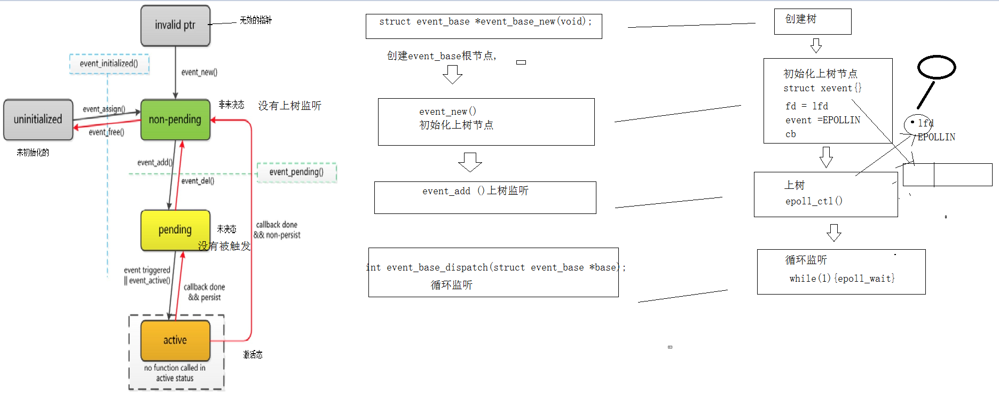
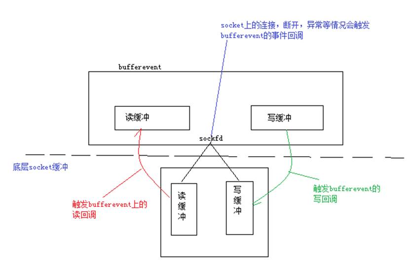
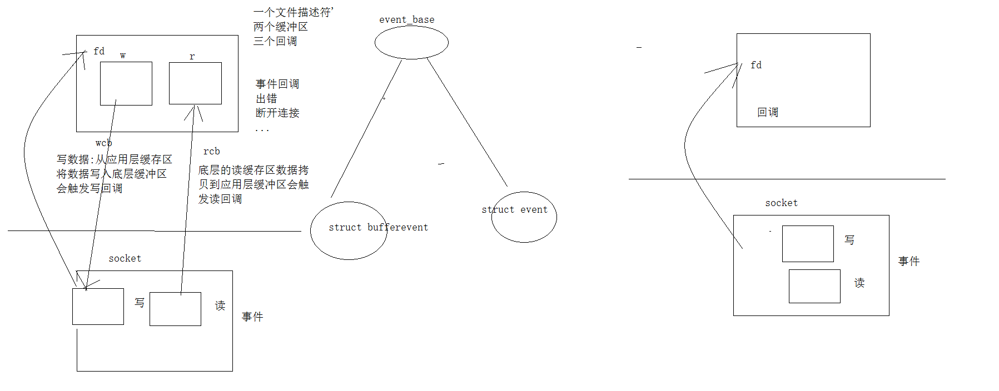
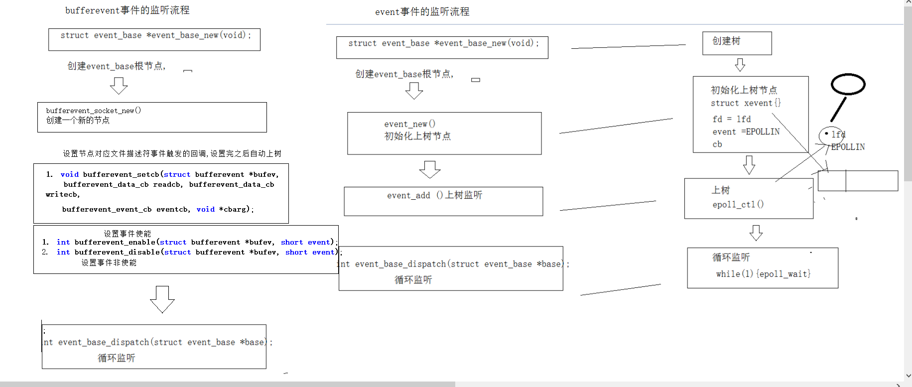
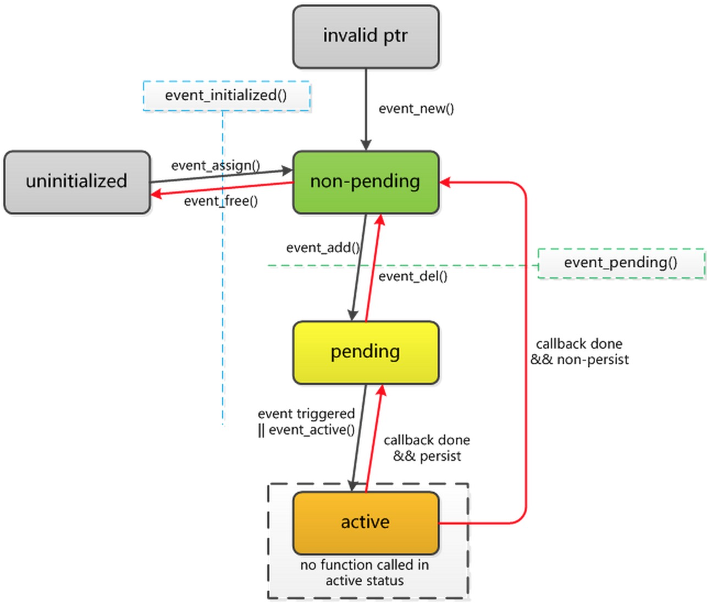

## libevent简介

Libevent 是一个用C语言编写的、轻量级的开源高性能事件通知库，主要有以下几个亮点：事件驱动（ event-driven），高性能;轻量级，专注于网络，不如 ACE 那么臃肿庞大；源代码相当精炼、易读；跨平台，支持 Windows、 Linux、 *BSD 和 Mac Os；支持多种 I/O 多路复用技术， epoll、 poll、 dev/poll、 select 和 kqueue 等；支持 I/O，定时器和信号等事件；注册事件优先级。


**libevent组成**：

libevent包括事件管理、缓存管理、DNS、HTTP、缓存事件几大部分。事件管理包括各种IO（socket）、定时器、信号等事件；缓存管理是指evbuffer功能；DNS是libevent提供的一个异步DNS查询功能；HTTP是libevent的一个轻量级http实现，包括服务器和客户端。libevent也支持ssl，这对于有安全需求的网络程序非常的重要，但是其支持不是很完善，比如http server的实现就不支持ssl


**libevent核心实现**：

Reactor（反应堆）模式是libevent的核心框架，libevent以事件驱动，自动触发回调功能。之前介绍的epoll反应堆的源码，就是从libevent中抽取出来的。

## 安装libevent

**环境：centos7.9**

**版本**：[libevent-2.0.22](https://github.com/libevent/libevent/releases/download/release-2.0.22-stable/libevent-2.0.22-stable.tar.gz) 

 

1. 解压:

​	**tar -xzvf libevent-2.0.22-stable.tar.gz -C ./install**

2. 执行configure ,检测环境生成makefile

​	./configure

3. 编译

​	make

4. 安装

​	sudo make install

**库的路径: /usr/local/lib**

**头文件目录: /usr/local/include**

**编译时需要指定库名 -levent**

## libevent使用

### 普通event事件流程与相关API

1. 创建event_base根节点，释放根节点

   > 在使用libevent的函数之前，需要先申请一个或event_base结构，相当于盖房子时的地基。在event_base基础上会有一个事件集合，可以检测哪个事件是激活的（就绪）。
   >
   > 通常情况下可以通过event_base_new函数获得event_base结构。
   >
   > ​    **struct event_base *event_base_new(void);**
   >
   > 
   >
   > 如果fork出子进程，想在子进程继续使用event_base，那么子进程需要对event_base重新初始化，函数如下：
   >
   > ​    **int event_reinit(struct event_base *base);**
   >
   > 对于不同系统而言，event_base就是调用不同的多路IO接口去判断事件是否已经被激活，对于linux系统而言，核心调用的就是epoll，同时支持poll和select。
   >
   >  
   >
   > 释放根节点：
   >
   > 申请到event_base结构指针可以通过event_base_free进行释放。
   >
   > ​    **void event_base_free(struct event_base *);**

2. 循环监听-等待event_base监听的文件描述符上产生了对应的事件

   > Libevent在地基打好之后，需要等待事件的产生，也就是等待想要等待的事件的激活，那么程序不能退出，对于epoll来说，我们需要自己控制循环，而在libevent中也给我们提供了api接口，函数如下：
   >
   > **int** **event_base_dispatch(**struct **event_base** ***base);**
   >
   > 相当于 while(1){epoll_wait}循环监听
   >
   > **程序将会一直运行，直到没有需要检测的事件了，或者被结束循环的api终止。**
   >
   >  
   >
   > **退出循环监听**：
   >
   > **int** **event_base_loopexit(struct** **event_base** ***base,** **const** **struct** **timeval** ***tv);**
   >
   > **int** **event_base_loopbreak(struct** **event_base** ***base);**
   >
   > struct timeval {
   >
   > ​    long  tv_sec;          
   >
   > ​    long  tv_usec;      
   >
   > };
   >
   > **两个函数的区别是如果正在执行激活事件的回调函数，那么event_base_loopexit将在事件回调执行结束后终止循环（如果tv时间非NULL，那么将等待tv设置的时间后立即结束循环），而event_base_loopbreak会立即终止循环。**


先介绍一下libevent的事件触发流程



主要几个状态：

无效的指针 此时仅仅是定义了 struct event *ptr；

非未决：相当于创建了事件，但是事件还没有处于被监听状态，类似于我们使用epoll的时候定义了struct epoll_event ev并且对ev的两个字段进行了赋值，但是此时尚未调用epoll_ctl。

未决：就是对事件开始监听，暂时未有事件产生。相当于调用epoll_ctl。

激活：代表监听的事件已经产生，这时需要处理，相当于我们epoll所说的事件就绪。


3. 初始化上树节点

   > Libevent的事件驱动对应的结构体为struct event，对应的函数在图上也比较清晰，下面介绍一下主要的函数
   >
   > ```c++
   > struct event *event_new(struct event_base *base, evutil_socket_t fd, short events, event_callback_fn cb, void *arg);
   > 
   > event_new负责新创建event结构指针，同时指定对应的地基base，还有对应的文件描述符，事件，以及回调函数和回调函数的参数。参数说明：
   > 
   > base 对应的根节点
   > 
   > fd 要监听的文件描述符
   > 
   > events 要监听的事件
   > 
   > #define  EV_TIMEOUT     0x01  //超时事件
   > 
   > #define  EV_READ          0x02 //读事件
   > 
   > #define  EV_WRITE         0x04 //写事件
   > 
   > #define  EV_SIGNAL        0x08   //信号事件
   > 
   > #define  EV_PERSIST        0x10  //周期性触发
   > 
   > #define  EV_ET             0x20 //边缘触发，如果底层模型支持
   > 
   > cb 回调函数，原型如下：
   > 
   > typedef void (*event_callback_fn)(evutil_socket_t fd, short events, void *arg);
   > 
   > arg 回调函数的参数
   > 
   > 返回值: 初始化好的节点的地址
   > ```
   >
   > 

4. 节点上树

   > ```c++
   > int event_add(struct event *ev, const struct timeval *timeout);
   > 
   > 将非未决态事件转为未决态，相当于调用epoll_ctl函数，开始监听事件是否产生。
   > 
   > 参数说明：
   > 
   >  Ev 就是前面event_new创建的事件
   > 
   > Timeout 限时等待事件的产生，也可以设置为NULL，没有限时。
   > ```
   >
   > 

5. 节点下树

   > ```c++
   > int event_del(struct event *ev);
   > ```
   >
   > 将事件从未决态变为非未决态，相当于epoll的下树（epoll_ctl调用EPOLL_CTL_DEL操作）操作。

6. 释放节点

   > ```c++
   > void event_free(struct event *ev);
   > ```
   >
   > 释放event_new申请的event节点。

### 普通event + 数组实现tcp服务器代码

```c++

```

### bufferEvent介绍

**普通的event事件  文件描述符  事件(底层缓冲区的读事件或者写事件) 触发  回调**

Bufferevent实际上也是一个event，只不过比普通的event高级一些，它的内部有**两个缓冲区**，以及**一个文件描述符（网络套接字）**。我们都知道一个网络套接字有读和写两个缓冲区，bufferevent同样也带有两个缓冲区，还有就是libevent事件驱动的核心回调函数，那么四个缓冲区以及触发回调的关系如下：





有三个回调函数：

1. 读回调 – 当bufferevent将底层读缓冲区的数据读到自身的读缓冲区时（bufferevent的缓存区不是直接将数据读到用户传入的buffer中）触发读事件回调
2. 写回调 – 当bufferevent将自身写缓冲的数据写到底层写缓冲区的时候出发写事件回调
3. 事件回调 – 当bufferevent绑定的socket连接，断开或者异常的时候触发事件回调


### **bufferevent事件监听流程**



### bufferevent API

1. 创建新节点

   > ```c++
   > struct bufferevent *bufferevent_socket_new(struct event_base *base, evutil_socket_t fd, int options);
   > 
   > bufferevent_socket_new 对已经存在socket创建bufferevent事件，可用于后面讲到的链接监听器的回调函数中，参数说明：
   > 	base – 对应根节点
   > 	fd   -- 文件描述符
   > 	options – bufferevent的选项
   > 		BEV_OPT_CLOSE_ON_FREE   -- 释放bufferevent自动关闭底层接口    
   > 		BEV_OPT_THREADSAFE      -- 使bufferevent能够在多线程下是安全的
   > 返回值:
   >    新建节点的地址
   > ```
   >
   > 

2. 设置节点的回调

   > 设置节点回调成功后，节点自动上树
   >
   > ```c++
   > void bufferevent_setcb(struct bufferevent *bufev,bufferevent_data_cb readcb, bufferevent_data_cb writecb,bufferevent_event_cb eventcb, void *cbarg);
   > 
   > 	bufferevent_setcb用于设置bufferevent的回调函数，readcb，writecb，eventcb分别对应了读回调，写回调，事件回调，cbarg代表回调函数的参数。
   > 	回调函数的原型：
   > 	typedef void (*bufferevent_data_cb)(struct bufferevent *bev, void *ctx);//读写回调
   > 	typedef void (*bufferevent_event_cb)(struct bufferevent *bev, short what, void *ctx);//事件回调
   > What 代表 对应的事件
   >     BEV_EVENT_EOF, 对方关闭连接
   > 	BEV_EVENT_ERROR，出错
   >     BEV_EVENT_TIMEOUT, 超时
   > 	BEV_EVENT_CONNECTED 建立连接成功
   > 
   > ```
   >
   > 

3. 让事件使能（也就是使事件能够被监听）

   > bufferevent_enable与bufferevent_disable是设置事件是否生效，如果设置为disable，事件回调将不会被触发
   >
   > ```c++
   > int bufferevent_enable(struct bufferevent *bufev, short event);//EV_READ  EV_WRITE
   > int bufferevent_disable(struct bufferevent *bufev, short event);//EV_READ  EV_WRITE
   > ```
   >
   > 

4. 发送数据，接受数据

   > 注意应用层缓冲区会自动写内容到socket的缓冲区，然后触发写回调函数
   >
   > 同样的应用层读缓冲区也会自动读socket的读缓冲区从里面获取数据
   >
   > ```c++
   > 发送数据
   > int bufferevent_write(struct bufferevent *bufev, const void *data, size_t size);
   >     bufferevent_write是将data的数据写到bufferevent的写缓冲区，注意是写到应用层的缓冲区
   > 
   > 接收数据
   > size_t bufferevent_read(struct bufferevent *bufev, void *data, size_t size);
   >     bufferevent_read 是将bufferevent的读缓冲区数据读到data中，同时将读到的数据从bufferevent的读缓冲清除。
   >         注意是从应用层的读缓冲区读数据
   >         
   >   
   > ```
   >
   > 

5. 连接侦听器  == 创建套接字，绑定，监听，提取

   > 链接监听器封装了底层的socket通信相关函数，比如socket，bind，listen，accept这几个函数。链接监听器创建后实际上相当于调用了socket，bind，listen，此时等待新的客户端连接到来，如果有新的客户端连接，那么内部先进行accept处理，然后调用用户指定的回调函数
   >
   > ```c++
   > struct evconnlistener *evconnlistener_new_bind(struct event_base *base,evconnlistener_cb cb, void *ptr, unsigned flags, int backlog,const struct sockaddr *sa, int socklen);
   > 
   > 参数: 
   >     base : base根节点
   >     cb : 提取cfd后调用的回调
   >     ptr : 传给回调的参数
   >         
   > 	Flags 需要参考几个值：
   > 	LEV_OPT_LEAVE_SOCKETS_BLOCKING   文件描述符为阻塞的（默认创建的socket为阻塞）
   > 	LEV_OPT_CLOSE_ON_FREE            关闭时自动释放
   > 	LEV_OPT_REUSEABLE                端口复用
   > 	LEV_OPT_THREADSAFE               分配锁，线程安全
   > 
   >     backlog : -1
   >     sa : 绑定的地址信息
   >     socklen : sa的大小
   >     返回值: 连接侦听器的地址
   >         
   > 回调函数:
   > typedef void (*evconnlistener_cb)(struct evconnlistener *evl, evutil_socket_t fd, struct sockaddr *cliaddr, int socklen, void *ptr);
   > 参数:
   >     evl :  链接侦听器的地址
   >     fd :  cfd--accept之后返回的文件描述符，传入到回调函数
   >     cliaddr: 新连接的对端地址信息
   >     ptr:  evconnlistener_new_bind传过来的参数
   > ```
   >
   > ​     evconnlistener_new_bind是在当前没有套接字的情况下对链接监听器进行初始化，看最后2个参数实际上就是bind使用的关键参数，backlog是listen函数的关键参数（略有不同的是，如果backlog是-1，那么监听器会自动选择一个合适的值，如果填0，那么监听器会认为listen函数已经被调用过了），ptr是回调函数的参数，cb是有新连接之后的回调函数，<font color='red'>但是注意这个回调函数触发的时候，链接器已经处理好新连接了，也就是说触发这个回调的时候已经accept成功了</font>，并将与新连接的通信socket描述符交给回调函数。

6. 创建套接字 连接服务器

   > ```c++
   > int bufferevent_socket_connect(struct bufferevent *bev, struct sockaddr *serv, int socklen);
   > bev: 新建的节点
   > serv: 服务器的地址信息
   > 
   > socklen: serv长度
   > ```
   >
   > 

### buffer event服务端代码

```c++
其中有涉及到信号的函数，对应一个信号事件而已，处理机制略有不同。
#define evsignal_new(b, x, cb, arg)				\
	event_new((b), (x), EV_SIGNAL|EV_PERSIST, (cb), (arg))

```


```c++
/*
  This exmple program provides a trivial server program that listens for TCP
  connections on port 9995.  When they arrive, it writes a short message to
  each client connection, and closes each connection once it is flushed.

  Where possible, it exits cleanly in response to a SIGINT (ctrl-c).
*/


#include <string.h>
#include <errno.h>
#include <stdio.h>
#include <signal.h>
#ifndef WIN32
#include <netinet/in.h>
# ifdef _XOPEN_SOURCE_EXTENDED
#  include <arpa/inet.h>
# endif
#include <sys/socket.h>
#endif

#include <event2/bufferevent.h>
#include <event2/buffer.h>
#include <event2/listener.h>
#include <event2/util.h>
#include <event2/event.h>

static const char MESSAGE[] = "Hello, World!\n";

static const int PORT = 9995;

static void conn_readcb(struct bufferevent *bev, void *user_data);
static void listener_cb(struct evconnlistener *, evutil_socket_t,
    struct sockaddr *, int socklen, void *);
static void conn_writecb(struct bufferevent *, void *);
static void conn_eventcb(struct bufferevent *, short, void *);
static void signal_cb(evutil_socket_t, short, void *);

int
main(int argc, char **argv)
{
	struct event_base *base;
	struct evconnlistener *listener;
	struct event *signal_event;

	struct sockaddr_in sin;
#ifdef WIN32
	WSADATA wsa_data;
	WSAStartup(0x0201, &wsa_data);
#endif

	base = event_base_new();//创建event_base根节点
	if (!base) {
		fprintf(stderr, "Could not initialize libevent!\n");
		return 1;
	}

	memset(&sin, 0, sizeof(sin));
	sin.sin_family = AF_INET;
	sin.sin_port = htons(PORT);

	//创建链接侦听器
	listener = evconnlistener_new_bind(base, listener_cb, (void *)base,
	    LEV_OPT_REUSEABLE|LEV_OPT_CLOSE_ON_FREE, -1,
	    (struct sockaddr*)&sin,
	    sizeof(sin));

	if (!listener) {
		fprintf(stderr, "Could not create a listener!\n");
		return 1;
	}
	//创建信触发的节点
	signal_event = evsignal_new(base, SIGINT, signal_cb, (void *)base);
	//将信号节点上树
	if (!signal_event || event_add(signal_event, NULL)<0) {
		fprintf(stderr, "Could not create/add a signal event!\n");
		return 1;
	}

	event_base_dispatch(base);//循环监听

	evconnlistener_free(listener);//释放链接侦听器
	event_free(signal_event);//释放信号节点
	event_base_free(base);//释放event_base根节点

	printf("done\n");
	return 0;
}

static void
listener_cb(struct evconnlistener *listener, evutil_socket_t fd,
    struct sockaddr *sa, int socklen, void *user_data)
{
	struct event_base *base = user_data;
	struct bufferevent *bev;

	//将fd上树
	//新建一个buffervent节点
	bev = bufferevent_socket_new(base, fd, BEV_OPT_CLOSE_ON_FREE);
	if (!bev) {
		fprintf(stderr, "Error constructing bufferevent!");
		event_base_loopbreak(base);
		return;
	}
	//设置回调
	bufferevent_setcb(bev, conn_readcb, conn_writecb, conn_eventcb, NULL);
	bufferevent_enable(bev, EV_WRITE | EV_READ);//设置写事件使能
	//bufferevent_disable(bev, EV_READ);//设置读事件非使能

	bufferevent_write(bev, MESSAGE, strlen(MESSAGE));//给cfd发送消息 helloworld
}
static void conn_readcb(struct bufferevent *bev, void *user_data)
{
	char buf[1500]="";
	int n = bufferevent_read(bev,buf,sizeof(buf));
	printf("%s\n",buf);
	bufferevent_write(bev, buf,n);//给cfd发送消息 


}

static void
conn_writecb(struct bufferevent *bev, void *user_data)
{
	struct evbuffer *output = bufferevent_get_output(bev);//获取缓冲区类型
	if (evbuffer_get_length(output) == 0) {
		
	//	printf("flushed answer\n");
	//	bufferevent_free(bev);//释放节点 自动关闭
	}
}

static void
conn_eventcb(struct bufferevent *bev, short events, void *user_data)
{
	if (events & BEV_EVENT_EOF) {
		printf("Connection closed.\n");
	} else if (events & BEV_EVENT_ERROR) {
		printf("Got an error on the connection: %s\n",
		    strerror(errno));/*XXX win32*/
	}
	/* None of the other events can happen here, since we haven't enabled
	 * timeouts */
	bufferevent_free(bev);
}

static void
signal_cb(evutil_socket_t sig, short events, void *user_data)
{
	struct event_base *base = user_data;
	struct timeval delay = { 2, 0 };

	printf("Caught an interrupt signal; exiting cleanly in two seconds.\n");

	event_base_loopexit(base, &delay);//退出循环监听
}

```

### buffer event客户端代码


## libevent补充


### 事件 event

libevent 的基本操作单元是事件。每个事件代表一组条件的集合,这些条件包括:

- 文件描述符已经就绪,可以读取或者写入
- 文件描述符变为就绪状态,可以读取或者写入(仅对于边沿触发 IO)
- 超时事件
- 发生某信号
- 用户触发事件

所有事件具有相似的生命周期。调用 libevent 函数设置事件并且关联到 event_base 之后, 事件进入“已初始化(initialized)”状态。此时可以将事件添加到 event_base 中,这使之进入“未决(pending)”状态。在未决状态下,如果触发事件的条件发生(比如说,文件描述 符的状态改变,或者超时时间到达 ),则事件进入“激活(active)”状态,(用户提供的)事件回调函数将被执行。如果配置为“持久的(persistent)”,事件将保持为未决状态。否则, 执行完回调后,事件不再是未决的。删除操作可以让未决事件成为非未决(已初始化)的 ; 添加操作可以让非未决事件再次成为未决的。

#### 1.生成事件

使用 event_new()接口创建事件。

```
#define EV_TIMEOUT      0x01
#define EV_READ         0x02
#define EV_WRITE        0x04
#define EV_SIGNAL       0x08
#define EV_PERSIST      0x10
#define EV_ET           0x20

typedef void (*event_callback_fn)(evutil_socket_t, short, void *);

struct event *event_new(struct event_base *base, evutil_socket_t fd,
    short what, event_callback_fn cb,
    void *arg);

void event_free(struct event *event);
```

event_new()试图分配和构造一个用于 base 的新的事件。what 参数是上述标志的集合。

如果 fd 非负,则它是将被观察其读写事件的文件。事件被激活时, libevent 将调用 cb 函数,

回调函数传递这些参数:文件描述符 fd,表示所有被触发事件的位字段 ,以及构造事件时的 arg 参数。

发生内部错误,或者传入无效参数时, event_new()将返回 NULL。

> 所有新创建的事件都处于已初始化和非未决状态 ,调用 event_add()可以使其成为未决的。

要释放事件,调用 event_free()。对未决或者激活状态的事件调用 event_free()是安全 的:在释放事件之前,函数将会使事件成为非激活和非未决的。

#### 2.事件标志

- EV_TIMEOUT

这个标志表示某超时时间流逝后事件成为激活的。构造事件的时候,EV_TIMEOUT 标志是 被忽略的:可以在添加事件的时候设置超时 ,也可以不设置。超时发生时,回调函数的 what 参数将带有这个标志。

- EV_READ

表示指定的文件描述符已经就绪,可以读取的时候,事件将成为激活的。

- EV_WRITE

表示指定的文件描述符已经就绪,可以写入的时候,事件将成为激活的。

-  EV_SIGNAL
  用于实现信号检测,请看下面的 “构造信号事件”节。 
-  EV_PERSIST
  表示事件是“持久的”,请看下面的“关于事件持久性”节。 
-  EV_ET 

表示如果底层的 event_base 后端支持边沿触发事件,则事件应该是**边沿触发**的。这个标志 影响 EV_READ 和 EV_WRITE 的语义。


从2.0.1-alpha 版本开始,可以有任意多个事件因为同样的条件而未决。比如说,可以有两个事件因为某个给定的fd已经就绪,可以读取而成为激活的。这种情况下,多个事件回调 被执行的次序是不确定的。

#### 3.事件的持久性

默认情况下,每当未决事件成为激活的(因为 fd 已经准备好读取或者写入,或者因为超时), **事件将在其回调被执行前成为非未决的**。如果想让事件再次成为未决的 ,可以在回调函数中 再次对其调用 event_add()。

然而,如果设置了 EV_PERSIST 标志,事件就是持久的。这意味着即使其回调被激活 ,事件还是会保持为未决状态 。如果想在回调中让事件成为非未决的 ,可以对其调用 event_del ()。

每次执行事件回调的时候,持久事件的超时值会被复位。因此,如果具有 EV_READ|EV_PERSIST 标志,以及5秒的超时值,则事件将在以下情况下成为激活的:

- 套接字已经准备好被读取的时候
- 从最后一次成为激活的开始,已经逝去 5秒

#### 4.信号事件

libevent 也可以监测 POSIX 风格的信号。要构造信号处理器,使用:

```
#define evsignal_new(base, signum, cb, arg) \
    event_new(base, signum, EV_SIGNAL|EV_PERSIST, cb, arg)
```

除了提供一个信号编号代替文件描述符之外,各个参数与 event_new()相同。

示例：

```
struct event *hup_event;
struct event_base *base = event_base_new();

/* call sighup_function on a HUP signal */
hup_event = evsignal_new(base, SIGHUP, sighup_function, NULL);
```

```
注意 :信号回调是信号发生后在事件循环中被执行的,所以可以安全地调用通常不能 在 POSIX 风格信号处理器中使用的函数。
```

**信号宏函数**：

```
#define evsignal_add(ev, tv) \
    event_add((ev),(tv))
#define evsignal_del(ev) \
    event_del(ev)
#define evsignal_pending(ev, what, tv_out) \
    event_pending((ev), (what), (tv_out))
```

<font color='red'>warring</font>:

在当前版本的 libevent 和大多数后端中,**每个进程任何时刻**只能有一个 event_base 可以监 听信号。如果同时向两个 event_base 添加信号事件,即使是不同的信号,也只有一 个 event_base 可以取得信号。

#### 5.事件的未决和非未决

构造事件之后,在将其添加到 event_base 之前实际上是不能对其做任何操作的。使用event_add()将事件添加到 event_base。

- 设置为未决事件，开始监听该事件

  ```
  int event_add(struct event *ev, const struct timeval *tv);
  ```

- 设置为非未决事件，不监听该事件

  ```
  int event_del(struct event *ev);
  
  对已经初始化的事件调用 event_del()将使其成为非未决和非激活的。如果事件不是未决的或者激活的,调用将没有效果。成功时函数返回 0,失败时返回-1。
  
  注意:如果在事件激活后,其回调被执行前删除事件,回调将不会执行。
  ```

  

#### 6.检查事件状态

了解事件是否已经添加,检查事件代表什么

```
int event_pending(const struct event *ev, short what, struct timeval *tv_out);

#define event_get_signal(ev) /* ... */

evutil_socket_t event_get_fd(const struct event *ev);

struct event_base *event_get_base(const struct event *ev);

short event_get_events(const struct event *ev);

event_callback_fn event_get_callback(const struct event *ev);

void *event_get_callback_arg(const struct event *ev);

int event_get_priority(const struct event *ev);

void event_get_assignment(const struct event *event,
        struct event_base **base_out,
        evutil_socket_t *fd_out,
        short *events_out,
        event_callback_fn *callback_out,
        void **arg_out);
```

event_pending()函数确定给定的事件是否是未决的或者激活的。如果是,而且 what 参数设置了 EV_READ、EV_WRITE、EV_SIGNAL 或者 EV_TIMEOUT 等标志,则函数会返回事件当前为 未决或者激活的 所有标志。如果提供了 tv_out 参数,并且 what 参数中设置了 EV_TIMEOUT 标志,而事件当前正因超时事件而未决或者激活,则 tv_out 会返回事件 的超时值。


event_get_fd()和 event_get_signal()返回为事件配置的文件描述符或者信号值。 

event_get_base()返回为事件配置的 event_base。

event_get_events()返回事件的标志(EV_READ、EV_WRITE 等)。

event_get_callback()和 event_get_callback_arg() 返回事件的回调函数及其参数指针。


event_get_assignment()复制所有为事件分配的字段到提供的指针中。任何为 NULL 的参数会被忽略。

**示例**：

```
#include <event2/event.h>
#include <stdio.h>

/* Change the callback and callback_arg of 'ev', which must not be
 * pending. */
int replace_callback(struct event *ev, event_callback_fn new_callback,
    void *new_callback_arg)
{
    struct event_base *base;
    evutil_socket_t fd;
    short events;

    int pending;

    pending = event_pending(ev, EV_READ|EV_WRITE|EV_SIGNAL|EV_TIMEOUT,
                            NULL);
    if (pending) {
        /* We want to catch this here so that we do not re-assign a
         * pending event.  That would be very very bad. */
        fprintf(stderr,
                "Error! replace_callback called on a pending event!\n");
        return -1;
    }

    event_get_assignment(ev, &base, &fd, &events,
                         NULL /* ignore old callback */ ,
                         NULL /* ignore old callback argument */);

    event_assign(ev, base, fd, events, new_callback, new_callback_arg);
    return 0;
}
```

#### 一次触发事件

如果不需要多次添加一个事件,或者要在添加后立即删除事件,而事件又不需要是持久的 , 则可以使用 event_base_once()。

```
int event_base_once(struct event_base *, evutil_socket_t, short,
  void (*)(evutil_socket_t, short, void *), void *, const struct timeval *);
```

除了不支持 EV_SIGNAL 或者 EV_PERSIST 之外,这个函数的接口与 event_new()相同。 安排的事件将以默认的优先级加入到 event_base并执行。回调被执行后,libevent内部将 会释放 event 结构。成功时函数返回0,失败时返回-1。

**不能删除或者手动激活使用 event_base_once ()插入的事件**:如果希望能够取消事件, 应该使用 event_new()或者 event_assign()。

#### 8.事件状态的转化



### Bufferevent

很多时候,除了响应事件之外,应用还希望做一定的数据缓冲。比如说,写入数据的时候 ,通常的运行模式是:

-  决定要向连接写入一些数据,把数据放入到缓冲区中 
-  等待连接可以写入 
-  写入尽量多的数据 
-  记住写入了多少数据,如果还有更多数据要写入,等待连接再次可以写入 

这种缓冲 IO 模式很通用,libevent 为此提供了一种通用机制,即bufferevent。

bufferevent 由一个底层的传输端口(如套接字 ),一个读取缓冲区和一个写入缓冲区组成。**与通常的事件在底层传输端口已经就绪,可以读取或者写入的时候执行回调不同的是**,bufferevent 在读取或者写入了足够量的数据之后调用用户提供的回调。

#### bufferevent初始化

基于套接字的 bufferevent 是最简单的,它使用 libevent 的底层事件机制来检测底层网络套 接字是否已经就绪,可以进行读写操作,并且使用底层网络调用(如 readv 、 writev 、 WSASend、WSARecv)来发送和接收数据。

1. 创建基于套接字的bufferevent

   > ```
   > struct bufferevent *bufferevent_socket_new(
   >     struct event_base *base,
   >     evutil_socket_t fd,
   >     enum bufferevent_options options);
   > ```
   >
   > base 是 event_base,
   >
   > options 是表示 bufferevent 选项(BEV_OPT_CLOSE_ON_FREE 等) 的位掩码, 
   >
   > fd是一个可选的表示套接字的文件描述符。如果想以后设置文件描述符,可以设置fd为-1。
   >
   > 成功时函数返回一个 bufferevent,失败则返回 NULL。

2. 在bufferevent上启动链接

   > ```
   > int bufferevent_socket_connect(struct bufferevent *bev,
   >     struct sockaddr *address, int addrlen);
   > ```
   >
   > address 和 addrlen 参数跟标准调用 connect()的参数相同。如果还没有为 bufferevent 设置套接字,调用函数将为其分配一个新的流套接字,并且设置为非阻塞的。
   >
   > 
   >
   > 如果已经为 bufferevent 设置套接字,调用bufferevent_socket_connect() 将告知 libevent 套接字还未连接,直到连接成功之前不应该对其进行读取或者写入操作。
   >
   > 
   >
   > 连接完成之前可以向输出缓冲区添加数据。
   >
   > （不能对套接字的缓冲区写入或者读取操作，但是可以向bufferevent输出缓冲区添加数据）
   >
   > 如果连接成功启动,函数返回 0;如果发生错误则返回 -1。

   注意**:如果使用 bufferevent_socket_connect() 发起连接,将只会收 到 BEV_EVENT_CONNECTED 事件。如果自己调用 connect(),则连接上将被报告为写入事件。**


#### bufferevent 操作

