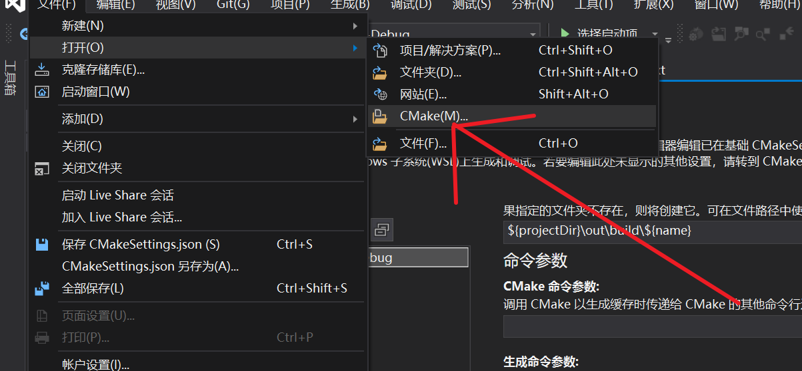
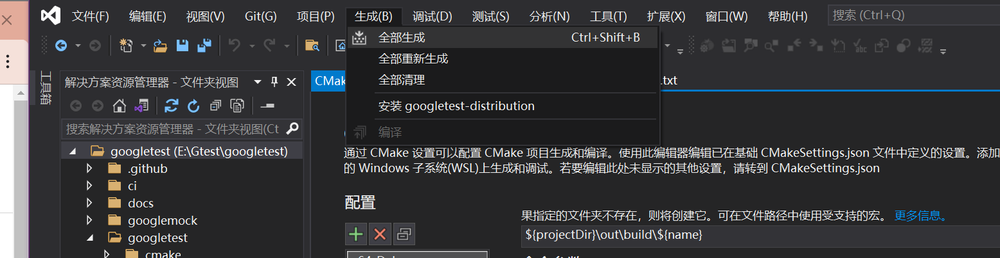
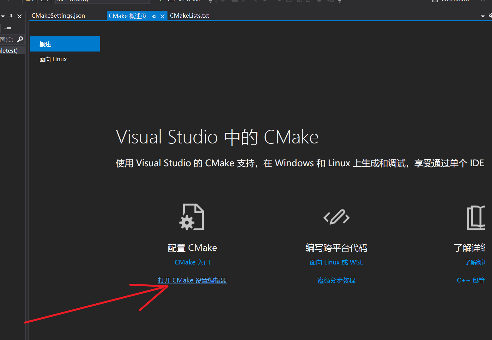
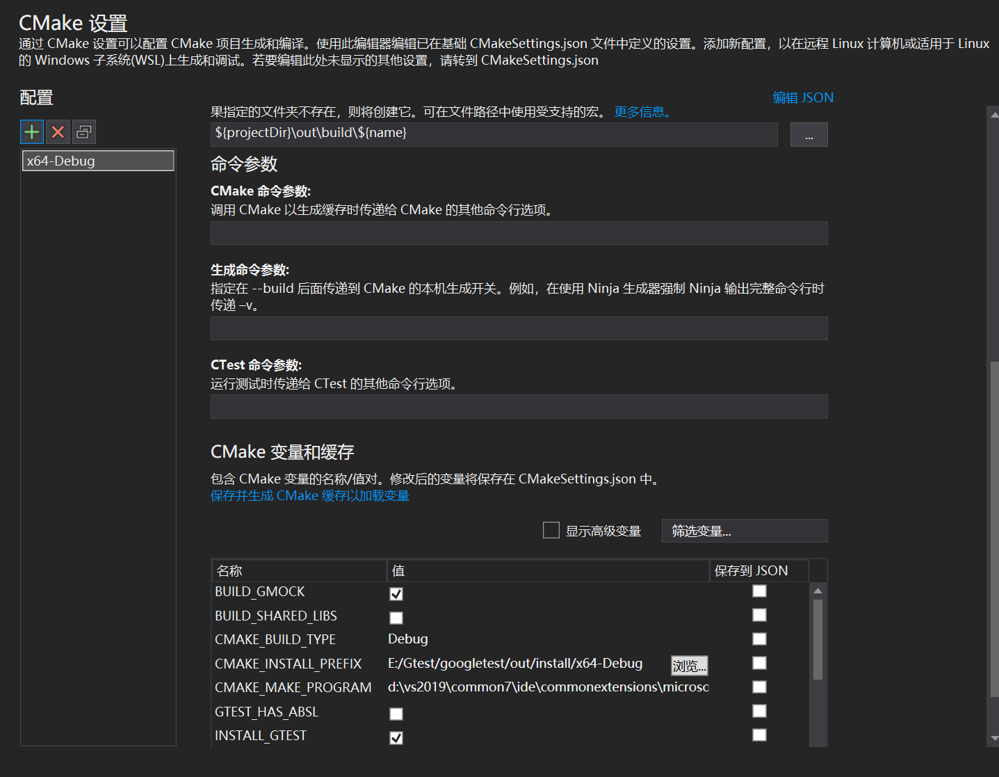

# GTEST框架编译

## 1.windows

### windows端的安装

源码github的地址https://github.com/google/googletest.git

vs2019直接打开cmake文件，所以将github将gtest clone下来了之后

直接选择 文件 打开 CMake

然后选择CMakeLists.txt文件，成功后会显示一个CMake的gui，

如果你想要生成就点击

这个会安装cmake的规则会在out目录中新建一个build目录

生成了静态的gmock.lib和gtest.lib

注：vs还可以在gui上配置cmake的信息

### windows端的使用

在vs2019想要使用gtest和gmock，要包含它们的头文件和库

## 2.linux端

如果使用apt或者yum安装有所不同

apt安装的gtest还需要第二次进行编译，编译出对应的.a文件

yum安装gtes没有gmock的库

所以在linux中我们统一使用源码安装

源码地址https://github.com/google/googletest.git

> 使用git clone拉下来代码
>
> 然后新建build目录，在build目录使用
>
> cmake ..
>
> 然后使用make命令编译
>
> 编译成功之后使用make install
>
> 将对应的头文件放在usr/local/include下面
>
> 对应lib目录放在usr/local/lib
>
> 

注：

最新版本的gtest要求cmake最低版本3.13

要求c++版本支持c++14

# GTEST

# GMOCK