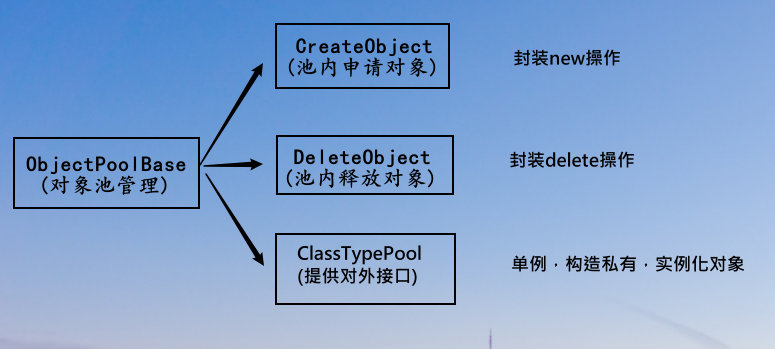

# 对象池

对象池是一种空间换时间的技术，对象被预先创建并初始化后放入对象池中，对象提供者就能利用已有的对象来处理请求，并在不需要时归还给池子而非直接销毁

它减少对象频繁创建所占用的内存

## 对象池原理

描述一个对象池有两个很重要的参数，一个是这个对象池的类型，另一个是这个对象池可以获得对象的数量


对象池的实现和内存池的实现原理很像：都是一开始申请大内存空间，然后把大内存分配成小内存空间，当需要使用的时候直接分配使用，不在向系统申请内存空间，也不直接释放内存空间。使用完之后都是放回池子里


不同的地方在内存池有一个映射数组，在使用时负责快速定位合适的内存池（一个内存池可以有很多内存块大小不同的池子）

但是每一个类型的对象只对应一个对象池，并自己管理自己的对象池。不同类型的对象池是相互独立的存在


## 对象池优点

1、减少频繁创建和销毁对象带来的成本，实现对象的缓存和复用

2、提高了获取对象的响应速度，对实时性要求较高的程序有很大帮助

3、一定程度上减少了垃圾回收机制（GC）的压力

## 对象池的缺点

1、很难设定对象池的大小，如果太小则不起作用，过大又会占用内存资源过高

2、并发环境中, 多个线程可能(同时)需要获取池中对象, 进而需要在堆数据结构上进行同步或者因为锁竞争而产生阻塞, 这种开销要比创建销毁对象的开销高数百倍;

3、由于池中对象的数量有限, 势必成为一个可伸缩性瓶颈;

4、所谓的脏对象就是指的是当对象被放回对象池后，还保留着刚刚被客户端调用时生成的数据。

脏对象可能带来两个问题

- 脏对象持有上次使用的引用，导致内存泄漏等问题。
- 脏对象如果下一次使用时没有做清理，可能影响程序的处理数据。

## 什么条件下使用对象池

1、资源受限的, 不需要可伸缩性的环境(cpu\内存等物理资源有限): cpu性能不够强劲, 内存比较紧张, 垃圾收集, 内存抖动会造成比较大的影响, 需要提高内存管理效

率,响应性比吞吐量更为重要;

2、数量受限的, 比如数据库连接;

3、创建对象的成本比较大，并且创建比较频繁。比如线程的创建代价比较大，于是就有了常用的线程池。

## 对象池的实现

对象池的实现代码分三部分，一个是对象池的内部实现类（ObjectPool），另一个是管理对象池的类（ObjectPoolBase）

对象池内部的实现和内存池基本一样，都是先申请一大块内存空间，然后再把大内存分成许多小内存，每个小内存对应一个对象，这些小内存以链表的形式进行管理


内存池的管理主要是对用户提供接口，参数的传递通过**可变参的模板类**来实现，对new和delete操作进行封装是为了更方便的初始化对象，让使用时更加灵活；要

创建不同类型的对象池，只需要继承ObjectPoolBase这个类就可以，当发现该类型对应的对象池没有初始化的时候，就会创建该对象池并且进行初始化操作，之后

就可以正常分配对象



**注意：**

对象池和内存池可以一起使用，在一起使用的情况下，如果要在对象池中使用智能指针，应该特别注意new操作，因为智能指针使用的是全局的new，内存池使用的

是类里面的new,在申请内存时会有差别

```c++
#ifndef _ObjectPoolBase_hpp_
#define _ObjectPoolBase_hpp_


#include<stdlib.h>
#include<assert.h>
#include<mutex>

#ifdef _DEBUG
#ifndef xPrintf
#include<stdio.h>
#define xPrintf(...) printf(__VA_ARGS__)
#endif
#else
#ifndef xPrintf
#define xPrintf(...)
#endif
#endif // _DEBUG
//模板给对象池提供参数接口
template<class Type, size_t nPoolSzie>
//对象池的实现
class CELLObjectPool
{
public:
    CELLObjectPool()
    {
        initPool();
    }

    ~CELLObjectPool()
    {
        if (_pBuf)
            delete[] _pBuf;
    }
private:
    //NodeHeader是每个对象的描述信息
    class NodeHeader
    {
    public:
        //下一块位置
        NodeHeader* pNext;
        //内存块编号
        int nID;
        //引用次数
        char nRef;
        //是否在内存池中
        bool bPool;
    private:
        //预留
        char c1;
        char c2;
    };
public:
    //释放对象内存
    void freeObjMemory(void* pMem)
    {
        //首地址往前偏移，对象和对象描述信息的内存一起释放
        NodeHeader* pBlock = (NodeHeader*)((char*)pMem - sizeof(NodeHeader));
        Printf("freeObjMemory: %llx, id=%d\n", pBlock, pBlock->nID);
        assert(1 == pBlock->nRef);
        //内存在对象池的部分释放之后，指针回到第一个未分配的对象
        if (pBlock->bPool)
        {
            std::lock_guard<std::mutex> lg(_mutex);
            if (--pBlock->nRef != 0)
            {
                return;
            }
            pBlock->pNext = _pHeader;
            _pHeader = pBlock;
        }
        else {
            if (--pBlock->nRef != 0)
            {
                return;
            }
            //不在对象池的直接释放内存
            delete[] pBlock;
        }
    }
    //申请对象内存，优先向内存池申请内存，内存池不够在向系统申请内存
    void* allocObjMemory(size_t nSize)
    {
        std::lock_guard<std::mutex> lg(_mutex);
        NodeHeader* pReturn = nullptr;
        //如果对象池已经满了，数量达到上限，需要向系统申请内存
        if (nullptr == _pHeader)
        {
            //计算对象池大小=对象数量*（一个对象内存大小+对象描述信息内存大小）
            pReturn = (NodeHeader*)new char[sizeof(Type) + sizeof(NodeHeader)];
            pReturn->bPool = false;
            pReturn->nID = -1;
            pReturn->nRef = 1;
            pReturn->pNext = nullptr;
        }
        else {
            pReturn = _pHeader;
            _pHeader = _pHeader->pNext;
            assert(0 == pReturn->nRef);
            pReturn->nRef = 1;
        }
        xPrintf("allocObjMemory: %llx, id=%d, size=%d\n", pReturn, pReturn->nID, nSize);
        return ((char*)pReturn + sizeof(NodeHeader));
    }
private:
    //初始化对象池
    void initPool()
    {
        //断言
        assert(nullptr == _pBuf);
        //对象池不为空（已经初始化过），不初始化直接返回
        if (_pBuf)
            return;
        //计算对象池大小=对象数量*（一个对象内存大小+对象描述信息内存大小）
        size_t realSzie = sizeof(Type) + sizeof(NodeHeader);
        size_t n = nPoolSzie * realSzie;
        //申请池的内存
        _pBuf = new char[n];
        //初始化内存池
        _pHeader = (NodeHeader*)_pBuf;
        _pHeader->bPool = true;
        _pHeader->nID = 0;
        _pHeader->nRef = 0;
        _pHeader->pNext = nullptr;
        //遍历内存块进行初始化
        NodeHeader* pTemp1 = _pHeader;

        for (size_t n = 1; n < nPoolSzie; n++)
        {
            NodeHeader* pTemp2 = (NodeHeader*)(_pBuf + (n* realSzie));
            pTemp2->bPool = true;
            pTemp2->nID = n;
            pTemp2->nRef = 0;
            pTemp2->pNext = nullptr;
            pTemp1->pNext = pTemp2;
            pTemp1 = pTemp2;
        }
    }
private:
    //描述信息块地址
    NodeHeader* _pHeader;
    //对象池内存缓存区地址
    char* _pBuf;
    //多线程使用需要加锁
    std::mutex _mutex;
};

//模板类给主函数使用对象池提供接口
template<class Type, size_t nPoolSzie>
//使用对象池的类
class ObjectPoolBase
{
public:
    //重载给对象申请内存的new操作
    void* operator new(size_t nSize)
    {
        return objectPool().allocObjMemory(nSize);
    }
    //重载给对象释放内存的delete操作
    void operator delete(void* p)
    {
        objectPool().freeObjMemory(p);
    }

    //创建对象，用模板类提供对外的可变参数的接口
    //这里的模板为啥要用可变参数？
    //这里创建一个对象的时候还可能带有初始化的参数，这个参数的个数是不一样的，所有模板的参数需要变参
    //
    template<typename ...Args>
    static Type* createObject(Args ... args)
    {   //不定参数  可变参数
        Type* obj = new Type(args...);
        //可以做点其它的事情，比如说对象的放逐和驱逐
        return obj;
    }
    //销毁对象
    static void destroyObject(Type* obj)
    {
        delete obj;
    }
private:
    //定义不同类型的对象池
    typedef CELLObjectPool<Type, nPoolSzie> ClassTypePool;
    //单例-饿汉模式，实例化一个对象池
    static ClassTypePool& objectPool()
    {   //静态CELLObjectPool对象
        static ClassTypePool sPool;
        return sPool;
    }
};
#endif // !_ObjectPoolBase_hpp_

#include "ObjectPoolBase.hpp"
```

## 测试代码

```c++
#include<stdlib.h>
#include<iostream>
#include<thread>
#include<mutex>//锁
#include<memory>

#include"ObjectPoolBase.hpp"

using namespace std;

//10是池内对象的最大数量，通过继承ObjectPoolBase来使用对象池
class ClassA : public ObjectPoolBase<ClassA, 10>
{
public:
    ClassA(int n)
    {
        num = n;
        printf("ClassA\n");
    }

    ~ClassA()
    {
        printf("~ClassA\n");
    }
public:
    int num = 0;
};

class ClassB : public ObjectPoolBase<ClassB, 10>
{
public:
    ClassB(int n, int m)
    {
        num = n * m;
        printf("ClassB\n");
    }

    ~ClassB()
    {
        printf("~ClassB\n");
    }
public:
    int num = 0;
};


int main()
{
    {
        //对象池的使用过程是在使用new的时候，因为你要创建的类继承了对象池管理的类，
        //对象池管理类会根据你设计的对象数量创建（初始化）对象池，
        //进入对象池的时候首先判断该对象池是否初始化，初始化过说明该对象池已经存在
        //未初始化说明还没有该类型的对象池

        //如果该对象池没有初始化，就进行初始化（创建一个对象池）
        //已经初始化就直接从该对象池中分配一个对象
        //然后通过new操作在对象池中分配一个已经创建好的对象
        
        //再根据对象传进来的参数，确定对象池允许有几个对象
        //然后申请相应大小的内存，逐个以链表的形式进行初始化

        //两种创建对象的方法
        //直接用new创建对象，把new和delete暴露在外，使用不灵活，初始化对象不方便
        ClassA* a1 = new ClassA(5);
        //delete a1;

        //把new和delete封装成一个函数，可以更灵活的对对象进行操作，比如在创建的时候初始化对象
        ClassA* a2 = ClassA::createObject(6);
        //ClassA::destroyObject(a2);

        delete a1;
        ClassA::destroyObject(a2);
        ClassB* b1 = new ClassB(5, 6);
        delete b1;

        ClassB* b2 = ClassB::createObject(5, 6);
        ClassB::destroyObject(b2);
    }
    system("pause");
    return 0;
}
```

