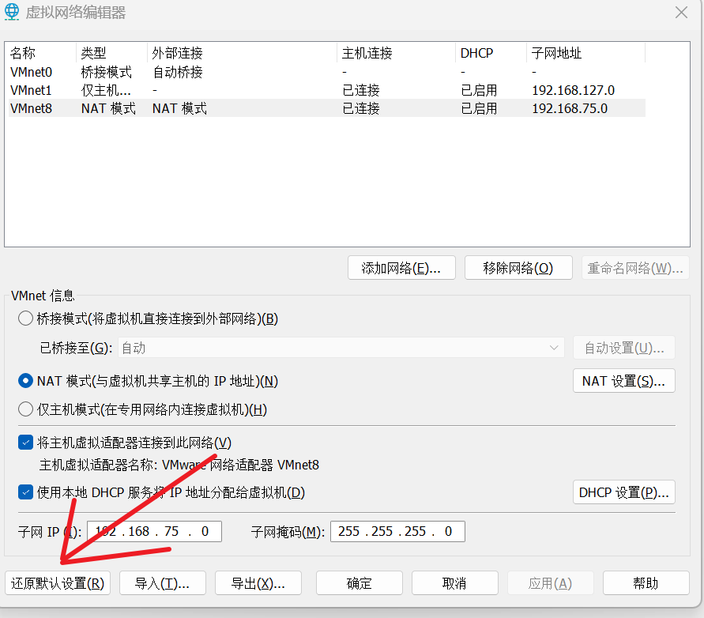
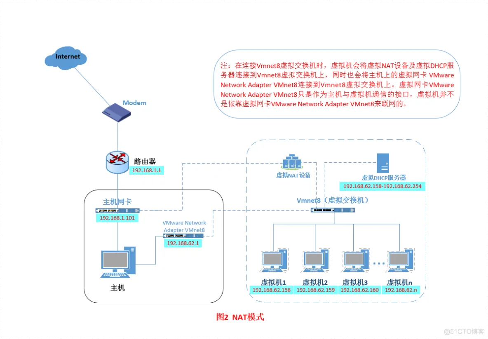
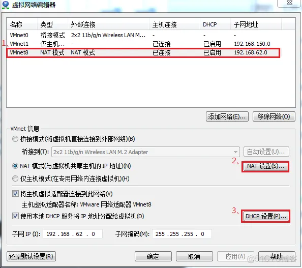
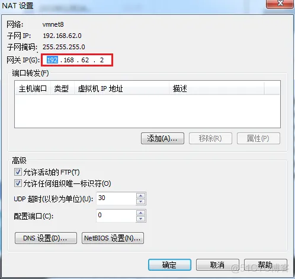
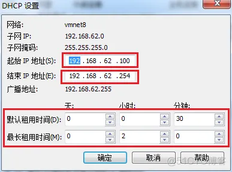
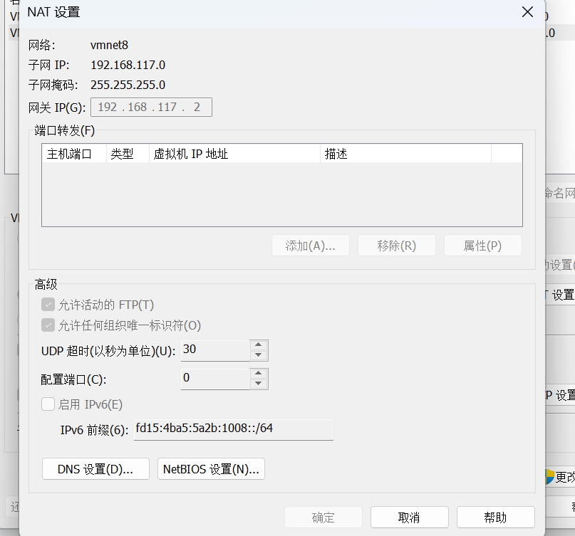
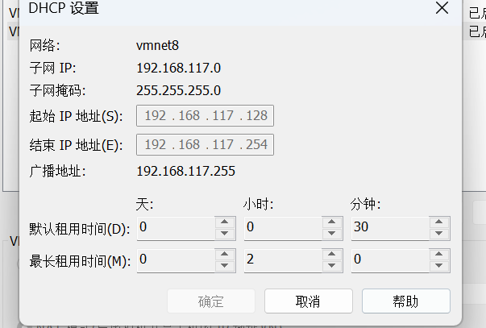
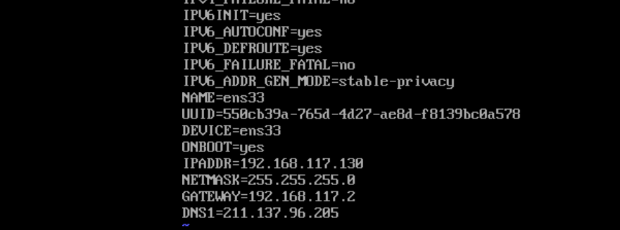

# vmware虚拟机网络配置

参考blog：https://blog.51cto.com/u_15169172/2710721（有其他两种网络的配置方式）

vmware为我们提供了三种网络工作模式，它们分别是：Bridged（桥接模式）、NAT（网络地址转换模式）、Host-Only（仅主机模式）。

打开vmware虚拟机，我们可以在选项栏的“编辑”下的“虚拟网络编辑器”中看到VMnet0（桥接模式）、VMnet1（仅主机模式）、VMnet8（NAT模式），那么这些都是有什么作用呢？其实，我们现在看到的VMnet0表示的是用于桥接模式下的虚拟交换机；VMnet1表示的是用于仅主机模式下的虚拟交换机；VMnet8表示的是用于NAT模式下的虚拟交换机。

**注：**

如果你打开发现没有这三张网卡，只需要点击还原默认设置-，同时如果你不小心卸载了两张虚拟网卡，也可以通过这种方法重新设置

## 桥接模式

不要使用桥接模式，问题很大

## net模式

刚刚我们说到，如果你的网络ip资源紧缺，但是你又希望你的虚拟机能够联网，这时候NAT模式是最好的选择。NAT模式借助虚拟NAT设备和虚拟DHCP服务器，使得虚拟机可以联网。其网络结构如下图所示：

在NAT模式中，主机网卡直接与虚拟NAT设备相连，然后虚拟NAT设备与虚拟DHCP服务器一起连接在虚拟交换机VMnet8上，这样就实现了虚拟机联网。那么我们会觉得很奇怪，为什么需要虚拟网卡VMware Network Adapter VMnet8呢？原来我们的VMware Network Adapter VMnet8虚拟网卡主要是为了实现主机与虚拟机之间的通信。在之后的设置步骤中，我们可以加以验证。

其实不需要再去修改nat的设置

如我本机分配的ip和网关是

此时我只需要打开我的虚拟机然后将网卡的ip设置为上面的内容，如果设置ip为static的，那么ip地址一定要在dhcp分配的ip区域中

然后现在我就可以进行虚拟机和本机的ping了，同时我的虚拟机也能ping通外网