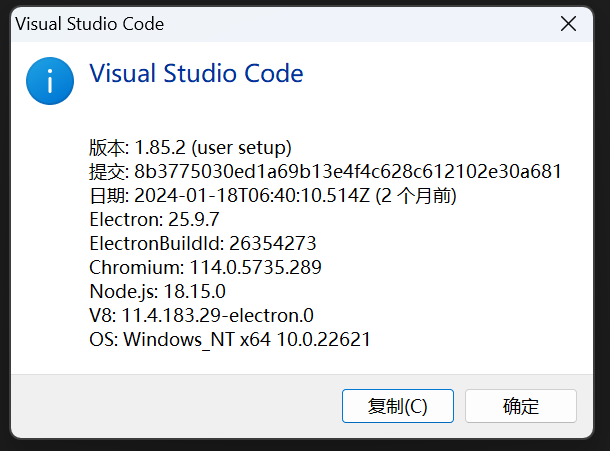
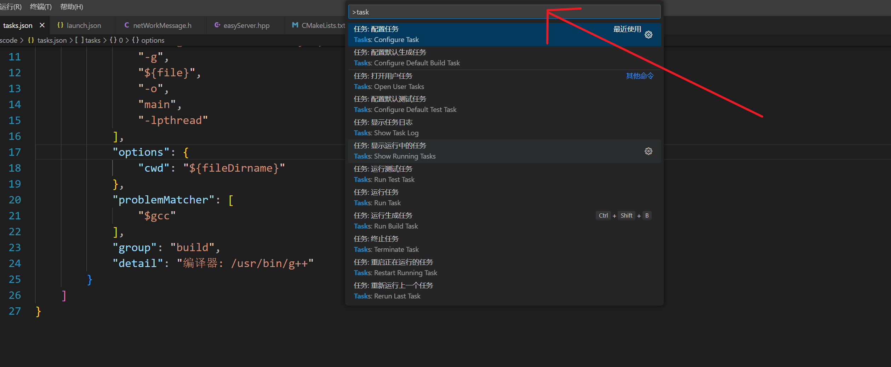
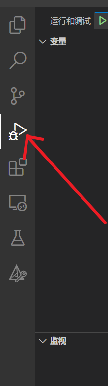

## vs code普通配置

这是普通配置，选择vs code这个版本




使用ctrl + shift + p



然后输入task,选择 配置任何，并且在task.json中输入下面的内容

task.json

```cmake
{
	"version": "2.0.0",
	"tasks": [
		{
			"type": "cppbuild",
			"label": "build debug",
			"command": "/usr/bin/g++",
			"args": [
				"-std=c++11",
				"-fdiagnostics-color=always",
				"-g",
				"${file}",
				"-o",
				"main",
				"-lpthread"
			],
			"options": {
				"cwd": "${fileDirname}"
			},
			"problemMatcher": [
				"$gcc"
			],
			"group": "build",
			"detail": "编译器: /usr/bin/g++"
		}
	]
}
```

点击下面这个



然后点击出现的launch.json，并将下面的内容填到对应的文件

```cmake
{
    "configurations": [
        {
            "name": "C/C++: g++ 生成和调试活动文件",
            "type": "cppdbg",
            "request": "launch",
            "program": "${workspaceFolder}/code/main",
            //"args": ["-host","127.0.0.1","-port","6051","-cacert","ca.crt","-cert","c_sign.crt","-key","c_signkey.pem","-pass","123456"],
            //Above is an example of parameter input for the main function
            "args": [],
            "stopAtEntry": false,
            "cwd": "${workspaceFolder}/",
            "environment": [],
            "externalConsole": false,
            "MIMode": "gdb",
            "setupCommands": [
                {
                    "description": "为 gdb 启用整齐打印",
                    "text": "-enable-pretty-printing",
                    "ignoreFailures": true
                },
                {
                    "description": "将反汇编风格设置为 Intel",
                    "text": "-gdb-set disassembly-flavor intel",
                    "ignoreFailures": true
                }
            ],
            "preLaunchTask": "build debug",
            "miDebuggerPath": "/bin/gdb"
        }
    ],
    "version": "2.0.0"
}
```


这个是告诉vscode你需要去哪里找你的头文件，只是为了防止头文件变红，具体的编译规则是通过task.json来实现的

c_cpp_propertied.json

```cmake
{
    "configurations": [
        {
            "name": "Linux",
            "includePath": [
                "${workspaceFolder}/**",
                "/usr/include/**"
            ],
            "defines": [],
            "compilerPath": "/usr/bin/gcc",
            "cStandard": "c11",
            "cppStandard": "c++11",
            "intelliSenseMode": "linux-gcc-x64"
        }
    ],
    "version": 4
}
```

## vs code配置cmake

### 1.编写对应的源文件和cmake文件

**不需要配置上面的那些launch.json，task.json等文件**


进入到远程的文件夹中编写对应的头文件和cpp文件

以及对应的cmake文件


下一步需要配置对应的编译器


### 2.配置cmake

ctrl + shift + p ,然后输入cmake选择对应的配置cmake


配置完成后会在当前目录下生成一个build目录，就相当于你新建了一个build目录，并且在build目录中使用了cmake ..


你会发现build目录下面又有一个bin目录是由于CMakeLIsts.list文件中使用了如下的命令

```cmake
set(EXECUTABLE_OUTPUT_PATH ./bin)
```

这个./当前目录不是CMakeLIsts.list文件所在的目录，而是执行cmake ..,命令所在的目录


注意：cmake添加的set(CMAKE_CXX_STANDARD 11)未生效

可能的解决办法：

```cmake
#法1：
add_compile_options(-std=c++11)

#法二
include(CheckCXXCompilerFlag)
CHECK_CXX_COMPILER_FLAG("-std=c++11" COMPILER_SUPPORTS_CXX11)
CHECK_CXX_COMPILER_FLAG("-std=c++0x" COMPILER_SUPPORTS_CXX0X)
if(COMPILER_SUPPORTS_CXX11)
        set(CMAKE_CXX_FLAGS "${CMAKE_CXX_FLAGS} -std=c++11")
elseif(COMPILER_SUPPORTS_CXX0X)
        set(CMAKE_CXX_FLAGS "${CMAKE_CXX_FLAGS} -std=c++0x")
else()
     message(STATUS "The compiler ${CMAKE_CXX_COMPILER} has no C++11 support. Please use a different C++ compiler.")


```


### 3.生成目标（可执行程序 静态库 动态库）

如何生成cmake的最终目标

1. 方法1：直接在可视化界面中点击生成进而得到可执行程序


2. 方法2：老老实实在build目录先使用cmake ..,再使用make -j9来编译

### 4.调试

cmake版本过低的问题，cmake tools的开发者表示目前只能支持3.7.2以上版本的cmake进行一键debug功能.

此时直接调试会报错


所以我们需要结合