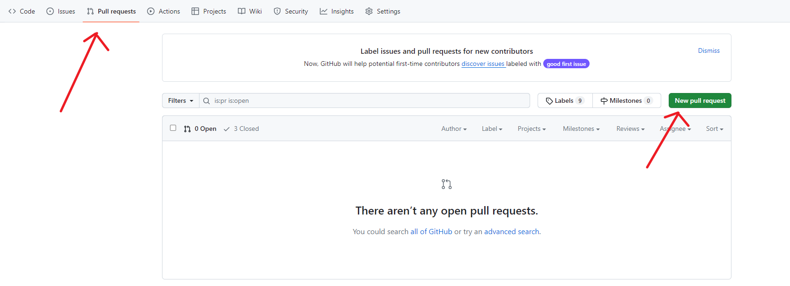

# git

## 初始化

什么是版本库呢？版本库又名仓库，英文名**repository**，你可以简单理解成一个目录，这个目录里面的所有文件都可以被Git管理起来，每个文件的修改、删除，Git都能跟踪，以便任何时刻都可以追踪历史，或者在将来某个时刻可以“还原”。

1.设置git仓库的用户名和密码

> ```
> $ git config --global user.name "Your Name"
> $ git config --global user.email "email@example.com"
> ```

因为Git是分布式版本控制系统，所以，每个机器都必须自报家门：你的名字和Email地址。

注意`git config`命令的`--global`参数，用了这个参数，表示你这台机器上所有的Git仓库都会使用这个配置，当然也可以对某个仓库指定不同的用户名和Email地址。


2.初始化一个git仓库

> ```
> $ git init
> //成功就返回下面的输出
> Initialized empty Git repository in /Users/michael/learngit/.git/
> ```

初始化成功后当前目录下多了一个`.git`的目录，这个目录是Git来跟踪管理版本库的，没事千万不要手动修改这个目录里面的文件，不然改乱了，就把Git仓库给破坏了。

**（如果你是通过clon下来的代码库，那么你不需要再使用git init了）**

## git的使用

### 1.将文件添加到版本库

编写一个readme.txt文件，内容为

> Git is a version control system.
> Git is free software.

1. 用命令`git add`告诉Git，把文件添加到仓库：

   > ```
   > git add readme.txt
   > //unix哲学没有显示错误就是对的
   > ```

2. 用命令`git commit`告诉Git，把文件提交到仓库：

   > ```
   >   $ git commit -m "wrote a readme file"
   >   [master (root-commit) eaadf4e] wrote a readme file
   >    1 file changed, 2 insertions(+)
   >    create mode 100644 readme.txt
   > ```
   >
   > 简单解释一下`git commit`命令，`-m`后面输入的是本次提交的说明，可以输入任意内容，当然最好是有意义的，这样你就能从历史记录里方便地找到改动记录。
   >
   > 
   >
   > 为什么Git添加文件需要`add`，`commit`一共两步呢？因为`commit`可以一次提交很多文件，所以你可以多次`add`不同的文件，比如：
   >
   > ```
   > $ git add file1.txt
   > $ git add file2.txt file3.txt
   > $ git commit -m "add 3 files."
   > ```

3. 添加文件夹以及文件夹下的所有文件

   > ```
   > git add 文件夹/ 添加整个文件夹及内容
   >  
   > git add *.文件类型 添加目录中所有此文件类型的文件
   > ```
   >
   > 

**注意：**

1. 添加的文件一定要在learngit目录下（子目录也可以）
2. 版本控制系统只能追踪文本文件的改动，那一行进行了增减，**而图片，视频虽然也能管理但是无法追踪具体哪里发生了变化**

### 2.管理版本库

我们已经成功地添加并提交了一个readme.txt文件，现在，是时候继续工作了，于是，我们继续修改readme.txt文件，改成如下内容：

```
Git is a distributed version control system.
Git is free software.
```

#### 1.查看版本库状态

> ```
> $ git status
> On branch master
> Changes not staged for commit:
>   (use "git add <file>..." to update what will be committed)
>   (use "git checkout -- <file>..." to discard changes in working directory)
> 
> 	modified:   readme.txt
> 
> no changes added to commit (use "git add" and/or "git commit -a")
> 
> ```
>
> `git status`命令可以让我们时刻掌握仓库当前的状态，上面的命令输出告诉我们，`readme.txt`被修改过了，但还没有准备提交的修改。


#### 2.查看文件与版本库中上次commit的文件的差异

> ```
> $ git diff readme.txt 
> diff --git a/readme.txt b/readme.txt
> index 46d49bf..9247db6 100644
> --- a/readme.txt
> +++ b/readme.txt
> @@ -1,2 +1,2 @@
> Git is a version control system.
> -Git is free software.
> +Git is a free software.
> +hello
> ```
>
> 解读一下上面命令的输出 -代表则上次commit的内容，+则代表当前文件的内容，修改之后记得添加文件到版本库，也是两步走
>
> ```
> git log file_name （查看文件提交日志）
> ```
>
> **注意**：
>
> 如果你修改了一次没有commit，再修改第二次，那么commit并不会显示第一次修改和第二次修改的差异，git diff展示的差异一定是当前文件和上次commit文件的差异


#### 3.版本回退

每当你觉得文件修改到一定程度的时候，就可以“保存一个快照”，这个快照在Git中被称为`commit`。一旦你把文件改乱了，或者误删了文件，还可以从最近的一个`commit`恢复，然后继续工作，而不是把几个月的工作成果全部丢失。

1. 查看提交日志

   > ```
   > $ git log
   > commit 1094adb7b9b3807259d8cb349e7df1d4d6477073 (HEAD -> master)
   > Author: Michael Liao <askxuefeng@gmail.com>
   > Date:   Fri May 18 21:06:15 2018 +0800
   > 
   >     append GPL
   > 
   > commit e475afc93c209a690c39c13a46716e8fa000c366
   > Author: Michael Liao <askxuefeng@gmail.com>
   > Date:   Fri May 18 21:03:36 2018 +0800
   > 
   >     add distributed
   > 
   > commit eaadf4e385e865d25c48e7ca9c8395c3f7dfaef0
   > Author: Michael Liao <askxuefeng@gmail.com>
   > Date:   Fri May 18 20:59:18 2018 +0800
   > 
   >     wrote a readme file
   > ```
   >
   > `git log`命令显示从最近到最远的提交日志，我们可以看到3次提交，最近的一次是`append GPL`，上一次是`add distributed`，最早的一次是`wrote a readme file`。
   >
   > 如果嫌输出信息太多，看得眼花缭乱的，可以试试加上`--pretty=oneline`参数：
   >
   > ```
   > $ git log --pretty=oneline
   > 1094adb7b9b3807259d8cb349e7df1d4d6477073 (HEAD -> master) append GPL
   > e475afc93c209a690c39c13a46716e8fa000c366 add distributed
   > eaadf4e385e865d25c48e7ca9c8395c3f7dfaef0 wrote a readme file
   > ```

2. 回退到某个commit

   > 好了，现在我们启动时光穿梭机，准备把`readme.txt`回退到上一个版本，也就是`add distributed`的那个版本，怎么做呢？
   >
   > 首先，Git必须知道当前版本是哪个版本，在Git中，用`HEAD`表示当前版本，也就是最新的提交`1094adb...`（注意我的提交ID和你的肯定不一样），上一个版本就是`HEAD^`，上上一个版本就是`HEAD^^`，当然往上100个版本写100个`^`比较容易数不过来，所以写成`HEAD~100`
   >
   > ```
   > $ git reset --hard HEAD^
   > HEAD is now at e475afc add distributed
   > ```
   >
   > 此时你再通过git log你就发现已经找不到最新的那个版本`append GPL，但是如果你又想要跳回去也是有办法的，只要你还有最新版本的commit号你可以使用下面的命令，版本号没必要写全，前几位就可以了，Git会自动去找。当然也不能只写前一两位，因为Git可能会找到多个版本号，就无法确定是哪一个了。
   >
   > ```
   > $ git reset --hard 1094a
   > 
   > ```
   >
   >  
   >
   > Git的版本回退速度非常快，因为Git在内部有个指向当前版本的`HEAD`指针，当你回退版本的时候，Git仅仅是把HEAD从指向`append GPL`：
   >
   > ```ascii
   > ┌────┐
   > │HEAD│
   > └────┘
   >    │
   >    └──▶ ○ append GPL
   >         │
   >         ○ add distributed
   >         │
   >         ○ wrote a readme file
   > ```
   >
   > 改为指向`add distributed`：
   >
   > ```ascii
   > ┌────┐
   > │HEAD│
   > └────┘
   >    │
   >    │    ○ append GPL
   >    │    │
   >    └──▶ ○ add distributed
   >         │
   >         ○ wrote a readme file
   > ```
   >
   > 然后顺便把工作区的文件更新了。所以你让`HEAD`指向哪个版本号，你就把当前版本定位在哪。
   >
   >  
   >
   > 要重返未来，用`git reflog`查看命令历史，以便确定要回到未来的哪个版本。

   

#### 4.工作区和暂存区

git的一个总体的框架结构


1.工作区

就是你在电脑里能看到的目录，比如我的`learngit`文件夹就是一个工作区


2.版本库

工作区有一个隐藏目录`.git`，这个不算工作区，而是Git的版本库。

Git的版本库里存了很多东西，其中最重要的就是称为stage（或者叫index）的暂存区，还有Git为我们自动创建的第一个分支`master`，以及指向`master`的一个指针叫`HEAD`。


前面讲了我们把文件往Git版本库里添加的时候，是分两步执行的：

第一步是用`git add`把文件添加进去，实际上就是把文件修改添加到暂存区；

第二步是用`git commit`提交更改，实际上就是把暂存区的所有内容提交到当前分支。

因为我们创建Git版本库时，Git自动为我们创建了唯一一个`master`分支，所以，现在，`git commit`就是往`master`分支上提交更改。

你可以简单理解为，需要提交的文件修改通通放到暂存区，然后，一次性提交暂存区的所有修改。


#### 5.撤销修改

> ```
> $ git checkout -- readme.txt
> ```
>
> 命令`git checkout -- readme.txt`意思就是，把`readme.txt`文件在工作区的修改全部撤销，这里有两种情况：
>
> 一种是`readme.txt`自修改后还没有被放到暂存区，现在，撤销修改就回到和版本库一模一样的状态；
>
> 一种是`readme.txt`已经添加到暂存区后，又作了修改，现在，撤销修改就回到添加到暂存区后的状态。
>
> 总之，就是让这个文件回到最近一次`git commit`或`git add`时的状态。
>
>  
>
>  
>
> 如果你git add到了暂存区，可以通过下面的命令将暂存区的修改撤销掉，重新放回工作区，这个不是将修改撤销，而是将修改从暂存区中放回到工作区，如果工作区也不需要这个修改，就通过最上面的命令撤销
>
> ```
> git reset HEAD readme.txt
> ```
>
>  
>
> 最后如果你已经commit，那就只能进行版本回退了


撤销命令汇总（上面的checkout尽可能的不要使用）

```
情况1：文件只在工作区操作，未add。撤销操作：git restore <file>。结果：工作区文件回退。
情况2：文件已add，未commit。撤销操作：git restore --staged <file>。结果：暂存区文件回退，工作区文件未回退，如需继续回退，操按情况1操作。
情况3：文件已add，已commit。撤销操作：git reset --hard commit_id。结果：工作区文件、暂存区文件、本地仓库都回退
情况4：撤销暂存区的所有修改git restore --staged . 
```


```
                                                             工作区     暂存区    版本库

某文件F修改时间（数值越大则文件越新）：   							a             b             c

  情形                                                           使用 "git restore F" 后的效果

* 情形1.  a>c；b=0（即暂存区没有文件）         					    工作区的F用版本库里的F覆盖

* 情形2.  a>b>c。                                                 工作区的F被暂存区里的F覆盖（同时暂存区的修改还在，需要使用git restore --staged F 抛弃修改）

如果在情形2之下，我们的目的是想用版本库里的F（而不是暂存区里的F）来覆盖工作区的F呢：

step1：  "git restore --staged F". 此命令是把X从暂存区直接丢弃（粉碎），而不是像 "git restore F"把暂存区的F撤回并覆盖工作区里的F。 ——执行这条命令之后，则形成了情形1.

step2:   "git restore F"。
```

#### 6.删除文件

> ```
> 删除文件
> 1.rm -rf tt.txt(在工作区删除文件)
> 
> 2.在版本库删除文件，再提交这才算删除了文件
> git rm test.txt
> git commit -m "remove test.txt"
> 注意：应该是先手动删除文件，然后使用git add <file>和git rm<file>效果是一样的，删除后都需要commit
> 
> 从版本库删除文件，但是本地文件系统不删除该文件
> git rm -r --cached  <file>
> 
> 工作区删除错了文件
> git checkout -- test.txt
> git checkout其实是用版本库里的版本替换工作区的版本，无论工作区是修改还是删除，都可以“一键还原”。
> 当然现在更多的是使用git restore 恢复文件，但是只能恢复到版本库的最新版本，如果没有提交那么就无法找回
> ```
>
> 

#### 7.查看配置

> ```
> git config list
> 
>     diff.astextplain.textconv=astextplain
>     filter.lfs.clean=git-lfs clean -- %f
>     filter.lfs.smudge=git-lfs smudge -- %f
>     filter.lfs.process=git-lfs filter-process
>     filter.lfs.required=true
>     http.sslbackend=openssl
>     http.sslcainfo=C:/Program Files/Git/mingw64/etc/ssl/certs/ca-bundle.crt
>     core.autocrlf=true
>     core.fscache=true
>     core.symlinks=false
>     pull.rebase=false
>     credential.helper=manager
>     credential.https://dev.azure.com.usehttppath=true
>     init.defaultbranch=master
>     core.editor="D:\Microsoft VS Code\bin\code" --wait
>     user.name=tangming
>     user.email=1919371336@qq.com
>     http.proxy=socks5://127.0.0.1:7890
>     https.proxy=socks5://127.0.0.1:7890
>     core.repositoryformatversion=0
>     core.filemode=false
>     core.bare=false
>     core.logallrefupdates=true
>     core.symlinks=false
>     core.ignorecase=true
>     gui.wmstate=normal
>     gui.geometry=1205x669+190+190 276 304
>     remote.origin.url=git@github.com:timipig/linux_server.git
>     remote.origin.fetch=+refs/heads/*:refs/remotes/origin/
> ```


## 远程仓库

#### 1.创建ssh key

第1步：创建SSH Key。在用户主目录下，看看有没有.ssh目录，如果有，再看看这个目录下有没有`id_rsa`和`id_rsa.pub`这两个文件，如果已经有了，可直接跳到下一步。如果没有，打开Shell（Windows下打开Git Bash），创建SSH Key：

```
$ ssh-keygen -t rsa -C "1919371336@qq.com"
```

你需要把邮件地址换成你自己的邮件地址，然后一路回车，使用默认值即可，由于这个Key也不是用于军事目的，所以也无需设置密码。

如果一切顺利的话，可以在用户主目录里找到`.ssh`目录，里面有`id_rsa`和`id_rsa.pub`两个文件，这两个就是SSH Key的秘钥对，`id_rsa`是私钥，不能泄露出去，`id_rsa.pub`是公钥，可以放心地告诉任何人。

第2步：登陆GitHub，点击头像再选择 settings，然后选择SSH and GPG keys

然后，点“New SSH Key”，填上任意Title，在Key文本框里粘贴`id_rsa.pub`文件的内容：


为什么GitHub需要SSH Key呢？因为GitHub需要识别出你推送的提交确实是你推送的，而不是别人冒充的，而Git支持SSH协议，所以，GitHub只要知道了你的公钥，就可以确认只有你自己才能推送。

当然，GitHub允许你添加多个Key。假定你有若干电脑，你一会儿在公司提交，一会儿在家里提交，只要把每台电脑的Key都添加到GitHub，就可以在每台电脑上往GitHub推送了。


#### 2.添加远程库

1. 先在github上新建一个空的仓库，GitHub告诉我们，可以从这个仓库克隆出新的仓库，也可以把一个已有的本地仓库与之关联，然后，把本地仓库的内容推送到GitHub仓库

2. 将本地仓库与远程仓库关联

   > ```
   > git remote add origin git@github.com:timipig/linux_server.git
   > ```
   >
   > 添加后，远程库的名字就是`origin`，这是Git默认的叫法，也可以改成别的，但是`origin`这个名字一看就知道是远程库。

3. 本地库的所有内容推送到远程库上

   > ```
   > git push -u origin master
   > ```
   >
   > 把本地库的内容推送到远程，用`git push`命令，实际上是把当前分支`master`推送到远程。
   >
   > 由于远程库是空的，我们第一次推送`master`分支时，加上了`-u`参数，Git不但会把本地的`master`分支内容推送的远程新的`master`分支，还会把本地的`master`分支和远程的`master`分支关联起来，在以后的推送或者拉取时就可以简化命令。
   >
   > 但是如果远程库不是空的，就需要你自己在github上合并分支
   >
   >  
   >
   > 从现在起，只要本地作了提交，就可以通过命令：
   >
   > ```
   >  git push origin master
   > ```
   >
   > 把本地`master`分支的最新修改推送至GitHub，现在，你就拥有了真正的分布式版本库！
   >
   > 但是因为我的版本库不是空的，所以你需要在github上手动去合并分支

4. 删除远程库

   > 先查看远程库信息
   >
   > ```
   > $ git remote -v
   > origin  git@github.com:timipig/linux_server.git (fetch)
   > origin  git@github.com:timipig/linux_server.git (push)
   > 
   > ```
   >
   >  
   >
   > 根据名字删除，如删除origin
   >
   > ```
   > git remote rm origin
   > ```
   >
   > 此处的“删除”其实是解除了本地和远程的绑定关系，并不是物理上删除了远程库。远程库本身并没有任何改动。要真正删除远程库，需要登录到GitHub，在后台页面找到删除按钮再删除。

5. 推送新分支

   > 如果你新建了一个test分支，并且想将test分支推送到远程仓库
   >
   > 先从master分支切换到test分支，然后使用git push  origin test
   >
   > 也可以使用就将本地的test分支推送到远程的REMOTE-BRANCH-NAME分支
   >
   > ```
   > git push REMOTE-NAME LOCAL-BRANCH-NAME:REMOTE-BRANCH-NAME
   > ```
   >
   > 
   >

注意事项1：

关联到远程仓库后，推送的时候报错


解决办法1：

1.先删除与远程库的关联

2.在c盘用户目录下的.ssh目录中的config文件中增加

```
Host github.com
    Hostname ssh.github.com
    Port 443
    User git
```

3.然后就可以推送或拉取远程库了


解决办法2：

关闭代理


注意事项2：

远程仓库更改了分支的名字，再push修改报错

解决办法：

在push远程服务器的时候发现出现此错误；原因是没有同步远程的master

所以我们需要先同步一下，但是如果远程仓库的内容与本地仓库不一样就会发送报错（如远程仓库有一个readme.md文件，但是本地仓库没有如果推送就会发送错误）

```html
git pull origin master
//如果远程仓库与本地仓库内容不一致
git pull origin master --allow-unrelated-histories
此时会编辑一个文件，直接保存关闭即可
```


注意事项3：

[Dealing with "non-fast-forward" errors](https://docs.github.com/zh/get-started/using-git/pushing-commits-to-a-remote-repository#dealing-with-non-fast-forward-errors)

If your local copy of a repository is out of sync with, or "behind," the upstream repository you're pushing to, you'll get a message saying `non-fast-forward updates were rejected`. This means that you must retrieve, or "fetch," the upstream changes, before you are able to push your local changes.


#### 3.从远程库克隆

上次我们讲了先有本地库，后有远程库的时候，如何关联远程库。

克隆远程库

> ```
> 现在，远程库已经准备好了，下一步是用命令git clone克隆一个本地库：
> 
> $ git clone git@github.com:michaelliao/gitskills.git
> Cloning into 'gitskills'...
> remote: Counting objects: 3, done.
> remote: Total 3 (delta 0), reused 0 (delta 0), pack-reused 3
> Receiving objects: 100% (3/3), done.
> 注意把Git库的地址换成你自己的，然后进入gitskills目录看看，已经有README.md文件了：
> ```
>
> 从远程库clone会发生什么情况
>
> - 创建名为 `repo` 的新文件夹
> - 将它初始化为 Git 仓库
> - 创建名为 `origin` 的远程存储库，指向用于克隆的 URL
> - 将所有的仓库文件和提交下载到那里
> - 默认分支已检出
>
>  
>
> 对于远程存储库中的每个分支 `foo`，在本地存储库中创建相应的远程跟踪分支 `refs/remotes/origin/foo`。 通常可将此类远程跟踪分支名称缩写为 `origin/foo
>
> 这句话可以理解为：
>
> 然后你的本地仓库会维护一个note分支，然后你的本地还有一个origin note分支的副本，你可以通过git fetch origin note命令来获取其他人是否再该分支上进行了修改，你也可以通过git log origin note来查看origin note分支本地副本的提交记录，只要你fetch之后马上查看那么这个副本的commit一定是最新的，然后你觉得你需要合并这些commit就使用git merge origin note(合并的是远程origin note分支在本地仓库的一个副本分支)
>
> 

#### 4.查看远程库的log

远程库的分支会在本地仓库有一个副本，如master分支会在本地仓库有一个origin/master的副本，这个副本只能由git来操作，可以通过下面的命令来

```
git log origin/master 

//来查看origin/master分支上面的commit 与你当前分支的commit的区别
```


## 分支管理

分支在实际中有什么用呢？假设你准备开发一个新功能，但是需要两周才能完成，第一周你写了50%的代码，如果立刻提交，由于代码还没写完，不完整的代码库会导致别人不能干活了。如果等代码全部写完再一次提交，又存在丢失每天进度的巨大风险。

现在有了分支，就不用怕了。你创建了一个属于你自己的分支，别人看不到，还继续在原来的分支上正常工作，而你在自己的分支上干活，想提交就提交，直到开发完毕后，再一次性合并到原来的分支上，这样，既安全，又不影响别人工作。

其他版本控制系统如SVN等都有分支管理，但是用过之后你会发现，这些版本控制系统创建和切换分支比蜗牛还慢，简直让人无法忍受，结果分支功能成了摆设，大家都不去用。

但Git的分支是与众不同的，无论创建、切换和删除分支，Git在1秒钟之内就能完成！无论你的版本库是1个文件还是1万个文件。

#### 1.创建和合并分支

在[版本回退](https://www.liaoxuefeng.com/wiki/896043488029600/897013573512192)里，你已经知道，每次提交，Git都把它们串成一条时间线，这条时间线就是一个分支。截止到目前，只有一条时间线，在Git里，这个分支叫主分支，即`master`分支。`HEAD`严格来说不是指向提交，而是指向`master`，`master`才是指向提交的，所以，`HEAD`指向的就是当前分支。

一开始的时候，`master`分支是一条线，Git用`master`指向最新的提交，再用`HEAD`指向`master`，就能确定当前分支，以及当前分支的提交点：


每次提交，`master`分支都会向前移动一步，这样，随着你不断提交，`master`分支的线也越来越长。

当我们创建新的分支，例如`dev`时，Git新建了一个指针叫`dev`，指向`master`相同的提交，再把`HEAD`指向`dev`，就表示当前分支在`dev`上：


你看，Git创建一个分支很快，因为除了增加一个`dev`指针，改改`HEAD`的指向，工作区的文件都没有任何变化！

不过，从现在开始，对工作区的修改和提交就是针对`dev`分支了，比如新提交一次后，`dev`指针往前移动一步，而`master`指针不变：


假如我们在`dev`上的工作完成了，就可以把`dev`合并到`master`上。Git怎么合并呢？最简单的方法，就是直接把`master`指向`dev`的当前提交，就完成了合并：


所以Git合并分支也很快！就改改指针，工作区内容也不变！

合并完分支后，甚至可以删除`dev`分支。删除`dev`分支就是把`dev`指针给删掉，删掉后，我们就剩下了一条`master`分支：


**创建分支并合并其他分支的修改**

> 我们创建`dev`分支，然后切换到`dev`分支：
>
> ```
> $ git checkout -b dev
> Switched to a new branch 'dev'
> ```
>
> `git checkout`命令加上`-b`参数表示创建并切换，相当于以下两条命令：
>
> ```
> $ git branch dev
> $ git checkout dev
> Switched to branch 'dev'
> ```
>
> 然后，用`git branch`命令查看当前分支：
>
> `git branch`命令会列出所有分支，当前分支前面会标一个`*`号。
>
> 然后，我们就可以在`dev`分支上正常提交，比如对`readme.txt`做个修改，加上一行：
>
> ```
> Creating a new branch is quick.
> ```
>
> 然后再提交到dev分支
>
> 现在，`dev`分支的工作完成，我们就可以切换回`master`分支：
>
> ```
> $ git checkout master  或者 git switch master
> Switched to branch 'master'
> ```
>
> 切换回`master`分支后，再查看一个`readme.txt`文件，刚才添加的内容不见了！因为那个提交是在`dev`分支上，而`master`分支此刻的提交点并没有变：
>
> 
>
>  现在，我们把`dev`分支的工作成果合并到`master`分支上：
>
> ```
> $ git merge dev
> Updating d46f35e..b17d20e
> Fast-forward
>  readme.txt | 1 +
>  1 file changed, 1 insertion(+)
> ```
>
> `git merge`命令用于合并指定分支到当前分支。合并后，再查看`readme.txt`的内容，就可以看到，和`dev`分支的最新提交是完全一样的。
>
> 注意到上面的`Fast-forward`信息，Git告诉我们，这次合并是“快进模式”，也就是直接把`master`指向`dev`的当前提交，所以合并速度非常快。
>
> 当然，也不是每次合并都能`Fast-forward`，我们后面会讲其他方式的合并。
>
>  合并完成后，就可以放心地删除`dev`分支了：
>
> ```
> git branch -d dev
> ```
>
> 删除后，查看`branch`，就只剩下`master`分支了

<font color='red'>注意事项1：</font>

如果你在其它分支修改了文件但是没有commit的话，在master分支也是能够看到修改并且你还可以在master分支上提交这个修改，哪怕修改是已经存放在暂存区。


<font color='red'>注意事项2：</font>

切换分支的时候一定要保证当前分支的修改已经提交了，再切换。

#### 2.解决冲突

1. 新增feature分支，并在feature分支上修改readme.txt最后一行新增hello world并commit

2. 切换master分支，master分支在readme.txt最后一行新增refuse 并commit

3. 在master分支上将feature分支合并，发送冲突

   > 
   >
   > ```
   > $ git merge feature1
   > Auto-merging readme.txt
   > CONFLICT (content): Merge conflict in readme.txt
   > Automatic merge failed; fix conflicts and then commit the result.
   > ```
   >
   > 果然冲突了！Git告诉我们，`readme.txt`文件存在冲突，必须手动解决冲突后再提交。`git status`也可以告诉我们冲突的文件
   >
   > 我们可以直接查看readme.txt的内容：
   >
   > ```
   > xxxx省略
   > <<<<<<< HEAD
   > hello world
   > =======
   > refuse
   > >>>>>>> feature
   > ```
   >
   > 手动修改这个文件后在add 和commit
   >
   > 
   >
   > 用带参数的`git log`也可以看到分支的合并情况：
   >
   > ```
   > $ git log --graph --pretty=oneline --abbrev-commit
   > *   cf810e4 (HEAD -> master) conflict fixed
   > |\  
   > | * 14096d0 (feature1) AND simple
   > * | 5dc6824 & simple
   > |/  
   > * b17d20e branch test
   > * d46f35e (origin/master) remove test.txt
   > * b84166e add test.txt
   > * 519219b git tracks changes
   > * e43a48b understand how stage works
   > * 1094adb append GPL
   > * e475afc add distributed
   > * eaadf4e wrote a readme file
   > ```
   >
   > 

#### 3.分支管理策略

通常，合并分支时，如果可能，Git会用`Fast forward`模式，但这种模式下，删除分支后，会丢掉分支信息。

如果要强制禁用`Fast forward`模式，Git就会在merge时生成一个新的commit，这样，从分支历史上就可以看出分支信息。

就是在master分支合并dev分支使用命令

```
$ git merge --no-ff -m "merge with no-ff" dev
Merge made by the 'recursive' strategy.
 readme.txt | 1 +
 1 file changed, 1 insertion(+)
```

因为本次合并要创建一个新的commit，所以加上`-m`参数，把commit描述写进去。

可以看到，不使用`Fast forward`模式，merge后就像这样：


这样操作会在merge成功之后有一个新的commit

<font color='red'>注意：</font>

在实际开发中，我们应该按照几个基本原则进行分支管理：

首先，`master`分支应该是非常稳定的，也就是仅用来发布新版本，平时不能在上面干活；

那在哪干活呢？干活都在`dev`分支上，也就是说，`dev`分支是不稳定的，到某个时候，比如1.0版本发布时，再把`dev`分支合并到`master`上，在`master`分支发布1.0版本；

你和你的小伙伴们每个人都在`dev`分支上干活，每个人都有自己的分支，时不时地往`dev`分支上合并就可以了。

所以，团队合作的分支看起来就像这样：


#### 4.存储工作区状态

首先有一个原则，你要切换分支的时候要确保当前分支的工作区和暂存区是干净的，因为如果在当前分支的工作区不干净，切换到另外分支也可以继续修改，如你在dev分支创建一个a文件然后切换回master分支，你同样也会看到这个文件，但是这个文件按照道理是属于dev分支，所以如果我们要临时修改一个bug应该如何，但是我们的功能分支还有代码没有完成，不能提交应该如何做？

可以通过以下命令，把当前工作现场“储藏”起来，等以后恢复现场后继续工作：

```
$ git stash
Saved working directory and index state WIP on dev: f52c633 add merge
```

然后可以再需要修改bug的分支上，新建一个分支修改bug后再合并到当前分支

<font color='red'>注意1：</font>

git stash将工作区存放了起来，但是它对于每一个分支都是可见的，意思是如果你在master分支stash，在dev分支也可以使用git stash pop来获取暂存的工作区状态


<font color='red'>注意2：</font>

master分支有一个dev分支，从master分支上新建一个bug分支来修改bug，但是dev分支同样的有这个bug，同样的bug，要在dev上修复，我们只需要把`4c805e2 fix bug 101`（4c代表的是commit的号）这个提交所做的修改“复制”到dev分支。注意：我们只想复制`4c805e2 fix bug 101`这个提交所做的修改，**并不是把整个master分支merge过来。（特别注意不需要将主分支整个merge）**

```
git cherry-pick 4c805e2
```

流程是bug合并到master上之后，再切换到dev分支上先git cherry-pick 4c805e2 再 git stash pop就可以了，但是不能先git stash pop 再合并修改bug的commit

#### 5.抓取与推送远程分支

当你从远程仓库克隆时，实际上Git自动把本地的`master`分支和远程的`master`分支对应起来了，并且，远程仓库的默认名称是`origin`。

要查看远程库的信息，用`git remote`：

```
$ git remote
origin
```

或者，用`git remote -v`显示更详细的信息：

```
$ git remote -v
origin  git@github.com:michaelliao/learngit.git (fetch)
origin  git@github.com:michaelliao/learngit.git (push)
```

1. **推送分支**

   > 就是把该分支上的所有本地提交推送到远程库。推送时，要指定本地分支，这样，Git就会把该分支推送到远程库对应的远程分支上：
   >
   > ```
   > $ git push origin master
   > ```
   >
   > 如果要推送其他分支，比如`dev`，就改成：
   >
   > ```
   > $ git push origin dev
   > ```

   

2. **抓取分支**

   > 当你的小伙伴从远程库clone时，默认情况下，你的小伙伴只能看到本地的`master`分支。不信可以用`git branch`命令看看：
   >
   > ```
   > $ git branch
   > * master
   > ```
   >
   > 现在，你的小伙伴要在`dev`分支上开发，就必须创建远程`origin`的`dev`分支到本地，于是他用这个命令创建本地`dev`分支：
   >
   > ```
   > git checkout -b dev origin/dev
   > ```
   >
   > 现在，他就可以在`dev`上继续修改，然后，时不时地把`dev`分支`push`到远程：
   >
   > ```
   > $ git add env.txt
   > 
   > $ git commit -m "add env"
   > [dev 7a5e5dd] add env
   >  1 file changed, 1 insertion(+)
   >  create mode 100644 env.txt
   > 
   > $ git push origin dev
   > Counting objects: 3, done.
   > Delta compression using up to 4 threads.
   > Compressing objects: 100% (2/2), done.
   > Writing objects: 100% (3/3), 308 bytes | 308.00 KiB/s, done.
   > Total 3 (delta 0), reused 0 (delta 0)
   > To github.com:michaelliao/learngit.git
   >    f52c633..7a5e5dd  dev -> dev
   > ```
   >
   > <font color='red'>你的小伙伴已经向`origin/dev`分支推送了他的提交，而碰巧你也对同样的文件作了修改，并试图推送：</font>
   >
   > ```
   > $ cat env.txt
   > env
   > 
   > $ git add env.txt
   > 
   > $ git commit -m "add new env"
   > [dev 7bd91f1] add new env
   >  1 file changed, 1 insertion(+)
   >  create mode 100644 env.txt
   > 
   > $ git push origin dev
   > To github.com:michaelliao/learngit.git
   >  ! [rejected]        dev -> dev (non-fast-forward)
   > error: failed to push some refs to 'git@github.com:michaelliao/learngit.git'
   > hint: Updates were rejected because the tip of your current branch is behind
   > hint: its remote counterpart. Integrate the remote changes (e.g.
   > hint: 'git pull ...') before pushing again.
   > hint: See the 'Note about fast-forwards' in 'git push --help' for details.
   > ```
   >
   > 推送失败，因为你的小伙伴的最新提交和你试图推送的提交有冲突，解决办法也很简单，Git已经提示我们，先用`git pull`把最新的提交从`origin/dev`抓下来，然后，在本地合并，解决冲突，再推送：
   >
   > ```
   > $ git pull
   > There is no tracking information for the current branch.
   > Please specify which branch you want to merge with.
   > See git-pull(1) for details.
   > 
   >     git pull <remote> <branch>
   > 
   > If you wish to set tracking information for this branch you can do so with:
   > 
   >     git branch --set-upstream-to=origin/<branch> dev
   > ```
   >
   > `git pull`也失败了，原因是没有指定本地`dev`分支与远程`origin/dev`分支的链接，根据提示，设置`dev`和`origin/dev`的链接：
   >
   > ```
   > $ git branch --set-upstream-to=origin/dev dev
   > Branch 'dev' set up to track remote branch 'dev' from 'origin'.
   > ```
   >
   > 再pull
   >
   > ```
   > $ git pull
   > Auto-merging env.txt
   > CONFLICT (add/add): Merge conflict in env.txt
   > Automatic merge failed; fix conflicts and then commit the result.
   > 
   > ```
   >
   > 这回`git pull`成功，但是合并有冲突，需要手动解决，解决的方法和分支管理中的[解决冲突](http://www.liaoxuefeng.com/wiki/896043488029600/900004111093344)完全一样。解决后，提交，再push：

**总结：因此，多人协作的工作模式通常是这样：**

1. 首先，可以试图用`git push origin <branch-name>`推送自己的修改；
2. 如果推送失败，则因为远程分支比你的本地更新，需要先用`git pull`试图合并；
3. 如果合并有冲突，则解决冲突，并在本地提交；
4. 没有冲突或者解决掉冲突后，再用`git push origin <branch-name>`推送就能成功！

如果`git pull`提示`no tracking information`，则说明本地分支和远程分支的链接关系没有创建，用命令`git branch --set-upstream-to <branch-name> origin/<branch-name>`。

这就是多人协作的工作模式，一旦熟悉了，就非常简单。


注意：如果你是手动创建的dev分支，你想要将你的dev分支直接push到远程的origin/dev分支，这时候两个分支是没有关联的，哪怕没有错误，也是不能push的

#### 6.rebase的使用（建议不要使用）

多人在同一个分支上协作时，很容易出现冲突。即使没有冲突，后push的童鞋不得不先pull，在本地合并，然后才能push成功。

每次合并再push后，分支变成了这样：

```
$ git log --graph --pretty=oneline --abbrev-commit
*   e0ea545 (HEAD -> master) Merge branch 'master' of github.com:michaelliao/learngit
|\  
| * f005ed4 (origin/master) set exit=1
* | 582d922 add author
* | 8875536 add comment
|/  
* d1be385 init hello
...
```


这个时候，rebase就派上了用场。我们输入命令`git rebase`试试：

```
$ git rebase
First, rewinding head to replay your work on top of it...
Applying: add comment
Using index info to reconstruct a base tree...
M	hello.py
Falling back to patching base and 3-way merge...
Auto-merging hello.py
Applying: add author
Using index info to reconstruct a base tree...
M	hello.py
Falling back to patching base and 3-way merge...
Auto-merging hello.py
```

输出了一大堆操作，到底是啥效果？再用`git log`看看：

```
$ git log --graph --pretty=oneline --abbrev-commit
* 7e61ed4 (HEAD -> master) add author
* 3611cfe add comment
* f005ed4 (origin/master) set exit=1
* d1be385 init hello
```

原本分叉的提交现在变成一条直线了！这种神奇的操作是怎么实现的？其实原理非常简单。我们注意观察，发现Git把我们本地的提交“挪动”了位置，放到了`f005ed4 (origin/master) set exit=1`之前，这样，整个提交历史就成了一条直线。rebase操作前后，最终的提交内容是一致的，但是，我们本地的commit修改内容已经变化了，它们的修改不再基于`d1be385 init hello`，而是基于`f005ed4 (origin/master) set exit=1`，但最后的提交`7e61ed4`内容是一致的。

这就是rebase操作的特点：把分叉的提交历史“整理”成一条直线，看上去更直观。缺点是本地的分叉提交已经被修改过了。

最后，通过push操作把本地分支推送到远程：

#### 7.远程分支更名

> ```
> 在您重命名 GitHub 仓库中的分支后，拥有该仓库本地克隆的所有协作者都需要更新克隆。
> 
> 从计算机上的仓库本地克隆中，运行以下命令以更新默认分支的名称。
> 
> git branch -m OLD-BRANCH-NAME NEW-BRANCH-NAME
> git fetch origin
> git branch -u origin/NEW-BRANCH-NAME NEW-BRANCH-NAME
> git remote set-head origin -a
> ```
>
> 

#### 8.本地分支关联到远程分支

> 
>
> **如何关联远程分支与本地分支，不想要clone 整个代码库**
>
> 创建项目并初始化(已有仓库可以忽略)
>
> git init
> 2、创建并切换到分支
>
> git checkout -b develop
> 3、设置remote(已有仓库可以忽略)
>
> git remote add origin git@…
> 4、将本地分支关联到远程分支
>
> git branch --set-upstream-to=origin/develop develop
> 5、然后就可以正常的pull和push了（push和pull都是远程的origin仓库的develop分支）
>
> 
>
> 注意如果你使用的是git clone 远程地址，可以拉取远程master的所有项目至本地
>
> 那么远程仓库有几个分支你就有几个分支，同时分支与分支之间已经一一对应好了


#### 命令总结

1.创建合并分支

> ```
> 查看分支：git branch
> 
> 创建分支：git branch <name>
> 
> 切换分支：git checkout <name>或者git switch <name>
> 
> 创建+切换分支：git checkout -b <name>或者git switch -c <name>
> 
> 合并某分支到当前分支：git merge <name>
> 
> 删除分支：git branch -d <name>
> ```
>
> 

2. 多人协作总结

   > - 查看远程库信息，使用`git remote -v`；
   > - 本地新建的分支如果不推送到远程，对其他人就是不可见的；
   > - 从本地推送分支，使用`git push origin branch-name`，如果推送失败，先用`git pull`抓取远程的新提交；
   > - 在本地创建和远程分支对应的分支，使用`git checkout -b branch-name origin/branch-name`，本地和远程分支的名称最好一致；
   > - 建立本地分支和远程分支的关联，使用`git branch --set-upstream branch-name origin/branch-name`；
   > - 从远程抓取分支，使用`git pull`，如果有冲突，要先处理冲突。
   > - 只要分支与远程分支相关联，就可以切换到对应分支dev然后使用git pull拉取对于origin/dev分支的内容，或者使用git push推送dev分支到远程origin/dev


## 标签管理

创建标签

> 1.先切换到需要打标签的分支上
>
> 2.打标签，默认标签是打在最新提交的commit上的。如果想要对某一个commit打标签方法是找到历史提交的commit id，然后打上就可以了：
>
> ```
> $ git tag v1.0
> $ git tag v0.9 f52c633（commit号）
> ```
>
> 3.查看所有标签
>
> ```
> $ git tag
> ```
>
> 4.查看某一个标签的具体信息
>
> ```
> $ git show v0.9
> commit f52c63349bc3c1593499807e5c8e972b82c8f286 (tag: v0.9)
> Author: Michael Liao <askxuefeng@gmail.com>
> Date:   Fri May 18 21:56:54 2018 +0800
> 
>     add merge
> 
> diff --git a/readme.txt b/readme.txt
> ...
> ```
>
> 5.建带有说明的标签，用`-a`指定标签名，`-m`指定说明文字,然后通过git show `<tagname>`可以看到说明文字：
>
> ```
> $ git tag -a v0.1 -m "version 0.1 released" 1094adb
> ```
>
> 

<font color='red'> 注意：标签总是和某个commit挂钩。如果这个commit既出现在master分支，又出现在dev分支，那么在这两个分支上都可以看到这个标签。</font>

管理标签

> 1.删除标签
>
> ```
> $ git tag -d v0.1
> Deleted tag 'v0.1' (was f15b0dd)
> ```
>
> 2.如果要推送某个标签到远程，使用命令`git push origin <tagname>`：
>
> ```
> $ git push origin v1.0
> Total 0 (delta 0), reused 0 (delta 0)
> To github.com:michaelliao/learngit.git
>  * [new tag]         v1.0 -> v1.0
> 
> ```
>
> 或者，一次性推送全部尚未推送到远程的本地标签：
>
> ```
> $ git push origin --tags
> Total 0 (delta 0), reused 0 (delta 0)
> To github.com:michaelliao/learngit.git
>  * [new tag]         v0.9 -> v0.9
> ```
>
> 如果标签已经推送到远程，要删除远程标签就麻烦一点，先从本地删除：
>
> ```
> $ git tag -d v0.9
> Deleted tag 'v0.9' (was f52c633)
> ```
>
> 然后，从远程删除。删除命令也是push，但是格式如下：
>
> ```
> $ git push origin :refs/tags/v0.9
> To github.com:michaelliao/learngit.git
>  - [deleted]         v0.9
>  
>  也可以使用
>  git push origin -d tagName
> ```
>
> 要看看是否真的从远程库删除了标签，可以登陆GitHub查看。


## 命令速查


| 行为                        | 命令                                                         | 备注                                                         |
| :-------------------------- | :----------------------------------------------------------- | :----------------------------------------------------------- |
| 初始化                      | [init](https://www.cnblogs.com/schaepher/p/5561193.html#init) | 在本地的当前目录里初始化git仓库                              |
|                             | [clone 地址](https://www.cnblogs.com/schaepher/p/5561193.html#clone) | 从网络上某个地址拷贝仓库(repository)到本地                   |
| 查看当前状态                | [status](https://www.cnblogs.com/schaepher/p/5561193.html#status) | 查看当前仓库的状态。碰到问题不知道怎么办的时候，可以通过看它给出的提示来解决问题。这个命令执行的频率应该是其他命令的几倍，特别是新手 |
| 查看不同                    | [diff](https://www.cnblogs.com/schaepher/p/5561193.html#diff) | 查看当前状态和最新的commit之间不同的地方                     |
|                             | diff 版本号1 版本号2                                         | 查看两个指定的版本之间不同的地方。这里的版本号指的是commit的hash值 |
| 添加文件                    | [add -A](https://www.cnblogs.com/schaepher/p/5561193.html#add) | 这算是相当通用的了。在commit之前要先add                      |
| 撤回修改的且还未stage的内容 | [checkout -- .](https://www.cnblogs.com/schaepher/p/5561193.html#checkout) | 这里用小数点表示撤回所有修改，在`--`的前后都有空格           |
| 提交                        | [commit -m "提交信息"](https://www.cnblogs.com/schaepher/p/5561193.html#commit) | 提交信息最好能体现更改了什么                                 |
| 删除未tracked               | [clean -xf](https://www.cnblogs.com/schaepher/p/5561193.html#clean) | 删除当前目录下所有没有track过的文件。不管它是否是.gitignore文件里面指定的文件夹和文件 |
| 查看提交记录                | [log](https://www.cnblogs.com/schaepher/p/5561193.html#log)  | 查看当前版本及之前的commit记录                               |
|                             | [reflog](https://www.cnblogs.com/schaepher/p/5561193.html#reflog) | HEAD的变更记录                                               |
| 版本回退                    | [reset --hard 版本号](https://www.cnblogs.com/schaepher/p/5561193.html#reset) | 回退到指定版本号的版本，该版本之后的修改都被删除。同时也是通过这个命令回到最新版本。需要reflog配合 |


| 行为           | 命令                                                         | 备注                                                   |
| :------------- | :----------------------------------------------------------- | :----------------------------------------------------- |
| 设置用户名     | [config --global user.name "你的用户名"](https://www.cnblogs.com/schaepher/p/5561193.html#config_user) |                                                        |
| 设置邮箱       | [config --global user.email "你的邮箱"](https://www.cnblogs.com/schaepher/p/5561193.html#config_email) |                                                        |
| 生成ssh key    | [ssh-keygen -t rsa -C "你的邮箱"](https://www.cnblogs.com/schaepher/p/5561193.html#ssh_key) | 这条命令前面不用加git                                  |
| 添加远程仓库   | [remote add origin 你复制的地址](https://www.cnblogs.com/schaepher/p/5561193.html#remote_add) | 设置origin                                             |
| 上传并指定默认 | [push -u origin master](https://www.cnblogs.com/schaepher/p/5561193.html#push_origin) | 指定origin为默认主机，以后push默认上传到origin上       |
| 提交到远程仓库 | [push](https://www.cnblogs.com/schaepher/p/5561193.html#push) origin | 将当前分支增加的commit提交到远程仓库（需要分支关联）   |
| 从远程仓库同步 | pull                                                         | 在本地版本低于远程仓库版本的时候，获取远程仓库的commit |

## 自定义git

### 1.忽略特殊文件（可以使用第三方软件）

有些时候，你必须把某些文件放到Git工作目录中，但又不能提交它们，比如保存了数据库密码的配置文件啦，等等，每次`git status`都会显示`Untracked files ...`，有强迫症的童鞋心里肯定不爽。

好在Git考虑到了大家的感受，这个问题解决起来也很简单，在Git工作区的根目录下创建一个特殊的`.gitignore`文件，然后把要忽略的文件名填进去，Git就会自动忽略这些文件。


例如：

```
忽略Python编译产生的.pyc、.pyo、dist等文件或目录：

# Python:
*.py[cod]
*.so（文件）
*.egg
*.egg-info
dist（目录）
build
```

最后一步就是把`.gitignore`也提交到Git，就完成了！当然检验`.gitignore`的标准是`git status`命令是不是说`working directory clean`。

# 我的git


## 学习网站

查看git的命令直接上官网https://git-scm.com/book

https://docs.github.com/zh（github的官网）


## 远程管理多分支

github上创建多分支，如何进行分支的合并

创建note分支管理笔记，再创建source分支管理include和src文件

从note分支或者source分支将内容合并到master分支

下面是合并的流程：

点击pull request，然后再点击new pull request




然后选择不同分支的合并，这里选择将note分支的内容合并到master分支（选择了不同分支之后，github会自动进行比较，查看两个分支的文件是否有不同）


然后直接点击create pull request，然后就会进入下面这个界面


然后发现在最上面的pull request中有一个记录，这个记录就是用来合并note分支到主分支的，任何代码想要合并到master分支都需要先有一个pull request，

然后再点击下方的merge pull request，然后再点击confirm


## 深入理解git命令

### 1.git fetch与git pull

Git 有两个命令用来提取远程仓库的更新。

1. fetch

   > 1、从远程仓库下载新分支与数据：
   >
   > ```
   > git fetch
   > ```
   >
   > 该命令执行完后需要执行 git merge 远程分支到你所在的分支。
   >
   > 2、从远端仓库提取数据并尝试合并到当前分支：
   >
   > ```
   > git merge
   > ```
   >
   > 该命令就是在执行 **git fetch** 之后紧接着执行 **git merge** 远程分支到你所在的任意分支。
   >
   >  
   >
   > 使用示例：
   >
   > 1.git fetch
   >
   >  这将更新git remote 中所有的远程仓库(repository) 所包含分支的最新commit-id, 将其记录到.git/FETCH_HEAD文件中
   >
   > **2. git fetch remote_repository**
   >
   >  这将更新名称为remote_repository 的远程repository上的所有branch的最新commit-id，将其记录。 
   >
   > **3. git fetch remote_repository remote_branch_name**
   >
   >  这将更新名称为remote_repository 的远程repository上的分支： remote_branch_name
   >
   > **4. git fetch remote_repository remote_branch_name:local_branch_name** 
   >
   > 这将更新名称为remote_repository 的远程repository上的分支： remote_branch_name ，并在本地创建local_branch_name 本地分支保存远端分支的所有数据。
   >
   > FETCH_HEAD： 是一个版本链接，记录在本地的一个文件中，指向目前已经从远程仓库取下来的分支的末端版本。
   >
   > 上面的命令只更新远程仓库在本地的分支副本，如果要更新自己的仓库需要merge

   

2. pull

   > `git pull` 是在同一命令中完成 `git fetch` 和 `git merge` 的便捷方式：
   >
   > ```shell
   > $ git pull REMOTE-NAME BRANCH-NAME
   > # Grabs online updates and merges them with your local work
   > ```
   >
   > 由于 `pull` 会对检索到的更改执行合并，因此应确保在运行 `pull` 命令之前提交本地工作。 如果遇到无法解决的[合并冲突](https://docs.github.com/zh/pull-requests/collaborating-with-pull-requests/addressing-merge-conflicts/resolving-a-merge-conflict-using-the-command-line)，或者如果你决定退出合并，则可以使用 `git merge --abort` 将分支返回到拉取之前的位置。
   >
   >  
   >
   > 注意：该命令仅仅在合并后导致冲突时才使用，git merge --abort 将会抛弃合并过程并且尝试重建合并前的状态。但是，当合并开始时如果存在未 commit 的文件，git merge --abort在某些情况下将无法重现合并前的状态。（**特别是这些未 commit 的文件在合并的过程中将会被修改时**）

<font color='red'>注意：</font>

`git fetch` 命令是告诉你的本地 git 从源文件中检索最新元数据信息（但尚未进行任何文件传输，它更像是检查是否有可用的更新）。

而 `git pull` 会做相同的操作，还会从远程仓库中引入（复制）那些更新。

要记住的一点是，你的工作站上通常至少有三个项目的副本。

- 一个副本是你自己的存储库，有自己的提交历史记录（可以说是已经保存的一个）。
- 第二个副本是你正在编辑和构建的工作副本（尚未提交到你的仓库）。
- 第三个副本是远程仓库的本地“缓存”副本（可能是你从中克隆副本的原始文件）。

你可以使用 `git fetch` 来了解自上次 pull 以来在远程仓库/分支中所做的更新。这有助于在进行实际 pull 之前进行检查——实际 pull 可能会更改当前分支和工作副本中的文件（并可能丢失所做的更新等）。


<font color='red'>警告：</font>

运行git-merge时含有大量的未commit文件很容易让你陷入困境，这将使你在冲突中难以回退。因此非常不鼓励在使用 git-merge 时存在未 commit 的文件，建议使用 git-stash 命令将这些未 commit 文件暂存起来，并在解决冲突以后使用 git stash pop 把这些未 commit 文件还原出来。

### 2.git push

git push的格式和git pull类似：

```javascript
$ git push <远程主机名> <本地分支名>:<远程分支名>
```

注意：

分支推送顺序的写法是<来源地>:<目的地>，所以git pull是<远程分支>:<本地分支>，而git push是<本地分支>:<远程分支>。如果省略远程分支名，则表示将本地分支推送与之存在”追踪关系”的远程分支(通常两者同名)，如果该远程分支不存在，则会被新建。

**git push常见用法：**

```javascript
$ git push origin master
```

该命令的作用是将本地的master分支推送到origin主机的master分支。如果后者不存在，则会被新建。如果省略本地分支名，则表示删除指定的远程分支，因为这等同于推送一个空的本地分支到远程分支。

```javascript
$ git push origin :master
# 等同于
$ git push origin --delete master
```

上面命令表示删除origin主机的master分支。如果当前分支与远程分支之间存在追踪关系，则本地分支和远程分支都可以省略。

```javascript
$ git push origin
```

上面命令表示，将当前分支推送到origin主机的对应分支。如果当前分支只有一个追踪分支，那么主机名都可以省略。

```javascript
$ git push
```

如果当前分支与多个主机存在追踪关系，则可以使用-u选项指定一个默认主机，这样后面就可以不加任何参数使用git push。

```javascript
$ git push -u origin master
```

上面命令将本地的master分支推送到origin主机，同时指定origin为默认主机，后面就可以不加任何参数使用git push了。

不带任何参数的git push，默认只推送当前分支，这叫做simple方式。此外，还有一种matching方式，会推送所有有对应的远程分支的本地分支。Git 2.0版本之前，默认采用matching方法，现在改为默认采用simple方式。如果要修改这个设置，可以采用git config命令。

```javascript
$ git config --global push.default matching
# 或者
$ git config --global push.default simple
```

还有一种情况，就是不管是否存在对应的远程分支，将本地的所有分支都推送到远程主机，这时需要使用–all选项。

```javascript
$ git push --all origin
```

上面命令表示，将所有本地分支都推送到origin主机。

如果远程主机的版本比本地版本更新，推送时Git会报错，要求先在本地做git pull合并差异，然后再推送到远程主机。这时，如果你一定要推送，可以使用–force选项。

```javascript
$ git push --force origin
```

上面命令使用–force选项，结果导致在远程主机产生一个”非直进式”的合并(non-fast-forward merge)。除非你很确定要这样做，否则应该尽量避免使用–force选项。

最后，git push不会推送标签(tag)，除非使用–tags选项。

```javascript
$ git push origin --tags
```

有时候当远程xxx分支被删掉了后，用git branch -a 你还可以看到本地还有remote/origin/xxx这个分支，那么你可以使用git fetch -p 这个命令可以帮你同步最新的远程分支，并删掉本地被删了的远程分支。


## 远程分支与本地分支的管理

### 1. 三种分支

git中分支分为三种，如下：

1. 本地分支
2. 本地的远程分支(也叫追踪分支)
3. 远程分支

#### 1.1 本地分支

> 各个用户在各自的工作空间中创建的分支叫做本地分支，各个用户的本地分支可以互不相同，各自处理，互补影响。

#### 1.2 远程分支

> 这里的远程分支指的是远程服务器，例如github中的某个仓库的分支

#### 1.3 本地的远程分支(追踪分支)

> 本地的远程分支是用于远程分支关联本地分支的桥梁，方便在远程服务器断网时，本地保留某个时刻的最新的远程版本库，用于异常时回滚，该分支原则上不能手动操作，是由git操作。


### 2.本地分支命令

查看分支管理即可

查看某个分支最近的提交信息

git show 分支名称

### 3.远程分支操作命令

远程分支操作分为两种

1. 在github上创建远程分支
2. 将本地的分支推送到远程，就可以创建远程分支

这里只介绍使用命令，将本地的分支推送到远程

#### 3.1 创建远程分支

> ```
> git push origin 本地分支名:待创建的远程分支名
> 
> [root@huangzb study-git]# git branch -av
> * master                8d09f82 update heloc.txt
>   remotes/origin/HEAD   -> origin/master
>   remotes/origin/master 8d09f82 update heloc.txt
> [root@huangzb study-git]#
> [root@huangzb study-git]# git branch dev
> [root@huangzb study-git]#
> [root@huangzb study-git]# git push origin dev:dev
> Total 0 (delta 0), reused 0 (delta 0)
> remote:
> remote: Create a pull request for 'dev' on GitHub by visiting:
> remote:      https://github.com/duguxiaobiao/study-git/pull/new/dev
> remote:
> To https://github.com/duguxiaobiao/study-git.git
>  * [new branch]      dev -> dev
> ```
>
>  
>
> ```
> git push origin -u 本地分支名
> 这种方式则是将本地的指定分支推送到远程分支，通过 -u参数关联，默认是使用规范，远程如果没有跟本地分支同名的分支，则会创建要给跟本地分支名同名的远程分支
> ```
>
>  
>
> ```
> git push origin --set-upstream 本地分支名
> ```
>
> 


#### 3.2删除远程分支

1. 在github上通过按钮删除

2. 使用命令 `git push origin :待删除的远程分支名`

   这种删除方式，属于投机取巧的方式，将一个 空 对应这远程分支，即变相的删除了远程分支，操作如下：

3. 使用命令 `git push origin --delete 待删除的远程分支名`

   这种相比上一种来说更加规范，通过指定参数 --delete 来表明是一个删除操作，因为刚才把dev分支都删除了，现在先加上再删除，远程分支删除后如果不需要本地分支就可以使用git branch -d 本地分支名

#### 3.3拉取远程分支（重点）

> 之前介绍的是将本地的分支推送到远程，现在是假设有另一个用户，他想获取远程分支就可以使用下面的操作

将远程分支拉取到本地会分为两个步骤

1. 拉取远程分支到本地，即生成了 本地的远程分支(追踪分支)
2. 将本地分支与本地的远程分支(追踪分支)进行关联


1. 远程---> 本地远程分支(追踪分支)

> 现在我们切换到另外一个用户来操作

使用命令 `git pull` 来拉取最新代码，而且还有远程分支信息，操作如下：

```shell
Copy[root@huangzb git3]# git pull
From https://github.com/duguxiaobiao/study-git
 * [new branch]      dev        -> origin/dev
 * [new branch]      test       -> origin/test
 * [new branch]      test2      -> origin/test2
Already up to date.
[root@huangzb git3]#
[root@huangzb git3]# git branch -av
* master                8d09f82 update heloc.txt
  remotes/origin/HEAD   -> origin/master
  remotes/origin/dev    8d09f82 update heloc.txt
  remotes/origin/master 8d09f82 update heloc.txt
  remotes/origin/test   8d09f82 update heloc.txt
  remotes/origin/test2  8d09f82 update heloc.txt
[root@huangzb git3]#
```

由上图我们可以看到，使用`git pull` **命令将远程分支拉取到本地后，在本地创建了本地的远程分支(追踪分支)**,就是只生成了origin/test分支没有本地库的test分支

但是我们可以看到，本地并没有生成 类似 dev，test等本地分支，此时我们自己创建并且关联。

2. **本地分支关联---------> 本地远程分支(追踪分支)**

本地分支关联本地的远程分支有多种方式，如下：

1. 使用命令 `git checkout -b 新分支名 本地的远程分支名`
2. 使用命令 `git branch 新分支名 --track 本地的远程分支名`

**2.1 git checkout -b 待新建的分支名 本地的远程分支名**

假设目前已经将远程的dev分支pull到了本地，现在需要创建一个dev本地分支，且与之关联，可以使用该命令，操作如下：

```shell
Copy[root@huangzb git3]# git checkout -b dev origin/dev
Branch 'dev' set up to track remote branch 'dev' from 'origin'.
Switched to a new branch 'dev'
[root@huangzb git3]# git branch -av
* dev                   8d09f82 update heloc.txt
  master                8d09f82 update heloc.txt
  remotes/origin/HEAD   -> origin/master
  remotes/origin/dev    8d09f82 update heloc.txt
  remotes/origin/master 8d09f82 update heloc.txt
  remotes/origin/test   8d09f82 update heloc.txt
  remotes/origin/test2  8d09f82 update heloc.txt
```

2.2 git branch 待新建的分支命 --track 本地的远程分支名

可以使用 --track 参数，在新建一个分支的同时关联一个本地的远程分支，当然这里也可以使用 `git checkout -b 待新建的分支名 --track 本地的远程分支名`,两者的区别就多了一步切换分支的操作。操作如下：

```shell
Copy[root@huangzb git3]# git branch test --track origin/test
Branch 'test' set up to track remote branch 'test' from 'origin'.
[root@huangzb git3]#
[root@huangzb git3]# git branch -av
* dev                   8d09f82 update heloc.txt
  master                8d09f82 update heloc.txt
  test                  8d09f82 update heloc.txt
  remotes/origin/HEAD   -> origin/master
  remotes/origin/dev    8d09f82 update heloc.txt
  remotes/origin/master 8d09f82 update heloc.txt
  remotes/origin/test   8d09f82 update heloc.txt
  remotes/origin/test2  8d09f82 update heloc.txt
[root@huangzb git3]#
```

#### 3.4 清理无效分支

当我们使用git命令操作远程仓库时，会在本地生成一个本地的远程分支，此时我们如果直接在github中删除了某一个远程分支，但是本地对应的远程分支依然存在，但是此时的本地的远程分支已经失效了，因为对应的远程分支都删除了，所有需要清除掉这样的无效的本地远程分支，如何删除呢？


```
git remote prune origin
```

#### 3.5 查看本地分支与远程分支的关联信息

如果我们想看我们的本地分支与远程分支的对应关系，例如我想查看下本地的 dev分支对应远程的哪一个分支，可以命令 `git remote show origin` 来查看


## 应用场景

场景1，合并两个不相干的远程分支，并删除一个

在已经有两个分支的情况下，将两个分支克隆到本地，进行合并操作后再推送到github，并删除原来github上的其它分支。

解决方案:
1、克隆指定仓库git clone [仓库地址]

2、查看分支列表git branch -r

3、切换到main分支，也就是github的默认的分支git switch main

4、设置允许不相关的两个分支合并git pull origin master --allow-unrelated-histories（从origin仓库拉去master分支并与main分支进行合并）

输入命令后，会出现一个消息录入窗口，需要说明为什么这么做

按i即可进入编辑模式，编辑完毕按esc输入:wq即可，了解linux的应该比较熟悉

我使用的是vscode直接保存关闭即可

5、此时就是已经合并好的分支，再将该分支内容推送到github的main分支git push origin main:main [本地分支的名称]:[仓库分支的名称]

6、接着删除其它分支内容即可git push -d origin master 


## git报错

### 1.Github：通过sshkey的方式拉取代码报错

使用ssh拉取代码报错kex_exchange_identification: Connection closed by remote

通过查阅资料，这个报错其实跟梯子有关~但是不用梯子，速度感人！

**解决：**

1、关掉梯子（不推荐）

2、将 Github 的连接端口从 22 改为 443 即可

编辑 **~/.ssh/config** 文件（没有就新增）linux，windows在用户目录下的.ssh目录，添加如下内容

```c++
Host github.com
    HostName ssh.github.com
    User git
    Port 443
```

然后使用下面的命令来检测

```c++
ssh -T git@github.com
```

为什么我的阿里云不会报错？

原因是阿里云是公有云，而虚拟机本质和我使用的是一张网卡，自然也受到梯子的限制
