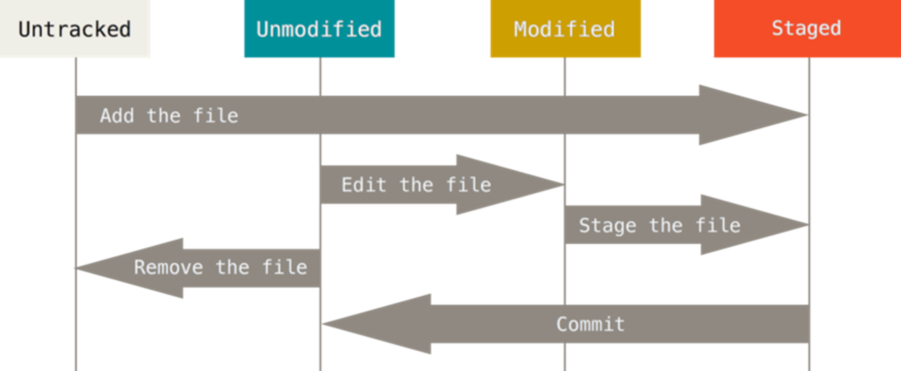

## 远程仓库

远程仓库的别名为origin

## 本地仓库与远程仓库交互协议

一般是选择ssh

更快

主要使用公钥和私钥

将客户端的ssh公钥拷贝服务端中，这样可以实现免密码登录

## git基础原理

### git的git的四个区域

**Workspace**： 工作区，就是你平时存放项目代码的地方

**Index / Stage**： 暂存区，用于临时存放你的改动，事实上它只是一个文件，保存即将提交到文件列表信息

**Repository**： 仓库区（或版本库），就是安全存放数据的位置，这里面有你提交到所有版本的数据。其中HEAD指向最新放入仓库的版本

**Remote**： 远程仓库，托管代码的服务器，可以简单的认为是你项目组中的一台电脑用于远程数据交换

**这里有一个地方值得注意就是从Remote中拉取代码有两种方式**

**一种是fecth一种是pull**

**git pull相当于直接把代码拉取到工作区然后修改工作区的文件**

**git fetch则是把远程仓库的修改先拉取到本地仓库 的origin(远程仓库在本地的分支，由git维护)**

将远程仓库包含分支的最新commit-id到本地文件

然后再git merge把修改的内容拷贝到工作区

### git的工作流程

git的工作流程一般是这样的：

1、在工作目录中添加、修改文件；

2、将需要进行版本管理的文件add到暂存区域；

3、将暂存区域的文件commit到git仓库；

4、本地的修改push到远程仓库，如果失败则执行第5步

5、git pull将远程仓库的修改拉取到本地，如果有冲突需要修改冲突。回到第三步

因此，git管理的文件有三种状态：已修改（modified）,已暂存（staged）,已提交(committed)

### git 文件的四种状态

Untracked:   未跟踪, 此文件在文件夹中，但并没有加入到git库，不参与版本控制， 通过git add 状态变为Staged。
Unmodify:   文件已经入库且未修改, 即版本库中的文件快照内容与文件夹中完全一致，这种类型的文件有两种去处，如果它被修改， 而变为Modified，如果使用git rm移出版本库, 则成为Untracked文件。
Modified：文件已修改，仅仅是修改，并没有进行其他的操作，这个文件也有两个去处，通过git add可进入暂存staged状态，使用git checkout 则丢弃修改，返回到unmodify状态, 这个git checkout即从库中取出文件，覆盖当前修改
Staged：暂存状态，执行git commit则将修改同步到库中，这时库中的文件和本地文件又变为一致，文件为Unmodify状态。

## 管理commit

## 版本回退

### 尚未commit

git restore --staged  文件名

直接取消暂存区的修改，但是如果此时工作区的文件已经被修改，那么不会从暂存区中的文件来覆盖工作区的文件

git restore -s  文件名

工作区的文件wei

### 已经commit，如何回退

git reset --soft //回退到暂存区

giut reset --mixed //回退到工作区

git rest --hard //直接删除这个提交，本地文件全部回退，仿佛没有编辑过或者新添加过这个文件一样

上面三个最后一个参数是head^代表回退一个版本

（这个不会删除文件，只会管理修改，要删除文件需要自己删除）

### 清空工作区的修改

git checkout 将工作区情况

### 如果已经提交到远程仓库

你只能先把远程仓库的代码拉取下来，回退提交到本地仓库，再提交到远程仓库

## 本地仓库的整理操作

commit 加上. 代表把暂存区的内容全部提交

### 补充提交到上一次commit

因为忘记有代码修改了没提交，但是又不能再来一个commit

新文件还是先gid add

然后git commit --amend （复用你的上一次提交）

### 修改前几次提交

 