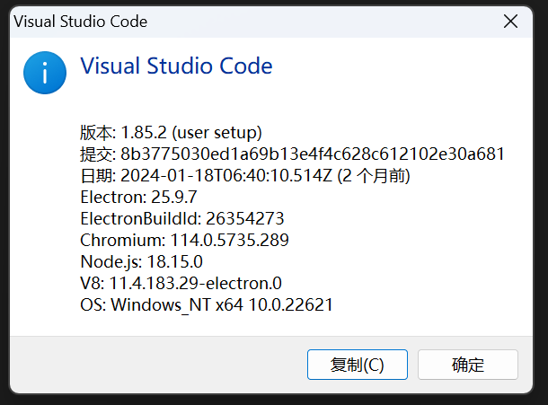
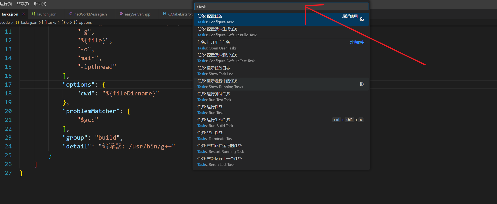
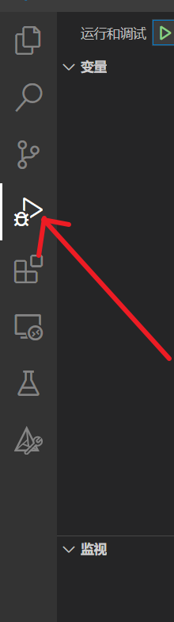

## vs code普通配置

这是普通配置，选择vs code这个版本




使用ctrl + shift + p



然后输入task,选择 配置任何，并且在task.json中输入下面的内容

task.json

```cmake
{
	"version": "2.0.0",
	"tasks": [
		{
			"type": "cppbuild",
			"label": "build debug",
			"command": "/usr/bin/g++",
			"args": [
				"-std=c++11",
				"-fdiagnostics-color=always",
				"-g",
				"${file}",
				"-o",
				"main",
				"-lpthread"
			],
			"options": {
				"cwd": "${fileDirname}"
			},
			"problemMatcher": [
				"$gcc"
			],
			"group": "build",
			"detail": "编译器: /usr/bin/g++"
		}
	]
}
```

点击下面这个



然后点击出现的launch.json，并将下面的内容填到对应的文件

```cmake
{
    "configurations": [
        {
            "name": "C/C++: g++ 生成和调试活动文件",
            "type": "cppdbg",
            "request": "launch",
            "program": "${workspaceFolder}/code/main",
            //"args": ["-host","127.0.0.1","-port","6051","-cacert","ca.crt","-cert","c_sign.crt","-key","c_signkey.pem","-pass","123456"],
            //Above is an example of parameter input for the main function
            "args": [],
            "stopAtEntry": false,
            "cwd": "${workspaceFolder}/",
            "environment": [],
            "externalConsole": false,
            "MIMode": "gdb",
            "setupCommands": [
                {
                    "description": "为 gdb 启用整齐打印",
                    "text": "-enable-pretty-printing",
                    "ignoreFailures": true
                },
                {
                    "description": "将反汇编风格设置为 Intel",
                    "text": "-gdb-set disassembly-flavor intel",
                    "ignoreFailures": true
                }
            ],
            "preLaunchTask": "build debug",
            "miDebuggerPath": "/bin/gdb"
        }
    ],
    "version": "2.0.0"
}
```


这个是告诉vscode你需要去哪里找你的头文件，只是为了防止头文件变红，具体的编译规则是通过task.json来实现的

c_cpp_propertied.json

```cmake
{
    "configurations": [
        {
            "name": "Linux",
            "includePath": [
                "${workspaceFolder}/**",
                "/usr/include/**"
            ],
            "defines": [],
            "compilerPath": "/usr/bin/gcc",
            "cStandard": "c11",
            "cppStandard": "c++11",
            "intelliSenseMode": "linux-gcc-x64"
        }
    ],
    "version": 4
}
```

## vs code配置cmake