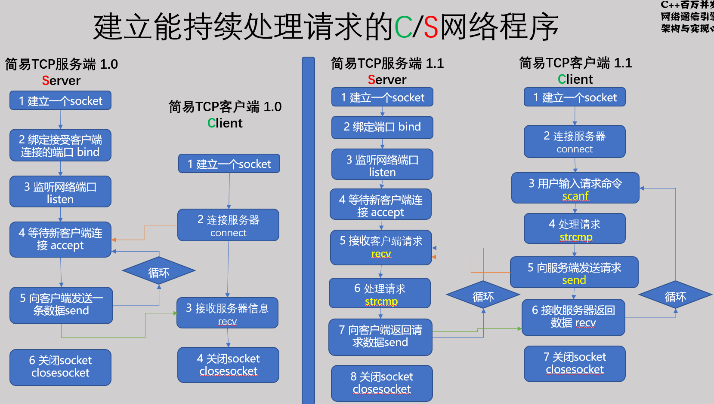
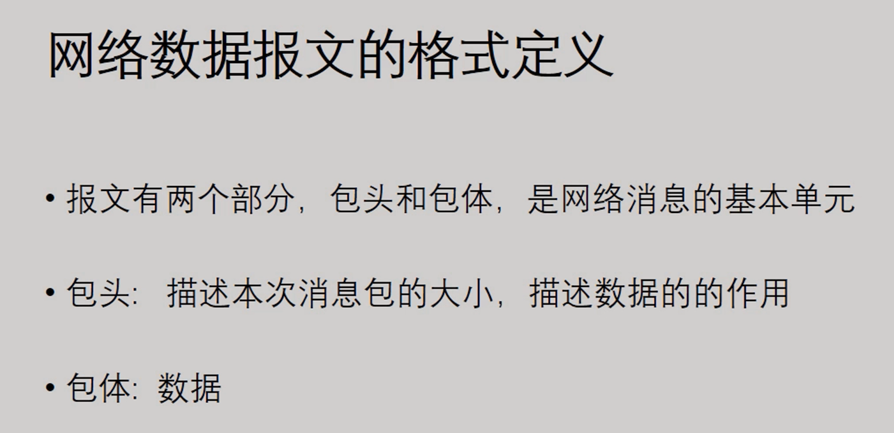

## 建立持续处理请求的C/S网络程序



整体比较简单，但纯字符串网络消息不能更好的表达信息

## 采用结构化的网络消息数据

**使用结构化的二进制数据流传输网络消息**

**优点：**

​	**简单、方便、解析快，消耗低**
**缺点：**

​	**需要严格的网络字节序一致**



**使用结构化网络数据包来进行消息的传递代码**

发送端将包头，数据体都存放在一个结构体内部，然后接收端，接受到信息后，先解析包头的值，再根据包头的值采用对应的处理函数

### **服务端**

1.定义数据头与数据体

```c++
enum CMD
{
    CMD_LOGIN,
    CMD_LOGIN_RESULT,
    CMD_LOGOUT,
    CMD_LOGOUT_RESULT,
    CMD_ERROR
};
struct DataHeader
{
    short dataLength;
    short cmd;
};

// DataPackage,数据体
struct Login : public DataHeader
{
    Login()
    {
        dataLength = sizeof(Login);
        cmd = CMD_LOGIN;
    }
    char userName[32];
    char PassWord[32];
};

struct LoginResult : public DataHeader
{
    LoginResult()
    {
        dataLength = sizeof(LoginResult);
        cmd = CMD_LOGIN_RESULT;
        result = 0;
    }
    int result;
};

struct Logout : public DataHeader
{
    Logout()
    {
        dataLength = sizeof(Logout);
        cmd = CMD_LOGOUT;
    }
    char userName[32];
};

struct LogoutResult : public DataHeader
{
    LogoutResult()
    {
        dataLength = sizeof(LogoutResult);
        cmd = CMD_LOGIN_RESULT;
        result = 0;
    }
    int result;
};
```

2.具体业务处理逻辑

先获取数据头，判断接受到的数据长度是否比定义的数据头长度小，如果小则说明没有获取到完整的数据头

获取到数据头之后利用指针强转为对应的结构体，然后解析数据头的命令信息，调用对应的业务处理逻辑

> 这里有一个易错的问题就是第二次recv是有一个偏移量，是因为我们第一次已经接收到了对应的数据头，接下来我们只期望接收到数据体，所以有一个指针偏移量，并且将这个数据体的数据获取完成之后，直接转换为对应的数据包（包括包头和包体的结构体）

```c++
    // 接受客户数据
    while (true)
    {
        DataHeader *header;
        char szRecv[128] = {};
        // 5 接收客户端数据，先提取数据头
        int nLen = recv(cln_fd, szRecv, sizeof(DataHeader), 0);
        header = (DataHeader *)szRecv;
        if (nLen <= 0)
        {
            printf("客户端已退出，任务结束。");
            break;
        }
        // 粘包问题详解
        // 设置
        switch (header->cmd)
        {
        case CMD_LOGIN:
        {
            Login *login;
            // 因为最开始已经读取了一个头部数据，所以这里buf的地址有一个偏移量
            recv(cln_fd, szRecv + sizeof(DataHeader), header->dataLength - sizeof(DataHeader), 0);
            
            //这里相当于已经读取了整个Login结构体的数据
            login = (Login *)(szRecv);
            printf("收到命令：CMD_LOGIN,数据长度：%d,userName=%s PassWord=%s\n", login->dataLength, login->userName, login->PassWord);
            // 忽略判断用户密码是否正确的过程
            LoginResult ret;
            send(cln_fd, (char *)&ret, sizeof(LoginResult), 0);
        }
        break;
        case CMD_LOGOUT:
        {
            Logout *logout;
            recv(cln_fd, szRecv + sizeof(DataHeader), header->dataLength - sizeof(DataHeader), 0);
            logout = (Logout *)(szRecv);
            printf("收到命令：CMD_LOGOUT,数据长度：%d,userName=%s \n", logout->dataLength, logout->userName);
            // 忽略判断用户密码是否正确的过程
            LogoutResult ret;
            send(cln_fd, (char *)&ret, sizeof(ret), 0);
        }
        break;
        default:
            DataHeader header = {CMD_ERROR, 0};
            send(cln_fd, (char *)&header, sizeof(header), 0);
            break;
        }
    }
```

3.总体代码

```c++
#include <stdio.h>
#include <stdlib.h>
#include <sys/socket.h>
#include <unistd.h>
#include <arpa/inet.h>
#include <pthread.h>
#include <errno.h>

enum CMD
{
    CMD_LOGIN,
    CMD_LOGIN_RESULT,
    CMD_LOGOUT,
    CMD_LOGOUT_RESULT,
    CMD_ERROR
};
struct DataHeader
{
    short dataLength;
    short cmd;
};

// DataPackage,数据体
struct Login : public DataHeader
{
    Login()
    {
        dataLength = sizeof(Login);
        cmd = CMD_LOGIN;
    }
    char userName[32];
    char PassWord[32];
};

struct LoginResult : public DataHeader
{
    LoginResult()
    {
        dataLength = sizeof(LoginResult);
        cmd = CMD_LOGIN_RESULT;
        result = 0;
    }
    int result;
};

struct Logout : public DataHeader
{
    Logout()
    {
        dataLength = sizeof(Logout);
        cmd = CMD_LOGOUT;
    }
    char userName[32];
};

struct LogoutResult : public DataHeader
{
    LogoutResult()
    {
        dataLength = sizeof(LogoutResult);
        cmd = CMD_LOGIN_RESULT;
        result = 0;
    }
    int result;
};
int main()
{
    int lfd, cln_fd;
    char buf[128] = {0};
    struct sockaddr_in serv_addr, cln_addr;
    socklen_t len = sizeof(serv_addr);

    serv_addr.sin_family = AF_INET;
    serv_addr.sin_port = htons(8101);
    serv_addr.sin_addr.s_addr = INADDR_ANY;

    lfd = socket(AF_INET, SOCK_STREAM, 0);
    if (bind(lfd, (sockaddr *)&serv_addr, sizeof(serv_addr)) < 0)
    {
        printf("bind err,%d\n", errno);
    }

    if (listen(lfd, 5) < 0)
    {
        printf("listen err,%d\n", errno);
    }

    cln_fd = accept(lfd, (sockaddr *)&cln_addr, &len);

    // 接受客户数据
    while (true)
    {
        DataHeader *header;
        char szRecv[128] = {};
        // 5 接收客户端数据，先提取数据头
        int nLen = recv(cln_fd, szRecv, sizeof(DataHeader), 0);
        header = (DataHeader *)szRecv;
        if (nLen <= 0)
        {
            printf("客户端已退出，任务结束。");
            break;
        }
        // 粘包问题详解
        // 设置
        switch (header->cmd)
        {
        case CMD_LOGIN:
        {
            Login *login;
            // 因为最开始已经读取了一个头部数据，所以这里buf的地址有一个偏移量
            recv(cln_fd, szRecv + sizeof(DataHeader), header->dataLength - sizeof(DataHeader), 0);
            
            //这里相当于已经读取了整个Login结构体的数据
            login = (Login *)(szRecv);
            printf("收到命令：CMD_LOGIN,数据长度：%d,userName=%s PassWord=%s\n", login->dataLength, login->userName, login->PassWord);
            // 忽略判断用户密码是否正确的过程
            LoginResult ret;
            send(cln_fd, (char *)&ret, sizeof(LoginResult), 0);
        }
        break;
        case CMD_LOGOUT:
        {
            Logout *logout;
            recv(cln_fd, szRecv + sizeof(DataHeader), header->dataLength - sizeof(DataHeader), 0);
            logout = (Logout *)(szRecv);
            printf("收到命令：CMD_LOGOUT,数据长度：%d,userName=%s \n", logout->dataLength, logout->userName);
            // 忽略判断用户密码是否正确的过程
            LogoutResult ret;
            send(cln_fd, (char *)&ret, sizeof(ret), 0);
        }
        break;
        default:
            DataHeader header = {CMD_ERROR, 0};
            send(cln_fd, (char *)&header, sizeof(header), 0);
            break;
        }
    }
}
```

### **客户端：**

```c++
#include <stdio.h>
#include <unistd.h>
#include <arpa/inet.h>
#include <sys/socket.h>
#include <stdlib.h>
#include <string.h>
#include <errno.h>

enum CMD
{
    CMD_LOGIN,
    CMD_LOGIN_RESULT,
    CMD_LOGOUT,
    CMD_LOGOUT_RESULT,
    CMD_ERROR
};
struct DataHeader
{
    short dataLength;
    short cmd;
};
// DataPackage
struct Login : public DataHeader
{
    Login()
    {
        dataLength = sizeof(Login);
        cmd = CMD_LOGIN;
    }
    char userName[32];
    char PassWord[32];
};

struct LoginResult : public DataHeader
{
    LoginResult()
    {
        dataLength = sizeof(LoginResult);
        cmd = CMD_LOGIN_RESULT;
        result = 0;
    }
    int result;
};

struct Logout : public DataHeader
{
    Logout()
    {
        dataLength = sizeof(Logout);
        cmd = CMD_LOGOUT;
    }
    char userName[32];
};

struct LogoutResult : public DataHeader
{
    LogoutResult()
    {
        dataLength = sizeof(LogoutResult);
        cmd = CMD_LOGIN_RESULT;
        result = 0;
    }
    int result;
};

int main()
{
    // 1.创建一个tcp的socket，客户端
    int client_socket = socket(AF_INET, SOCK_STREAM, 0);

    // 2.初始化服务器地址
    struct sockaddr_in server_addr;
    memset(&server_addr, 0, sizeof(server_addr));
    server_addr.sin_family = AF_INET;
    server_addr.sin_port = htons(8101);
    server_addr.sin_addr.s_addr = inet_addr("127.0.0.1");

    // 3.连接到服务器
    if (connect(client_socket, (struct sockaddr *)&server_addr, sizeof(server_addr)) != -1)
    {
        printf("connect server sucess\n");
    }
    else
    {
        // 出现错误打印出errno的值
        printf("connect server error,error number is %d\n", errno);
        return -1;
    }
    while (true)
    {
        // 3输入请求命令
        char cmdBuf[128] = {};
        scanf("%s", cmdBuf);
        // 4 处理请求命令,判断用户输入的指令，对用户封装了内部的实现逻辑
        if (0 == strcmp(cmdBuf, "exit"))
        {
            printf("收到exit命令，任务结束。\n");
            break;
        }
        else if (0 == strcmp(cmdBuf, "login"))
        {
            // 5 向服务器发送请求命令
            Login login;
            strcpy(login.userName, "lyd");
            strcpy(login.PassWord, "lydmima");
            send(client_socket, (const char *)&login, sizeof(login), 0);
            // 接收服务器返回的数据
            LoginResult loginRet = {};
            recv(client_socket, (char *)&loginRet, sizeof(loginRet), 0);
            printf("LoginResult: %d \n", loginRet.result);
        }
        else if (0 == strcmp(cmdBuf, "logout"))
        {
            Logout logout;
            strcpy(logout.userName, "lyd");
            // 5 向服务器发送请求命令
            send(client_socket, (const char *)&logout, sizeof(logout), 0);
            // 接收服务器返回的数据
            LogoutResult logoutRet = {};
            recv(client_socket, (char *)&logoutRet, sizeof(logoutRet), 0);
            printf("LogoutResult: %d \n", logoutRet.result);
        }
        else
        {
            printf("不支持的命令，请重新输入。\n");
        }
    }
}

```

 

## select模型处理多客户端

### 服务端

基于select实现的服务端

```c++
#include <stdio.h> //标准io printf scanf
#include <stdlib.h>
#include <sys/socket.h> //socket 相关
#include <unistd.h>     // uni std，
#include <arpa/inet.h>  // 网络序
#include <thread>       //c++ 11 线程库
#include <errno.h>
#include <vector>
#include <sys/select.h>
#include <fcntl.h>

enum CMD
{
    CMD_LOGIN,
    CMD_LOGIN_RESULT,
    CMD_LOGOUT,
    CMD_LOGOUT_RESULT,
    CMD_NEW_USER_JOIN,
    CMD_ERROR
};
struct DataHeader
{
    short dataLength;
    short cmd;
};

// DataPackage,数据体
struct Login : public DataHeader
{
    Login()
    {
        dataLength = sizeof(Login);
        cmd = CMD_LOGIN;
    }
    char userName[32];
    char PassWord[32];
};

struct LoginResult : public DataHeader
{
    LoginResult()
    {
        dataLength = sizeof(LoginResult);
        cmd = CMD_LOGIN_RESULT;
        result = 0;
    }
    int result;
};

struct Logout : public DataHeader
{
    Logout()
    {
        dataLength = sizeof(Logout);
        cmd = CMD_LOGOUT;
    }
    char userName[32];
};

struct LogoutResult : public DataHeader
{
    LogoutResult()
    {
        dataLength = sizeof(LogoutResult);
        cmd = CMD_LOGIN_RESULT;
        result = 0;
    }
    int result;
};

struct NewUserJoin : public DataHeader
{
    NewUserJoin()
    {
        dataLength = sizeof(NewUserJoin);
        cmd = CMD_NEW_USER_JOIN;
        scok = 0;
    }
    int scok;
};

std::vector<int> g_clients; // 存放客户端的文件描述符

// 处理消息的具体步骤，抽出为函数
int processer(int cln_fd)
{
    DataHeader *header;
    char szRecv[128] = {};
    // 接收客户端数据，先提取数据头
    int nLen = recv(cln_fd, szRecv, sizeof(DataHeader), 0);
    header = (DataHeader *)szRecv;
    if (nLen <= 0)
    {
        printf("客户端已退出，任务结束。\n");
        return -1;
    }
    switch (header->cmd)
    {
    case CMD_LOGIN:
    {
        Login *login;
        // 因为最开始已经读取了一个头部数据，所以这里buf的地址有一个偏移量
        recv(cln_fd, szRecv + sizeof(DataHeader), header->dataLength - sizeof(DataHeader), 0);
        login = (Login *)(szRecv);
        printf("收到命令：CMD_LOGIN,数据长度：% d,userName=%s PassWord=%s\n", login->dataLength, login->userName, login->PassWord);
        // 忽略判断用户密码是否正确的过程
        LoginResult ret;
        send(cln_fd, (char *)&ret, sizeof(LoginResult), 0);
    }
    break;
    case CMD_LOGOUT:
    {
        Logout *logout;
        recv(cln_fd, szRecv + sizeof(DataHeader), header->dataLength - sizeof(DataHeader), 0);
        logout = (Logout *)(szRecv);
        printf("收到命令：CMD_LOGOUT,数据长度：%d,userName=%s \n", logout->dataLength, logout->userName);
        // 忽略判断用户密码是否正确的过程
        LogoutResult ret;
        send(cln_fd, (char *)&ret, sizeof(ret), 0);
    }
    break;
    default:
    {
        DataHeader header = {CMD_ERROR, 0};
        send(cln_fd, (char *)&header, sizeof(header), 0);
        break;
    }
    }
}

int main()
{
    int lfd, cln_fd;
    char buf[128] = {0};
    struct sockaddr_in serv_addr;
    socklen_t len = sizeof(serv_addr);

    serv_addr.sin_family = AF_INET;
    serv_addr.sin_port = htons(8101);
    serv_addr.sin_addr.s_addr = INADDR_ANY;

    lfd = socket(AF_INET, SOCK_STREAM, 0);
    int flag = fcntl(lfd, F_GETFD);
    // flag = flag |
    if (bind(lfd, (sockaddr *)&serv_addr, sizeof(serv_addr)) < 0)
    {
        printf("bind err,%d\n", errno);
    }

    if (listen(lfd, 5) < 0)
    {
        printf("listen err,%d\n", errno);
    }

    // 接受客户数据
    while (true)
    {
        // 初始化 读文件描述符集合
        fd_set read_set;
        fd_set write_set;
        fd_set error_set;
        FD_ZERO(&read_set);
        FD_ZERO(&write_set);
        FD_ZERO(&error_set);
        // 将监听文件描述符加入到事件集合中去
        FD_SET(lfd, &read_set);
        FD_SET(lfd, &write_set);
        FD_SET(lfd, &error_set);

        int max_fd = lfd;
        // 监听客户端的文件描述，只考虑放入 可读事件发送队列
        for (int i = g_clients.size() - 1; i >= 0; i--)
        {
            FD_SET(g_clients[i], &read_set);
            // 判断新的max_fd是多少，因为select需要传入最大文件描述符+1
            if (max_fd < g_clients[i])
            {
                max_fd = g_clients[i];
            }
        }
        // select监听文件描述符，等待两秒钟就返回，如果没有事件需要监听，那么返回-1
        timeval time = {2, 0};

        // nfd 返回的是发生变化的文件描述符的总数
        int ret = select(max_fd + 1, &read_set, &write_set, &error_set, &time);
        if (ret < 0)
        {
            printf("select task is over\n");
            break;
        }

        // ret 为0则说明超时
        if (ret == 0)
        {
            printf("空闲，处理其他任务\n");
        }
        else
        {
            // 先判断监听文件描述符是否发生了读事件
            // 如果是监听文件描述符发生了变化，说明有新的连接到来，需要接受新的连接，并放入g_clients中
            if (FD_ISSET(lfd, &read_set))
            {
                // 清除
                FD_CLR(lfd, &read_set);
                struct sockaddr_in cln_addr;
                socklen_t cln_len = sizeof(cln_addr);
                cln_fd = accept(lfd, (sockaddr *)&cln_addr, &cln_len);

                if (cln_fd == -1)
                {
                    printf("accept error");
                }
                else
                {
                    for (int n = (int)g_clients.size() - 1; n >= 0; n--)
                    {
                        NewUserJoin userJoin;
                        send(g_clients[n], (const char *)&userJoin, sizeof(NewUserJoin), 0);
                    }
                    g_clients.push_back(cln_fd);
                    printf("新客户端加入：socket = %d,IP = %s \n", (int)cln_fd, inet_ntoa(cln_addr.sin_addr));
                }
            }

            // 处理其他客户端的读事件
            for (int i = g_clients.size() - 1; i >= 0; i--)
            {
                if (FD_ISSET(g_clients[i], &read_set))
                {
                    // 如果返回值是-1，则说明该文件描述符关闭或者因为其他原因损坏，要将其直接关闭
                    if (-1 == processer(g_clients[i]))
                    {
                        auto iter = g_clients.begin() + i; // std::vector<SOCKET>::iterator
                        close(g_clients[i]);               // 关闭该文件描述符
                        // 从动态数组中删除该文件描述符
                        if (iter != g_clients.end())
                        {
                            g_clients.erase(iter);
                        }
                    }
                }
            }
        }
    }
    // 结束关闭所有的客户端文件描述符
    for (int i = g_clients.size() - 1; i >= 0; i--)
    {
        close(g_clients[i]);
    }
    // 关闭监听文件描述符
    close(lfd);
}
```


### 客户端

 基于select模型与多线程处理

```c++
#include <stdio.h>
#include <unistd.h>
#include <arpa/inet.h>
#include <sys/socket.h>
#include <stdlib.h>
#include <string.h>
#include <errno.h>
#include <sys/select.h>
#include <thread>
enum CMD
{
    CMD_LOGIN,
    CMD_LOGIN_RESULT,
    CMD_LOGOUT,
    CMD_LOGOUT_RESULT,
    CMD_NEW_USER_JOIN,
    CMD_ERROR
};
struct DataHeader
{
    short dataLength;
    short cmd;
};

// DataPackage,数据体
struct Login : public DataHeader
{
    Login()
    {
        dataLength = sizeof(Login);
        cmd = CMD_LOGIN;
    }
    char userName[32];
    char PassWord[32];
};

struct LoginResult : public DataHeader
{
    LoginResult()
    {
        dataLength = sizeof(LoginResult);
        cmd = CMD_LOGIN_RESULT;
        result = 0;
    }
    int result;
};

struct Logout : public DataHeader
{
    Logout()
    {
        dataLength = sizeof(Logout);
        cmd = CMD_LOGOUT;
    }
    char userName[32];
};

struct LogoutResult : public DataHeader
{
    LogoutResult()
    {
        dataLength = sizeof(LogoutResult);
        cmd = CMD_LOGIN_RESULT;
        result = 0;
    }
    int result;
};

struct NewUserJoin : public DataHeader
{
    NewUserJoin()
    {
        dataLength = sizeof(NewUserJoin);
        cmd = CMD_NEW_USER_JOIN;
        scok = 0;
    }
    int scok;
};
bool g_run = true;
void InputCmd(int sock)
{
    while (true)
    {
        // 输入请求命令
        char cmdBuf[128] = {};
        scanf("%s", cmdBuf);
        // 处理请求命令,判断用户输入的指令，对用户封装了内部的实现逻辑
        if (0 == strcmp(cmdBuf, "exit"))
        {
            printf("收到exit命令，任务结束。\n");
            g_run = false;
            break;
        }
        else if (0 == strcmp(cmdBuf, "Login"))
        {
            // 向服务器发送请求命令
            Login result;
            strcpy(result.userName, "lyd");
            strcpy(result.PassWord, "lydmima");
            send(sock, (const char *)&result, sizeof(result), 0);
        }
        else if (0 == strcmp(cmdBuf, "Logout"))
        {
            Logout result;
            strcpy(result.userName, "lyd");
            // 5 向服务器发送请求命令
            send(sock, (const char *)&result, sizeof(result), 0);
        }
        else
        {
            printf("不支持的命令，请重新输入。\n");
        }
    }
}

// 接受来之服务端的信息
int processer(int sock)
{
    DataHeader *header;
    char szRecv[1024] = {};
    // 接收服务端数据，先提取数据头
    int nLen = recv(sock, szRecv, sizeof(DataHeader), 0);
    header = (DataHeader *)szRecv;
    if (nLen <= 0)
    {
        printf("服务端已退出，任务结束。\n");
        return -1;
    }
    switch (header->cmd)
    {
    case CMD_LOGIN_RESULT:
    {
        LoginResult *result;
        // 因为最开始已经读取了一个头部数据，所以这里buf的地址有一个偏移量
        recv(sock, szRecv + sizeof(DataHeader), header->dataLength - sizeof(DataHeader), 0);
        result = (LoginResult *)(szRecv);
        printf("收到服务端消息：CMD_LOGIN_RESULT,数据长度：% d,result=%d \n", result->dataLength, result->result);
    }
    break;
    case CMD_LOGOUT_RESULT:
    {
        LogoutResult *result;
        recv(sock, szRecv + sizeof(DataHeader), header->dataLength - sizeof(DataHeader), 0);
        result = (LogoutResult *)(szRecv);
        printf("收到服务端消息：CMD_LOGOUT,数据长度：%d,result=%d \n", result->dataLength, result->result);
    }
    break;
    case CMD_NEW_USER_JOIN:
    {
        NewUserJoin *result;
        recv(sock, szRecv + sizeof(DataHeader), header->dataLength - sizeof(DataHeader), 0);
        result = (NewUserJoin *)(szRecv);
        printf("收到服务端消息：CMD_NEW_USER_JOIN,数据长度：%d\n", result->dataLength);
    }
    break;
    default:
    {
        DataHeader header = {CMD_ERROR, 0};
        send(sock, (char *)&header, sizeof(header), 0);
        break;
    }
    }
}
int main()
{
    // 1.创建一个tcp的socket，客户端
    int sock = socket(AF_INET, SOCK_STREAM, 0);

    // 2.初始化服务器地址
    struct sockaddr_in server_addr;
    memset(&server_addr, 0, sizeof(server_addr));
    server_addr.sin_family = AF_INET;
    server_addr.sin_port = htons(8101);
    server_addr.sin_addr.s_addr = inet_addr("127.0.0.1");

    // 3.连接到服务器
    if (connect(sock, (struct sockaddr *)&server_addr, sizeof(server_addr)) != -1)
    {
        printf("connect server sucess\n");
    }
    else
    {
        // 出现错误打印出errno的值
        printf("connect server error,error number is %d\n", errno);
        return -1;
    }
    std::thread t1(InputCmd, sock);
    t1.detach();
    while (g_run)
    {
        fd_set read_set;
        FD_ZERO(&read_set);
        FD_SET(sock, &read_set);
        timeval time = {2, 0};
        int nfd = select(sock + 1, &read_set, NULL, NULL, &time);
        if (nfd < 0)
        {
            printf("select task client error");
            break;
        }

        if (FD_ISSET(sock, &read_set))
        {
            FD_CLR(sock, &read_set);

            if (-1 == processer(sock))
            {
                printf("select任务结束2\n");
                break;
            }
        }

        // printf("发送login信息..\n");
        // Login login;
        // strcpy(login.userName, "lyd");
        // strcpy(login.PassWord, "lyd");
        // send(sock, (const char *)&login, sizeof(Login), 0);
        // sleep(2);
    }
    printf("关闭socket\n");
    close(sock);
}

```

