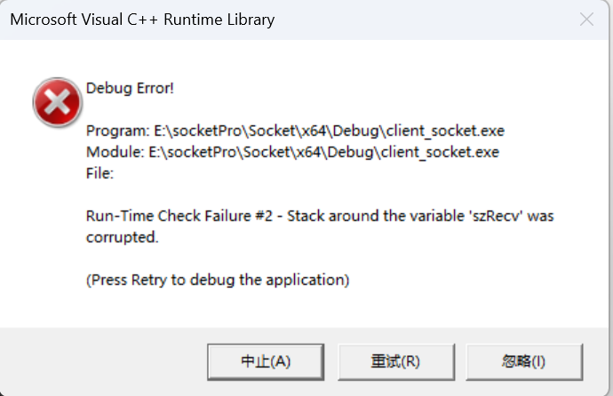
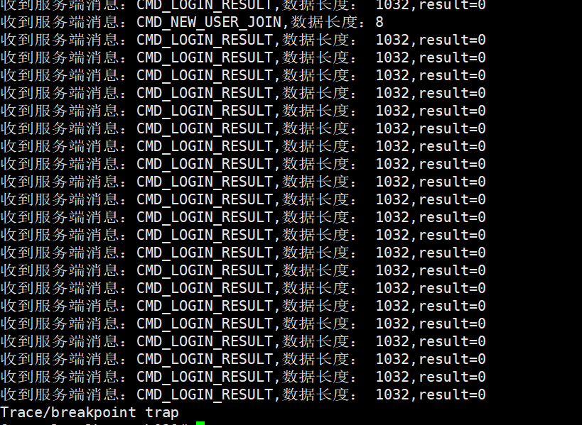
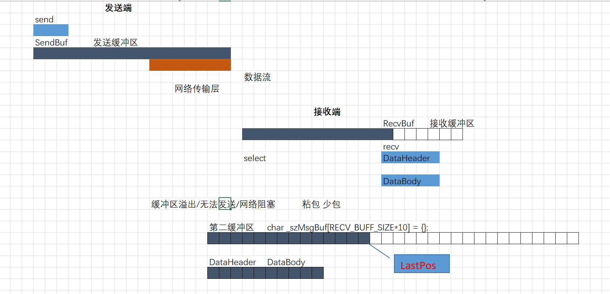
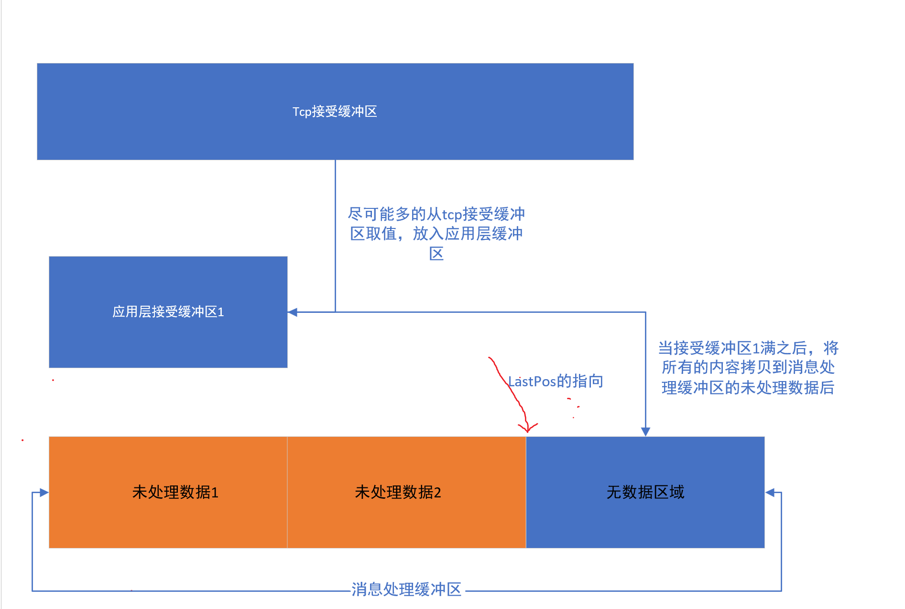
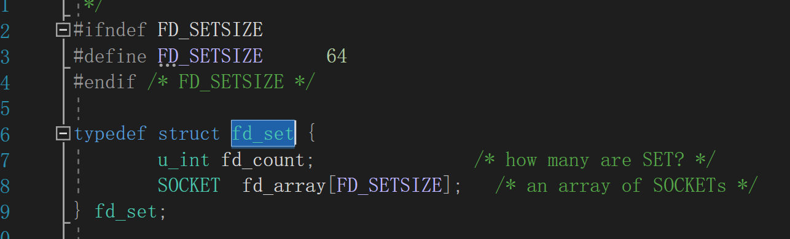

## 不处理粘包可能出现的问题

如果对于收发数据不做额外的处理，同时发送的数据量过大,在windows的客户端会报错栈溢出了



在linux会出现



## send和recv缓冲区

send函数可能不会立即将将数据发送到网络上，而是先将数据发送到tcp的发送缓冲区，等tcp自己确认什么时候该发送数据了，就把发送缓冲区的数据发送出去



在客户端的recv函数获取数据是不可控的，可能并不会提取出你所期望的数据比如你期望获取1000个字节，可能只获取了500个字节就返回了，这就可能导致tcp的接受缓冲区满了（发送数据的速度比接受数据的速度更快）

那么就可能出现发送方无法发送数据，网络阻塞等情况。

**解决这个问题的方案**

**1.就是我们尽可能的从缓冲区中获取一定量的数据到应用层的数据缓冲区，这样就可以保持一个接收方接受缓冲区更，就可以一直接受发送方传输过来的数据**

2.**就是客户端发送过来的数据可能并不会恰好是一个数据报，所以服务端不能每次都恰好先收一个数据头**

## 修改netWorkMessage

为了更好的测试发送和接受的性能，先将netWorkMessage中的Login与LoginResult类进行修改

```c++
struct Login : public DataHeader
{
	Login()
	{
		dataLength = sizeof(Login);
		cmd = CMD_LOGIN;
	}
	char userName[32];
	char PassWord[32];
	char data[932];
};

struct LoginResult : public DataHeader
{
	LoginResult()
	{
		dataLength = sizeof(LoginResult);
		cmd = CMD_LOGIN_RESULT;
		result = 0;
	}
	int result;
	char data[992];
};
```

确保发送和接受的数据包都是1k个字节

## 客户端解决粘包

###  1.处理接受数据逻辑

处理粘包核心在于接受数据的时候进行相应的处理

防止被阻塞在应用层中，所以在应用层中设置一个接受缓冲区A，不断的从tcp接受缓冲区读取数据，尽可能的读取完tcp接受缓冲区的数据或者读取到缓冲区A的size就返回

再设置一个消息处理缓冲区，吧接受缓冲区的数据拷贝到消息处理缓冲区，我们对于发送方发送的数据处理主要是在消息缓冲区中进行



当把消息处理缓冲区中的未处理数据1处理，并向对应的客户端返回对应的结果之后，将未处理数据2前移到最开始的位置再进行循环处理

具体接受逻辑为

```c++
#define  RECV_BUFFER_SIZE 10240
	//接受缓冲区（应用层的缓冲区）
	char _szRecv[RECV_BUFFER_SIZE] = {};
	//第二缓冲区 消息处理缓冲区
	char _szMsgBuf[RECV_BUFFER_SIZE * 10] = {};
	//消息缓冲区的数据尾部位置，也就是可以存放新数据的起始位置,通过这个变量来控制那些数据被处理
	char _lastPos = 0;
	// 接收数据 处理粘包 拆分包
	int Recv()
	{

		//1.从tcp缓冲区读数据，尽可能读取接受缓冲区的大小
		int nLen = (int)recv(_socket, _szRecv, RECV_BUFFER_SIZE, 0);
		if (nLen <= 0)
		{
			printf("<socket=%d>与服务器断开连接，任务结束。\n", _socket);
			return -1;
		}
		
		//2.将收取到的数据，拷贝到消息处理缓冲区中
		memcpy(_szMsgBuf + _lastPos, _szRecv, nLen);

		//3.改变lastPos的位置，它永远指向有效数据（从接收缓冲区拷贝到消息处理缓冲区，但是还没被处理的数据）的下一个字节
		_lastPos += nLen;

		//4.处理消息缓冲区的数据

		//先判断消息缓冲区的有效数据是否大于数据头的长度
		while (_lastPos >= sizeof(DataHeader)) 
		{
			DataHeader* head = (DataHeader*)_szMsgBuf;

			//判断消息缓冲区的有效数据是否大于一个数据包的长度
			if (_lastPos >= head->dataLength) 
			{
				//消息缓冲区剩余未处理数据的长度
				int nSize = _lastPos - head->dataLength;

				//进行对应的消息处理
				OnNetMsg((DataHeader* )head);

				//将消息缓冲区剩余未处理数据前移,从后面移到开头
				//第二个数据包开始的位置是首地址加上数据长度
				memcpy(_szMsgBuf, _szMsgBuf + head->dataLength, nSize);

				//修改lastPos的值
				_lastPos = nSize;
                
                //改变_lastPos的时候不能使用_lastPos = _lastPos - head->dataLength;
                //因为最开始head被后面的数据进行了覆盖
			}
			else 
			{
				//消息缓冲区剩余数据不够一条完整消息
				break;
			}
		}

		return 0;
	}
```

### 2.整体客户端类代码

```c++
#ifndef _CLIENT_H
#define _CLIENT_H

#ifdef _WIN32
#define WIN32_LEAN_AND_MEAN
#define _WINSOCK_DEPRECATED_NO_WARNINGS
#define _CRT_SECURE_NO_WARNINGS
#include <windows.h>
#include <WinSock2.h>
#pragma comment(lib, "ws2_32.lib")
#else
#include <sys/socket.h>
#include <unistd.h>
#include <arpa/inet.h>
#include <sys/select.h>
#include <string.h>

// 为了兼容windows的socket
#define SOCKET int
#define INVALID_SOCKET (SOCKET)(~0) // 也是-1
#define SOCKET_ERROR (-1)
#endif

#include <stdio.h>
#include "netWorkMessage.h"

class TcpClient
{
public:
	TcpClient()
	{
		_socket = INVALID_SOCKET;
	}
	// 初始化socket
	void InitSocket()
	{
#ifdef _WIN32
		// 启动Windows socket 2.x环境
		WORD ver = MAKEWORD(2, 2);
		WSADATA dat;
		WSAStartup(ver, &dat);
#endif
		// 如果socket已经初始化了，那么先关闭他
		if (INVALID_SOCKET != _socket)
		{
			printf("socket已经初始化，关闭老链接，socket=%d\n", _socket);
			Close();
		}

		_socket = socket(AF_INET, SOCK_STREAM, 0);
		if (INVALID_SOCKET == _socket)
		{
			printf("socket初始化失败\n");
		}
		else
		{
			printf("socket初始化成功,socket=%d\n", _socket);
		}
	}

	// 连接服务器
	int Connect(const char* ip, unsigned short port)
	{
		if (INVALID_SOCKET == _socket)
		{
			printf("请先初始化\n");
			return -1;
		}

		// 设置服务器ip地址
		sockaddr_in server_addr;
		memset(&server_addr, 0, sizeof(server_addr));
		server_addr.sin_family = AF_INET;
		server_addr.sin_port = htons(port);
#ifdef _WIN32
		server_addr.sin_addr.S_un.S_addr = inet_addr(ip);
#else
		server_addr.sin_addr.s_addr = inet_addr(ip);
#endif
		printf("<socket=%d>正在连接服务器<%s:%d>...\n", _socket, ip, port);
		int ret = connect(_socket, (struct sockaddr*)&server_addr, sizeof(server_addr));
		if (ret != -1)
		{
			printf("<socket=%d>连接服务器<%s:%d>成功...\n", _socket, ip, port);
		}
		else
		{
			// 出现错误打印出errno的值
			printf("<socket=%d>错误，连接服务器<%s:%d>失败...\n", _socket, ip, port);
			Close();
		}

		return ret;
	}
	int num = 0;
	// 处理网络消息
	int OnRun()
	{
		if (IsRun())
		{
			fd_set read_set;
			FD_ZERO(&read_set);
			FD_SET(_socket, &read_set);
			timeval time = { 1, 0 };
			int ret = select(_socket + 1, &read_set, NULL, NULL, &time);
			if (ret < 0)
			{
				printf("select task client dead");
			}

			if (FD_ISSET(_socket, &read_set))
			{
				FD_CLR(_socket, &read_set);

				if (-1 == Recv())
				{
					printf("select任务结束2\n");
					Close();
					return -1;
				}
			}
		}
	}
#define  RECV_BUFFER_SIZE 10240
	//接受缓冲区（应用层的缓冲区）
	char _szRecv[RECV_BUFFER_SIZE] = {};
	//第二缓冲区 消息处理缓冲区
	char _szMsgBuf[RECV_BUFFER_SIZE * 10] = {};
	//消息缓冲区的数据尾部位置，也就是可以存放新数据的起始位置,通过这个变量来控制那些数据被处理
	int _lastPos = 0;
	// 接收数据 处理粘包 拆分包
	int Recv()
	{

		//1.从tcp缓冲区读数据，尽可能读取接受缓冲区的大小
		int nLen = (int)recv(_socket, _szRecv, RECV_BUFFER_SIZE, 0);
		if (nLen <= 0)
		{
			printf("<socket=%d>与服务器断开连接，任务结束。\n", _socket);
			return -1;
		}
		
		//2.将收取到的数据，拷贝到消息处理缓冲区中
		memcpy(_szMsgBuf + _lastPos, _szRecv, nLen);

		//3.改变lastPos的位置，它永远指向有效数据（从接收缓冲区拷贝到消息处理缓冲区，但是还没被处理的数据）的下一个字节
		_lastPos += nLen;

		//4.处理消息缓冲区的数据

		//先判断消息缓冲区的有效数据是否大于数据头的长度
		while (_lastPos >= sizeof(DataHeader)) 
		{
			DataHeader* head = (DataHeader*)_szMsgBuf;

			//判断消息缓冲区的有效数据是否大于一个数据包的长度
			if (_lastPos >= head->dataLength) 
			{
				//消息缓冲区剩余未处理数据的长度
				int nSize = _lastPos - head->dataLength;

				//进行对应的消息处理
				OnNetMsg(head);

				//将消息缓冲区剩余未处理数据前移,从后面移到开头
				//第二个数据包开始的位置是首地址加上数据长度
				memcpy(_szMsgBuf, _szMsgBuf + head->dataLength, nSize);

				//修改lastPos的值
				_lastPos = nSize;
			}
			else 
			{
				//消息缓冲区剩余数据不够一条完整消息
				break;
			}
		}

		return 0;
	}

	// 处理具体的信息结构
	void OnNetMsg(DataHeader* header)
	{
		switch (header->cmd)
		{
		case CMD_LOGIN_RESULT:
		{
			LoginResult* result;
			// 因为传入的header是一个地址，而这个地址其是本质上也是LoginResult的地址，所以直接强转为LoginResult结构体
			result = (LoginResult*)(header);
			//printf("收到服务端消息：CMD_LOGIN_RESULT,数据长度：% d,result=%d \n", result->dataLength, result->result);
		}
		break;
		case CMD_LOGOUT_RESULT:
		{
			LogoutResult* result;
			result = (LogoutResult*)(header);
			//printf("收到服务端消息：CMD_LOGOUT,数据长度：%d,result=%d \n", result->dataLength, result->result);
		}
		break;
		case CMD_NEW_USER_JOIN:
		{
			NewUserJoin* result;
			result = (NewUserJoin*)(header);
			//printf("收到服务端消息：CMD_NEW_USER_JOIN,数据长度：%d\n", result->dataLength);
		}
		break;
		case CMD_ERROR:
		{
			printf("<socket=%d>收到服务端消息：CMD_ERROR,数据长度：%d\n", _socket, header->dataLength);
		}
		break;
		default:
		{
			printf("<socket=%d>收到未定义消息,数据长度：%d\n", _socket, header->dataLength);
		}
		}
	}
	// 判断是否还在运行
	bool IsRun()
	{
		return _socket != INVALID_SOCKET;
	}

	// 发送数据,传入DataHeader，因为如果你传入具体的类型，就需要多个重载，但是DataHeader是基类，你是可以将派生类对象赋值给基类的
	int SendData(DataHeader* header)
	{
		if (IsRun() && header)
		{
			return send(_socket, (const char*)header, header->dataLength, 0);
		}
		return SOCKET_ERROR;
	}

	// 关闭套接字
	void Close()
	{
		if (_socket != INVALID_SOCKET)
		{
#ifdef _WIN32
			closesocket(_socket);
			// 清除Windows socket环境
			WSACleanup();
#else
			close(_socket);
#endif
			_socket = INVALID_SOCKET;
		}
	}

	~TcpClient()
	{
		_socket = -1;
	}

private:
	SOCKET _socket;
};
#endif
```

### 3.使用代码

因为windows的现在select最多只能监听64-1个客户端socket

```c++
#include "easyClient.hpp"
#include<thread>

bool g_bRun = true;
void cmdThread()
{
	while (true)
	{
		char cmdBuf[256] = {};
		scanf("%s", cmdBuf);
		if (0 == strcmp(cmdBuf, "exit"))
		{
			g_bRun = false;
			printf("退出cmdThread线程\n");
			break;
		}
		else {
			printf("不支持的命令。\n");
		}
	}
}

int main()
{
	Login login;
	strcpy(login.userName, "lyd");
	strcpy(login.PassWord, "lydmima");

	const int cCount = FD_SETSIZE - 1;
	TcpClient* client[cCount];

	for (int n = 0; n < cCount; n++)
	{
		client[n] = new TcpClient();
	}
	for (int n = 0; n < cCount; n++)
	{
		client[n]->InitSocket();
		client[n]->Connect("192.168.1.8", 8102);
	}
	//启动UI线程
	std::thread t1(cmdThread);
	t1.detach();

	while (g_bRun)
	{
		for (int n = 0; n < cCount; n++)
		{
			client[n]->SendData(&login);
			client[n]->OnRun();
		}

	}

	for (int n = 0; n < cCount; n++)
	{
		client[n]->Close();
	}
	printf("已退出。\n");
	getchar();
	return 0;
}


```


## 服务端解决粘包

在最核心的代码，接受数据函数相关的逻辑和客户端相同，只是服务端可能有多个套接字，自然也需要多个消息处理缓冲区与套接字一一对应

### 1.改造服务端中维护客户端套接字的方式

```c++
class ClientSocket 
{
public:
    ClientSocket(SOCKET socketfd = INVALID_SOCKET) 
    {
        _sock = socketfd;
        memset(_szMsgBuf, 0, sizeof(_szMsgBuf));
        _lastPos = 0;
    }

    int GetLastPos() 
    {
        return _lastPos;
    }

    void SetLastPos(int lastPos)
    {
        _lastPos = lastPos;
    }

    char* GetMsgBuf() 
    {
        return _szMsgBuf;
    }

    SOCKET GetSocket() 
    {
        return _sock;
    }
private:
    SOCKET _sock;
    //消息缓冲区
    char _szMsgBuf[RECV_BUFFER_SIZE * 10];
    //消息缓冲区的数据尾部位置
    int _lastPos;
};
```

同时在easyServer类中

不能使用这个成员变量

```c++
std::vector<ClientSocket> _clients;
```

因为如果这样做，相当于是将ClientSocket对象存放在栈区，而且ClientSocket的size非常大，只要多存放几个数据很容易会引起爆栈的后果

所以应该将这个成员变量修改为

```c++
std::vector<ClientSocket *> _clients;
```

这样就相当于通过new来分配ClientSocket，然后将它的地址存放在_clients中

### 2.整体服务端代码

重点在与RecvData函数的处理，核心思路和tcp客户端相同

```c++
#ifndef _SERVER_H
#define _SERVER_H

#ifdef _WIN32
#define WIN32_LEAN_AND_MEAN
#define _WINSOCK_DEPRECATED_NO_WARNINGS
#include <windows.h>
#include <WinSock2.h>
#pragma comment(lib, "ws2_32.lib")
#else
#include <sys/socket.h>
#include <unistd.h>
#include <arpa/inet.h>
#include <sys/select.h>
#include <string.h>

// 为了兼容windows的socket
#define SOCKET int
#define INVALID_SOCKET (SOCKET)(~0) // 也是-1
#define SOCKET_ERROR (-1)
#endif

#include <stdio.h>
#include <vector>
#include "netWorkMessage.h"

#ifndef RECV_BUFFER_SIZE
#define  RECV_BUFFER_SIZE 10240
#endif // !RECV_BUFFER_SIZE

//存放客户端socket，消息缓冲区
class ClientSocket
{
public:
    ClientSocket(SOCKET socketfd = INVALID_SOCKET)
    {
        _sock = socketfd;
        memset(_szMsgBuf, 0, sizeof(_szMsgBuf));
        _lastPos = 0;
    }

    int GetLastPos()
    {
        return _lastPos;
    }

    void SetLastPos(int lastPos)
    {
        _lastPos = lastPos;
    }

    char* GetMsgBuf()
    {
        return _szMsgBuf;
    }

    SOCKET GetSocket()
    {
        return _sock;
    }
private:
    SOCKET _sock;
    //消息缓冲区
    char _szMsgBuf[RECV_BUFFER_SIZE * 10];
    //消息缓冲区的数据尾部位置
    int _lastPos;
};
class easyServer
{
private:
    SOCKET _sock;               // 监听套接字
    std::vector<ClientSocket*> _clients;

public:
    easyServer(/* args */)
    {
        _sock = INVALID_SOCKET;
    }

    virtual ~easyServer()
    {
        Close();
    }

    // 初始化
    SOCKET InitServer()
    {
#ifdef _WIN32
        // 启动Windows socket 2.x环境
        WORD ver = MAKEWORD(2, 2);
        WSADATA dat;
        WSAStartup(ver, &dat);
#endif
        if (INVALID_SOCKET != _sock)
        {
            printf("socket已经初始化，关闭老链接，socket=%d\n", _sock);
            Close();
        }
        _sock = socket(AF_INET, SOCK_STREAM, 0);
        if (INVALID_SOCKET == _sock)
        {
            printf("错误，建立socket失败...\n");
        }
        else
        {
            printf("建立socket=<%d>成功...\n", (int)_sock);
        }

        return _sock;
    }

    // 绑定套接字
    int Bind(const char* ip, unsigned short port)
    {
        struct sockaddr_in serv_addr;

        serv_addr.sin_family = AF_INET;
        serv_addr.sin_port = htons(port);

        // 判断传入的ip的值是否为空
        if (ip != nullptr)
        {
#ifdef _WIN32
            serv_addr.sin_addr.S_un.S_addr = inet_addr(ip);
#else
            serv_addr.sin_addr.s_addr = inet_addr(ip);
#endif
        }
        else
        {
#ifdef _WIN32
            serv_addr.sin_addr.S_un.S_addr = INADDR_ANY;
#else
            serv_addr.sin_addr.s_addr = INADDR_ANY;
#endif
        }
        int ret = bind(_sock, (sockaddr*)&serv_addr, sizeof(serv_addr));
        if (ret < 0)
        {
            printf("错误,绑定网络端口<%d>失败...\n", port);
        }
        else
        {
            printf("绑定网络端口<%d>成功...\n", port);
        }

        return ret;
    }

    // 监听网络端口
    int Listen(int n)
    {
        int ret = listen(_sock, n);
        if (ret < 0)
        {
            printf("socket=<%d>错误,监听网络端口失败...\n", _sock);
        }
        else
        {
            printf("socket=<%d>监听网络端口成功...\n", _sock);
        }

        return ret;
    }

    // 接受连接,并向所有客户端发送用户加入信息
    SOCKET Accept()
    {
        struct sockaddr_in cln_addr = {};
        int cln_len = sizeof(cln_addr);
        SOCKET _cln_sock = INVALID_SOCKET;
        /*这里为什么不用socklen_t类型的长度，因为windows该类型是int，而unix则是unsigned int类型，毫无疑问unsigned int类型所表示的值更多，
        如果把unsigned int类型转换为int类型可能会发生截断，发生错误*/
#ifdef _WIN32
        _cln_sock = accept(_sock, (sockaddr*)&cln_addr, &cln_len);
#else
        _cln_sock = accept(_sock, (sockaddr*)&cln_addr, (socklen_t*)&cln_len);
#endif
        if (INVALID_SOCKET == _cln_sock)
        {
            printf("socket=<%d>错误,接受到无效客户端SOCKET...\n", (int)_sock);
        }
        else
        {
            NewUserJoin userJoin;
            SendDataToAll((DataHeader*)&userJoin);
            _clients.push_back(new ClientSocket(_cln_sock));
            printf("新客户端加入：socket = %d,IP = %s \n", (int)_cln_sock, inet_ntoa(cln_addr.sin_addr));
        }

        return _cln_sock;
    }

    // 处理连接信息
    int OnRun()
    {
        if (isRun())
        {
            // 初始化 读文件描述符集合
            fd_set read_set;
            fd_set write_set;
            fd_set error_set;
            FD_ZERO(&read_set);
            FD_ZERO(&write_set);
            FD_ZERO(&error_set);
            // 将监听文件描述符加入到读 写 错误事件集合中去
            FD_SET(_sock, &read_set);
            FD_SET(_sock, &write_set);
            FD_SET(_sock, &error_set);

            SOCKET max_fd = _sock;
            // 监听客户端的文件描述，只监听客户端的读事件,每次都需要拷贝文件描述符到内核中
            for (int i = _clients.size() - 1; i >= 0; i--)
            {
                FD_SET(_clients[i]->GetSocket(), &read_set);
                // 判断新的max_fd是多少，因为select需要传入最大文件描述符+1
                if (max_fd < _clients[i]->GetSocket())
                {
                    max_fd = _clients[i]->GetSocket();
                }
            }
            // select监听文件描述符，设置阻塞一秒钟
            timeval time = { 1, 0 };

            // select 返回的是发生变化的文件描述符的总数
            int ret = select(max_fd + 1, &read_set, &write_set, &error_set, &time);

            // 1.select返回值小于0 代表失败
            if (ret < 0)
            {
                printf("select任务结束。\n");
                Close();
                return false;
            }

            // 2.select返回值=0，则代表设置time到了也没有发生事件，默认不处理

            // 3.select值大于0，则代表有socket发生了事件
            // 先判断是读写事件集合是否存在监听文件描述符
            if (FD_ISSET(_sock, &read_set))
            {
                FD_CLR(_sock, &read_set);
                Accept();
            }

            // 再遍历客户端套接字，判断套接字是否存在返回的读写文件描述符集合中
            for (int n = (int)_clients.size() - 1; n >= 0; n--)
            {
                if (FD_ISSET(_clients[n]->GetSocket(), &read_set))
                {
                    // 如果该客户端发生了读写事件，接受数据，如果接受数据返回-1，则说明改客户端关闭，从vector数组中删除
                    if (-1 == RecvData(_clients[n]))
                    {
                        auto iter = _clients.begin() + n;
                        if (iter != _clients.end())
                        {
                            delete _clients[n];
                            _clients.erase(iter);
                        }
                    }
                }
            }
        }
    }


    // 接收数据 处理粘包 拆分包
    int RecvData(ClientSocket* cSock)
    {
        char _szRecv[RECV_BUFFER_SIZE] = {};

        //1.从tcp缓冲区读数据，尽可能读取接受缓冲区的大小
        int nLen = (int)recv(cSock->GetSocket(), _szRecv, RECV_BUFFER_SIZE, 0);
        if (nLen <= 0)
        {
            printf("客户端<Socket=%d>已退出，任务结束。\n", cSock->GetSocket());
            return -1;
        }

        //2.将收取到的数据，拷贝到消息处理缓冲区中
        memcpy(cSock->GetMsgBuf() + cSock->GetLastPos(), _szRecv, nLen);

        //3.改变lastPos的位置，它永远指向有效数据（从接收缓冲区拷贝到消息处理缓冲区，但是还没被处理的数据）的下一个字节
        cSock->SetLastPos(cSock->GetLastPos() + nLen);

        //先判断消息缓冲区的有效数据是否大于数据头的长度
        while (cSock->GetLastPos() >= sizeof(DataHeader))
        {
            DataHeader* head = (DataHeader*)cSock->GetMsgBuf();

            //判断消息缓冲区的有效数据是否大于一个数据包的长度
            if (cSock->GetLastPos() >= head->dataLength)
            {
                //消息缓冲区剩余未处理数据的长度
                int nSize = cSock->GetLastPos() - head->dataLength;

                //进行对应的消息处理
                OnNetMsg(cSock->GetSocket(), head);

                //将消息缓冲区剩余未处理数据前移,从后面移到开头
                //第二个数据包开始的位置是首地址加上数据长度
                memcpy(cSock->GetMsgBuf(), cSock->GetMsgBuf() + head->dataLength, nSize);

                //修改lastPos的值
                cSock->SetLastPos(nSize);
            }
            else
            {
                //消息缓冲区剩余数据不够一条完整消息
                break;
            }
        }

        return 0;
    }

    // 处理网络数据,负责具体的消息处理逻辑，这里使用DataHeader类型的参数，是因为DataHeader是基类
    // 声明为virtual类型，希望该服务器的派生类，能够实现自己的消息处理函数
    virtual void OnNetMsg(SOCKET _cSock, DataHeader* head)
    {
        switch (head->cmd)
        {
        case CMD_LOGIN:
        {
            // head指针指向了接受缓冲区，可以直接转换为Login类型的指针，然后按照login类型来获取数据
            Login* login = (Login*)(head);
            //printf("收到命令：CMD_LOGIN,数据长度：% d,userName=%s PassWord=%s\n", login->dataLength, login->userName, login->PassWord);
            // 忽略判断用户密码是否正确的过程
            LoginResult ret;
            SendData(_cSock, &ret);
        }
        break;
        case CMD_LOGOUT:
        {
            Logout* logout = (Logout*)(head);
            //printf("收到命令：CMD_LOGOUT,数据长度：%d,userName=%s \n", logout->dataLength, logout->userName);
            // 忽略判断用户密码是否正确的过程
            LogoutResult ret;
            SendData(_cSock, &ret);
        }
        break;
        default:
        {
            printf("<socket=%d>收到未定义消息,数据长度：%d\n", _cSock, head->dataLength);
            //DataHeader header = { 0, CMD_ERROR };
            //SendData(_cSock, (DataHeader*)&header);
        }
        break;
        }
    }

    // 发生给指定socket数据,参数类型依然是DataHeader，因为这是基类，是可以把派生类对象传递给基类指针的，这是类型安全的转换
    int SendData(SOCKET _cSock, DataHeader* header)
    {
        // 类型检测
        if (isRun() && header)
        {
            return send(_cSock, (const char*)header, header->dataLength, 0);
        }

        return -1;
    }

    // 给所有连接的客户端发送数据
    void SendDataToAll(DataHeader* header)
    {
        for (int n = (int)_clients.size() - 1; n >= 0; n--)
        {
            SendData(_clients[n]->GetSocket(), header);
        }
    }

    // 判端套接字是否运行
    bool isRun()
    {
        return _sock != INVALID_SOCKET;
    }

    // 关闭套接字
    void Close()
    {
        if (_sock != INVALID_SOCKET)
        {
            printf("关闭socket，socket=%d\n", _sock);
#ifdef _WIN32
            closesocket(_sock);
            // 清除Windows socket环境
            WSACleanup();
#else
            close(_sock);
#endif
            _sock = INVALID_SOCKET;
        }
    }
};

#endif
```

### 3.使用代码

```c++
#include "easyServer.hpp"
#include<thread>

bool g_bRun = true;
void cmdThread()
{
	while (true)
	{
		char cmdBuf[256] = {};
		scanf("%s", cmdBuf);
		if (0 == strcmp(cmdBuf, "exit"))
		{
			g_bRun = false;
			printf("退出cmdThread线程\n");
			break;
		}
		else {
			printf("不支持的命令。\n");
		}
	}
}

int main()
{

	easyServer server;
	server.InitServer();
	server.Bind(nullptr, 8102);
	server.Listen(5);

	//启动UI线程
	std::thread t1(cmdThread);
	t1.detach();

	while (g_bRun)
	{
		server.OnRun();
		// printf("空闲时间处理其它业务..\n");
	}
	server.Close();
	printf("已退出。\n");
	getchar();
	return 0;
}
```

## 处理windows服务端 Select限制的问题

当客户端程序同时创建了64个socket客户端，这个时候作为以windows为核心的服务端程序的select模型将无法处理64个客户端的数据接受与发送，会直接陷入阻塞状态。（前提是单线程的select模型）

当然你可以使用多线程，多个线程来维护一个select函数就可以实现监听超过63个客户端，但这样会消耗更多的资源

**在windows中的WinSock2.h的源码中有一个宏定义，如果没有没有定义FD_SETSIZE则定义这个宏的值为64**



所以为了改变windows只能监听64个客户端，我们可以在server的头文件中先对FD_SETSIZE定义为1024，那么此时select模型就可以处理1024-1个客户端

在easyServer.hpp中新加下面这个宏定义，一定要加在头文件#include <WinSock2.h>之前

```c++
#ifndef FD_SETSIZE
#define FD_SETSIZE 1024
#endif // !FD_SETSIZE

```

**这样定义和声明之后，服务端程序可以正常处理客户端发送过来的数据了**

## 增加高精度计数器测量处理能力