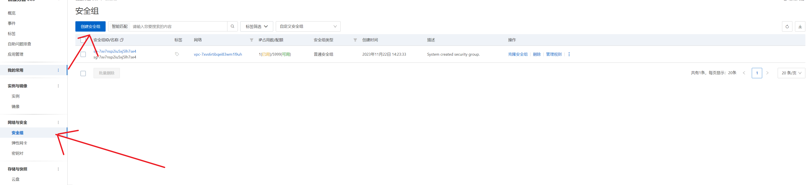
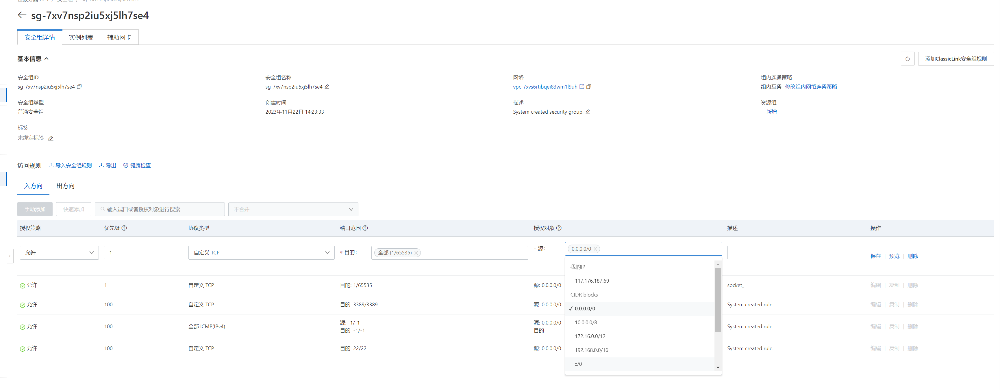

# 配置阿里云服务器

如果直接把服务端的代码拷贝到阿里云服务器上去使用，那么能连接成功，但是收发数据的时候就会失败

## 配置安全规则

阿里云需要设置安全规则开放具体的端口给客户端使用

可以创建一个新的安全组

然后手动添加一个入方向的访问规则，如果是tcp类型的socket就选择自定义tcp，然后选择目的端口范围，和允许那些对象来访问

添加成功之后要确保该安全组生效

## 配置服务端的ip

**服务端的ip要绑定阿里云的内网ip可以通过ifconfig来查看**

**客户端的ip要绑定服务器的公网ip，通过网站来查看**

服务端如果绑定自己的公网ip会直接失败